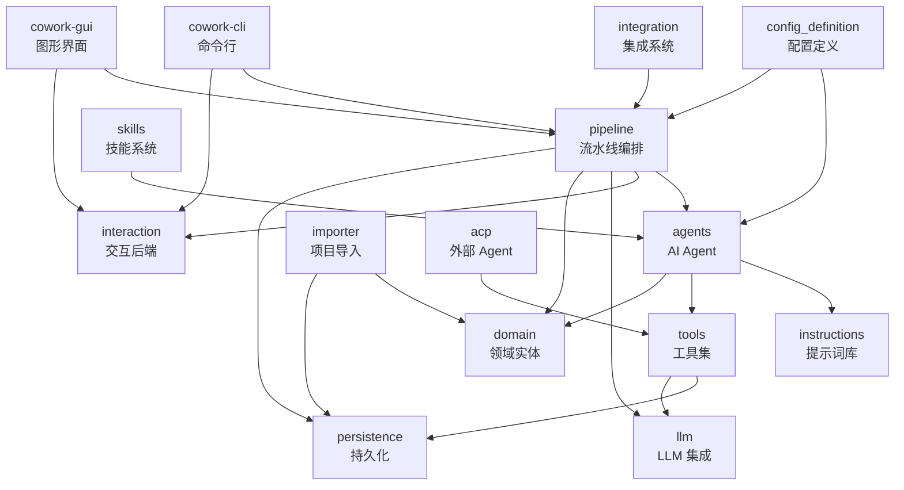

# 领域模块报告

## 识别到的领域模块（完整列表）

| 模块名称 | 路径 | 核心职责 | DDD 分类 | 重要性(1-10) | 复杂度(1-10) |
|---------|------|---------|---------|:----------:|:----------:|
| pipeline | `crates/cowork-core/src/pipeline/` | 7 阶段开发流水线编排与执行 | 核心域 | 10 | 9 |
| agents | `crates/cowork-core/src/agents/` | AI Agent 构建与 Actor-Critic 循环 | 核心域 | 10 | 8 |
| tools | `crates/cowork-core/src/tools/` | 30+ ADK 工具（文件、命令、验证、Memory） | 支撑域 | 8 | 7 |
| instructions | `crates/cowork-core/src/instructions/` | Agent 提示词库（每个阶段的 Actor/Critic 指令） | 支撑域 | 8 | 4 |
| domain | `crates/cowork-core/src/domain/` | 核心领域实体模型（Project/Iteration/Memory） | 通用域 | 7 | 5 |
| persistence | `crates/cowork-core/src/persistence/` | JSON 文件持久化存储 | 支撑域 | 7 | 5 |
| llm | `crates/cowork-core/src/llm/` | LLM 客户端集成与速率限制 | 支撑域 | 8 | 5 |
| config_definition | `crates/cowork-core/src/config_definition/` | 数据驱动配置系统 | 支撑域 | 7 | 7 |
| interaction | `crates/cowork-core/src/interaction/` | InteractiveBackend 交互抽象层 | 通用域 | 6 | 4 |
| acp | `crates/cowork-core/src/acp/` | 外部 Agent 协议客户端 | 支撑域 | 5 | 4 |
| skills | `crates/cowork-core/src/skills/` | agentskills.io 技能系统 | 通用域 | 4 | 4 |
| integration | `crates/cowork-core/src/integration/` | 外部集成 Hook 管理器 | 支撑域 | 4 | 5 |
| importer | `crates/cowork-core/src/importer/` | 遗留项目导入与反向工程 | 核心域 | 7 | 6 |
| project_runtime | `crates/cowork-core/src/project_runtime.rs` | 项目运行时配置与安全 | 支撑域 | 4 | 3 |
| cowork-cli | `crates/cowork-cli/src/` | CLI 命令行接口 | 核心域 | 8 | 4 |
| cowork-gui | `crates/cowork-gui/` | Tauri + React 图形界面 | 核心域 | 8 | 7 |

## 领域间关系

## 业务流程（Business Flows）

| 流程名称 | 描述 | 涉及领域 | 入口点 |
|---------|------|---------|-------|
| 7-Stage 开发流水线 | 从想法到交付的完整开发流程 | pipeline, agents, domain, llm, tools, interaction, persistence | `crates/cowork-cli/src/main.rs` |
| 遗留项目导入 | 分析现有项目并反向生成文档 | importer, domain, persistence | `crates/cowork-cli/src/commands/import.rs` |
| 外部 Agent 编码 | 通过 ACP 协议调用外部编码 Agent | acp, pipeline, tools | `crates/cowork-core/src/acp/client.rs` |
| 项目知识生成 | 每次迭代完成后自动提取项目知识 | agents, domain, persistence, instructions | `crates/cowork-core/src/pipeline/executor/knowledge.rs` |
| PM Agent 交互 | 交付后通过 PM Agent 继续与项目互动 | agents, domain, persistence, tools | `crates/cowork-core/src/agents/mod.rs` |

## 各模块详情

### pipeline 模块
- **路径**：`crates/cowork-core/src/pipeline/`
- **职责**：7 阶段开发流水线的编排和执行，管理迭代生命周期
- **核心抽象**：`Stage` trait（`crates/cowork-core/src/pipeline/mod.rs:47`）、`PipelineContext`（`crates/cowork-core/src/pipeline/mod.rs:29`）、`StageResult`（`crates/cowork-core/src/pipeline/mod.rs:19`）
- **子模块**：
  - `executor/`：迭代执行器（IterationExecutor）——统一入口点
  - `stages/`：各阶段实现（idea/prd/design/plan/coding/check/delivery）
  - `stage_executor.rs`：配置驱动的阶段执行框架
- **依赖的模块**：domain, agents, llm, config_definition, interaction, persistence
- **重要性评分**：10

### agents 模块
- **路径**：`crates/cowork-core/src/agents/`
- **职责**：使用 adk-rust 框架构建 AI Agent，实现 Actor-Critic 自优化循环
- **核心抽象**：LoopAgent（Actor+Cirtic 循环）、LlmAgentBuilder
- **子模块**：
  - `external_coding_agent.rs`：外部 ACP 编码 Agent 集成
  - `legacy_project_analyzer.rs`：遗留项目分析 Agent
- **依赖的模块**：instructions, tools, domain
- **被依赖的模块**：pipeline
- **重要性评分**：10

### tools 模块
- **路径**：`crates/cowork-core/src/tools/`
- **职责**：提供 30+ ADK 工具，涵盖文件操作、命令执行、数据 CRUD、验证、Memory 等
- **核心抽象**：ToolNotifyFn（工具通知回调，用于 GUI 实时显示）
- **子模块**：file_tools, hitl_tools, test_lint_tools, data_tools, validation_tools, control_tools, artifact_tools, memory_tools, pm_tools, mcp_tools 等
- **依赖的模块**：domain, persistence
- **重要性评分**：8

### llm 模块
- **路径**：`crates/cowork-core/src/llm/`
- **职责**：LLM 客户端创建与 TokenBucket 速率限制
- **核心抽象**：`TokenBucketRateLimiter`（`crates/cowork-core/src/llm/rate_limiter.rs:32`）
- **子模块**：config.rs（配置加载）、rate_limiter.rs（速率限制）
- **重要性评分**：8

### persistence 模块
- **路径**：`crates/cowork-core/src/persistence/`
- **职责**：JSON 文件持久化，管理 Project、Iteration、Memory 的存储
- **核心抽象**：ProjectStore, IterationStore, MemoryStore
- **子模块**：project_store.rs, iteration_store.rs, memory_store.rs, iteration_data.rs
- **重要性评分**：7

### domain 模块
- **路径**：`crates/cowork-core/src/domain/`
- **职责**：核心领域实体定义，采用 DDD 聚合模式
- **核心抽象**：`Project`（`crates/cowork-core/src/domain/project.rs:6`）、`Iteration`（`crates/cowork-core/src/domain/iteration.rs:8`）、`ProjectMemory`（`crates/cowork-core/src/domain/memory.rs:7`）
- **重要性评分**：7

### config_definition 模块
- **路径**：`crates/cowork-core/src/config_definition/`
- **职责**：数据驱动配置系统，将硬编码的 Agent/Stage/Flow/Integration 定义变为可配置
- **核心抽象**：`ConfigRegistry`（`crates/cowork-core/src/config_definition/registry.rs:41`）、`AgentDefinition`、`StageDefinition`、`FlowDefinition`
- **子模块**：agent_definition, stage_definition, flow_definition, integration_definition, registry, validator, builtin, agent_factory
- **重要性评分**：7

### interaction 模块
- **路径**：`crates/cowork-core/src/interaction/`
- **职责**：定义 InteractiveBackend trait，抽象 CLI 和 GUI 的用户交互方式
- **核心抽象**：`InteractiveBackend` trait（`crates/cowork-core/src/interaction/mod.rs:109`）
- **子模块**：cli.rs（CLI 实现）、tauri.rs（Tauri GUI 实现）
- **重要性评分**：6

### acp 模块
- **路径**：`crates/cowork-core/src/acp/`
- **职责**：Agent Client Protocol 客户端，支持外部 Agent（OpenCode/Gemini CLI 等）集成
- **核心抽象**：`AcpClient`（`crates/cowork-core/src/acp/client.rs`）
- **重要性评分**：5

### importer 模块
- **路径**：`crates/cowork-core/src/importer/`
- **职责**：遗留项目导入与反向工程——分析已有项目结构并生成文档产出
- **核心抽象**：`ImportConfig`, `ImportResult`, `ImportPreview`
- **子模块**：import_config.rs, project_analyzer.rs, artifact_generator.rs
- **重要性评分**：7

### cowork-cli 模块
- **路径**：`crates/cowork-cli/src/`
- **职责**：CLI 命令行接口（clap + dialoguer），提供项目初始化和迭代管理
- **核心抽象**：Cli Parser（`crates/cowork-cli/src/main.rs:12`）
- **子模块**：commands/（11 个命令处理模块）
- **重要性评分**：8

### cowork-gui 模块
- **路径**：`crates/cowork-gui/`
- **职责**：Tauri + React + Ant Design 图形界面，提供可视化项目管理
- **核心文件**：`src-tauri/src/lib.rs`、`src/App.tsx`
- **子模块**：Tauri 后端（commands, project_manager, project_runner）和 React 前端（components, hooks, stores）
- **重要性评分**：8
