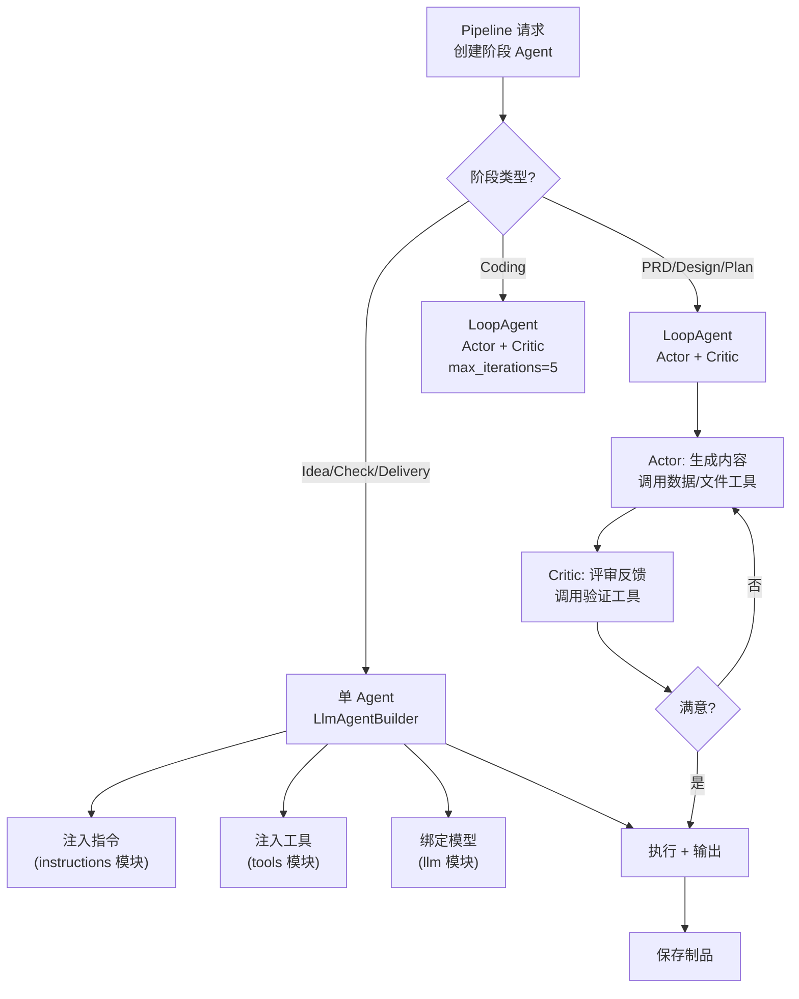

# agents 模块深度报告

## 这个模块在做什么

Agents 模块是 Cowork Forge 的"人力资源部"——它负责创建和管理系统中所有的 AI Agent。每个 Agent 就像工厂里的一个"工人"，有的当产品经理（PRD Agent），有的当架构师（Design Agent），有的写代码（Coding Agent）。但和人类团队不同，这里的每个"关键岗位"实际上是一对工人：一个负责干活（Actor），一个负责审查（Critic），通过这种"互相监督"的机制来保证输出质量。

## 核心功能点

1. **Agent 工厂**——提供一系列 `create_*_agent()` 和 `create_*_agent_with_id()` 函数，为 7 个开发阶段创建对应的 Agent 实例。每个 Agent 使用 `LlmAgentBuilder` 构建，注入特定的指令和工具集。代码位置：`crates/cowork-core/src/agents/mod.rs:32-507`
2. **Actor-Critic 循环**——PRD、Design、Plan、Coding 四个阶段使用 `LoopAgent` 组合 Actor 和 Critic 两个 Agent。Actor 先生成内容，Critic 再评审并给出反馈，循环迭代直到输出令人满意。代码位置：`crates/cowork-core/src/agents/mod.rs:68-378`
3. **PM Agent（项目经理 Agent）**——迭代完成后激活的聊天式 Agent，支持查询项目状态、跳转到已有阶段、创建新迭代。通过流式 API 支持 GUI 的实时消息推送。代码位置：`crates/cowork-core/src/agents/mod.rs:548-928`
4. **外部编码 Agent 集成**——通过 ACP 协议调用外部 Agent（如 OpenCode、Gemini CLI）替代内置的 Coding Agent。代码位置：`crates/cowork-core/src/agents/external_coding_agent.rs`
5. **遗留项目分析 Agent**——专门用于分析已有项目结构并反向工程生成文档。代码位置：`crates/cowork-core/src/agents/legacy_project_analyzer.rs`

## 关键组件

| 组件/类型 | 文件路径 | 一句话职责 |
|---------|---------|----------|
| `create_idea_agent()` | `crates/cowork-core/src/agents/mod.rs:32` | 创建 Idea Agent，捕捉用户需求生成 idea.md |
| `create_prd_loop()` | `crates/cowork-core/src/agents/mod.rs:68` | 创建 PRD Actor+Cirtic LoopAgent，生成并自优化 PRD |
| `create_design_loop()` | `crates/cowork-core/src/agents/mod.rs:149` | 创建 Design Actor+Cirtic LoopAgent，设计技术架构 |
| `create_plan_loop()` | `crates/cowork-core/src/agents/mod.rs:223` | 创建 Plan Actor+Cirtic LoopAgent，分解任务和依赖 |
| `create_coding_loop()` | `crates/cowork-core/src/agents/mod.rs:301` | 创建 Coding Actor+Cirtic LoopAgent（5 次迭代），编写代码 |
| `create_check_agent()` | `crates/cowork-core/src/agents/mod.rs:384` | 创建 Check Agent，验证质量和完整性 |
| `create_delivery_agent()` | `crates/cowork-core/src/agents/mod.rs:444` | 创建 Delivery Agent，生成交付报告 |
| `create_project_manager_agent()` | `crates/cowork-core/src/agents/mod.rs:548` | 创建 PM Agent，交付后聊天交互 |
| `PMAgentResult` | `crates/cowork-core/src/agents/mod.rs:621` | PM Agent 执行结果，包含响应消息和检测到的动作 |
| `PMAgentStreamCallback` trait | `crates/cowork-core/src/agents/mod.rs:652` | 流式回调接口，支持 GUI 实时显示 Agent 输出 |

## 内部数据流

## 关键接口与扩展点

Agent 创建通过 `LlmAgentBuilder` 模式进行，可以灵活组合不同的指令、工具和模型参数。`config_definition/agent_factory.rs` 中的 `create_agent_for_stage()` 和 `create_agent_from_config()` 提供了基于配置文件的 Agent 创建方式，使得用户可以不修改代码就定义新的 Agent 角色。

PM Agent 可以通过 MCP 工具集扩展能力（`crates/cowork-core/src/agents/mod.rs:563`）。

## 与其他模块的交互

| 交互模块 | 方向 | 说明 |
|---------|------|------|
| instructions | 依赖 | Agent 使用 instructions 模块中的提示词常量构建指令 |
| tools | 依赖 | Agent 需要注入各种 ADK 工具来执行文件/数据/验证操作 |
| domain | 依赖 | 需要访问 Iteration 和 Project 数据来构建上下文 |
| llm | 依赖 | Agent 需要绑定 LLM 模型进行推理 |
| config_definition | 依赖 | 通过 agent_factory 从配置创建 Agent |

## 跨模块协作场景

**在 7-Stage 开发流水线中**：每个阶段执行时，Pipeline 的 `StageExecutor` 调用 agents 模块创建对应的 Agent，注入当前迭代的上下文。Agent 执行过程中调用 tools 模块提供的文件、数据和验证工具，通过 llm 模块的速率限制器与 LLM API 通信。完成后将结果保存到 persistence 模块。

## 性能考量

所有 Agent 执行都是异步的（基于 Tokio），但 LLM 调用通过 TokenBucketRateLimiter 串行化。Coding Loop 的 max_iterations=5 比其他 Loop（max_iterations=1）更多，因为编码任务通常需要多次迭代才能完成。

## 实现亮点

**SequentialAgent 终止 Bug 的解决**（`crates/cowork-core/src/agents/mod.rs:4-10`）：这是一个值得注意的架构决策。adk-rust 的 LoopAgent 在子 Agent 调用 `exit_loop()` 时会终止整个 SequentialAgent（而非仅终止当前 LoopAgent）。解决方案是将 max_iterations 设为 1，让 LoopAgent 自然完成而非通过 exit_loop 终止。这个妥协保证了 SequentialAgent 中的后续 Agent 能继续执行。
