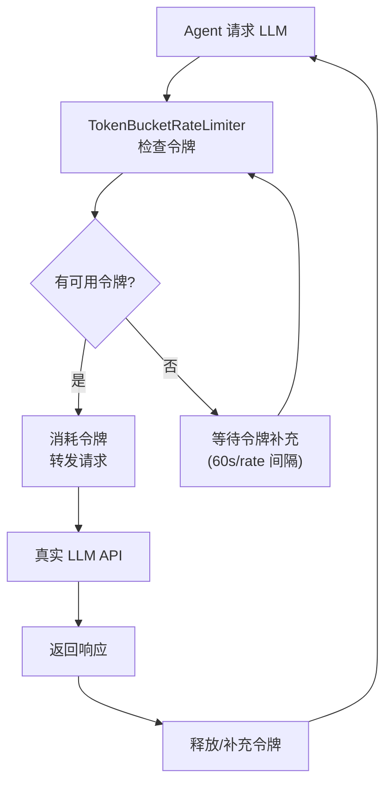

# llm 模块深度报告

## 这个模块在做什么

LLM 模块是 Cowork Forge 的"大脑接口"——它负责与外部大语言模型 API 通信，并确保通信过程不会因过于频繁的请求而被服务商限流。简单来说，它就像工厂的"电力系统"：没有它所有机器都转不起来，但如果电压不稳（API 限流），整个工厂都会瘫痪。

## 核心功能点

1. **LLM 客户端创建**——从 config.toml 加载配置创建 OpenAI 兼容的 LLM 客户端。代码位置：`crates/cowork-core/src/llm/config.rs`
2. **TokenBucket 速率限制**——实现 TokenBucket 算法，允许 5 个突发请求同时进行，长期平均速率为 30 req/min。代码位置：`crates/cowork-core/src/llm/rate_limiter.rs:32-60`
3. **限流器装饰器模式**——`TokenBucketRateLimiter` 实现了 `Llm` trait，作为装饰器包裹真实的 LLM 客户端，对上层调用者完全透明。代码位置：`crates/cowork-core/src/llm/rate_limiter.rs`

## 关键组件

| 组件/类型 | 文件路径 | 一句话职责 |
|---------|---------|----------|
| `TokenBucketRateLimiter` | `crates/cowork-core/src/llm/rate_limiter.rs:32` | TokenBucket 速率限制装饰器，透明控制 LLM 请求频率 |
| `create_llm_client()` | `crates/cowork-core/src/llm/config.rs` | 从配置文件创建 LLM 客户端 |
| `load_config()` | `crates/cowork-core/src/llm/config.rs` | 加载 LLM 配置（API 地址、密钥、模型名） |

## 内部数据流

## 关键接口与扩展点

`TokenBucketRateLimiter` 实现了 `adk_core::Llm` trait，可以透明地替换或包装任何其他 `Llm` 实现。参数 `max_burst` 和 `rate_limit_per_minute` 可配置。

## 与其他模块的交互

| 交互模块 | 方向 | 说明 |
|---------|------|------|
| agents | 被依赖 | Agent 构建时需要绑定 LLM 模型 |
| pipeline | 被依赖 | StageExecutor 创建 LLM 客户端供所有阶段使用 |

## 跨模块协作场景

**在每个 Agent 执行过程中**：Agent 每次调用 LLM 推理时 → 经过 `TokenBucketRateLimiter` 获取令牌 → 如果没令牌就等待 → 获取令牌后调用真实 LLM API → 返回结果 → 补充令牌。整个过程对 Agent 完全透明。
