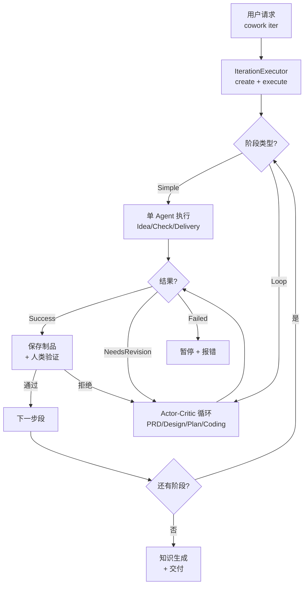

# pipeline 模块深度报告

## 这个模块在做什么

Pipeline 是 Cowork Forge 的"流水线传送带"——它负责把 7 个开发阶段按正确的顺序串联起来，管理每个阶段的执行、暂停、重试和跳转。如果把整个系统比作一个工厂，Pipeline 就是那个决定"什么零件什么时候送到哪个工位"的生产调度中心。

## 核心功能点

1. **7 阶段流水线编排**——定义了从 Idea 到 Delivery 的 7 个开发阶段的执行顺序，支持从任意阶段开始执行（`get_stages_from()`）和根据流程配置动态创建阶段（`get_stages_from_flow()`）。代码位置：`crates/cowork-core/src/pipeline/mod.rs:77-94`
2. **Flow 配置驱动**——通过 ConfigRegistry 可以定义自定义流程（自定义阶段组合和顺序），系统会自动根据流程配置创建对应的阶段实例。代码位置：`crates/cowork-core/src/pipeline/mod.rs:116-143`
3. **迭代执行器**——`IterationExecutor` 是统一的迭代生命周期管理器，负责创建迭代（Genesis/Evolution）、保存状态、执行所有阶段。代码位置：`crates/cowork-core/src/pipeline/executor/mod.rs:17-80`
4. **Actor-Critic 阶段执行**——`stage_executor.rs` 实现了配置驱动的阶段执行框架，根据阶段类型（Simple 或 Actor-Critic）选择合适的执行策略，处理反馈和迭代。代码位置：`crates/cowork-core/src/pipeline/stage_executor.rs:1-80`
5. **知识生成**——迭代完成后自动触发知识生成，提取关键决策、模式和学习心得。代码位置：`crates/cowork-core/src/pipeline/executor/knowledge.rs`

## 关键组件

| 组件/类型 | 文件路径 | 一句话职责 |
|---------|---------|----------|
| `Stage` trait | `crates/cowork-core/src/pipeline/mod.rs:47` | 定义所有开发阶段的统一接口（execute + execute_with_feedback） |
| `PipelineContext` | `crates/cowork-core/src/pipeline/mod.rs:29` | 保存流水线执行的上下文信息（项目、迭代、工作区路径） |
| `StageResult` | `crates/cowork-core/src/pipeline/mod.rs:19` | 阶段执行结果枚举（Success/Failed/Paused/NeedsRevision/GotoStage） |
| `IterationExecutor` | `crates/cowork-core/src/pipeline/executor/mod.rs:17` | 迭代执行器，统一管理迭代生命周期的创建和执行 |
| `StageExecutor` | `crates/cowork-core/src/pipeline/stage_executor.rs` | 配置驱动的阶段执行框架，处理 Agent 创建、执行和反馈循环 |

## 内部数据流

关键步骤：
1. 用户请求到达 `crates/cowork-cli/src/main.rs`，通过 CLI 命令路由到 `commands/iter.rs`
2. `IterationExecutor` 创建迭代并开始执行阶段序列（`crates/cowork-core/src/pipeline/executor/mod.rs:79`）
3. 每个阶段通过 `Stage` trait 的 `execute()` 方法执行，结果返回 `StageResult`
4. 对于 Loop 类型阶段，Actor-Critic 循环可能因 `NeedsRevision` 多次迭代
5. 人类验证关键阶段的输出后才能继续

## 扩展点

ConfigRegistry 允许定义自定义 Flow（`crates/cowork-core/src/config_definition/flow_definition.rs`），可以重新排列阶段顺序、跳过某些阶段、或者添加自定义 Hook。Integration 系统（`crates/cowork-core/src/integration/`）允许在阶段完成后触发外部 Webhook。

## 与其他模块的交互

| 交互模块 | 方向 | 接口/协议 | 说明 |
|---------|------|---------|------|
| agents | 依赖 | `create_prd_loop()`, `create_idea_agent()` 等 | Pipeline 调用 Agent 工厂创建各阶段 Agent |
| domain | 依赖 | `Project`, `Iteration` | Pipeline 读取项目/迭代状态并更新 |
| llm | 依赖 | `create_llm_client()`, `TokenBucketRateLimiter` | Pipeline 创建 LLM 客户端供 Agent 使用 |
| interaction | 依赖 | `InteractiveBackend` trait | Pipeline 通过交互后端与用户通信 |
| persistence | 依赖 | `ProjectStore`, `IterationStore` | Pipeline 保存和加载项目/迭代数据 |
| config_definition | 依赖 | `ConfigRegistry` | Pipeline 查询流程配置和 Agent 定义 |

## 跨模块协作场景

**在 7-Stage 开发流水线中**：Pipeline 是主调度器，它按顺序实例化每个阶段的 Agent，提供执行上下文，处理结果流转。具体来说：Pipeline 从 ConfigRegistry 获取流程定义 → 创建 LLM 客户端（llm 模块）→ 构建 Agent（agents 模块）→ 注册交互后端（interaction 模块）→ 执行阶段 → 保存结果（persistence 模块）→ 重复直到所有阶段完成。

## 性能考量

Pipeline 的执行是串行化的——每个阶段必须等待前一个阶段完成后才能开始。这是设计使然，因为开发流程本质上是有序的（不能在设计完成之前就开始编码）。LLM 调用通过 TokenBucketRateLimiter 串行化，确保不会触发 API 速率限制。文件操作和命令执行异步执行，不会阻塞主流程。
