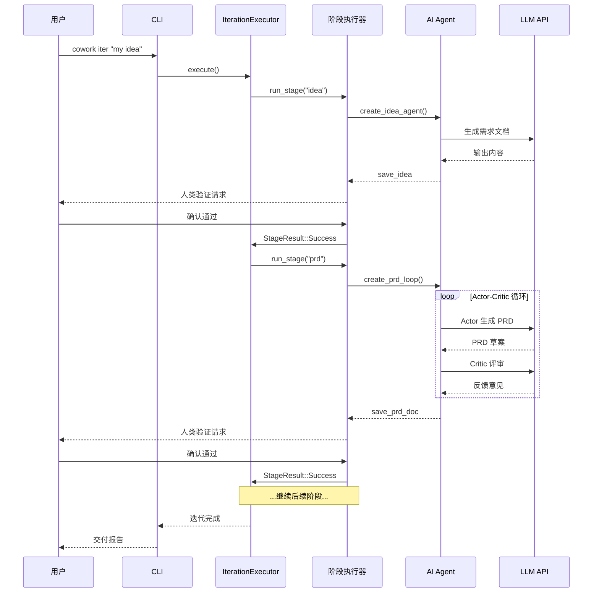

# 工作流研究报告

## 主要工作流

Cowork Forge 的核心工作流可以想象成一条"汽车生产线"——用户的原始想法就像原材料，经过 7 个工位（阶段）的接力加工，最终变成一辆完整的汽车（可交付的软件项目）。但和传统生产线不同，这里的每个工位都有"自检"环节：Actor 负责加工，Critic 负责质检，不合格就返工。

### 工作流1：7 阶段开发流水线

这是 Cowork Forge 最核心的工作流。它从用户的一个想法开始，经过 7 个阶段的顺序执行，最终产出完整的软件项目。

**触发方式**：用户在 CLI 执行 `cowork iter --project "my-project" "想法描述"` 或通过 GUI 创建新迭代
**入口**：`crates/cowork-cli/src/main.rs:119` → `commands/iter.rs` → `IterationExecutor::execute()`（`crates/cowork-core/src/pipeline/executor/mod.rs:79`）
**执行步骤**：

1. **Idea 阶段**（`IdeaStage` in `crates/cowork-core/src/pipeline/stages/idea.rs`）——Idea Agent 与用户对话，捕捉和结构化需求，生成 idea.md
2. **PRD 阶段**（`PrdStage` in `crates/cowork-core/src/pipeline/stages/prd.rs`）——PRD Actor 生成产品需求文档，PRD Critic 评审并反馈，循环迭代直到满意
3. **Design 阶段**（`DesignStage` in `crates/cowork-core/src/pipeline/stages/design.rs`）——Design Actor 设计技术架构，Design Critic 评审覆盖度，输出 design.md
4. **Plan 阶段**（`PlanStage` in `crates/cowork-core/src/pipeline/stages/plan.rs`）——Plan Actor 分解任务和依赖，Plan Critic 检查任务完整性，输出 plan.md
5. **Coding 阶段**（`CodingStage` in `crates/cowork-core/src/pipeline/stages/coding.rs`）——Coding Actor 编写代码、运行构建和测试，Coding Critic 审查代码质量
6. **Check 阶段**（`CheckStage` in `crates/cowork-core/src/pipeline/stages/check.rs`）——Check Agent 验证需求覆盖度、数据格式、任务完整性
7. **Delivery 阶段**（`DeliveryStage` in `crates/cowork-core/src/pipeline/stages/delivery.rs`）——Delivery Agent 生成交付报告，将代码复制到项目根目录

**关键设计**：PRD、Design、Plan、Coding 四个阶段使用 LoopAgent（Actor-Critic 循环），Idea、Check、Delivery 使用单 Agent 模式。这反映了设计理念——生成式任务需要自优化循环，验证式任务单次执行即可。

### 工作流2：遗留项目导入

**触发方式**：用户执行 `cowork import /path/to/project`
**入口**：`crates/cowork-cli/src/commands/import.rs` → `crates/cowork-core/src/importer/`
**执行步骤**：
1. 扫描项目目录结构、配置文件和依赖
2. 自动检测技术栈（语言、框架、工具）
3. 读取 README 和关键源文件
4. 使用 LLM 合成信息生成 idea.md、prd.md、design.md、plan.md
5. 创建初始迭代并保存所有制品

### 工作流3：PM Agent 交付后交互

**触发方式**：迭代完成后的用户消息
**入口**：`crates/cowork-core/src/agents/mod.rs:659`（`execute_pm_agent_message_streaming`）
**执行步骤**：
1. 加载当前迭代的制品摘要和项目记忆
2. 构建对话上下文（包含项目信息、历史决策）
3. PM Agent 分析用户意图，决定执行什么动作
4. 可能触发的动作：`pm_goto_stage`（跳转到某个阶段）、`pm_create_iteration`（创建新迭代）、`pm_respond`（直接回答）

## 并发/异步模型

Cowork Forge 采用 Tokio 异步运行时全异步架构。但 LLM 调用是串行化的——全局 TokenBucket 速率限制器确保同时只有一个 LLM 请求在进行（concurrency=1）。这看起来是"性能瓶颈"，但实际上是刻意的设计选择：LLM API 调用是系统的"最慢环节"，并行多个请求不仅容易触发 API 速率限制、增加成本，还会让系统行为变得难以预测。串行化的 LLM 调用使得行为可预测、调试简单，对于桌面工具场景来说，用户体验反而是更好的（响应有序而非乱序）。

文件操作（读写、列表）和命令执行（编译、测试）使用 Tokio 异步任务，不会阻塞主循环。

## 错误处理策略

系统的错误处理核心理念是："局部失败不应导致全局中断"。整个系统采用 `anyhow::Result` 作为统一的错误返回类型（`crates/cowork-core/src/agents/mod.rs:16`），错误在整个调用栈中逐层传播，最终由流水线执行器或 CLI 入口统一处理。

关键错误处理模式：
- **阶段执行失败**：返回 `StageResult::Failed(message)`，流水线暂停，用户可以查看错误信息后选择重试或放弃
- **LLM 调用失败**：由 TokenBucketRateLimiter 内部处理重试（最多 3 次），逐层传播最终错误
- **文件操作失败**：使用 `?` 操作符向上传播，由调用方决定如何处理
- **人类验证失败**：返回 `StageResult::NeedsRevision(feedback)`，触发 Actor-Critic 循环的再次迭代

## 关键时序交互

