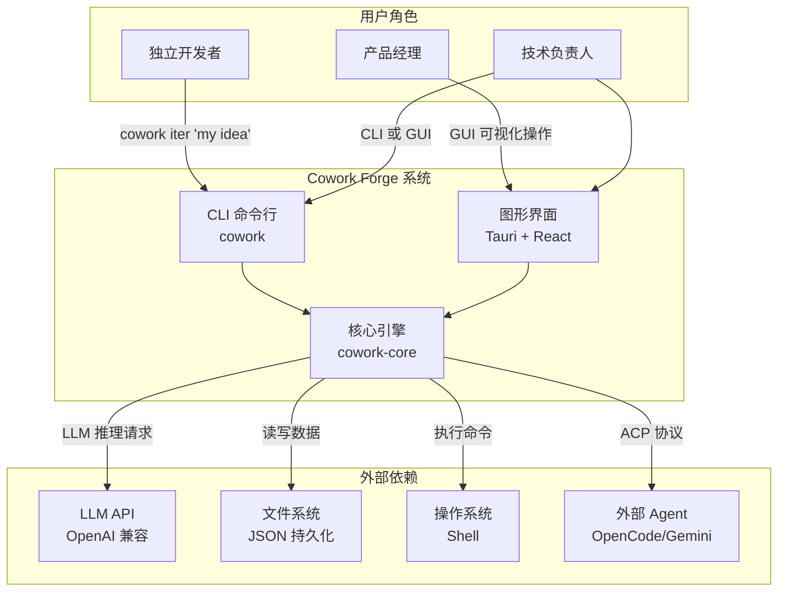

# Cowork Forge 项目概述

Cowork Forge 是一个"AI 原生的多 Agent 软件开发平台"。它不是普通的代码生成器，也不是简单的 AI 编程助手——它是一个完整的虚拟开发团队，内部有扮演产品经理、架构师、项目经理和工程师角色的 AI Agent，通过七阶段流水线协作，把你的原始想法一步步变成可交付的软件产品。

想象一下，你只需要花几分钟描述想要什么，剩下的工作——需求分析、架构设计、任务分解、代码编写、质量验证、交付报告——全部由 AI 团队自动完成。整个流程中，你只在关键决策点参与确认，确保输出符合预期。这就是 Cowork Forge 承诺的核心价值：一个人可以拥有一个完整的开发团队。

## 它能做什么

Cowork Forge 的核心能力可以概括为"从想法到交付的全自动开发流水线"。简单来说，你描述需求，它交付软件。

**全角色 AI 团队协作**——系统中内置了 10+ 个专业 AI Agent，分别模拟软件开发中的不同角色。产品经理 Agent 负责写 PRD，架构师 Agent 负责设计技术方案，项目经理 Agent 负责分解任务，工程师 Agent 负责编写代码。每个关键角色采用 Actor-Critic 自优化模式——先干活、再自我审查、根据反馈改进，确保输出质量。

**7 阶段开发流水线**——从 Idea（想法捕捉）到 PRD（需求文档）→ Design（架构设计）→ Plan（实施计划）→ Coding（编码）→ Check（质量验证）→ Delivery（交付），每个阶段都有明确的输入输出和人类验证点。

**迭代继承体系**——支持 Genesis（首次）和 Evolution（演化）两种迭代模式。Evolution 迭代可以继承前一次迭代的代码或制品，实现增量开发。三种继承模式（None/Full/Partial）满足不同的演进需求。

**遗留项目导入**——可以把现有的项目导入 Cowork Forge，AI 会自动分析项目结构、检测技术栈、反向工程生成文档，让已有项目也能享受迭代管理的好处。

**外部 Agent 集成**——支持通过 ACP 协议集成外部的 AI Agent（如 OpenCode、Gemini CLI、Claude CLI），在编码阶段调用更专业的编码工具。

**知识累积**——每次迭代完成后自动提取关键决策和模式，跨迭代累积项目记忆，系统"越用越聪明"。

## C4 Context 图（系统全景）

上图展示了 Cowork Forge 在生态系统中的定位：用户通过 CLI 或 GUI 与系统交互，核心引擎协调 LLM、文件系统和外部 Agent 来完成开发任务。

## 技术选型背后的思考

Cowork Forge 的技术选型有明确的考量。

| 技术领域 | 具体选择 | 为什么这样选 |
|---------|---------|------------|
| 语言与运行时 | Rust (edition 2024) + Tokio | Rust 的内存安全保证和高性能使 IO 密集型的多 Agent 并发成为可能，Tokio 异步运行时则是 Rust 生态的异步标准 |
| Agent 框架 | adk-rust | 提供了标准化的 Agent 构建 API 和 LoopAgent 机制，避免了从头实现 Agent 框架 |
| CLI | clap (v4) + dialoguer | Rust 生态中最成熟的 CLI 框架，derive 宏使参数声明简洁且类型安全 |
| GUI | Tauri 2 + React + Ant Design | Tauri 提供跨平台原生应用能力且体积小，React 前端生态丰富，Ant Design 组件库开箱即用 |
| 持久化 | JSON 文件 | 不依赖外部数据库，开箱即用，文件即备份。适合桌面工具的单用户场景 |
| 速率限制 | TokenBucket 算法 | 允许突发请求的同时保证长期速率，比固定延迟更高效——适合"需要时快速响应，平时不浪费"的场景 |

## Cowork Forge 能做什么，不能做什么

**它能做的事**：
- 从用户的一句话描述，"端到端"完成一个软件项目的开发——生成需求、设计、计划、代码、测试、交付报告
- 在开发过程中让用户在关键决策点参与确认，保证方向正确
- 导入已有项目进行迭代管理，增量添加功能或修改
- 通过外部 Agent 集成，在特定阶段调用更专业的工具
- 跨迭代累积项目知识和设计决策，越用越聪明

**它不做的事**：
- 不替代 IDE——Agent 通过文件工具修改代码，不给用户提供编码 IDE
- 不直接部署到生产——但可以通过集成 Hook 触发部署流程
- 不提供实时多人协作——聚焦 AI-Agent 协作，非人-人协作
- 不提供数据库服务——数据以 JSON 文件形式存储在本地
