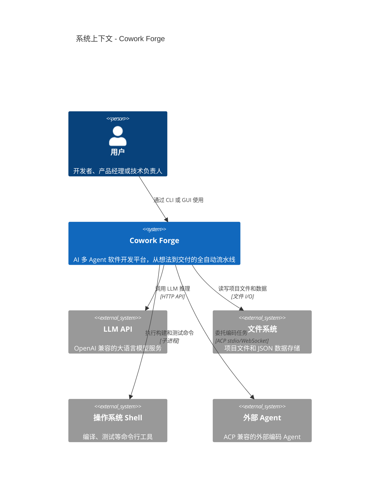
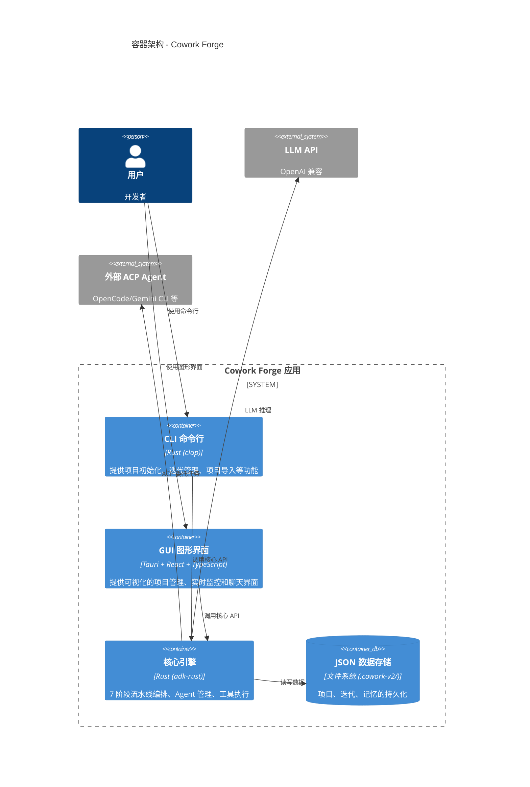
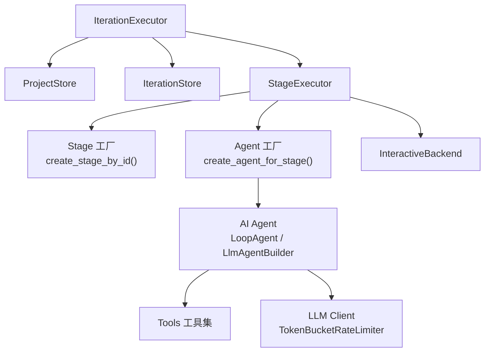
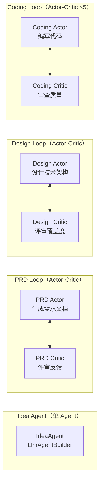
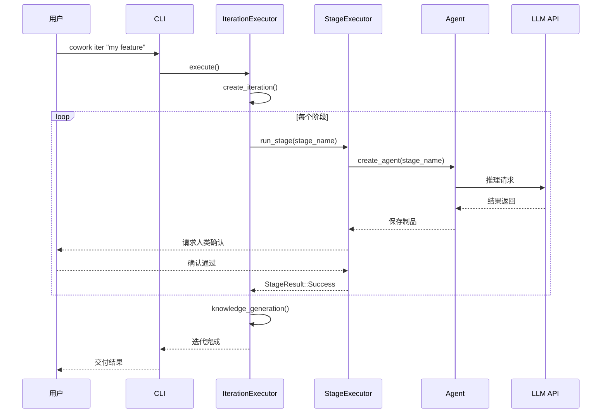

# 系统架构文档：Cowork Forge

**版本：** 1.0
**分类：** 内部架构文档
**生成日期：** 2026-07-05

---

## 1. 架构概述

### 1.1 设计理念

Cowork Forge 的架构设计围绕几个核心原则展开，它们共同塑造了系统的形态和行为。

**1. 流水线驱动的开发流程**

一切从"开发是有序的"这个观察出发——你不能在设计好之前就编码，也不能在测试之前就交付。因此，系统的核心骨架是一个 7 阶段的流水线，每个阶段有明确的输入、处理和输出。这就像汽车生产线：零件（需求）→ 冲压（设计）→ 焊接（计划）→ 组装（编码）→ 质检（检查）→ 出厂（交付）。

**2. 自优化的 Agent 团队**

AI 单次生成的输出质量不稳定——同一个问题问两次可能得到不同的答案。解决这个问题的方法是让 Agent "自检"：采用 Actor-Critic 模式，让一个 Agent 生成内容，另一个 Agent 审查并给出反馈，循环迭代直到满意。这模拟了人类团队中的"写代码→Code Review"工作流。

**3. 交互方式无关的核心引擎**

系统应该同时服务命令行用户和图形界面用户，但核心业务逻辑不应该为任何一种交互方式做出妥协。因此，所有用户交互都通过 `InteractiveBackend` trait 抽象——核心引擎只调用 `show_message()`、`request_input()` 等方法，不知道也不关心这些消息是打印在终端还是显示在 GUI 弹窗中。

**4. 可配置而非硬编码**

Agent 角色、阶段流程、集成规则——这些在早期版本中是写死在代码里的。ConfigDefinition 模块的出现改变了这一点：现在这些东西都可以通过 JSON 配置文件来定义。这意味着用户可以在不修改 Rust 代码、不重新编译的情况下，自定义开发流程、创建新的 Agent 角色、或者配置外部集成。

### 1.2 核心架构模式

| 模式 | 实现方式 | 为什么这样设计 |
|------|---------|-------------|
| Pipeline-Filter（流水线-过滤器） | 7 个 Stage 实现相同的 `Stage` trait，按序串联执行 | 开发流程本质上是顺序的，流水线模式让每个阶段的职责边界清晰，也便于在任意两个阶段之间插入 Hook |
| Actor-Critic（演员-评论家） | LoopAgent 组合 Actor 和 Critic 两个子 Agent，循环执行 | AI 生成的内容需要质量把关，Actor-Critic 模式让"干活"和"审查"分离，提升输出质量 |
| Hexagonal（六边形架构） | domain 层零外部依赖，基础设施适配器通过 trait 注入 | 核心业务逻辑不受 UI 框架、LLM 服务商等技术细节影响，便于测试和更换 |
| Strategy（策略模式） | Stage trait 定义统一接口，各阶段各自实现 | Pipeline 不需要知道每个阶段的具体实现，只需要按接口调用 |
| Decorator（装饰器模式） | TokenBucketRateLimiter 实现 Llm trait 包裹真实 LLM 客户端 | 速率限制对上层调用者完全透明，不需要 Agent 感知限流逻辑 |

### 1.3 技术栈概述

| 层次/领域 | 技术选型 | 为什么这样选 |
|---------|---------|------------|
| 语言与运行时 | Rust (edition 2024) + Tokio | 内存安全+零成本抽象，适合 IO 密集型并发场景。Tokio 是 Rust 异步运行时的事实标准 |
| Agent 框架 | adk-rust | 成熟的 Agent 构建框架，提供 LoopAgent、LlmAgentBuilder、流式输出等开箱即用的能力 |
| CLI | clap (v4, derive) + dialoguer | clap 的 derive 宏让参数声明简洁，dialoguer 提供交互式选择/输入 |
| GUI | Tauri 2 + React + TypeScript + Ant Design | Tauri 提供安全的后端，React 提供灵活的前端，Ant Design 提供丰富的 UI 组件 |
| 持久化 | JSON 文件存储（`.cowork-v2/`） | 零运维、开箱即用、文件即备份，适合桌面工具的单用户场景 |
| LLM 速率限制 | TokenBucket 算法 | 允许突发请求，长期平均速率可控。max_burst=5，rate_limit=30 req/min |
| 外部 Agent 集成 | ACP（Agent Client Protocol） | 开放标准协议，支持多种外部 Agent 无缝集成 |

---

## 2. 系统上下文（C4 Level 1）



---

## 3. 容器视图（C4 Level 2）



### 3.1 领域模块职责

| 模块/领域 | 路径 | 职责 | 关键抽象 |
|---------|------|------|---------|
| pipeline | `crates/cowork-core/src/pipeline/` | 7 阶段流水线编排与执行 | `Stage trait`, `IterationExecutor` |
| agents | `crates/cowork-core/src/agents/` | AI Agent 构建与管理 | `LoopAgent`, `LlmAgentBuilder` |
| tools | `crates/cowork-core/src/tools/` | 30+ ADK 工具实现 | `ToolNotifyFn`, `ReadFileTool` |
| instructions | `crates/cowork-core/src/instructions/` | Agent 提示词库 | 各 Agent 的指令常量 |
| domain | `crates/cowork-core/src/domain/` | 核心领域实体 | `Project`, `Iteration`, `ProjectMemory` |
| persistence | `crates/cowork-core/src/persistence/` | JSON 文件持久化 | `ProjectStore`, `IterationStore` |
| llm | `crates/cowork-core/src/llm/` | LLM 集成与速率限制 | `TokenBucketRateLimiter` |
| config_definition | `crates/cowork-core/src/config_definition/` | 数据驱动配置系统 | `ConfigRegistry` |
| interaction | `crates/cowork-core/src/interaction/` | CLI/GUI 交互抽象 | `InteractiveBackend trait` |
| acp | `crates/cowork-core/src/acp/` | 外部 Agent 协议 | `AcpClient` |
| importer | `crates/cowork-core/src/importer/` | 遗留项目导入 | `ImportConfig`, `ProjectAnalysis` |

---

## 4. 组件视图（C4 Level 3）

### 4.1 Pipeline 核心组件



### 4.2 Agent 组件架构



---

## 5. 关键流程

### 5.1 迭代执行流程



### 5.2 Actor-Critic 迭代循环

```mermaid
sequenceDiagram
    participant Actor
    participant Critic
    participant Human

    loop Actor-Critic 循环
        Actor->>Actor: 生成/修改内容
        Actor->>Critic: 请求评审
        Critic->>Critic: 审查内容和质量
        Critic->>Actor: 反馈改进意见
        Actor->>Actor: 根据反馈修改
        alt 达到质量要求
            Actor->>Human: 请求人类验证
            Human-->>Actor: 确认通过
            Note over Actor,Human: 阶段完成
        else 需要修订
            Human->>Actor: 提供反馈
            Actor->>Critic: 继续循环
        end
    end
```

---

## 6. 技术实现

### 6.1 关键架构模式

**Stage trait 统一接口**（`crates/cowork-core/src/pipeline/mod.rs:47`）
```rust
pub trait Stage: Send + Sync {
    fn name(&self) -> &str;
    fn description(&self) -> &str;
    fn needs_confirmation(&self) -> bool { false }
    async fn execute(&self, ctx: &PipelineContext, interaction: Arc<dyn InteractiveBackend>) -> StageResult;
    async fn execute_with_feedback(&self, ctx: &PipelineContext, interaction: Arc<dyn InteractiveBackend>, feedback: &str) -> StageResult { ... }
}
```

**TokenBucket 速率限制器**（`crates/cowork-core/src/llm/rate_limiter.rs:32`）— 装饰器模式实现，对上层完全透明。

### 6.2 并发和并行策略

- LLM 调用串行化（concurrency=1）：防止触发 API 速率限制，保证行为可预测
- 文件操作 Tokio 异步：不阻塞主循环
- 命令执行异步 + 超时控制：防止长时间运行任务耗尽资源

### 6.3 性能优化策略

- TokenBucket 速率限制器允许 5 个突发请求，应对初始阶段的多 Agent 启动场景
- 知识快照数据仅保留最近 N 次迭代，防止记忆文件无限膨胀
- 路径规范化缓存，避免重复路径解析

---

## 附录：架构决策记录（ADR）

**ADR 1：Actor-Critic 自优化循环**

- **决策**：对 PRD、Design、Plan、Coding 四个关键阶段采用 Actor-Critic 双 Agent 循环
- **原因**：AI 单次生成的内容质量不稳定。Actor-Critic 模式让"干活"和"审查"分离，通过自我博弈提升输出质量。观察依据：`crates/cowork-core/src/agents/mod.rs:68-99`
- **后果**：增加了阶段执行时间（多次 LLM 调用），但显著提升了输出质量

**ADR 2：JSON 文件持久化而非数据库**

- **决策**：使用 JSON 文件持久化（`.cowork-v2/`），放弃关系型数据库
- **原因**：桌面工具不需要多用户并发访问，JSON 文件零运维、开箱即用、文件即备份。观察依据：`crates/cowork-core/src/persistence/mod.rs`
- **后果**：无法支持多用户协作场景，但换来了最大的部署便利性

**ADR 3：TokenBucket 算法而非固定延迟**

- **决策**：TokenBucket 速率限制器，允许 max_burst=5 个突发请求，长期速率 30 req/min
- **原因**：固定延迟等待导致每次请求都要等待，TokenBucket 在有空闲配额时可以立即执行，更加高效。观察依据：`crates/cowork-core/src/llm/rate_limiter.rs:32-60`
- **后果**：初始阶段的多 Agent 启动更快，长期运行仍符合 API 速率限制

**ADR 4：InteractiveBackend trait 抽象交互方式**

- **决策**：通过 `InteractiveBackend` trait 抽象所有用户交互，CLI 和 GUI 分别实现
- **原因**：核心引擎需要同时服务 CLI 和 GUI 用户，但不应该为任何一种界面优化而牺牲通用性。观察依据：`crates/cowork-core/src/interaction/mod.rs:108-160`
- **后果**：新增交互方式只需要实现 trait，无需修改核心逻辑

**ADR 5：迭代继承体系（Genesis / Evolution）**

- **决策**：引入 Genesis（首次）和 Evolution（演化）两种迭代模式，支持三种继承策略
- **原因**：软件开发很少一次完成，大多数是对已有代码的修改和功能新增。迭代继承让系统天然支持增量开发。观察依据：`crates/cowork-core/src/domain/iteration.rs`
- **后果**：增加了迭代管理的复杂度，但使得增量开发场景非常自然
