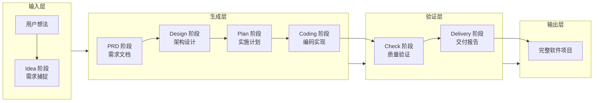
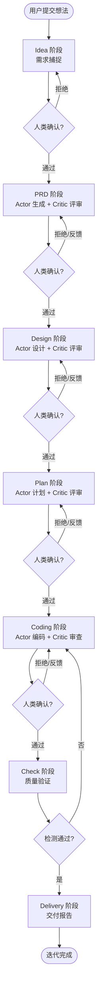
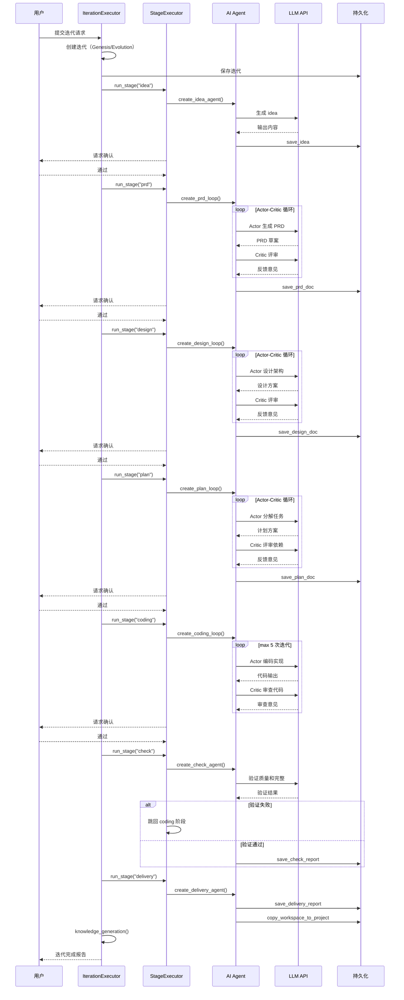
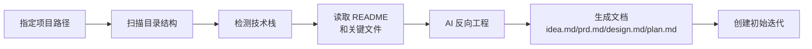
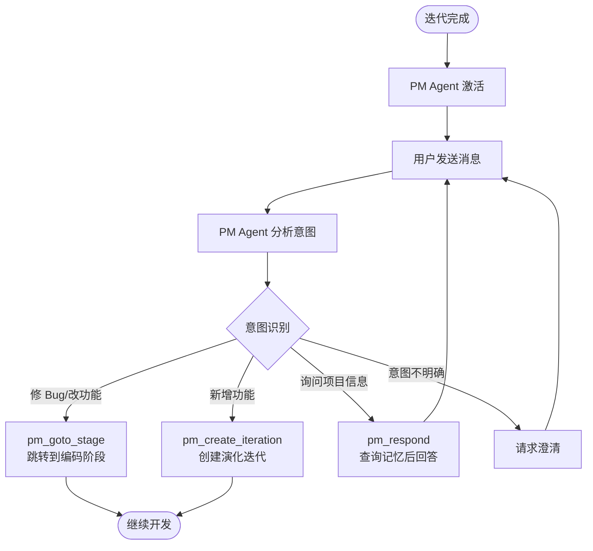

# 核心工作流

## 1. 工作流概述

### 1.1 系统架构与工作流理念

Cowork Forge 的工作流理念可以概括为"有序的接力赛"——每个阶段完成自己的工作后把"接力棒"交给下一个阶段，但关键赛段有"自我检视"环节来确保接棒不失误。

整个系统的工作流分为三个层次：
- **宏观层**：7 阶段开发流水线，从想法到交付的完整路径
- **中观层**：每个阶段内部的 Actor-Critic 自优化循环
- **微观层**：Agent 执行时的工具调用和数据操作

### 1.2 核心执行路径

---

## 2. 主要工作流

### 2.1 7 阶段开发流水线

这是 Cowork Forge 的心脏——从用户的一句话想法，到可交付的软件项目，历经 7 个阶段的接力执行。如果把系统比作一个"AI 工厂"，这条流水线就是工厂的生产线。

**触发方式**：用户在 CLI 执行 `cowork iter --project "my-project" "想法描述"` 或通过 GUI 创建新迭代
**入口**：`crates/cowork-cli/src/main.rs:119` → `IterationExecutor::execute()` at `crates/cowork-core/src/pipeline/executor/mod.rs:79`

#### 流程图

#### 时序图

#### 阶段说明

| 阶段 | 执行者 | 输入 | 输出 | 说明 |
|------|-------|------|------|------|
| Idea | Idea Agent | 用户想法描述 | idea.md | 与用户对话捕捉需求，输出结构化的项目概述 |
| PRD | PRD Actor + Critic | idea.md | prd.md | 生成产品需求文档，Actor-Critic 循环自优化 |
| Design | Design Actor + Critic | prd.md | design.md | 设计技术架构和组件，评审覆盖度 |
| Plan | Plan Actor + Critic | design.md | plan.md | 分解任务、规划依赖、设定实施路径 |
| Coding | Coding Actor + Critic | plan.md | 项目代码 | 编码实现，最多 5 次 Actor-Critic 迭代 |
| Check | Check Agent | 所有制品 | check_report.md | 验证需求覆盖、数据格式、任务完成度 |
| Delivery | Delivery Agent | 所有制品 | delivery_report.md | 生成交付报告，将代码复制到输出目录 |

### 2.2 遗留项目导入工作流

**触发方式**：用户执行 `cowork import /path/to/project`
**入口**：`crates/cowork-cli/src/commands/import.rs` → `crates/cowork-core/src/importer/`

**设计意图**：这个工作流解决了一个现实问题——大多数开发者手上都有大量已有项目，这些项目没有 Cowork Forge 需要的结构化文档。Importer 通过分析项目结构、检测技术栈、读取配置和关键文件，然后用 LLM 综合这些信息生成标准文档，让已有项目也能融入迭代体系。

### 2.3 PM Agent 交付后交互

**触发方式**：迭代完成后用户在 GUI 中与 PM Agent 对话
**入口**：`crates/cowork-core/src/agents/mod.rs:659`（`execute_pm_agent_message_streaming`）

---

## 3. 并发与异步模型

Cowork Forge 采用 Tokio 异步运行时，但 LLM 调用是串行化的。这看似矛盾，实则是经过权衡的设计选择：

- **LLM 串行化（concurrency=1）**：LLM API 是整个系统"最慢的环节"。并行调用不仅容易触发 API 速率限制、增加成本，还会让系统的行为变得不可预测——多个 Agent 同时输出，谁先谁后？串行化让行为有序可追踪，调试起来也更简单。
- **TokenBucket 突发支持**：虽然串行化，但 TokenBucket 算法允许在配额充足时快速发出多个请求（max_burst=5），应对阶段切换时的"小爆发"。
- **文件操作异步**：读写文件、列出目录等 IO 操作使用 Tokio 异步，不会阻塞主循环。
- **命令执行异步 + 超时**：编译、测试等外部命令在异步任务中执行，带有超时控制防止资源耗尽。

## 4. 错误处理策略

Cowork Forge 的错误处理核心理念是"局部失败不应导致全局中断"。具体策略：

- **统一错误类型**：全系统使用 `anyhow::Result`，错误通过 `?` 运算符逐层传播，最终由顶层处理。代码位置：`crates/cowork-core/src/agents/mod.rs:16`
- **阶段级容错**：一个阶段执行失败（如 LLM 调用超时）不会导致整个迭代崩溃——返回 `StageResult::Failed`，迭代暂停等待用户处理。代码位置：`crates/cowork-core/src/pipeline/mod.rs:19-25`
- **Actor-Critic 重试**：Actor-Critic 循环中，Critic 的反馈可能要求 Actor 重新生成内容。这是设计预期的"正常错误路径"，不是异常。
- **LLM 调用重试**：TokenBucketRateLimiter 在 LLM 调用失败时自动重试（最多 3 次）。代码位置：`crates/cowork-core/src/llm/rate_limiter.rs`
- **人类验证作为安全网**：关键阶段的输出需要人类确认后才能继续，这防止了 AI 的"自信错误"影响后续流程。
