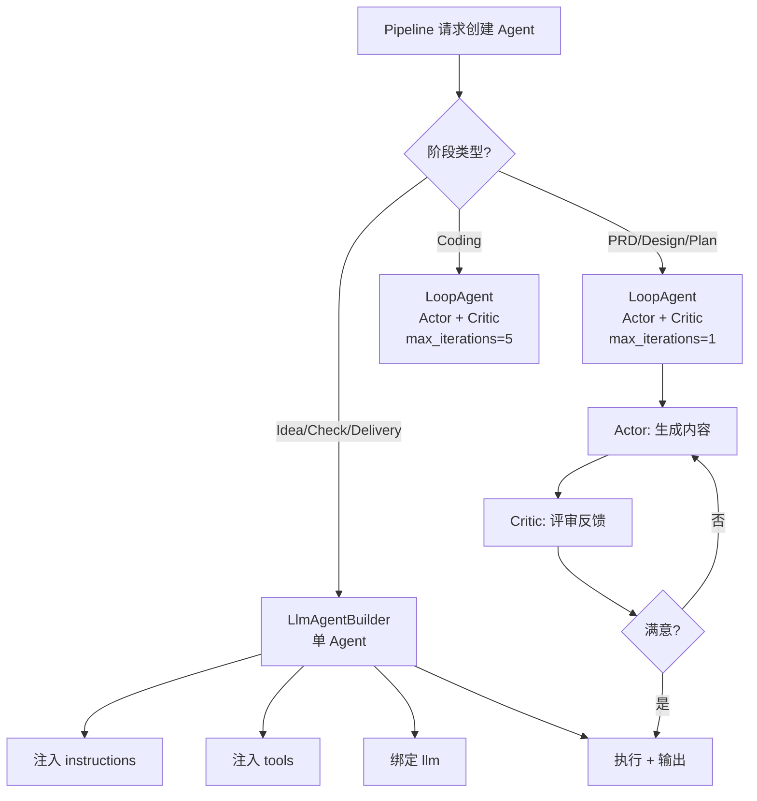

# Agents 领域

**模块路径**：`crates/cowork-core/src/agents/`
**生成日期**：2026-07-05

---

## 概述

Agents 模块是 Cowork Forge 的"人力资源部"——它负责创建和管理系统中所有的 AI Agent。每个 Agent 就像工厂里的一个"工人"，有的当产品经理（PRD Agent），有的当架构师（Design Agent），有的写代码（Coding Agent）。但和人类团队不同，这里的每个关键岗位是一对工人：**Actor 负责干活，Critic 负责审查**，通过这种"互相监督"的机制来保证输出质量。

模块的设计智慧藏在它的 Bug 修复注释里。`crates/cowork-core/src/agents/mod.rs:4-10` 有一段重要的注释，解释了 adk-rust 框架中 `SequentialAgent` 在 `LoopAgent` 之后会异常终止的问题。解决方案不是修改框架，而是将 `max_iterations` 设为 1——让 LoopAgent 自然完成而非通过 `exit_loop()` 终止。这是一个"懂得和框架妥协"的务实设计。

---

## 核心功能点

1. **Agent 工厂函数**——`create_idea_agent()`、`create_prd_loop()`、`create_design_loop()`、`create_plan_loop()`、`create_coding_loop()`、`create_check_agent()`、`create_delivery_agent()`，覆盖 7 个阶段。每个函数使用 `LlmAgentBuilder` 注入特定指令和工具集。代码位置：`crates/cowork-core/src/agents/mod.rs:32-507`
2. **Actor-Critic 循环**——PRD/Design/Plan/Coding 使用 `LoopAgent` 组合 Actor 和 Critic，Coding 有 5 次迭代上限。代码位置：`crates/cowork-core/src/agents/mod.rs:68-378`
3. **PM Agent 流式交互**——`execute_pm_agent_message_streaming()` 支持 GUI 实时流式推送，通过回调接口 `PMAgentStreamCallback` 通知文本和工具调用。代码位置：`crates/cowork-core/src/agents/mod.rs:659-917`

---

## 关键组件

| 组件/类型 | 文件路径 | 核心职责 |
|---------|---------|---------|
| `create_idea_agent()` | `crates/cowork-core/src/agents/mod.rs:32` | 创建 Idea Agent，捕捉需求生成 idea.md |
| `create_prd_loop()` | `crates/cowork-core/src/agents/mod.rs:68` | PRD Actor+Cirtic LoopAgent，生成自优化 PRD |
| `create_design_loop()` | `crates/cowork-core/src/agents/mod.rs:149` | Design Actor+Cirtic LoopAgent，设计技术架构 |
| `create_plan_loop()` | `crates/cowork-core/src/agents/mod.rs:223` | Plan Actor+Cirtic LoopAgent，分解任务和依赖 |
| `create_coding_loop()` | `crates/cowork-core/src/agents/mod.rs:301` | Coding Actor+Cirtic LoopAgent（5 次迭代），编写代码 |
| `create_check_agent()` | `crates/cowork-core/src/agents/mod.rs:384` | Check Agent，验证质量和完整性 |
| `create_delivery_agent()` | `crates/cowork-core/src/agents/mod.rs:444` | Delivery Agent，生成交付报告 |
| `create_project_manager_agent()` | `crates/cowork-core/src/agents/mod.rs:548` | PM Agent，交付后聊天交互 |
| `PMAgentResult` | `crates/cowork-core/src/agents/mod.rs:621` | PM Agent 执行结果，包含响应和动作 |
| `PMAgentStreamCallback` trait | `crates/cowork-core/src/agents/mod.rs:652` | 流式回调接口，GUI 实时显示 |

---

## 内部数据流

---

## 关键接口与扩展点

所有 Agent 通过 `LlmAgentBuilder` 创建，可以灵活组合指令、工具和模型。`config_definition/agent_factory.rs` 中的 `create_agent_for_stage()` 和 `create_agent_from_config()` 提供了基于配置的 Agent 创建方式。PM Agent 可以通过 MCP 工具集扩展能力（`crates/cowork-core/src/agents/mod.rs:563`）。

---

## 与其他模块的交互

| 交互模块 | 方向 | 说明 |
|---------|------|------|
| instructions | 依赖 | 使用提示词常量构建 Agent 指令 |
| tools | 依赖 | 注入各种 ADK 工具执行文件/数据/验证操作 |
| domain | 依赖 | 需要访问 Iteration 和 Project 数据 |
| llm | 依赖 | 绑定 LLM 模型进行推理 |
| config_definition | 依赖 | 通过 agent_factory 从配置创建 Agent |

---

## 性能考量

所有 Agent 执行异步（基于 Tokio），但 LLM 调用通过 TokenBucketRateLimiter 串行化。Coding Loop 的 max_iterations=5 比其他 Loop（1）更多，因为编码任务通常需要多次迭代。PM Agent 的流式 API 支持 GUI 实时显示文本输出。

---

## 实现亮点

**SequentialAgent 终止 Bug 的解决方案**（`crates/cowork-core/src/agents/mod.rs:4-10`）：adk-rust 的 LoopAgent 在子 Agent 调用 `exit_loop()` 时会终止整个 SequentialAgent。解决方案是 `max_iterations=1`，让 LoopAgent 自然完成而非通过 exit_loop 终止。这个妥协简洁有效地解决了问题，没有改动框架代码。
