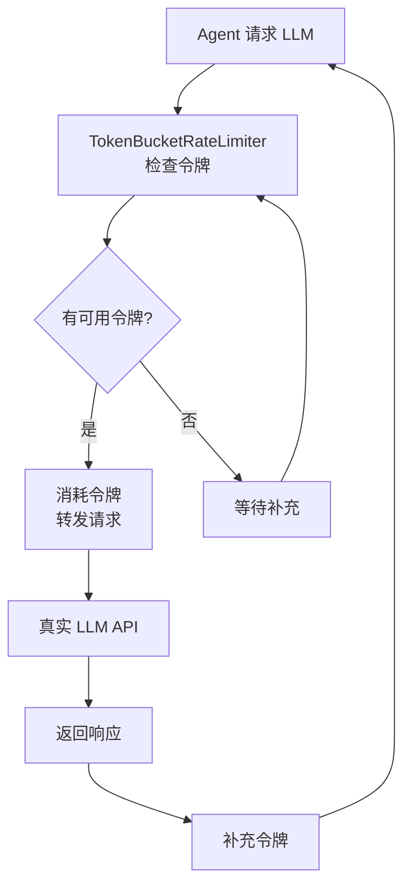

# LLM 领域

**模块路径**：`crates/cowork-core/src/llm/`
**生成日期**：2026-07-05

---

## 概述

LLM 模块是 Cowork Forge 的"大脑接口"——它负责与外部大语言模型 API 通信，并确保通信过程不会因过于频繁的请求而被限流。如果把系统比作一个 AI 工厂，LLM 模块就是工厂的"电力系统"：没有它所有机器都转不起来，但如果电压不稳（API 限流），整个工厂都会瘫痪。

---

## 核心功能点

1. **LLM 客户端创建**——从 config.toml 加载 API 配置创建 OpenAI 兼容的 LLM 客户端。代码位置：`crates/cowork-core/src/llm/config.rs`
2. **TokenBucket 速率限制**——允许 5 个突发请求，长期平均速率 30 req/min。代码位置：`crates/cowork-core/src/llm/rate_limiter.rs:32-60`
3. **装饰器模式**——`TokenBucketRateLimiter` 实现 `Llm` trait 包裹真实 LLM 客户端，对上层完全透明

---

## 关键组件

| 组件/类型 | 文件路径 | 核心职责 |
|---------|---------|---------|
| `TokenBucketRateLimiter` | `crates/cowork-core/src/llm/rate_limiter.rs:32` | TokenBucket 速率限制装饰器 |
| `create_llm_client()` | `crates/cowork-core/src/llm/config.rs` | 从配置创建 LLM 客户端 |

---

## 内部数据流

---

## 关键接口与扩展点

`TokenBucketRateLimiter` 实现了 `adk_core::Llm` trait，可透明替换任意 `Llm` 实现。参数 `max_burst` 和 `rate_limit_per_minute` 可配置。默认 max_burst=5，rate_limit=30 req/min。

---

## 与其他模块的交互

| 交互模块 | 方向 | 说明 |
|---------|------|------|
| agents | 被依赖 | Agent 绑定 LLM 模型进行推理 |
| pipeline | 被依赖 | StageExecutor 创建 LLM 客户端 |
