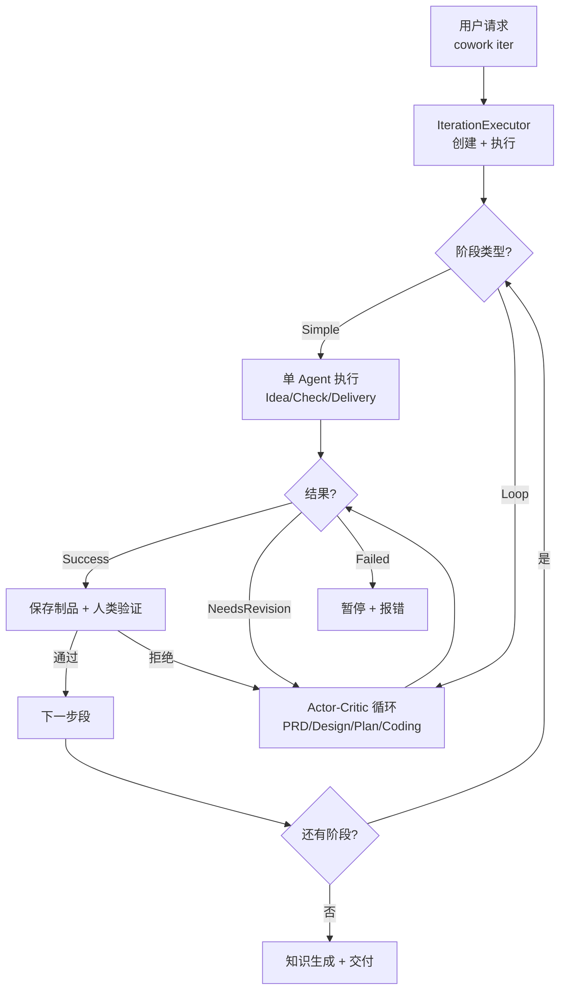

# Pipeline 领域

**模块路径**：`crates/cowork-core/src/pipeline/`
**生成日期**：2026-07-05

---

## 概述

Pipeline 是 Cowork Forge 的"流水线传送带"。它负责把 7 个开发阶段按顺序串联起来，管理每个阶段的执行、暂停、重试和跳转。如果把整个系统比作一个 AI 工厂，Pipeline 就是那个决定"什么零件什么时候送到哪个工位"的生产调度中心。

Pipeline 的核心设计思路是：**开发流程本质上是有序的**。你不可能在设计完成之前就写代码，也不可能在测试通过之前就交付。因此，Pipeline 用统一的 `Stage` trait 抽象所有阶段，用流水线模式确保阶段按序执行，同时用 Actor-Critic 循环让每个阶段内部能自优化。

---

## 核心功能点

1. **7 阶段流水线编排**——定义了从 Idea 到 Delivery 的 7 个开发阶段，支持从任意阶段开始执行（`get_stages_from()` at `crates/cowork-core/src/pipeline/mod.rs:90`）和根据流程配置动态创建阶段（`get_stages_from_flow()` at `crates/cowork-core/src/pipeline/mod.rs:116`）
2. **Flow 配置驱动**——通过 `ConfigRegistry` 可以定义自定义流程，系统自动根据流程配置创建对应的阶段实例，而不是硬编码阶段顺序。代码位置：`crates/cowork-core/src/pipeline/mod.rs:147-154`
3. **迭代执行器**——`IterationExecutor` 是统一的迭代生命周期管理器，负责 Genesis/Evolution 迭代的创建、执行、状态保存。代码位置：`crates/cowork-core/src/pipeline/executor/mod.rs:17`
4. **Actor-Critic 阶段执行**——`stage_executor.rs` 实现配置驱动的阶段执行框架，处理 Simple/Loop 两种阶段类型，支持反馈循环。代码位置：`crates/cowork-core/src/pipeline/stage_executor.rs:1-80`
5. **知识生成**——迭代完成后自动触发知识生成，提取关键决策和模式。代码位置：`crates/cowork-core/src/pipeline/executor/knowledge.rs`

---

## 关键组件

| 组件/类型 | 文件路径 | 核心职责 |
|---------|---------|---------|
| `Stage` trait | `crates/cowork-core/src/pipeline/mod.rs:47` | 定义所有开发阶段的统一接口（execute + execute_with_feedback） |
| `PipelineContext` | `crates/cowork-core/src/pipeline/mod.rs:29` | 保存流水线执行上下文（项目、迭代、工作区路径） |
| `StageResult` | `crates/cowork-core/src/pipeline/mod.rs:19` | 阶段执行结果枚举（Success/Failed/Paused/NeedsRevision/GotoStage） |
| `IterationExecutor` | `crates/cowork-core/src/pipeline/executor/mod.rs:17` | 迭代执行器，统一生命周期管理 |
| `StageExecutor` | `crates/cowork-core/src/pipeline/stage_executor.rs` | 配置驱动的阶段执行框架 |

---

## 内部数据流



**关键步骤说明**：
1. 用户请求到达 `crates/cowork-cli/src/main.rs:119`，路由到 `commands/iter.rs`
2. `IterationExecutor::execute()` 启动迭代，从 `get_stages_from_flow()` 获取阶段列表（`crates/cowork-core/src/pipeline/executor/mod.rs:79-80`）
3. 每个阶段通过 `Stage::execute()` 执行，结果返回 `StageResult`
4. Loop 类型阶段可能因 `NeedsRevision` 多次迭代
5. 关键阶段输出需要人类验证后才能继续

---

## 关键接口与扩展点

`Stage` trait 是 Pipeline 的核心接口：

```rust
pub trait Stage: Send + Sync {
    fn name(&self) -> &str;
    fn description(&self) -> &str;
    fn needs_confirmation(&self) -> bool { false }
    async fn execute(&self, ctx: &PipelineContext, interaction: Arc<dyn InteractiveBackend>) -> StageResult;
    async fn execute_with_feedback(&self, ctx: &PipelineContext, interaction: Arc<dyn InteractiveBackend>, feedback: &str) -> StageResult;
}
```

扩展点：`ConfigRegistry` 允许定义自定义 Flow（`crates/cowork-core/src/config_definition/flow_definition.rs`），可以重新排列阶段顺序、跳过阶段或添加 Hook。

---

## 与其他模块的交互

| 交互模块 | 方向 | 接口/协议 | 说明 |
|---------|------|---------|------|
| agents | 依赖 | `create_*_agent()` 系列函数 | Pipeline 调用 Agent 工厂创建各阶段 Agent |
| domain | 依赖 | `Project`, `Iteration` | Pipeline 读取项目/迭代状态并更新 |
| llm | 依赖 | `create_llm_client()` | Pipeline 创建 LLM 客户端供 Agent 使用 |
| interaction | 依赖 | `InteractiveBackend` trait | Pipeline 通过交互后端与用户通信 |
| persistence | 依赖 | `ProjectStore`, `IterationStore` | Pipeline 保存和加载项目/迭代数据 |
| config_definition | 依赖 | `ConfigRegistry` | Pipeline 查询流程配置和 Agent 定义 |

---

## 跨模块协作场景

**在 7-Stage 开发流水线中**：Pipeline 是主调度器。它从 `ConfigRegistry` 获取流程定义 → 创建 LLM 客户端（llm 模块）→ 构建 Agent（agents 模块）→ 注册交互后端（interaction 模块）→ 执行阶段 → 保存结果（persistence 模块）→ 重复直到所有阶段完成。迭代完成后触发知识生成（knowledge.rs）和持久化更新。

---

## 性能考量

Pipeline 的执行是串行化的——每个阶段必须等待前一个完成。这是设计使然，因为开发流程本质上是有序的。LLM 调用通过 `TokenBucketRateLimiter` 串行化（concurrency=1），确保不会触发 API 速率限制。文件操作和命令执行使用 Tokio 异步，不会阻塞主流程。

---

## 实现亮点

**Flow 配置驱动的动态阶段创建**（`crates/cowork-core/src/pipeline/mod.rs:98-112`）：`create_stage_by_id()` 函数使 Pipeline 不再硬编码阶段序列，而是可以根据 Flow 配置灵活组装。这是一个从"固定流水线"到"可配置流水线"的关键设计转变。
