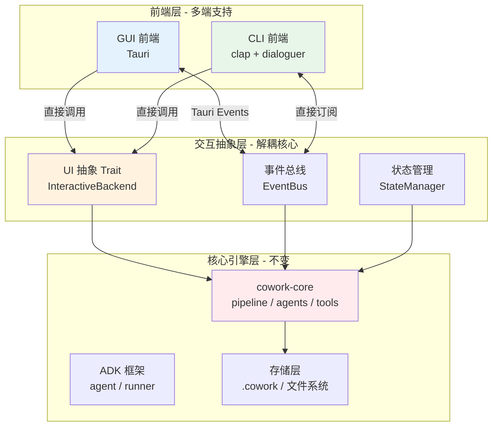

# Cowork Forge GUI 化架构规划（嵌入式方案）

**版本**: 2.0  
**创建时间**: 2026-01-31  
**更新时间**: 2026-01-31  
**文档状态**: 规划阶段  

## 架构概述

本规划采用**纯嵌入式方案**，将 GUI（Tauri）和 CLI 直接集成到核心引擎 `cowork-core` 中，无需独立的服务器进程。所有前端（CLI 和 GUI）都通过相同的抽象层与核心引擎交互，确保功能一致性和代码复用。

### 核心设计理念

1. **零服务器部署**：CLI 和 GUI 都是独立的可执行文件，无需后台服务
2. **共享核心引擎**：CLI 和 GUI 使用完全相同的 `cowork-core` 库
3. **事件驱动架构**：通过 `EventBus` 实现实时事件通知
4. **交互抽象解耦**：通过 `InteractiveBackend` trait 支持 TUI 和 GUI
5. **文件系统同步**：CLI 和 GUI 通过 `.cowork/` 目录实现状态共享  

---

## 一、当前架构分析

### 1.1 现有架构优势

```
┌─────────────────────────────────────────────────────────────┐
│                    当前架构优势                              │
├─────────────────────────────────────────────────────────────┤
│ ✅ 清晰的领域分层（CLI → Core → ADK → Storage）           │
│ ✅ 强大的工具抽象系统（adk_core::Tool trait）              │
│ ✅ 完善的会话隔离机制（session_id 隔离）                   │
│ ✅ 事件流支持（EventStream）                                │
│ ✅ Actor-Critic 协作模式成熟                                 │
└─────────────────────────────────────────────────────────────┘
```

### 1.2 关键耦合点识别

| 耦合点 | 位置 | 问题描述 | 影响范围 |
|--------|------|---------|---------|
| **TUI 交互耦合** | `ResilientAgent` + `hitl_tools.rs` | 直接使用 `dialoguer` crate | 人机协作场景 |
| **输出耦合** | 各模块中的 `println!` | 同步输出，无法被 GUI 捕获 | 所有状态反馈 |
| **命令解析耦合** | `cowork-cli` | `clap` 参数解析与业务逻辑混合 | 命令入口 |
| **配置管理耦合** | CLI 层直接加载配置 | 无配置抽象层 | 全局 |

---

## 二、目标架构设计

### 2.1 新架构分层



**架构特点**：
- **纯嵌入式**：前端（CLI 和 GUI）直接集成核心引擎，无需独立服务器
- **共享核心**：CLI 和 GUI 使用同一套 `cowork-core` 库
- **事件驱动**：通过 `EventBus` 实现实时事件通知
- **交互抽象**：通过 `InteractiveBackend` trait 解耦 TUI 和 GUI 交互

### 2.2 核心抽象设计

#### 2.2.1 交互抽象 Trait

```rust
// cowork-core/src/interaction/mod.rs

/// 交互后端抽象 - 支持不同前端实现
#[async_trait]
pub trait InteractiveBackend: Send + Sync {
    /// 显示消息
    async fn show_message(&self, level: MessageLevel, content: String);
    
    /// 请求用户输入
    async fn request_input(&self, prompt: &str, options: Vec<InputOption>) -> Result<InputResponse>;
    
    /// 显示进度
    async fn show_progress(&self, task_id: String, progress: ProgressInfo);
    
    /// 订阅事件流
    fn subscribe_events(&self) -> broadcast::Receiver<EngineEvent>;
}

/// 消息级别
pub enum MessageLevel {
    Info,
    Success,
    Warning,
    Error,
    Debug,
}

/// 输入选项
pub struct InputOption {
    pub id: String,
    pub label: String,
    pub description: Option<String>,
}

/// 用户响应
pub enum InputResponse {
    Text(String),
    Selection(String),
    Cancel,
}

/// 进度信息
pub struct ProgressInfo {
    pub current: u32,
    pub total: u32,
    pub message: String,
}
```

#### 2.2.2 CLI 交互实现

```rust
// cowork-cli/src/interaction/cli_backend.rs

use cowork_core::interaction::*;
use dialoguer::{Select, Input, theme::ColorfulTheme};
use crossterm::style::{Color, Print};

pub struct CliBackend;

#[async_trait]
impl InteractiveBackend for CliBackend {
    async fn show_message(&self, level: MessageLevel, content: String) {
        let (icon, color) = match level {
            MessageLevel::Info => ("ℹ️", Color::Blue),
            MessageLevel::Success => ("✅", Color::Green),
            MessageLevel::Warning => ("⚠️", Color::Yellow),
            MessageLevel::Error => ("❌", Color::Red),
            MessageLevel::Debug => ("🔍", Color::DarkGrey),
        };
        
        Print(content).color(color).unwrap();
    }
    
    async fn request_input(&self, prompt: &str, options: Vec<InputOption>) -> Result<InputResponse> {
        if options.is_empty() {
            let input: String = Input::new()
                .with_prompt(prompt)
                .interact_text()
                .map_err(|e| anyhow::anyhow!("Input error: {}", e))?;
            Ok(InputResponse::Text(input))
        } else {
            let selection = Select::with_theme(&ColorfulTheme::default())
                .with_prompt(prompt)
                .items(&options.iter().map(|o| o.label.as_str()).collect::<Vec<_>>())
                .interact()
                .map_err(|e| anyhow::anyhow!("Selection error: {}", e))?;
            Ok(InputResponse::Selection(options[selection].id.clone()))
        }
    }
    
    // ... 其他方法实现
}
```

#### 2.2.3 重构 ResilientAgent

```rust
// cowork-core/src/agents/resilient.rs

pub struct ResilientAgent {
    inner: Arc<dyn Agent>,
    retry_count: Arc<AtomicU32>,
    interaction: Arc<dyn InteractiveBackend>,  // 注入交互抽象
}

impl ResilientAgent {
    pub fn new(inner: Arc<dyn Agent>, interaction: Arc<dyn InteractiveBackend>) -> Self {
        Self {
            inner,
            retry_count: Arc::new(AtomicU32::new(0)),
            interaction,
        }
    }
    
    async fn handle_error(&self, context: Arc<dyn InvocationContext>, e: AdkError) -> Result<AgentOutput, AdkError> {
        self.interaction.show_message(
            MessageLevel::Warning,
            format!("Agent '{}' encountered error: {}", self.name(), e)
        ).await;
        
        let options = vec![
            InputOption {
                id: "retry".to_string(),
                label: "Retry (reset counter)".to_string(),
                description: Some("Retry the agent execution".to_string()),
            },
            InputOption {
                id: "guidance".to_string(),
                label: "Provide Guidance & Retry".to_string(),
                description: Some("Provide feedback to guide the agent".to_string()),
            },
            InputOption {
                id: "abort".to_string(),
                label: "Abort".to_string(),
                description: Some("Stop the execution".to_string()),
            },
        ];
        
        let response = self.interaction.request_input(
            "How would you like to proceed?",
            options
        ).await?;
        
        match response {
            InputResponse::Selection(id) => match id.as_str() {
                "retry" => {
                    self.retry_count.store(0, Ordering::SeqCst);
                    self.run(context).await
                },
                "guidance" => {
                    self.run(context).await
                },
                "abort" => {
                    self.retry_count.store(0, Ordering::SeqCst);
                    Err(e)
                },
                _ => Err(e),
            },
            _ => Err(e),
        }
    }
}
```

### 2.3 事件系统设计

#### 2.3.1 事件总线

```rust
// cowork-core/src/event_bus.rs

use tokio::sync::broadcast;
use serde::{Serialize, Deserialize};

#[derive(Debug, Clone, Serialize, Deserialize)]
pub enum EngineEvent {
    // 阶段事件
    StageStarted { 
        stage: String, 
        session_id: String,
        timestamp: i64,
    },
    StageCompleted { 
        stage: String, 
        session_id: String,
        duration_ms: u64,
    },
    
    // Agent 事件
    AgentThinking { 
        agent: String, 
        content: String,
        session_id: String,
    },
    AgentOutput { 
        agent: String, 
        content: String,
        session_id: String,
    },
    
    // 工具事件
    ToolStarted { 
        tool: String, 
        session_id: String,
    },
    ToolCompleted { 
        tool: String, 
        result: ToolResult,
        session_id: String,
    },
    
    // 文件事件
    FileCreated { 
        path: String, 
        size: u64,
        session_id: String,
    },
    FileModified { 
        path: String, 
        changes: Vec<FileChange>,
        session_id: String,
    },
    FileDeleted { 
        path: String,
        session_id: String,
    },
    
    // 错误事件
    Error { 
        error: String, 
        context: String,
        session_id: String,
        severity: ErrorSeverity,
    },
    
    // 人机交互事件
    HITLRequest {
        tool: String,
        content: String,
        options: Vec<InteractionOption>,
        session_id: String,
    },
    HITLResponse {
        tool: String,
        response: InteractionResponse,
        session_id: String,
    },
}

#[derive(Debug, Clone, Serialize, Deserialize)]
pub enum ErrorSeverity {
    Low,
    Medium,
    High,
    Critical,
}

pub struct EventBus {
    sender: broadcast::Sender<EngineEvent>,
}

impl EventBus {
    pub fn new() -> Self {
        let (sender, _) = broadcast::channel(1000);
        Self { sender }
    }
    
    pub fn subscribe(&self) -> broadcast::Receiver<EngineEvent> {
        self.sender.subscribe()
    }
    
    pub async fn publish(&self, event: EngineEvent) {
        self.sender.send(event).ok();
    }
}
```

### 2.4 Tauri 事件机制

#### 2.4.1 事件通信

使用 Tauri 的内置事件系统实现前后端通信：

```rust
// cowork-gui/src-tauri/src/events.rs

use tauri::Window;
use cowork_core::event_bus::*;

/// 启动事件转发任务
pub async fn start_event_forwarding(
    window: Window,
    event_bus: Arc<EventBus>,
) {
    let mut receiver = event_bus.subscribe();
    
    tokio::spawn(async move {
        while let Ok(event) = receiver.recv().await {
            // 将 EngineEvent 转换为 Tauri 事件发送到前端
            let event_name = match &event {
                EngineEvent::StageStarted { .. } => "stage-started",
                EngineEvent::StageCompleted { .. } => "stage-completed",
                EngineEvent::AgentThinking { .. } => "agent-thinking",
                EngineEvent::AgentOutput { .. } => "agent-output",
                EngineEvent::ToolStarted { .. } => "tool-started",
                EngineEvent::ToolCompleted { .. } => "tool-completed",
                EngineEvent::FileCreated { .. } => "file-created",
                EngineEvent::FileModified { .. } => "file-modified",
                EngineEvent::FileDeleted { .. } => "file-deleted",
                EngineEvent::Error { .. } => "error",
                EngineEvent::HITLRequest { .. } => "hitl-request",
                EngineEvent::HITLResponse { .. } => "hitl-response",
            };
            
            window.emit(event_name, event).ok();
        }
    });
}
```

#### 2.4.2 前端事件监听

```typescript
// cowork-gui/src/hooks/useEngineEvents.ts

import { useEffect } from 'react';
import { listen } from '@tauri-apps/api/event';
import { EngineEvent } from '../types';

export function useEngineEvents(callback: (event: EngineEvent) => void) {
  useEffect(() => {
    const unlistenPromises = [
      listen('stage-started', callback),
      listen('stage-completed', callback),
      listen('agent-thinking', callback),
      listen('agent-output', callback),
      listen('tool-started', callback),
      listen('tool-completed', callback),
      listen('file-created', callback),
      listen('file-modified', callback),
      listen('file-deleted', callback),
      listen('error', callback),
      listen('hitl-request', callback),
      listen('hitl-response', callback),
    ];

    return () => {
      unlistenPromises.forEach(p => p.then(f => f()));
    };
  }, [callback]);
}
```

---

## 三、GUI 前端技术选型

### 3.1 推荐方案对比

| 方案 | 优势 | 劣势 | 适用场景 |
|------|------|------|---------|
| **Tauri** | Rust 原生、体积小、性能高、安全 | 生态较新 | ⭐⭐⭐⭐⭐ 推荐 |
| **Electron** | 生态成熟、开发体验好 | 体积大、资源占用高 | Web 技术栈团队 |
| **Flutter Desktop** | 跨平台一致性好 | 需要学习 Dart | 跨平台需求强 |
| **Slint** | 原生性能、Rust 集成 | 生态小、学习曲线 | 极致性能需求 |

### 3.2 Tauri 方案详细设计

#### 3.2.1 项目结构

```
cowork-forge/
├── crates/
│   ├── cowork-core/           # 核心引擎（不变）
│   ├── cowork-cli/            # CLI 前端
│   └── cowork-gui/            # GUI 前端（新增）
│       ├── src-tauri/         # Rust 后端（嵌入式）
│       │   ├── src/
│       │   │   ├── main.rs
│       │   │   ├── commands.rs    # Tauri 命令
│       │   │   ├── events.rs       # 事件转发
│       │   │   ├── backend.rs      # Tauri 交互后端实现
│       │   │   └── lib.rs          # 库导出
│       │   └── Cargo.toml
│       └── src/                # React 前端
│           ├── components/
│           │   ├── SessionList.tsx
│           │   ├── SessionDetail.tsx
│           │   ├── EventStream.tsx
│           │   ├── ArtifactViewer.tsx
│           │   └── HITLDialog.tsx    # 人机交互对话框
│           ├── pages/
│           │   ├── Dashboard.tsx
│           │   ├── NewProject.tsx
│           │   └── Settings.tsx
│           ├── hooks/
│           │   └── useEngineEvents.ts
│           └── App.tsx
└── Cargo.toml
```

#### 3.2.2 Tauri 命令示例

```rust
// cowork-gui/src-tauri/src/commands.rs

use tauri::{State, Window};
use cowork_core::pipeline::*;
use cowork_core::storage::*;
use cowork_core::interaction::*;
use std::sync::Arc;

#[tauri::command]
async fn create_new_project(
    idea: String,
    window: Window,
    interaction: State<'_, Arc<dyn InteractiveBackend>>,
    event_bus: State<'_, Arc<EventBus>>,
) -> Result<String, String> {
    // 直接调用存储层创建会话
    let session_id = format!("session-{}", chrono::Utc::now().timestamp());
    
    // 初始化会话
    let session_input = SessionInput {
        session_id: session_id.clone(),
        session_type: SessionType::New,
        description: idea.clone(),
        base_session_id: None,
        created_at: chrono::Utc::now(),
    };
    save_session_input(&session_id, &session_input)
        .map_err(|e| e.to_string())?;
    
    // 创建 pipeline
    let config = load_config("config.toml")
        .map_err(|e| e.to_string())?;
    let pipeline = create_cowork_pipeline(&config, &session_id)
        .map_err(|e| e.to_string())?;
    
    // 启动事件转发
    start_event_forwarding(window.clone(), event_bus.inner().clone()).await;
    
    // 在后台执行 pipeline
    let interaction_clone = interaction.inner().clone();
    tokio::spawn(async move {
        execute_pipeline_with_backend(pipeline, &idea, interaction_clone).await;
    });
    
    Ok(session_id)
}

#[tauri::command]
async fn get_sessions() -> Result<Vec<SessionRecord>, String> {
    let index = load_project_index().map_err(|e| e.to_string())?;
    Ok(index.sessions)
}

#[tauri::command]
async fn get_session_artifacts(session_id: String) -> Result<Vec<String>, String> {
    let session_dir = get_session_dir(&session_id).map_err(|e| e.to_string())?;
    let artifacts_dir = session_dir.join("artifacts");
    
    let mut artifacts = Vec::new();
    if artifacts_dir.exists() {
        for entry in std::fs::read_dir(artifacts_dir).map_err(|e| e.to_string())? {
            let entry = entry.map_err(|e| e.to_string())?;
            if entry.path().is_file() {
                if let Some(name) = entry.file_name().to_str() {
                    artifacts.push(name.to_string());
                }
            }
        }
    }
    
    Ok(artifacts)
}

#[tauri::command]
async fn read_artifact(session_id: String, artifact_name: String) -> Result<String, String> {
    let session_dir = get_session_dir(&session_id).map_err(|e| e.to_string())?;
    let artifact_path = session_dir.join("artifacts").join(&artifact_name);
    
    std::fs::read_to_string(artifact_path).map_err(|e| e.to_string())
}

#[tauri::command]
async fn hitl_response(
    tool_id: String,
    response: String,
    interaction: State<'_, Arc<dyn InteractiveBackend>>,
) -> Result<(), String> {
    interaction.submit_response(tool_id, response).await;
    Ok(())
}
```

#### 3.2.3 React 前端示例

```typescript
// cowork-gui/src/components/SessionList.tsx

import { useEffect, useState } from 'react';
import { invoke } from '@tauri-apps/api/tauri';
import { listen } from '@tauri-apps/api/event';

interface Session {
  id: string;
  status: 'InProgress' | 'Completed' | 'Failed';
  created_at: string;
  input_description: string;
}

export function SessionList() {
  const [sessions, setSessions] = useState<Session[]>([]);
  const [selectedSession, setSelectedSession] = useState<string | null>(null);

  useEffect(() => {
    invoke<Session[]>('get_sessions').then(setSessions);
    
    const unlisten = listen<EngineEvent>('engine-event', (event) => {
      console.log('Engine event:', event.payload);
    });
    
    return () => { unlisten.then(f => f()); };
  }, []);

  return (
    <div className="session-list">
      <h2>Sessions</h2>
      {sessions.map(session => (
        <div 
          key={session.id}
          className={`session-item ${selectedSession === session.id ? 'selected' : ''}`}
          onClick={() => setSelectedSession(session.id)}
        >
          <div className="session-id">{session.id}</div>
          <div className="session-status">{session.status}</div>
          <div className="session-description">{session.input_description}</div>
        </div>
      ))}
    </div>
  );
}
```

---

## 四、实施路线图

### 阶段 1：核心解耦（2-3 周）

```
Week 1-2: 交互抽象层
├── 创建 cowork-core/src/interaction/ 模块
├── 定义 InteractiveBackend trait
├── 实现 CliBackend（迁移现有 dialoguer 代码）
├── 重构 ResilientAgent 使用交互抽象
└── 重构 HITL 工具使用交互抽象

Week 3: 事件系统
├── 创建 cowork-core/src/event_bus.rs
├── 定义 EngineEvent 枚举
├── 在关键位置注入事件发布
└── 实现事件订阅机制
```

### 阶段 2：GUI 前端开发（4-5 周）

```
Week 4-5: Tauri 项目搭建
├── 初始化 Tauri 项目
├── 配置 Rust 依赖（依赖 cowork-core）
├── 配置 React/TypeScript
├── 实现 TauriBackend（InteractiveBackend 的 GUI 实现）
├── 实现事件转发机制
└── 实现基础布局

Week 6-8: 核心功能
├── 会话列表页面
├── 会话详情页面
├── 实时事件流显示
├── 工件查看器（Markdown 渲染）
├── 配置管理页面
└── HITL 对话框组件

Week 9: 高级功能
├── 新项目向导
├── 修改工作流 UI
├── 恢复/回退操作
└── 事件历史查询
```

### 阶段 3：测试与优化（2-3 周）

```
Week 10-11: 测试
├── 单元测试（交互抽象层）
├── 集成测试（CLI + GUI）
├── E2E 测试（完整工作流）
└── 性能测试（长时间运行）

Week 12: 优化与发布
├── 性能优化
├── UI/UX 优化
├── 文档编写
└── 发布准备
```

---

## 五、关键决策点

### 5.1 如何处理长期运行的 pipeline？

**方案 A：后台任务 + 事件推送（采用）**
- 使用 tokio::spawn 在后台运行 pipeline
- 通过 EventBus 推送事件到前端
- 前端实时更新 UI
- 优点：用户体验好、实现简单
- 缺点：需要在 GUI 启动时保持进程运行

**实现方式**：
```rust
// 在 Tauri 命令中启动后台任务
tokio::spawn(async move {
    execute_pipeline_with_backend(pipeline, &idea, interaction).await;
});
```

### 5.2 如何处理人机交互（HITL）？

**方案 A：阻塞式交互**
- 等待用户响应后继续
- 优点：实现简单
- 缺点：用户体验差、阻塞 UI

**方案 B：异步交互（采用）**
- 发送交互请求，暂停当前任务
- 收到响应后恢复执行
- 优点：用户体验好、不阻塞 UI
- 缺点：状态管理复杂

**实现方式**：
```rust
// InteractiveBackend trait 中定义
async fn request_input_async(&self, prompt: &str) -> Result<String>;

// TauriBackend 实现
pub struct TauriBackend {
    pending_requests: Arc<Mutex<HashMap<String, Sender<String>>>>,
}

impl TauriBackend {
    pub async fn submit_response(&self, request_id: String, response: String) {
        if let Some(sender) = self.pending_requests.lock().await.remove(&request_id) {
            sender.send(response).ok();
        }
    }
}
```

### 5.3 如何处理 CLI 和 GUI 的状态同步？

**方案 A：共享文件系统（采用）**
- CLI 和 GUI 都通过 `.cowork/` 目录读写状态
- 优点：简单、天然同步
- 缺点：文件锁问题

**实现方式**：
- 使用 `std::fs::File::try_lock()` 避免冲突
- 通过 EventBus 通知状态变化
- GUI 定期轮询会话状态

---

## 六、总结与建议

### 6.1 核心原则

1. **渐进式重构**：不要一次性重写，分阶段进行
2. **向后兼容**：保持 CLI 功能不变
3. **最小侵入**：核心引擎层改动最小化
4. **可测试性**：每个层级都可独立测试

### 6.2 优先级

```
P0 (必须):
├── 交互抽象层（InteractiveBackend trait）
├── 事件系统（EventBus）
├── ResilientAgent 重构
└── HITL 工具重构

P1 (重要):
├── TauriBackend 实现
├── Tauri 事件转发机制
├── 基础 GUI 页面（会话列表、详情）
└── HITL 对话框组件

P2 (可选):
├── 高级功能（修改工作流 UI、恢复/回退）
├── 性能优化
└── 插件系统
```

### 6.3 风险与缓解

| 风险 | 影响 | 缓解措施 |
|------|------|---------|
| 重构引入 bug | 高 | 充分测试，保留 CI/CD，分阶段提交 |
| 开发周期过长 | 中 | 分阶段交付，先完成核心解耦，再开发 GUI |
| Tauri 生态不成熟 | 低 | 保持交互抽象，可切换到其他桌面框架 |
| 异步交互状态管理复杂 | 中 | 使用 Channel 和 Mutex 确保线程安全 |
| CLI 和 GUI 状态同步 | 中 | 使用文件系统 + 事件总线双重同步机制 |
| 长时间运行性能问题 | 中 | 使用异步 I/O 和流式处理，避免内存泄漏 |

---

## 七、附录

### 7.1 依赖清单

**cowork-core 新增依赖**:
```toml
[dependencies]
# 交互抽象
tokio = { version = "1.0", features = ["sync", "broadcast"] }
serde = { version = "1.0", features = ["derive"] }
anyhow = "1.0"

# 现有依赖保持不变
```

**cowork-gui 依赖**:
```toml
[dependencies]
# 核心引擎
cowork-core = { path = "../cowork-core" }

# Tauri
tauri = { version = "2.0", features = ["shell-open"] }
tokio = { version = "1.0", features = ["full"] }
serde = { version = "1.0", features = ["derive"] }

# 异步支持
async-trait = "0.1"

[build-dependencies]
tauri-build = { version = "2.0", features = [] }
```

**Frontend 依赖**:
```json
{
  "dependencies": {
    "@tauri-apps/api": "^2.0.0",
    "@tauri-apps/plugin-shell": "^2.0.0",
    "react": "^18.0.0",
    "react-dom": "^18.0.0",
    "typescript": "^5.0.0",
    "zustand": "^4.4.0",
    "react-markdown": "^9.0.0",
    "react-syntax-highlighter": "^15.0.0"
  }
}
```

**Cargo.toml 工作区配置**:
```toml
[workspace]
members = [
    "crates/cowork-core",
    "crates/cowork-cli",
    "crates/cowork-gui",
]

[workspace.dependencies]
# 共享依赖版本
tokio = { version = "1.0", features = ["full"] }
serde = { version = "1.0", features = ["derive"] }
anyhow = "1.0"
```

### 7.2 参考资源

- [Tauri 官方文档](https://tauri.app/)
- [Tauri Events API](https://tauri.app/v1/guides/features/events)
- [ADK 框架文档](https://github.com/your-org/adk)
- [Rust 异步编程](https://rust-lang.github.io/async-book/)
- [Tokio 文档](https://tokio.rs/)

---

**文档维护**: 请在实施过程中及时更新此文档，记录实际的实现细节和遇到的问题。