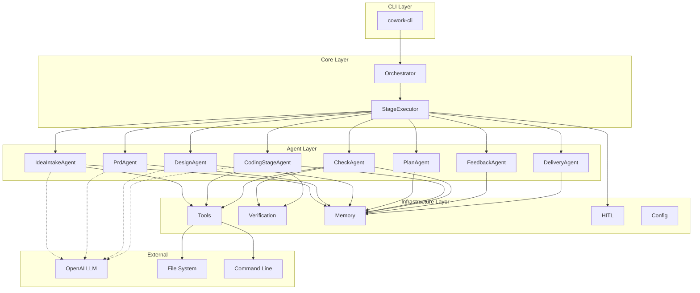
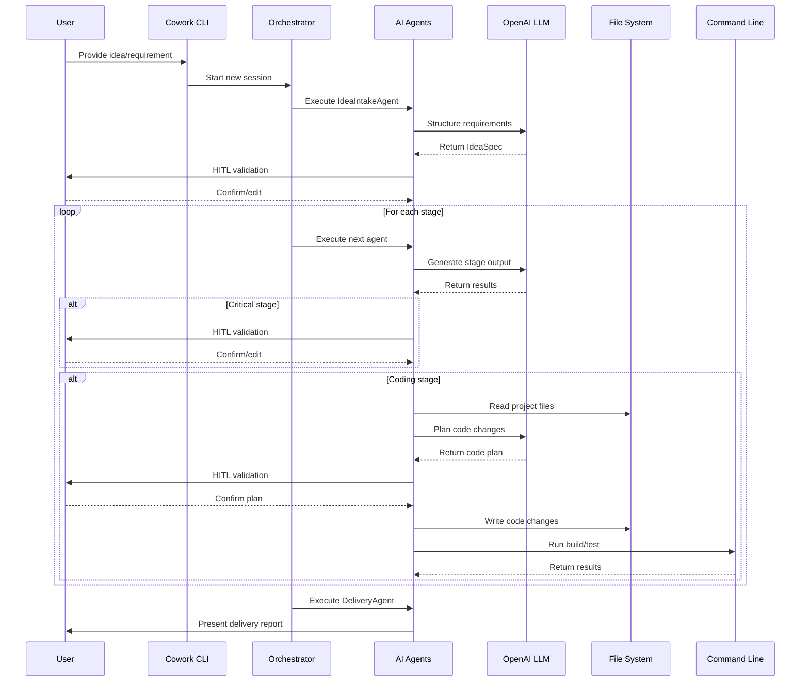
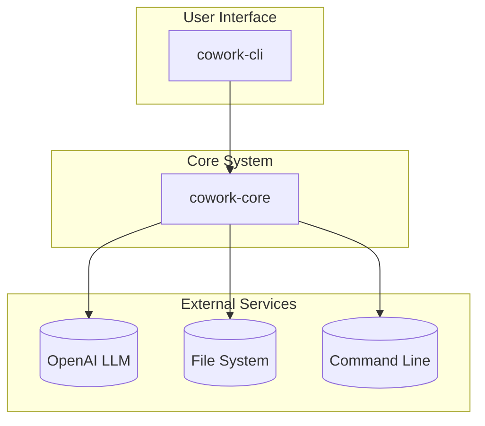

<p align="center">
  
</p>

<h1 align="center">Cowork AI Agent System</h1>

<p align="center">
    <a href="./README.md">English</a>
    |
    <a href="./README_zh.md">中文</a>
</p>

<p align="center">
    <strong>🤖 The AI-native multi-agent framework for automated software development 🤖</strong>
</p>
<p align="center">Built with Rust, Cowork orchestrates intelligent agents to automate the entire software development lifecycle—from requirements to delivery.</p>

<p align="center">
  <a href="https://github.com/sopaco/cowork-rs/tree/main/litho.docs">
  <a href="https://github.com/sopaco/cowork-rs">
  <a href="./LICENSE">
</p>

<hr />

# 👋 What is Cowork AI Agent System?

<strong>Cowork AI Agent System</strong> is a complete, production-ready framework for automating software development through intelligent multi-agent collaboration. It moves beyond simple code generation, providing a comprehensive system that orchestrates specialized AI agents to handle every stage of the software development lifecycle.

Powered by Rust and LLMs, Cowork coordinates 8 specialized agents that work together to transform your ideas into production-ready code. From requirement gathering and PRD generation to technical design, implementation planning, coding, and quality verification—Cowork manages it all with human-in-the-loop validation at critical decision points.

<p align="center">
  <strong>Transform your development workflow with AI agents that think, plan, and collaborate like a real development team.</strong>
</p>

<div style="text-align: center; margin: 30px 0;">
  <table style="width: 100%; border-collapse: collapse; margin: 0 auto;">
    <tr>
      <th style="width: 50%; padding: 15px; background-color: #f8f9fa; border: 1px solid #e9ecef; text-align: center; font-weight: bold; color: #495057;">Traditional Development</th>
      <th style="width: 50%; padding: 15px; background-color: #f8f9fa; border: 1px solid #e9ecef; text-align: center; font-weight: bold; color: #495057;">Development with Cowork</th>
    </tr>
    <tr>
      <td style="padding: 15px; border: 1px solid #e9ecef; vertical-align: top;">
        <p style="font-size: 14px; color: #6c757d; margin-bottom: 10px;"><strong>Manual, Fragmented Process</strong></p>
        <ul style="font-size: 13px; color: #6c757d; line-height: 1.6;">
          <li>Manual requirement gathering and documentation</li>
          <li>Separate tools for design, coding, and testing</li>
          <li>Time-consuming code reviews and iterations</li>
          <li>Siloed knowledge and communication gaps</li>
          <li>Repetitive boilerplate code writing</li>
        </ul>
      </td>
      <td style="padding: 15px; border: 1px solid #e9ecef; vertical-align: top;">
        <p style="font-size: 14px; color: #6c757d; margin-bottom: 10px;"><strong>AI-Powered Collaborative Development</strong></p>
        <ul style="font-size: 13px; color: #6c757d; line-height: 1.6;">
          <li>Automated requirement analysis and PRD generation</li>
          <li>Integrated agents for design, coding, and verification</li>
          <li>Intelligent code planning with incremental updates</li>
          <li>Shared context across all development stages</li>
          <li>Human validation at critical decision points</li>
        </ul>
      </td>
    </tr>
  </table>
</div>

<hr />

# 🏆 Cowork vs. Competitors

Cowork stands out in the AI development tools landscape through its unique multi-agent architecture and comprehensive workflow coverage.

## Core Capabilities Comparison

| Capability | Cowork AI Agent System | GitHub Copilot | Cursor AI | Aider |
|------------|------------------------|----------------|-----------|-------|
| **End-to-End Workflow** | ✅ Complete (Idea→Delivery) | ❌ Code completion only | ❌ Code editing focus | ❌ Code assistance only |
| **Multi-Agent Architecture** | ✅ 8 specialized agents | ❌ Single model | ❌ Single model | ❌ Single model |
| **PRD Generation** | ✅ Automated | ❌ N/A | ❌ N/A | ❌ N/A |
| **Technical Design** | ✅ C4 architecture docs | ❌ N/A | ❌ N/A | ❌ N/A |
| **Implementation Planning** | ✅ Task breakdown & milestones | ❌ N/A | ❌ N/A | ❌ N/A |
| **Incremental Updates** | ✅ Smart delta analysis | ❌ N/A | ❌ Limited | ❌ Limited |
| **Multi-Language Support** | ✅ Rust, Python, JS/TS | ✅ Many languages | ✅ Many languages | ✅ Many languages |
| **Human-in-the-Loop** | ✅ Critical decision points | ❌ N/A | ❌ Limited | ❌ Limited |
| **Automated Verification** | ✅ Build/test integration | ❌ N/A | ❌ N/A | ❌ N/A |
| **Safety Checks** | ✅ Multi-layer security | ❌ N/A | ❌ Basic | ❌ Basic |
| **Artifact Storage** | ✅ Versioned artifacts | ❌ N/A | ❌ N/A | ❌ N/A |
| **Open Source** | ✅ MIT License | ❌ Proprietary | ❌ Proprietary | ✅ MIT License |
| **Self-Hosted** | ✅ Local execution | ❌ Cloud only | ❌ Cloud only | ✅ Local execution |

## Key Differentiators

### 1. Complete Development Lifecycle
Unlike code completion tools that only assist with writing individual lines of code, Cowork manages the entire software development process—from initial idea gathering to final delivery. This comprehensive approach ensures consistency and traceability across all stages.

### 2. Multi-Agent Collaboration
Cowork's 8 specialized agents work together like a real development team:
- <strong>IdeaIntakeAgent</strong>: Structures user requirements
- <strong>PrdAgent</strong>: Generates comprehensive PRDs
- <strong>DesignAgent</strong>: Creates technical architecture (C4 models)
- <strong>PlanAgent</strong>: Breaks down implementation tasks
- <strong>CodingStageAgent</strong>: Plans and executes code changes
- <strong>CheckAgent</strong>: Verifies code quality and runs tests
- <strong>FeedbackAgent</strong>: Analyzes user feedback and determines rework
- <strong>DeliveryAgent</strong>: Generates delivery reports

### 3. Human-in-the-Loop Validation
Critical outputs require human confirmation before proceeding, ensuring:
- Accurate requirement capture
- Sound technical decisions
- Feasible implementation plans
- Safe code changes

This balance of automation and human control sets Cowork apart from fully autonomous tools.

### 4. Incremental Code Updates
When requirements or designs change, Cowork intelligently identifies affected files and updates only what's necessary—preserving your customizations and avoiding full regeneration.

### 5. Built-in Safety
Multi-layer security checks prevent:
- Dangerous command execution (rm -rf, sudo, etc.)
- Unauthorized file system access
- Malicious code injection
- Resource exhaustion

❤️ Like <strong>Cowork</strong>? Star it 🌟 or [Sponsor Me](https://github.com/sponsors/sopaco)! ❤️

# 🌠 Features & Capabilities

- <strong>8-Stage Development Workflow:</strong> Comprehensive workflow covering Idea Intake → PRD Generation → Technical Design → Implementation Plan → Coding → Checking → Feedback → Delivery.
- <strong>Specialized AI Agents:</strong> Each stage handled by a dedicated agent with domain-specific expertise and tools.
- <strong>Intelligent Code Planning:</strong> Analyzes project structure, dependencies, and generates precise code change plans.
- <strong>Incremental Code Updates:</strong> Smart delta analysis updates only affected files, preserving existing modifications.
- <strong>Automated Quality Verification:</strong> Multi-language build/test integration with comprehensive error analysis and reporting.
- <strong>Human-in-the-Loop Validation:</strong> Critical outputs (PRD, design, plans) require human confirmation before proceeding.
- <strong>Artifact-Based Storage:</strong> Versioned storage of all stage outputs with JSON and Markdown formats.
- <strong>Todo List Management:</strong> Automatic task tracking with status inference and progress reporting.
- <strong>Multi-Language Project Support:</strong> Automatic detection and handling of Rust, Python, JavaScript/TypeScript projects.
- <strong>Security & Safety:</strong> Command validation, path access control, and watchdog monitoring for safe execution.

# 🏗️ Architecture

Cowork is built with a modular, domain-driven architecture:



## Key Components

### Orchestrator
The central coordinator that manages session lifecycle, stage dependencies, and workflow execution.

### StageExecutor
Provides a unified execution framework for all agents with consistent error handling and state management.

### AI Agents
Eight specialized agents, each responsible for a specific stage of the development lifecycle.

### Tools Module
Safe file operations and command execution with security checks and resource limits.

### Verification Module
Project type detection, code validation, and comprehensive error analysis.

### HITL Controller
Manages human-in-the-loop interactions, including content review and editing.

### Artifact Store
Versioned storage of all stage outputs in JSON and Markdown formats.

# 🧠 How It Works

Cowork uses a sophisticated multi-stage workflow orchestrated by the `Orchestrator`:



# 🖥 Getting Started

### Prerequisites
- [**Rust**](https://www.rust-lang.org) (version 1.70 or later)
- [**OpenAI API Key**](https://platform.openai.com/) for LLM access
- Git and language-specific build tools (cargo, npm, pip, etc.)

### Installation

Build from source:

```sh
# Clone the repository
git clone https://github.com/sopaco/cowork-rs.git
cd cowork-rs

# Build the project
cargo build --release

# The CLI binary will be available at:
# target/release/cowork
```

### Configuration

Cowork uses a `config.toml` file for configuration. Create one in your project directory or use `--config` to specify a path:

```toml
# -----------------------------------------------------------------------------
# OpenAI LLM Configuration
# -----------------------------------------------------------------------------
[llm]
api_base_url = "https://api.openai.com/v1"
api_key = "sk-your-openai-api-key"
model = "gpt-4o"
temperature = 0.7
max_tokens = 8192

# -----------------------------------------------------------------------------
# Workspace Configuration
# -----------------------------------------------------------------------------
[workspace]
project_root = "."  # Root directory of your project
artifacts_dir = ".cowork/artifacts"  # Where to store generated artifacts

# -----------------------------------------------------------------------------
# HITL (Human-in-the-Loop) Configuration
# -----------------------------------------------------------------------------
[hitl]
enabled = true
editor_command = "code"  # External editor to use for validation

# -----------------------------------------------------------------------------
# Safety Configuration
# -----------------------------------------------------------------------------
[safety]
block_dangerous_commands = true
allowed_build_tools = ["cargo", "npm", "pip", "make", "mvn", "gradle"]

# -----------------------------------------------------------------------------
# Logging Configuration
# -----------------------------------------------------------------------------
[logging]
level = "info"
file = ".cowork/logs/cowork.log"
```

# 🚀 Usage

### Starting a New Development Session

```sh
# Start a new session with an idea
cowork start "Build a REST API for a task management application"

# Start with a configuration file
cowork start "Create a web dashboard" --config ./config.toml

# Resume an existing session
cowork resume <session-id>
```

### Session Workflow

When you start a session, Cowork will guide you through the 8-stage workflow:

1. **Idea Intake**: Your idea is structured into a formal specification
2. **PRD Generation**: A comprehensive Product Requirements Document is created
3. **Technical Design**: C4 architecture diagrams and technical specifications
4. **Implementation Plan**: Task breakdown with milestones and dependencies
5. **Coding**: Code is planned and executed with incremental updates
6. **Checking**: Build, test, and quality verification
7. **Feedback**: Review results and request changes if needed
8. **Delivery**: Final delivery report with implementation summary

At each critical stage, you'll be prompted to review and confirm the output before proceeding.

### Example Session Flow

```sh
$ cowork start "Build a CLI tool for file conversion"

[Stage 1/8] Idea Intake Agent
Analyzing your requirement...
Generated IdeaSpec: "A command-line tool for converting files between formats"

Do you want to:
  [1] Accept and continue
  [2] Edit the specification
  [3] Regenerate
> 1

[Stage 2/8] PRD Generation Agent
Generating Product Requirements Document...
Created PRD with 12 requirements and 5 user stories

Review the PRD at: .cowork/artifacts/session-001/prd.md
Do you want to:
  [1] Accept and continue
  [2] Edit the PRD
  [3] Regenerate
> 1

[Stage 3/8] Design Agent
Creating technical architecture...
Generated C4 system context and container diagrams

Review the design at: .cowork/artifacts/session-001/design.md
Do you want to:
  [1] Accept and continue
  [2] Edit the design
  [3] Regenerate
> 1

... (continues through all 8 stages)

[Delivery] Session Complete!
Delivery report: .cowork/artifacts/session-001/delivery.md

Summary:
- 12 requirements implemented
- 4 modules created
- 15 test cases added
- Build: PASSED
- Tests: 15/15 PASSED
```

### Managing Sessions

```sh
# List all sessions
cowork list

# View session status
cowork status <session-id>

# View artifacts from a session
cowork artifacts <session-id>

# Delete a session
cowork delete <session-id>
```

### Configuration Management

```sh
# Show current configuration
cowork config show

# Update configuration
cowork config set llm.model gpt-4-turbo
cowork config set hitl.enabled false
```

# 🌐 The Cowork Ecosystem

Cowork is organized as a modular Rust workspace with clear separation of concerns:



- <strong>`cowork-core`</strong>: The heart of the system containing all business logic, agents, orchestrator, and supporting modules.
- <strong>`cowork-cli`</strong>: Command-line interface for interacting with the Cowork system.

### Core Modules

<strong>cowork-core</strong> is organized into the following domain modules:

- <strong>`orchestrator`</strong>: Central workflow coordinator managing session lifecycle and stage execution.
- <strong>`agents`</strong>: 8 specialized AI agents (IdeaIntake, PRD, Design, Plan, Coding, Check, Feedback, Delivery).
- <strong>`tools`</strong>: File operations and command execution with safety checks.
- <strong>`verification`</strong>: Project detection, code validation, and security checking.
- <strong>`hitl`</strong>: Human-in-the-loop interaction controller.
- <strong>`artifacts`</strong>: Artifact storage and management system.
- <strong>`memory`</strong>: Data persistence and retrieval.
- <strong>`config`</strong>: Configuration management.


# 🔒 Security

Cowork implements multiple layers of security:

1. **Command Validation**: Dangerous commands are blocked before execution
2. **Path Access Control**: Restricted access to sensitive system directories
3. **Build Tool Whitelist**: Only authorized development tools can be executed
4. **Timeout Controls**: Prevents resource exhaustion from long-running commands
5. **Watchdog Monitoring**: Detects and prevents agent deviation from objectives

# 🤝 Contributing

We welcome all forms of contributions! Report bugs or submit feature requests through [GitHub Issues](https://github.com/sopaco/cowork-rs/issues).

### Development Process
1. Fork this project
2. Create a feature branch (`git checkout -b feature/amazing-feature`)
3. Commit your changes (`git commit -m 'Add some amazing feature'`)
4. Push to the branch (`git push origin feature/amazing-feature`)
5. Create a Pull Request

### Running Tests

```sh
# Run all tests
cargo test

# Run tests with coverage
cargo test --all-features

# Run specific module tests
cargo test -p cowork-core
```

# 📚 Documentation

Comprehensive documentation is available in the [litho.docs](./litho.docs/) directory:

- [Project Overview](./litho.docs/1、项目概述.md) - System context and architecture
- [Architecture Overview](./litho.docs/2、架构概览.md) - Detailed architecture documentation
- [Core Workflows](./litho.docs/3、工作流程.md) - Workflow and process documentation
- [Domain Modules](./litho.docs/4、深入探索/) - In-depth domain analysis

# 🪪 License

This project is licensed under the **MIT License**. See the [LICENSE](LICENSE) file for details.

# 🙏 Acknowledgments

- Built with [Rust](https://www.rust-lang.org/)
- Powered by [OpenAI](https://openai.com/) GPT models
- Inspired by modern software development practices and AI agent research

# 📬 Contact

- **GitHub**: [sopaco/cowork-rs](https://github.com/sopaco/cowork-rs)
- **Issues**: [GitHub Issues](https://github.com/sopaco/cowork-rs/issues)

---

**Transform your development workflow with Cowork AI Agent System—the future of collaborative software development.** 🚀
