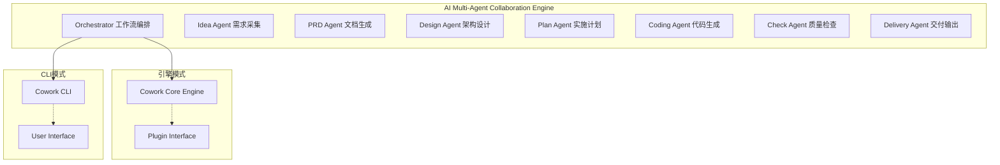

# Cowork RS - AI Multi-Agent Collaboration Engine

[](https://opensource.org/licenses/MIT)
[](https://www.rust-lang.org/)

**Cowork RS** 是一个基于AI的多角色协作智能交付引擎，为AI编码工具和平台提供底层协作能力，同时也可作为独立的CLI工具使用。

## 🚀 核心定位

Cowork RS 是一个通用的AI多角色协作引擎，专注于：

- **底层协作引擎**：为各类AI Coding工具与平台提供智能体协作能力
- **独立CLI工具**：可直接使用的命令行智能开发助手
- **多角色智能交付**：通过专业化AI角色协作，实现端到端的智能交付

## ✨ 主要特性

- **引擎化设计**：模块化架构，易于集成到其他AI工具
- **多角色协作**：多个专业化AI角色分工协作，提升交付质量
- **智能交付**：从需求到交付的全流程自动化管理
- **灵活部署**：支持库引用和独立CLI工具两种使用方式
- **质量保证**：集成代码检查和验证机制，确保输出质量

## 🏗️ 系统架构

Cowork RS 采用多角色智能体架构，通过专业化分工提升协作效率：



### 角色职责

1. **Idea Agent**: 需求理解与结构化
2. **PRD Agent**: 产品需求文档生成
3. **Design Agent**: 技术架构设计
4. **Plan Agent**: 任务分解与规划
5. **Coding Agent**: 代码生成与实现
6. **Check Agent**: 质量验证与检查
7. **Delivery Agent**: 成果交付与报告

## 🚀 快速开始

### 安装

1. **克隆项目**
```bash
git clone https://github.com/sopaco/cowork-rs.git
cd cowork-rs
```

2. **构建项目**
```bash
cargo build --release
```

### 使用方式

#### 1. 作为独立CLI工具

```bash
# 启动新的协作会话
cargo run --release

# 或全局安装后使用
cargo install --path crates/cowork-cli
cowork
```

#### 2. 作为引擎集成

```rust
use cowork_core::engine::WorkflowEngine;

let engine = WorkflowEngine::new(config);
let result = engine.execute_workflow(user_requirements).await?;
```

## 🛠️ 技术栈

- **编程语言**: Rust 2024
- **核心引擎**: Cowork Core (cowork-core crate)
- **AI服务**: OpenAI LLM API 或其他兼容API
- **存储**: 基于文件的工件存储
- **序列化**: JSON + Markdown
- **工具接口**: 可扩展的工具执行器

## 📦 模块架构

### crates/cowork-core
- 核心协作引擎
- 多角色AI执行框架
- 工具支持与安全检查
- 工件管理器

### crates/cowork-cli
- 命令行接口
- 用户交互控制
- 会话管理
- 输出格式化

## 🔌 集成与扩展

### 引擎接口

```rust
use cowork_core::engine::EngineInterface;

// 自定义引擎配置
let config = EngineConfig::default()
    .with_model("gpt-4-turbo")
    .with_security_level(SecurityLevel::Strict);

// 执行协作流程
let output = engine.process_project(requirements, config).await?;
```

### 工具扩展

```rust
use cowork_core::tool::ToolInterface;

pub struct CustomToolProvider;

impl ToolInterface for CustomToolProvider {
    fn register_tools(&self) -> Vec<Box<dyn Tool>> {
        // 注册自定义工具
        vec![]
    }
}
```

## 📚 使用场景

### 1. AI平台底层引擎
- 为其他AI编码工具提供多智能体协作能力
- 提供标准化的API接口
- 支持多种语言和框架

### 2. 独立CLI工具
- 开发者直接使用进行项目生成
- 快速原型开发
- 小型项目的端到端交付

### 3. 企业集成
- 企业级开发流程自动化
- 代码质量和一致性控制
- 与现有DevOps工具链集成

## 🔧 配置

### 基础配置

`config.toml` 包含以下配置项：

```toml
[llm]
api_base_url = "https://api.openai.com/v1"
api_key = "your-api-key"
model_name = "gpt-4-turbo"

[security]
level = "strict"  # "strict", "balanced", "permissive"
```

## 📊 核心价值

- **效率提升**：AI协作提升开发效率50%+
- **质量保障**：多层验证确保输出质量
- **标准化**：统一的项目生成和管理流程
- **灵活性**：同时支持引擎集成和独立使用
- **可扩展**：模块化架构支持功能扩展

## 🤝 贡献

我们欢迎社区贡献！欢迎提交issue和pull requests。

## 📄 许可证

本项目采用 MIT 许可证 - 查看 [LICENSE](LICENSE) 文件了解详情

---

<div align="center">

Made with ❤️ for the AI/Software engineering community  
A flexible collaboration engine for intelligent software delivery.
</div>
