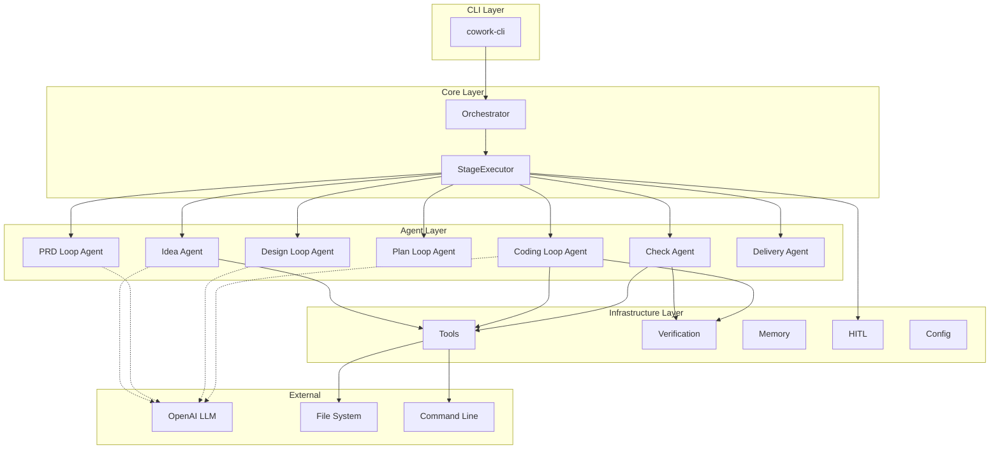
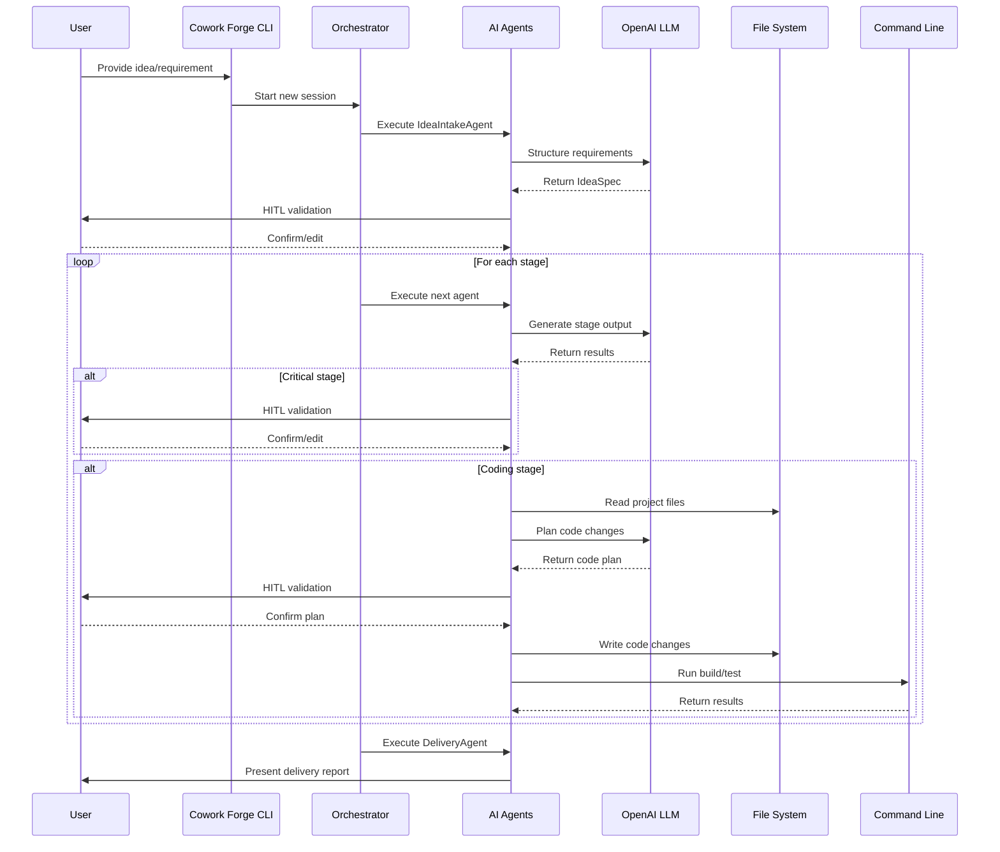
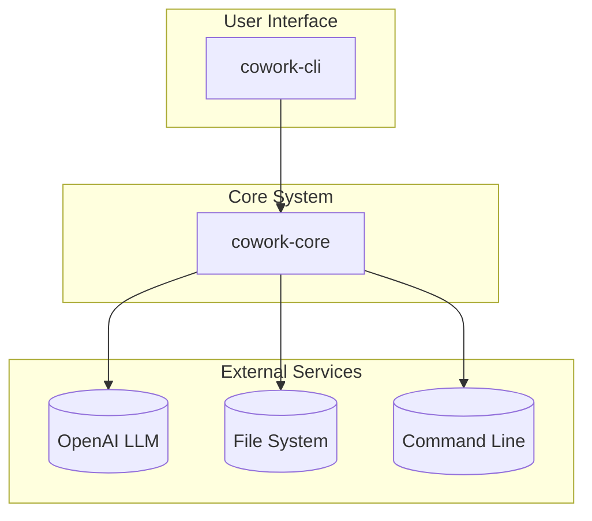

<p align="center">
  
</p>

<h1 align="center">Cowork Forge</h1>

<p align="center">
    <a href="./README.md">English</a>
    |
    <a href="./README_zh.md">中文</a>
</p>

<p align="center">
    <strong>🤖 Full-Stack AI Development Team - Complete Collaboration from Idea to Delivery 🤖</strong>
</p>
<p align="center">Cowork Forge is not just a code generator, but a complete virtual development team. It includes professional roles like Product Manager, Architect, Project Manager, and Engineer, working together through AI agent collaboration to transform your ideas into production-ready software systems.</p>

<p align="center">
  <a href="https://github.com/sopaco/cowork-forge/tree/main/litho.docs/en"></a>
  <a href="https://github.com/sopaco/cowork-forge/tree/main/litho.docs/zh"></a>
  <a href="https://github.com/sopaco/cowork-forge"></a>
  <a href="./LICENSE"></a>
</p>

<hr />

# 👋 What is Cowork Forge?

<strong>Cowork Forge</strong> is a complete AI-powered development team system that simulates how real software teams collaborate. AI agents take on roles as Product Manager, Architect, Project Manager, and Engineer, working together to complete everything from ideation to delivery.

Unlike AI coding assistants that only generate code snippets, Cowork Forge provides end-to-end development lifecycle management:
- **Product Manager AI**: Transforms your ideas into detailed Product Requirements Documents (PRD)
- **Architect AI**: Designs complete technical architecture and system components
- **Project Manager AI**: Breaks down tasks, plans dependencies, and defines implementation paths
- **Engineer AI**: Implements code, ensures quality, and generates delivery reports

Each role uses Actor-Critic patterns for self-review and optimization, with human validation at critical decision points to ensure output quality and direction.

<p align="center">
  <strong>One person can have a complete development team - Cowork Forge makes AI agents work for you like a real team.</strong>
</p>

<div style="text-align: center; margin: 30px 0;">
  <table style="width: 100%; border-collapse: collapse; margin: 0 auto;">
    <tr>
      <th style="width: 50%; padding: 15px; background-color: #f8f9fa; border: 1px solid #e9ecef; text-align: center; font-weight: bold; color: #495057;">Traditional Development</th>
      <th style="width: 50%; padding: 15px; background-color: #f8f9fa; border: 1px solid #e9ecef; text-align: center; font-weight: bold; color: #495057;">Development with Cowork Forge</th>
    </tr>
    <tr>
      <td style="padding: 15px; border: 1px solid #e9ecef; vertical-align: top;">
        <p style="font-size: 14px; color: #6c757d; margin-bottom: 10px;"><strong>Requires Multiple Roles and Tools</strong></p>
        <ul style="font-size: 13px; color: #6c757d; line-height: 1.6;">
          <li>Need Product Manager to write PRD</li>
          <li>Need Architect to design technical solution</li>
          <li>Need Project Manager to break down tasks</li>
          <li>Need Engineer to write code</li>
          <li>High cost and long cycle for multi-role collaboration</li>
        </ul>
      </td>
      <td style="padding: 15px; border: 1px solid #e9ecef; vertical-align: top;">
        <p style="font-size: 14px; color: #6c757d; margin-bottom: 10px;"><strong>One System Covers All Roles</strong></p>
        <ul style="font-size: 13px; color: #6c757d; line-height: 1.6;">
          <li>AI Product Manager auto-generates professional PRD</li>
          <li>AI Architect designs complete technical solution</li>
          <li>AI Project Manager intelligently breaks down tasks</li>
          <li>AI Engineer implements high-quality code</li>
          <li>Full-process collaboration, human only validates key decisions</li>
        </ul>
      </td>
    </tr>
  </table>
</div>

<hr />

# 🏆 Cowork Forge vs. Competitors

Cowork Forge stands out in the AI development tools landscape through its unique multi-agent architecture and comprehensive workflow coverage.

## Core Capabilities Comparison

| Capability | Cowork Forge | GitHub Copilot | Cursor AI | Aider |
|------------|------------------------|----------------|-----------|-------|
| **End-to-End Workflow** | ✅ Complete (Idea→Delivery) | ❌ Code completion only | ❌ Code editing focus | ❌ Code assistance only |
| **Multi-Agent Architecture** | ✅ 8 specialized agents | ❌ Single model | ❌ Single model | ❌ Single model |
| **PRD Generation** | ✅ Automated | ❌ N/A | ❌ N/A | ❌ N/A |
| **Technical Design** | ✅ C4 architecture docs | ❌ N/A | ❌ N/A | ❌ N/A |
| **Implementation Planning** | ✅ Task breakdown & milestones | ❌ N/A | ❌ N/A | ❌ N/A |
| **Incremental Updates** | ✅ Smart delta analysis | ❌ N/A | ❌ Limited | ❌ Limited |
| **Multi-Language Support** | ✅ Rust, Python, JS/TS | ✅ Many languages | ✅ Many languages | ✅ Many languages |
| **Human-in-the-Loop** | ✅ Critical decision points | ❌ N/A | ❌ Limited | ❌ Limited |
| **Automated Verification** | ✅ Build/test integration | ❌ N/A | ❌ N/A | ❌ N/A |
| **Safety Checks** | ✅ Multi-layer security | ❌ N/A | ❌ Basic | ❌ Basic |
| **Artifact Storage** | ✅ Versioned artifacts | ❌ N/A | ❌ N/A | ❌ N/A |
| **Open Source** | ✅ MIT License | ❌ Proprietary | ❌ Proprietary | ✅ MIT License |
| **Self-Hosted** | ✅ Local execution | ❌ Cloud only | ❌ Cloud only | ✅ Local execution |

## Key Differentiators

### 1. Complete Virtual Development Team

Unlike tools that only assist with writing code, Cowork Forge provides complete development team role coverage:
- **Product Manager Role**: Transforms vague ideas into structured Product Requirements Documents
- **Architect Role**: Designs complete technical architecture and system components
- **Project Manager Role**: Breaks down tasks, plans dependencies, and implementation paths
- **Engineer Role**: Implements code and performs quality verification

This full-role coverage ensures end-to-end continuity and professionalism from requirements analysis to code implementation.

### 2. Multi-Agent Collaboration
Cowork Forge's specialized agents work together like a real development team:
- <strong>Idea Agent</strong>: Captures and structures user requirements
- <strong>PRD Loop Agent</strong>: Generates comprehensive PRDs with actor-critic refinement
- <strong>Design Loop Agent</strong>: Creates technical architecture with actor-critic refinement
- <strong>Plan Loop Agent</strong>: Breaks down implementation tasks with actor-critic refinement
- <strong>Coding Loop Agent</strong>: Plans and executes code changes with actor-critic refinement
- <strong>Check Agent</strong>: Verifies code quality and completeness
- <strong>Delivery Agent</strong>: Generates comprehensive delivery reports
- <strong>Modify Agent</strong>: Analyzes and handles incremental change requests
- <strong>Code Patch Agent</strong>: Implements precise code patches
- <strong>Modify Delivery Agent</strong>: Generates modification delivery reports

### 3. Human-in-the-Loop Validation
Critical outputs require human confirmation before proceeding, ensuring:
- Accurate requirement capture
- Sound technical decisions
- Feasible implementation plans
- Safe code changes

This balance of automation and human control sets Cowork Forge apart from fully autonomous tools.

### 4. Incremental Code Updates
When requirements or designs change, Cowork Forge intelligently identifies affected files and updates only what's necessary—preserving your customizations and avoiding full regeneration.

### 5. Built-in Safety
Multi-layer security checks prevent:
- Dangerous command execution (rm -rf, sudo, etc.)
- Unauthorized file system access
- Malicious code injection
- Resource exhaustion

❤️ Like <strong>Cowork Forge</strong>? Star it 🌟 or [Sponsor Me](https://github.com/sponsors/sopaco)! ❤️

# 🌠 Features & Capabilities

- <strong>7-Stage Development Workflow:</strong> Comprehensive workflow covering Idea Intake → PRD Generation → Technical Design → Implementation Plan → Coding → Quality Check → Delivery, corresponding to the complete process of a real development team.
- <strong>Specialized AI Agents:</strong> Each stage handled by a dedicated agent with domain expertise. Four critical stages (PRD, Design, Plan, Coding) use actor-critic loops for iterative refinement, ensuring output quality meets professional standards.
- <strong>Intelligent Code Planning:</strong> Analyzes project structure, dependencies, and generates precise code change plans.
- <strong>Incremental Code Updates:</strong> Smart delta analysis updates only affected files, preserving existing modifications.
- <strong>Automated Quality Verification:</strong> Multi-language build/test integration with comprehensive error analysis and reporting.
- <strong>Human-in-the-Loop Validation:</strong> Critical outputs (PRD, design, plans) require human confirmation before proceeding.
- <strong>Artifact-Based Storage:</strong> Versioned storage of all stage outputs with JSON and Markdown formats.
- <strong>Todo List Management:</strong> Automatic task tracking with status inference and progress reporting.
- <strong>Multi-Language Project Support:</strong> Automatic detection and handling of Rust, Python, JavaScript/TypeScript projects.
- <strong>Security & Safety:</strong> Command validation, path access control, and watchdog monitoring for safe execution.

# 🏗️ Architecture

Cowork Forge is built with a modular, domain-driven architecture:



## Key Components

### Pipeline Orchestrator
Manages session lifecycle, stage dependencies, and workflow execution with support for full and partial pipeline assembly.

### AI Agents
Specialized agents work collaboratively, each responsible for a specific stage of the development lifecycle. Four agents (PRD, Design, Plan, Coding) use actor-critic loop patterns for iterative refinement with human feedback. Includes: Idea, PRD, Design, Plan, Coding, Check, Delivery, Modify, CodePatch, ModifyDelivery.

### Instruction Templates
Provides specialized prompt templates for each agent, defining their behavior and output format.

### Tools Module
Safe file operations and command execution with security checks and resource limits.

### LLM Integration Layer
Manages interactions with large language models, including rate limiting, API clients, and request optimization.

### Data Module
Defines system data models and session management mechanisms.

### Storage Module
Provides persistent data management and retrieval capabilities.

# 🧠 How It Works

Cowork Forge uses a sophisticated multi-stage workflow orchestrated by the `Orchestrator`:



# 🖥 Getting Started

### Prerequisites
- [**Rust**](https://www.rust-lang.org) (version 1.70 or later)
- [**OpenAI API Key**](https://platform.openai.com/) for LLM access
- Git and language-specific build tools (cargo, npm, pip, etc.)

### Installation

Build from source:

```sh
# Clone the repository
git clone https://github.com/sopaco/cowork-forge.git
cd cowork-forge

# Build the project
cargo build --release

# The CLI binary will be available at:
# target/release/cowork
```

### Configuration

Cowork Forge uses a `config.toml` file for configuration. Create one in your project directory or use `--config` to specify a path:

```toml
# LLM Configuration
[llm]
api_base_url = "https://api.openai.com/v1"
api_key = "sk-your-openai-api-key"
model_name = "gpt-5-codex"
```

# 🚀 Usage

### Starting a New Development Session

```sh
# Start a new project with an idea
cowork new "Build a REST API for a task management application"

# Start with a configuration file
cowork new "Create a web dashboard" --config ./config.toml

# Resume an existing project
cowork resume
```

### Session Workflow

When you start a session, Cowork Forge will guide you through the 7-stage workflow:

1. **Idea Intake**: Your idea is structured into a formal specification (idea.md)
2. **PRD Generation**: A comprehensive Product Requirements Document with actor-critic refinement
3. **Technical Design**: Architecture design with component specifications and actor-critic refinement
4. **Implementation Plan**: Task breakdown with dependencies and actor-critic refinement
5. **Coding**: Code implementation with actor-critic refinement and human validation
6. **Quality Check**: Verification of feature coverage and code completeness
7. **Delivery**: Final delivery report with implementation summary

At each critical stage, you'll be prompted to review and confirm the output before proceeding.

### Example Session Flow

```sh
$ cowork new "Build a CLI tool for file conversion"

[Stage 1/7] Idea Agent
Analyzing your requirement...
Generated IdeaSpec: "A command-line tool for converting files between formats"

Do you want to:
  [1] Accept and continue
  [2] Edit the specification
  [3] Regenerate
> 1

[Stage 2/7] PRD Generation Agent
Generating Product Requirements Document...
Created PRD with 12 requirements and 5 user stories

Review the PRD at: .cowork/artifacts/session-001/prd.md
Do you want to:
  [1] Accept and continue
  [2] Edit the PRD
  [3] Regenerate
> 1

[Stage 3/7] Design Agent
Creating technical architecture...
Generated C4 system context and container diagrams

Review the design at: .cowork/artifacts/session-001/design.md
Do you want to:
  [1] Accept and continue
  [2] Edit the design
  [3] Regenerate
> 1

... (continues through all 7 stages)

[Delivery] Project Complete!
Delivery report: .cowork/artifacts/session-001/delivery.md

Summary:
- 12 requirements implemented
- 4 modules created
- 15 test cases added
- Build: PASSED
- Tests: 15/15 PASSED
```

### Managing Projects

```sh
# View project status
cowork status

# Modify from a specific stage
cowork modify --from prd
cowork modify --from design
cowork modify --from plan
cowork modify --from coding
```

### Configuration Management

```sh
# Initialize configuration file
cowork init

# Use verbose logging
cowork new "your idea" --verbose

# Enable LLM streaming output
cowork new "your idea" --stream
```

# 🌐 The Cowork Forge Ecosystem

Cowork Forge is organized as a modular Rust workspace with clear separation of concerns:



- <strong>`cowork-core`</strong>: The heart of the system containing all business logic, agents, orchestrator, and supporting modules.
- <strong>`cowork-cli`</strong>: Command-line interface for interacting with the Cowork system.

### Core Modules

<strong>cowork-core</strong> is organized into the following domain modules:

- <strong>`pipeline`</strong>: Workflow pipeline orchestration managing session lifecycle and stage execution.
- <strong>`agents`</strong>: Specialized AI agents (Idea, PRD, Design, Plan, Coding, Check, Delivery, Modify, CodePatch, ModifyDelivery).
- <strong>`instructions`</strong>: Prompt templates for each agent.
- <strong>`tools`</strong>: File operations and command execution with safety checks.
- <strong>`llm`</strong>: LLM integration layer including rate limiting and API clients.
- <strong>`data`</strong>: Data models and session management.
- <strong>`storage`</strong>: Data persistence and retrieval.


# 🔒 Security

Cowork Forge implements multiple layers of security:

1. **Command Validation**: Dangerous commands are blocked before execution
2. **Path Access Control**: Restricted access to sensitive system directories
3. **Build Tool Whitelist**: Only authorized development tools can be executed
4. **Timeout Controls**: Prevents resource exhaustion from long-running commands
5. **Watchdog Monitoring**: Detects and prevents agent deviation from objectives

# 🤝 Contributing

We welcome all forms of contributions! Report bugs or submit feature requests through [GitHub Issues](https://github.com/sopaco/cowork-forge/issues).

### Development Process
1. Fork this project
2. Create a feature branch (`git checkout -b feature/amazing-feature`)
3. Commit your changes (`git commit -m 'Add some amazing feature'`)
4. Push to the branch (`git push origin feature/amazing-feature`)
5. Create a Pull Request

### Running Tests

```sh
# Run all tests
cargo test

# Run tests with coverage
cargo test --all-features

# Run specific module tests
cargo test -p cowork-core
```

# 📚 Documentation

Comprehensive documentation is available in the [litho.docs](./litho.docs/) directory:

- [Project Overview](./litho.docs/1、项目概述.md) - System context and architecture
- [Architecture Overview](./litho.docs/2、架构概览.md) - Detailed architecture documentation
- [Core Workflows](./litho.docs/3、工作流程.md) - Workflow and process documentation
- [Domain Modules](./litho.docs/4、深入探索/) - In-depth domain analysis

# 🪪 License

This project is licensed under the **MIT License**. See the [LICENSE](LICENSE) file for details.

# 🙏 Acknowledgments

- Built with [Rust](https://www.rust-lang.org/)
- Powered by [OpenAI](https://openai.com/) GPT models
- Inspired by modern software development practices and AI agent research

# 📬 Contact

- **GitHub**: [sopaco/cowork-forge](https://github.com/sopaco/cowork-forge)
- **Issues**: [GitHub Issues](https://github.com/sopaco/cowork-forge/issues)

---

**Transform your development workflow with Cowork Forge—the future of collaborative software development.** 🚀
