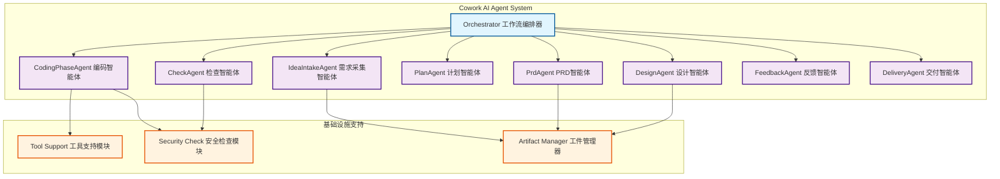
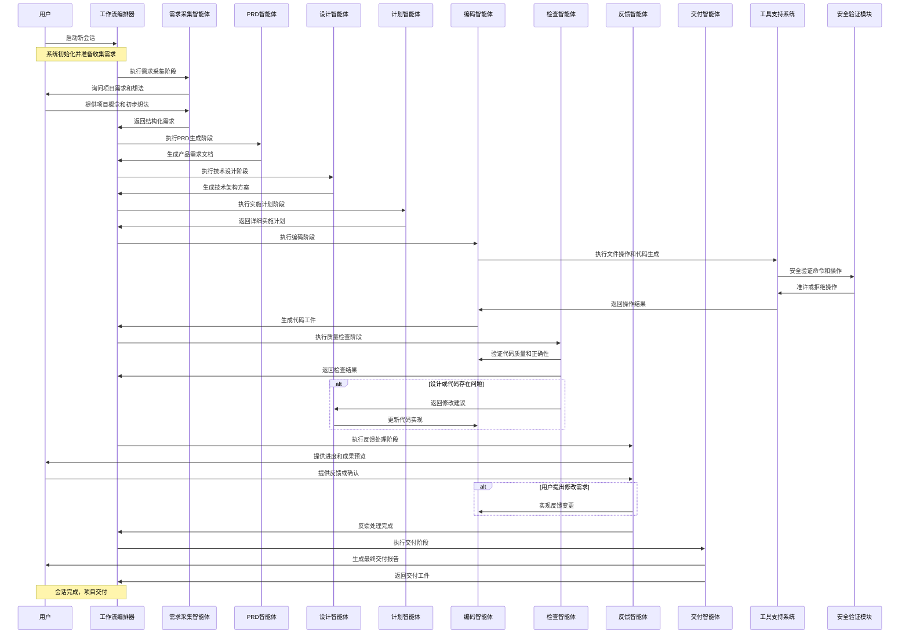

# Cowork AI Agent System

[](https://opensource.org/licenses/MIT)
[](https://www.rust-lang.org/)

**Cowork AI Agent System** 是一款基于多智能体架构的AI驱动软件开发自动化平台，专注于智能化的软件开发全生命周期管理。该平台通过专业化智能体协作，实现了从需求收集到代码交付的完整自动化流程。

Cowork AI Agent System 是下一代AI辅助开发工具，通过高度结构化的流程和多智能体协作，帮助开发者和项目团队自动完成从需求分析到代码实现的整个开发周期，显著提升开发效率和产品质量。系统内置人机交互验证机制(HITL)，确保生成内容的准确性和合理性。

## 🚀 功能特性

- **多智能体协作**：8个专业化智能体分工协作，覆盖软件开发全生命周期
- **智能需求管理**：自动化需求采集、PRD生成与技术架构设计
- **编码自动化**：智能化代码生成与执行协调
- **质量保证**：集成自动化检查和验证机制，确保代码质量
- **安全验证**：多层次安全检查，防范风险
- **人机交互**：在关键决策点引入人工验证（HITL），平衡自动化与可控性
- **模块化设计**：基于领域驱动的模块划分，便于维护和扩展
- **工具链集成**：完整文件操作、命令执行等开发工具集

## 🏗️ 系统架构

系统采用多智能体架构设计，8个专业化智能体协同工作：



### 核心智能体

1. **IdeaIntakeAgent**：需求想法收集和结构化
2. **PrdAgent**：产品需求文档生成和分析
3. **DesignAgent**：技术架构和设计文档生成
4. **PlanAgent**：实施计划和任务分解
5. **CodingPhaseAgent**：代码生成和执行协调
6. **CheckAgent**：代码质量检查和验证
7. **FeedbackAgent**：用户反馈收集和处理
8. **DeliveryAgent**：最终交付报告生成

## 📋 核心流程

系统工作流程包含以下8个阶段：



1. **需求采集阶段**：收集用户需求和想法，生成结构化需求文档
2. **PRD生成阶段**：基于需求生成产品需求文档
3. **技术设计阶段**：生成技术架构和详细设计文档
4. **计划制定阶段**：制定实施计划和任务分解
5. **编码执行阶段**：执行代码生成和文件操作
6. **质量检查阶段**：对生成的代码进行质量检查
7. **反馈处理阶段**：收集用户反馈并进行迭代优化
8. **交付完成阶段**：生成最终交付报告

## 🛠️ 技术栈

- **编程语言**: Rust 2024
- **核心框架**: 自定义多智能体框架
- **AI服务**: OpenAI LLM API 或其他兼容API
- **存储**: 基于文件的工件存储
- **序列化**: JSON + Markdown
- **工具支持**: 文件操作、命令执行、安全检查

## 📦 组件架构

### crates/cowork-core
- 核心工作流引擎
- 智能体执行框架
- 工具支持系统
- 工件管理器
- 验证安全模块

### crates/cowork-cli
- 命令行接口
- 会话管理
- 用户交互控制
- 输出格式化

## 🚀 快速开始

### 环境要求
- **CPU**: 4核心或以上
**内存**: 8GB或以上（推荐16GB+）
**存储**: 10GB可用空间（推荐SSD，50GB+）
**Rust**: 1.80+（支持Edition 2024）
**操作系统**: Windows, macOS, or Linux
**网络环境**: 访问LLM服务API（支持私有化部署）

### 安装

1. **克隆项目**
```bash
git clone https://github.com/jiangmeng03/cowork-rs.git
cd cowork-rs
```

2. **配置LLM API**
```bash
# 修改配置文件 config.toml
[llm]
api_base_url = "https://api.openai.com/v1"  # 或其他兼容API
api_key = "your-api-key"
model_name = "gpt-4-turbo"  # 或其他支持的模型
```
 
3. **可选配置（推荐）**
```bash
# 设置环境变量（替代配置文件方式）
export LLM_API_KEY="your-actual-api-key"
export LLM_MODEL="gpt-4-turbo"
```
 
3. **构建项目**
```bash
cargo build --release
```

4. **可选：全局安装**
```bash
cargo install --path crates/cowork-cli
```

### 使用方法

1. **运行系统**
```bash
# 方式一：直接运行
cargo run --release

# 方式二：使用全局安装的命令（如果已安装）
cowork
```

2. **启动新会话**
   - 系统会引导您完成需求收集流程
   - 通过智能体协作生成项目结构和代码
   - 在关键节点进行人工验证（HITL）

3. **会话管理**
   - **恢复会话**: `cowork resume <session-id>`
   - **检查进度**: `cowork inspect <session-id>`
   - **导出成果**: `cowork export <session-id>`
   - **修改需求**: `cowork modify --change "变更描述" <session-id>`

4. **查看结果**
   - 生成的项目文件位于工作目录
   - 最终交付报告包含项目总结和下一步建议

### 安装

1. **克隆项目**
```bash
git clone https://github.com/jiangmeng03/cowork-rs.git
cd cowork-rs
```

2. **配置LLM API**
```bash
# 修改配置文件 config.toml
[llm]
api_base_url = "https://api.openai.com/v1"  # 或其他兼容API
api_key = "your-api-key"
model_name = "gpt-4-turbo"  # 或其他支持的模型
```
 
3. **构建项目**
```bash
cargo build --release
```

### 使用方法

1. **运行系统**
```bash
cargo run --release
```

2. **启动会话**
   - 系统会引导您完成需求收集流程
   - 通过智能体协作生成项目结构和代码
   - 在关键节点进行人工验证（HITL）

3. **查看结果**
   - 生成的项目文件位于工作目录
   - 最终交付报告包含项目总结和下一步建议

## 📚 配置

### 配置文件

`config.toml` 包含以下配置项：

```toml
[llm]
api_base_url = "https://api.openai.com/v1"  # 或其他兼容API
api_key = "your-api-key"
model_name = "gpt-4-turbo"  # 或其他支持的模型

[embedding]
api_base_url = "https://api.openai.com/v1"  # 或其他兼容API
api_key = "your-api-key"
model_name = "text-embedding-3-small"  # 嵌入模型名称
```

- `llm` - LLM服务配置
  - `api_base_url` - API基础URL
  - `api_key` - API密钥
  - `model_name` - 使用的模型名称

- `embedding` - 嵌入模型配置（用于相似度匹配等）

### CLI 命令参考

| 命令 | 描述 |
|------|------|
| `cowork` | 启动新会话 |
| `cowork resume <session-id>` | 恢复指定会话 |
| `cowork inspect <session-id>` | 查看会话状态和工件 |
| `cowork export <session-id>` | 导出会话的 Markdown 工件 |
| `cowork modify --change "变更描述" <session-id>` | 修改需求并重新执行 |
| `cowork clean` | 清理会话缓存和临时文件 |
| `cowork list` | 列出所有会话 |
| `cowork logs <session-id>` | 查看会话执行日志 |

## 📈 目标用户

### 软件开发工程师
- 需要使用AI辅助工具加速开发流程
- 通过自动化减少重复性编码工作
- 提高代码质量和开发效率

### 技术项目经理
- 负责软件项目管理和交付
- 需要可视化开发进度和质量管理
- 协调多项目并行管理

### 产品经理
- 负责产品需求定义和设计
- 需要快速验证产品想法和技术可行性
- 生成产品原型和文档

## 📊 核心价值

1. **效率提升**：通过AI智能体自动化编码流程，提升开发效率40%以上
2. **质量保证**：集成自动化检查机制，确保代码质量和规范性
3. **适应性支持**：支持迭代式开发和需求变更管理
4. **降低门槛**：为非专业开发人员提供AI辅助工具

## 🔐 安全特性

- **输入验证**：严格验证用户输入和外部数据
- **命令过滤**：检测和阻止危险命令执行
- **权限控制**：最小权限原则管理文件系统操作
- **会话管理**：安全的会话状态和上下文保持
- **内容过滤**：多层过滤机制防止生成有害内容

## 🔧 开发与扩展

系统采用模块化设计，支持以下扩展：

### 新智能体扩展
```rust
use cowork_core::StageAgent;

pub struct NewDomainAgent {/* ... */}

impl StageAgent for NewDomainAgent {
    fn execute(/* ... */) { /* 实现新的智能体能力 */ }
    fn get_stage(&self) -> WorkflowStage { /* 返回支持的阶段 */ }
}
```

### 工具扩展
- 实现新的工具执行器
- 添加自定义安全检查
- 扩展文件操作功能

## 🤝 贡献

我们欢迎社区贡献！请遵循以下准则：

1. Fork 项目
2. 创建功能分支 (`git checkout -b feature/AmazingFeature`)
3. 确保代码质量和测试
4. 提交变更 (`git commit -m 'Add some AmazingFeature'`)
5. 推送到分支 (`git push origin feature/AmazingFeature`)
6. 创建 Pull Request

## 📝 文档

- [项目概述](litho.docs/1、项目概述.md) - 了解项目基本概念和价值
- [架构概览](litho.docs/2、架构概览.md) - 深入理解系统设计
- [工作流程](litho.docs/3、工作流程.md) - 掌握系统核心工作流
- [边界调用](litho.docs/5、边界调用.md) - 系统交互机制说明
- [API参考](crates/cowork-core/README.md) - 核心API文档

## 🚧 路线图

- [ ] 支持分布式处理
- [ ] 图形化界面(GUI)实现
- [ ] 插件系统，支持自定义工具
- [ ] 集成更多CI/CD平台
- [ ] 支持更多编程语言（目前主要支持Rust和其他主流语言）
- [ ] 高级代码生成和优化功能
- [ ] 云端部署和协作功能

## 📄 许可证

本项目采用 MIT 许可证 - 查看 [LICENSE](LICENSE) 文件了解详情

## 🔗 相关资源

- [API参考](crates/cowork-core/README.md)
- [CLI命令参考](docs/cli.md)
- [高级教程](docs/tutorials/)
- [C4架构模型](docs/architecture/)

## 💬 支持

如果您有问题或需要帮助：

- 查看 [常见问题](docs/faq.md)
- 在GitHub仓库中开启issue
- 参考详细文档
- 加入我们的社区讨论

## 💬 用户反馈

Cowork AI Agent System 专注于通过智能化协作提高软件开发效率，为各角色用户提供自动化支持，显著提升项目交付质量与速度。通过8个专业化智能体的协同工作，系统实现了端到端的软件开发自动化解决方案。

---

<div align="center">

Made with ❤️ for the Rust community  
如遇到问题或有功能建议，欢迎在 GitHub 上提交 issue。
</div>