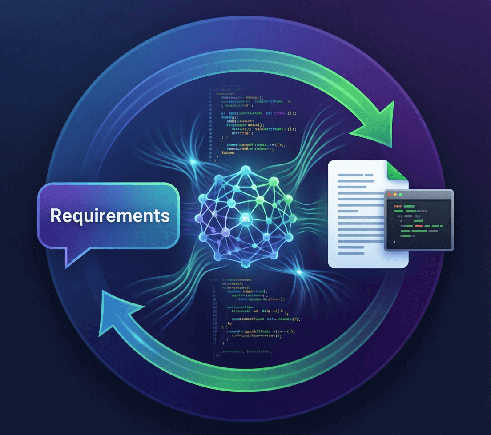
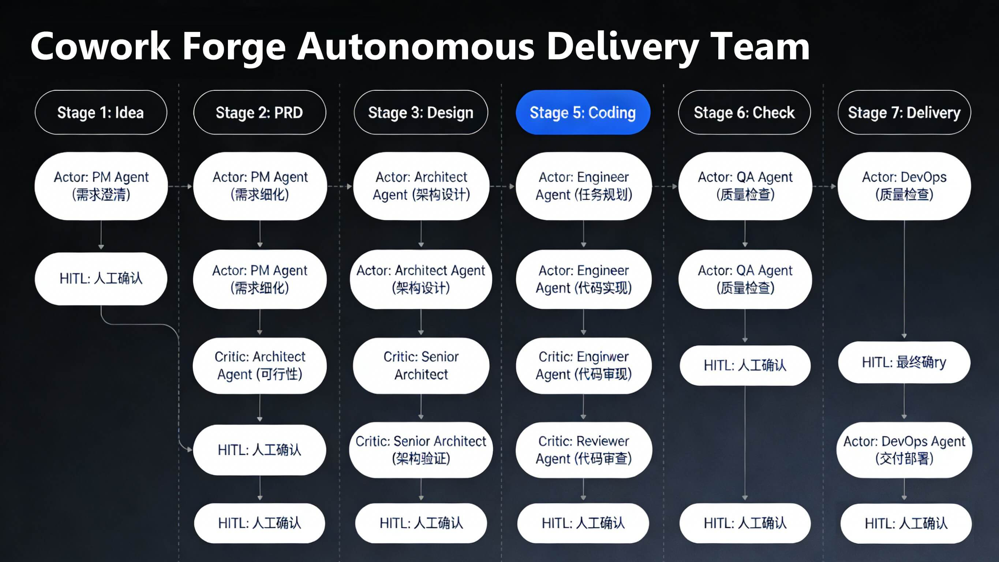
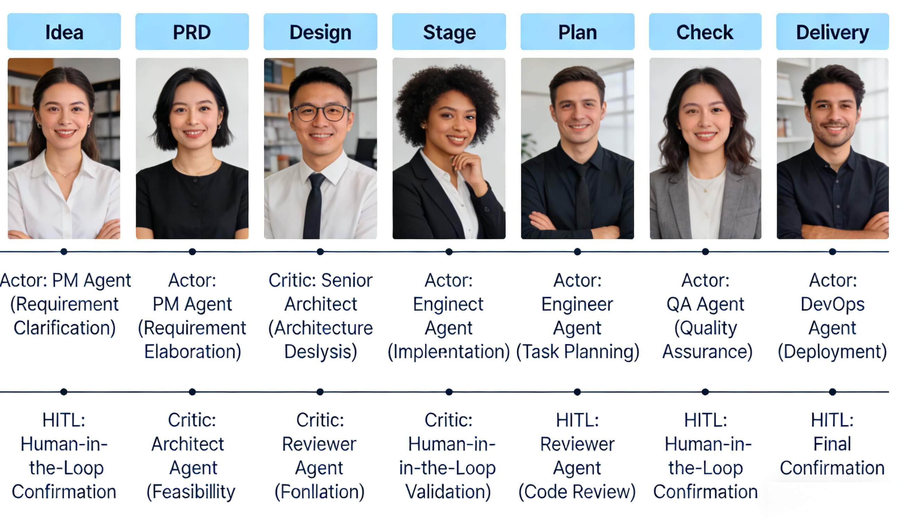
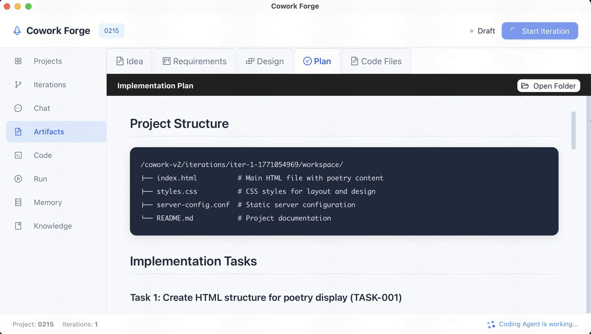
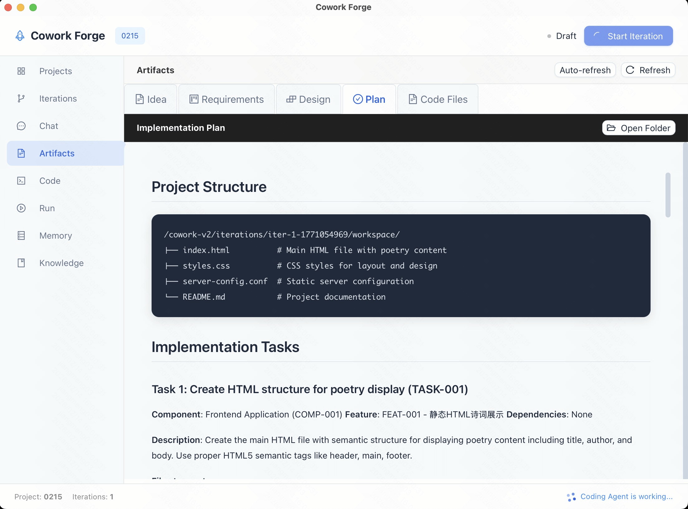
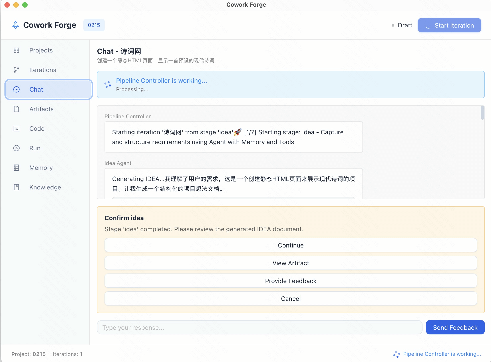
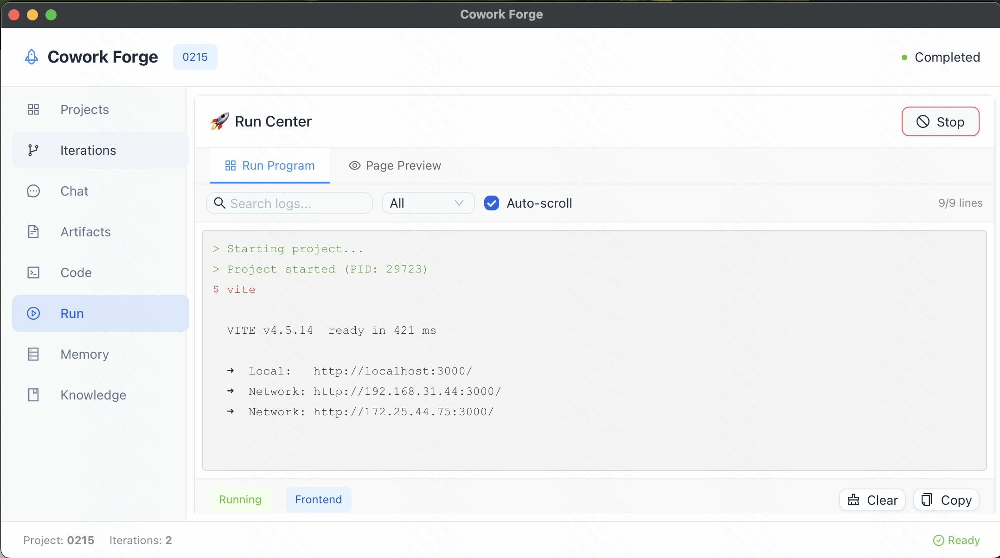
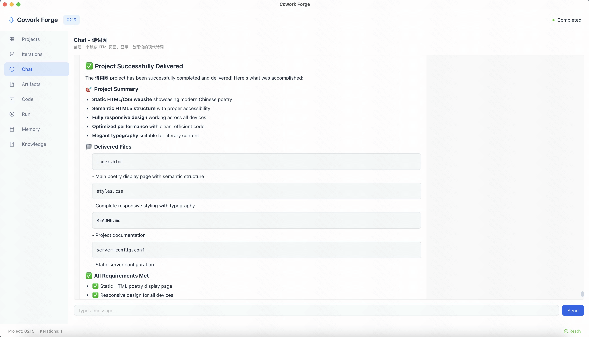
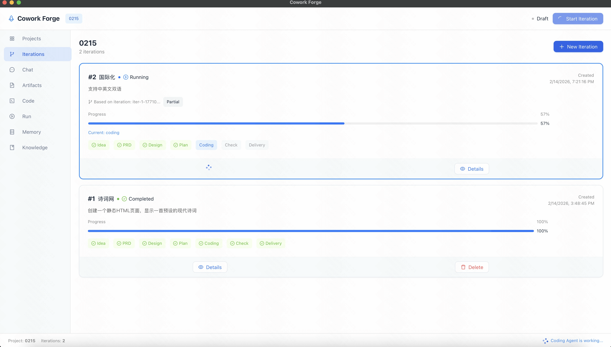
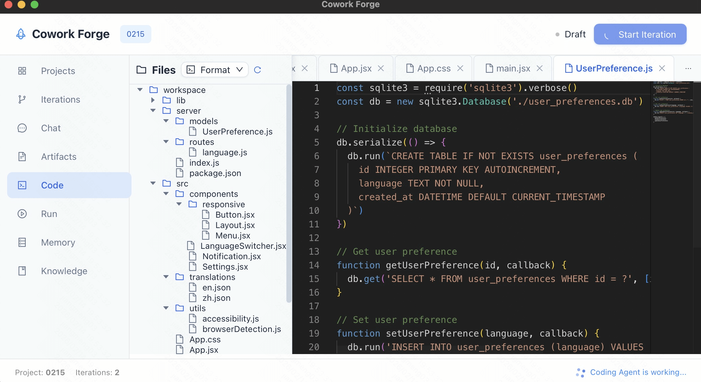

<p align="center">
  
</p>

<h1 align="center">Cowork Forge</h1>

<p align="center">
    <a href="./README.md">English</a>
    |
    <a href="./README_zh.md">中文</a>
</p>

<p align="center">
    <strong>🚀 Full-Stack AI Development Team - Complete Collaboration from Idea to Delivery 🚀</strong>
</p>
<p align="center">Cowork Forge is not just a code generator, but a complete virtual development team. It includes professional roles like Product Manager, Architect, Project Manager, and Engineer, working together through AI agent collaboration to transform your ideas into production-ready software systems.</p>

<p align="center">
  <a href="https://github.com/sopaco/cowork-forge/tree/main/litho.docs/en"></a>
  <a href="https://github.com/sopaco/cowork-forge/tree/main/litho.docs/zh"></a>
  <a href="https://github.com/sopaco/cowork-forge/actions/workflows/rust.yml"></a>
  <a href="./LICENSE"></a>
</p>

<hr />

# 👋 What is Cowork Forge?

| Full-Role Agents **COLLABORATION** | A team that works together like **HUMANS** | High-quality product solutions with **ARTIFACTS** |
| :--- | :--- | :--- |
| |  |  |

<strong>Cowork Forge</strong> is a complete AI-powered development team system that simulates how real software teams collaborate. AI agents take on roles as Product Manager, Architect, Project Manager, and Engineer, working together to complete everything from ideation to delivery.

Unlike AI coding assistants that only generate code snippets, Cowork Forge provides end-to-end development lifecycle management:
- **Product Manager AI**: Transforms your ideas into detailed Product Requirements Documents (PRD)
- **Architect AI**: Designs complete technical architecture and system components
- **Project Manager AI**: Breaks down tasks, plans dependencies, and defines implementation paths
- **Engineer AI**: Implements code, ensures quality, and generates delivery reports

Each role uses Actor-Critic patterns for self-review and optimization, with human validation at critical decision points to ensure output quality and direction.

<p align="center">
  <strong>One person can have a complete development team - Cowork Forge makes AI agents work for you like a real team.</strong>
</p>
<div style="text-align: center; margin: 30px 0;">
  <table style="width: 100%; border-collapse: collapse; margin: 0 auto;">
    <tr>
      <th style="width: 50%; padding: 15px; background-color: #f8f9fa; border: 1px solid #e9ecef; text-align: center; font-weight: bold; color: #495057;">Traditional Development</th>
      <th style="width: 50%; padding: 15px; background-color: #f8f9fa; border: 1px solid #e9ecef; text-align: center; font-weight: bold; color: #495057;">Development with Cowork Forge</th>
    </tr>
    <tr>
      <td style="padding: 15px; border: 1px solid #e9ecef; vertical-align: top;">
        <p style="font-size: 14px; color: #6c757d; margin-bottom: 10px;"><strong>Requires Multiple Roles and Tools</strong></p>
        <ul style="font-size: 13px; color: #6c757d; line-height: 1.6;">
          <li>Need Product Manager to write PRD</li>
          <li>Need Architect to design technical solution</li>
          <li>Need Project Manager to break down tasks</li>
          <li>Need Engineer to write code</li>
          <li>High cost and long cycle for multi-role collaboration</li>
        </ul>
      </td>
      <td style="padding: 15px; border: 1px solid #e9ecef; vertical-align: top;">
        <p style="font-size: 14px; color: #6c757d; margin-bottom: 10px;"><strong>One System Covers All Roles</strong></p>
        <ul style="font-size: 13px; color: #6c757d; line-height: 1.6;">
          <li>AI Product Manager auto-generates professional PRD</li>
          <li>AI Architect designs complete technical solution</li>
          <li>AI Project Manager intelligently breaks down tasks</li>
          <li>AI Engineer implements high-quality code</li>
          <li>Full-process collaboration, human only validates key decisions</li>
        </ul>
      </td>
    </tr>
  </table>
</div>

<hr />

## ✨ Visual Walkthrough
> Cowork Forge is an intelligent development engine that can be called by various technology stacks (Python/Java/NodeJS) through FFI as the high-performance cowork-core library; easily integrated into workflows through cowork-cli; also includes a locally deployable GUI project that provides a friendly interactive interface.

|  |  |
| :--- | :--- |
| **📄 Live Artifact Preview**：Watch documents being written in real-time. View formatted **PRDs**, **System Designs**, and **Implementation Plans** as they are generated. Support for Markdown rendering allows for clear, structured documentation reviews.  | **💬 Interactive Agent Chat**：Collaborate directly with your AI team. Discuss requirements with the Product Manager, review architecture with the Architect, or give feedback to the Engineer. The chat interface keeps the context of your entire project history.  |
| **🌐 Built-in App Preview**：See the result instantly. Cowork Forge GUI includes a web view to preview your generated web applications immediately after the build completes, without leaving the tool.  | **📝 Task & Todo Management**：Keep track of progress. The system automatically generates and maintains a Todo list for the current iteration, checking off items as the agents complete them.  |
| **🚀 Project Dashboard**：The central hub for all your development initiatives. View active projects, check their status (Running, Paused, Completed), and quickly launch new ones from a clean, modern interface. | **⚡ Real-time Code Execution**：Monitor the **Coding Agent** as it writes files, runs builds, and executes tests. The built-in terminal view shows you exactly what commands are being run and their output, ensuring transparency and control.  |

---

## 🛠️ Development Workflow

Cowork Forge GUI guides you through the standard **7-Stage Development Lifecycle**:

1.  **💡 Idea Intake**: Chat with the agent to define your concept.
2.  **📄 PRD Generation**: Review the generated Product Requirements Document.
3.  **🏗️ Architecture Design**: Approve the technical design and system boundaries.
4.  **📐 Implementation Planning**: See the task breakdown and timeline.
5.  **💻 Coding & Testing**: Watch code being written and tests passing.
6.  **✅ Quality Check**: Verify the implementation against requirements.
7.  **📦 Delivery**: Receive the final project report and artifacts.

## 🔄 Post-Delivery Support

After an iteration completes, the **Project Manager Agent** becomes available for continued interaction:

- **💬 Natural Language Chat**: Ask questions about your project, request modifications, or discuss next steps
- **🔀 Stage Navigation**: Jump back to any stage (Idea, PRD, Design, Plan, Coding) to make changes
- **➕ Create New Iterations**: Start new iterations for new features with inheritance support

```
Iteration Completed
        ↓
[PM Agent Activated]
        ↓
User: "Fix the login bug" → PM Agent: Jumps to Coding stage
User: "Add payment feature" → PM Agent: Creates new iteration
User: "What tech stack?" → PM Agent: Answers directly
```


# 🏆 Cowork Forge vs. Competitors

## Core Capabilities Comparison

| Capability | Cowork Forge | GitHub Copilot | Cursor AI | Aider |
|------------|------------------------|----------------|-----------|-------|
| **End-to-End Workflow** | ✅ Complete (Idea→Delivery) | ❌ Code completion only | ❌ Code editing focus | ❌ Code assistance only |
| **Multi-Agent Architecture** | ✅ 10+ specialized agents | ❌ Single model | ❌ Single model | ❌ Single model |
| **PRD Generation** | ✅ Automated | ❌ N/A | ❌ N/A | ❌ N/A |
| **Technical Design** | ✅ C4 architecture docs | ❌ N/A | ❌ N/A | ❌ N/A |
| **Post-Delivery Support** | ✅ PM Agent chat interface | ❌ N/A | ❌ N/A | ❌ N/A |
| **External Agent Integration** | ✅ ACP-compatible agents | ❌ N/A | ❌ N/A | ❌ N/A |
| **Incremental Updates** | ✅ Smart delta analysis | ❌ N/A | ❌ Limited | ❌ Limited |
| **Human-in-the-Loop** | ✅ Critical decision points | ❌ N/A | ❌ Limited | ❌ Limited |
| **Open Source** | ✅ MIT License | ❌ Proprietary | ❌ Proprietary | ✅ MIT License |
| **Self-Hosted** | ✅ Local execution | ❌ Cloud only | ❌ Cloud only | ✅ Local execution |

## Key Differentiators

### 1. Complete Virtual Development Team

Unlike tools that only assist with writing code, Cowork Forge provides complete development team role coverage:
- **Product Manager Role**: Transforms vague ideas into structured Product Requirements Documents
- **Architect Role**: Designs complete technical architecture and system components
- **Project Manager Role**: Breaks down tasks, plans dependencies, and implementation paths
- **Engineer Role**: Implements code and performs quality verification

### 2. Multi-Agent Collaboration
Cowork Forge's specialized agents work together like a real development team:
- <strong>Idea Agent</strong>: Captures and structures user requirements
- <strong>PRD Loop Agent</strong>: Generates comprehensive PRDs with actor-critic refinement
- <strong>Design Loop Agent</strong>: Creates technical architecture with actor-critic refinement
- <strong>Plan Loop Agent</strong>: Breaks down implementation tasks with actor-critic refinement
- <strong>Coding Loop Agent</strong>: Plans and executes code changes with actor-critic refinement
- <strong>Check Agent</strong>: Verifies code quality and completeness
- <strong>Delivery Agent</strong>: Generates comprehensive delivery reports
- <strong>Project Manager Agent</strong>: Post-delivery assistant for modifications and new iterations
- <strong>Change Triage Agent</strong>: Analyzes and triages incremental change requests
- <strong>Code Patch Agent</strong>: Implements precise code patches for modifications

### 3. Human-in-the-Loop Validation
Critical outputs require human confirmation before proceeding, ensuring:
- Accurate requirement capture
- Sound technical decisions
- Feasible implementation plans
- Safe code changes

### 4. Incremental Code Updates
When requirements or designs change, Cowork Forge intelligently identifies affected files and updates only what's necessary.

### 5. Built-in Safety
Multi-layer security checks prevent:
- Dangerous command execution (rm -rf, sudo, etc.)
- Unauthorized file system access
- Malicious code injection
- Resource exhaustion

❤️ Like <strong>Cowork Forge</strong>? Star it ⭐ or [Sponsor Me](https://github.com/sponsors/sopaco)! ❤️


# 🌟 Features & Capabilities

## Core Workflow

- <strong>7-Stage Development Workflow:</strong> Comprehensive workflow covering Idea Intake → PRD Generation → Technical Design → Implementation Plan → Coding → Quality Check → Delivery.
- <strong>Specialized AI Agents:</strong> Each stage handled by a dedicated agent with domain expertise. Four critical stages (PRD, Design, Plan, Coding) use actor-critic loops for iterative refinement.
- <strong>Project Manager Agent:</strong> Post-delivery chat interface for continued project interaction. Request modifications, create new iterations, or ask questions about your completed project.
- <strong>External Coding Agent Support:</strong> Optionally integrate external ACP-compatible coding agents (OpenCode, iFlow, Codex, Gemini CLI, Claude CLI) for specialized coding tasks.
- <strong>Intelligent Code Planning:</strong> Analyzes project structure, dependencies, and generates precise code change plans.
- <strong>Incremental Code Updates:</strong> Smart delta analysis updates only affected files, preserving existing modifications.
- <strong>Automated Quality Verification:</strong> Multi-language build/test integration with comprehensive error analysis and reporting.
- <strong>Human-in-the-Loop Validation:</strong> Critical outputs (PRD, design, plans) require human confirmation before proceeding.

## Configurable System

- <strong>Custom Workflows (Flow):</strong> Create custom development pipelines with configurable stage combinations and execution order. Enterprises can define standardized process templates for different project types (Web apps, CLI tools, API services) to ensure consistent development practices across teams.
- <strong>Custom Agents:</strong> Define specialized AI agent roles with custom instructions, tool sets, and model parameters. Teams can create domain-specific agents like security reviewers, performance optimizers, or code quality specialists tailored to their business needs.
- <strong>Skill Extensions:</strong> Skill package system for injecting domain-specific tools, prompts, and context into agents. Supports multiple skill categories including frontend development, backend services, mobile apps, and DevOps—install and combine as needed.
- <strong>External Integrations:</strong> Configure integrations with external systems such as deployment platforms, requirement management tools, and CI/CD pipelines through webhooks and REST APIs for automated workflows.

## Data Management

- <strong>Artifact-Based Storage:</strong> Versioned storage of all stage outputs with JSON and Markdown formats.
- <strong>Todo List Management:</strong> Automatic task tracking with status inference and progress reporting.
- <strong>Multi-Language Project Support:</strong> Automatic detection and handling of Rust, Python, JavaScript/TypeScript projects.
- <strong>Security & Safety:</strong> Command validation, path access control, and watchdog monitoring for safe execution.

# 🏗️ Architecture

Cowork Forge is built as a Rust workspace with modular, hexagonal architecture based on the adk-rust framework:

## Key Components

### Rust Workspace Structure
- `cowork-core`: Core library with domain logic, pipeline orchestration, and tools
- `cowork-cli`: Command-line interface for interacting with the system
- `cowork-gui`: Optional graphical user interface (Tauri + React + TypeScript)

### Hexagonal Architecture
- **Domain Layer**: Pure business logic (Project, Iteration, Memory aggregates)
- **Application Layer**: Pipeline orchestration, stage execution
- **Infrastructure Layer**: Persistence, LLM integration, tools, ACP client
- **Ports**: InteractiveBackend trait for CLI/GUI abstraction

### Iteration Architecture
- **Genesis Iterations**: Start new projects from scratch
- **Evolution Iterations**: Build upon existing iterations with inheritance modes
- **Inheritance Modes**: None (fresh start), Full (complete code + artifacts copy), Partial (artifacts only, regenerate code)

### Pipeline Domain
Seven-stage development workflow with Actor-Critic pattern:
- **Idea Stage**: Capture and structure requirements
- **PRD Stage**: Generate product requirements with Actor-Critic refinement
- **Design Stage**: Create technical architecture with Actor-Critic refinement
- **Plan Stage**: Break down tasks with Actor-Critic refinement
- **Coding Stage**: Implement code with Actor-Critic refinement
- **Check Stage**: Verify quality and completeness
- **Delivery Stage**: Generate final delivery report

### Tools Module
Secure tool execution with workspace validation:
- File operations within project boundaries
- Command execution with safety checks
- Interactive tools for human-in-the-loop validation
- **PM tools** for post-delivery interactions
- 30+ ADK tools for file, data, validation, and memory operations

### ACP Integration
Agent Communication Protocol support:
- External coding agent integration via stdio or WebSocket
- Compatible with OpenCode, iFlow, Codex, Gemini CLI, Claude CLI
- Seamless fallback to built-in adk-rust agent


# 📋 Getting Started

### Prerequisites
- [**Rust**](https://www.rust-lang.org) (edition 2024)
- [**LLM API Access**](https://platform.openai.com/) (OpenAI or compatible provider)
- Git and language-specific build tools (cargo, npm, pip, etc.)

### Installation

```sh
# Clone the repository
git clone https://github.com/sopaco/cowork-forge.git
cd cowork-forge

# Build the entire workspace
cargo build --release

# The CLI binary will be available at:
# target/release/cowork
```

### Configuration

Cowork Forge uses a `config.toml` file stored in your system's application data directory:

| Platform | Config Location |
|----------|----------------|
| Windows | `%APPDATA%\CoworkCreative\config.toml` |
| macOS | `~/Library/Application Support/CoworkCreative/config.toml` |
| Linux | `~/.config/CoworkCreative/config.toml` |

```toml
# LLM Configuration (Required)
[llm]
api_base_url = "https://api.openai.com/v1"
api_key = "sk-your-openai-api-key"
model_name = "gpt-4"

# Optional: Embedding Configuration
[embedding]
api_base_url = "https://your-embedding-api.com/v1"
api_key = "your-embedding-api-key"
model_name = "text-embedding-3-small"

# Optional: External Coding Agent
[coding_agent]
enabled = false
agent_type = "opencode"       # opencode, iflow, codex, gemini, claude
command = "bun"
args = ["x", "opencode-ai", "acp"]
transport = "stdio"           # stdio or websocket
workspace_path = ""           # optional, uses current project if empty
```

#### External Coding Agent Configuration

You can configure an external ACP-compatible coding agent for the Coding stage:

```toml
[coding_agent]
enabled = true
agent_type = "opencode"
command = "bun"
args = ["x", "opencode-ai", "acp"]
transport = "stdio"
```

Supported agent types:
- **opencode**: OpenCode AI agent
- **iflow**: iFlow CLI agent  
- **codex**: OpenAI Codex CLI
- **gemini**: Gemini CLI
- **claude**: Claude CLI

# 🚀 Usage

## 🖥️ Cowork CLI

### Iteration Management

```sh
# Initialize a new project
cowork init --name "My Project"

# Create a new iteration (Genesis)
cowork iter --project "my-project" "Build a REST API for task management"

# Create an evolution iteration
cowork iter --project "my-project" --base iter-1 --inherit partial "Add user profiles"

# List all iterations
cowork list

# Show iteration details
cowork show iter-1-1234567890

# Continue a paused iteration
cowork continue iter-1-1234567890

# Check status
cowork status
```

### Inheritance Modes

| Mode        | Description                           | Use Case                          |
|-------------|---------------------------------------|-----------------------------------|
| `none`      | Fresh start, no inheritance           | Complete rewrites, new projects   |
| `full`      | Copy workspace code + artifacts       | Bug fixes, small enhancements     |
| `partial`   | Copy artifacts only, regenerate code  | Large features, architecture change|

## 🖼️ Cowork GUI

### Features
- **Visual Dashboard**: Overview of all your projects and iterations.
- **Real-time Monitoring**: Watch agents work in real-time with detailed logs and status updates.
- **Interactive Chat**: Communicate with agents directly through a chat interface.
- **Post-Delivery Chat**: Use the Project Manager Agent to continue working with completed projects.
- **Built-in Preview**: Preview your generated web applications directly within the app.

### Running the GUI

```sh
cd crates/cowork-gui
npm install   # or: bun install
cargo tauri dev
```


# 🌐 The Cowork Forge Ecosystem

- <strong>`cowork-core`</strong>: Core library containing domain logic, pipeline orchestration, tools, and persistence.
- <strong>`cowork-cli`</strong>: Command-line interface for iteration management and project interaction.
- <strong>`cowork-gui`</strong>: Graphical user interface based on Tauri framework with React + TypeScript frontend.

### Core Modules

<strong>cowork-core</strong> is organized into the following domain modules:

- <strong>`pipeline`</strong>: 7-stage pipeline orchestration managing iteration lifecycle and stage execution.
- <strong>`domain`</strong>: Core domain entities (Project, Iteration, Memory aggregates) with DDD patterns.
- <strong>`persistence`</strong>: JSON-based storage with workspace isolation.
- <strong>`tools`</strong>: 30+ ADK tools for file operations, command execution, and validation.
- <strong>`llm`</strong>: LLM integration with rate limiting (30 req/min, concurrency=1).
- <strong>`interaction`</strong>: InteractiveBackend trait for CLI/GUI abstraction.
- <strong>`memory`</strong>: Project memory system for cross-iteration knowledge retention.
- <strong>`acp`</strong>: Agent Communication Protocol client for external coding agents.

# 🔐 Security

Cowork Forge implements multiple layers of security:

1. **Command Validation**: Dangerous commands are blocked before execution
2. **Path Access Control**: Restricted access to sensitive system directories
3. **Build Tool Whitelist**: Only authorized development tools can be executed
4. **Timeout Controls**: Prevents resource exhaustion from long-running commands
5. **Watchdog Monitoring**: Detects and prevents agent deviation from objectives

# 🤝 Contributing

We welcome all forms of contributions! Report bugs or submit feature requests through [GitHub Issues](https://github.com/sopaco/cowork-forge/issues).

### Running Tests

```sh
# Run all tests
cargo test

# Run tests with coverage
cargo test --all-features

# Run specific module tests
cargo test -p cowork-core
```

# 📚 Documentation

Comprehensive documentation is available in the [litho.docs](./litho.docs/) directory:

- [English Documentation](./litho.docs/en/) - Complete system documentation
- [中文文档](./litho.docs/zh/) - 完整系统文档

# 📄 License

This project is licensed under the **MIT License**. See the [LICENSE](LICENSE) file for details.

# 🙏 Acknowledgments

- Built with [Rust](https://www.rust-lang.org/)
- Powered by [OpenAI](https://openai.com/) GPT models
- Inspired by modern software development practices and AI agent research

# 📧 Contact

- **GitHub**: [sopaco/cowork-forge](https://github.com/sopaco/cowork-forge)
- **Issues**: [GitHub Issues](https://github.com/sopaco/cowork-forge/issues)

---

**Transform your development workflow with Cowork Forge—the future of collaborative software development.** 🚀
