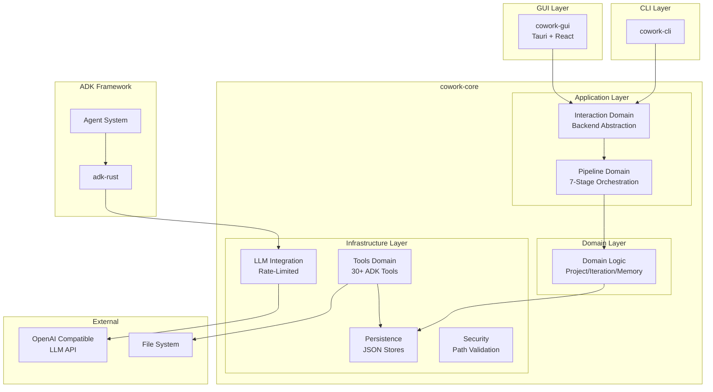
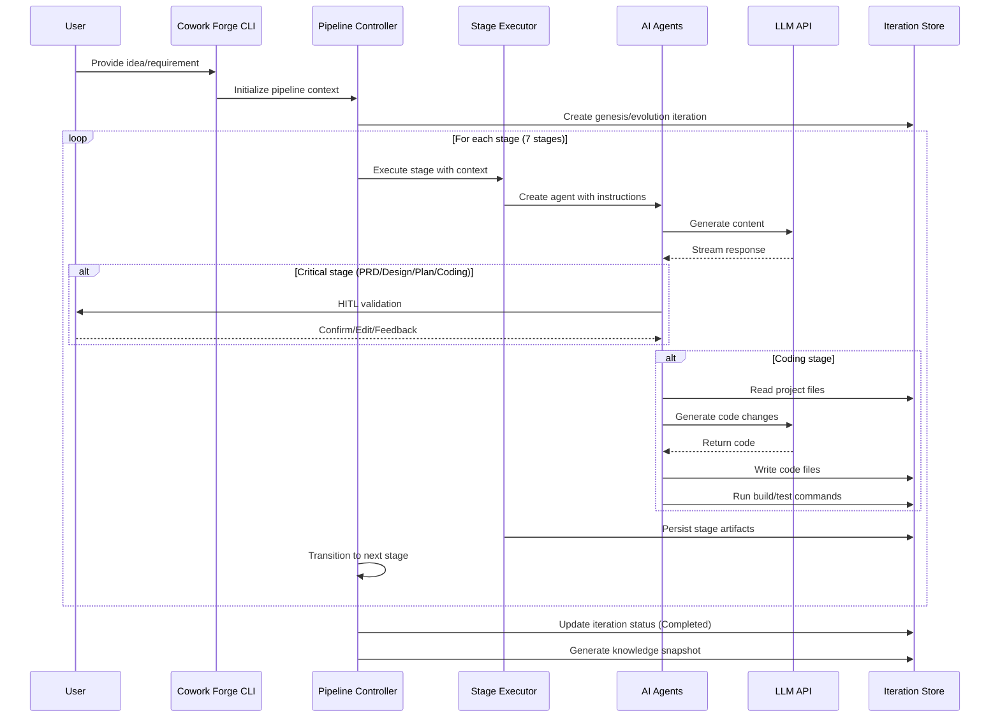
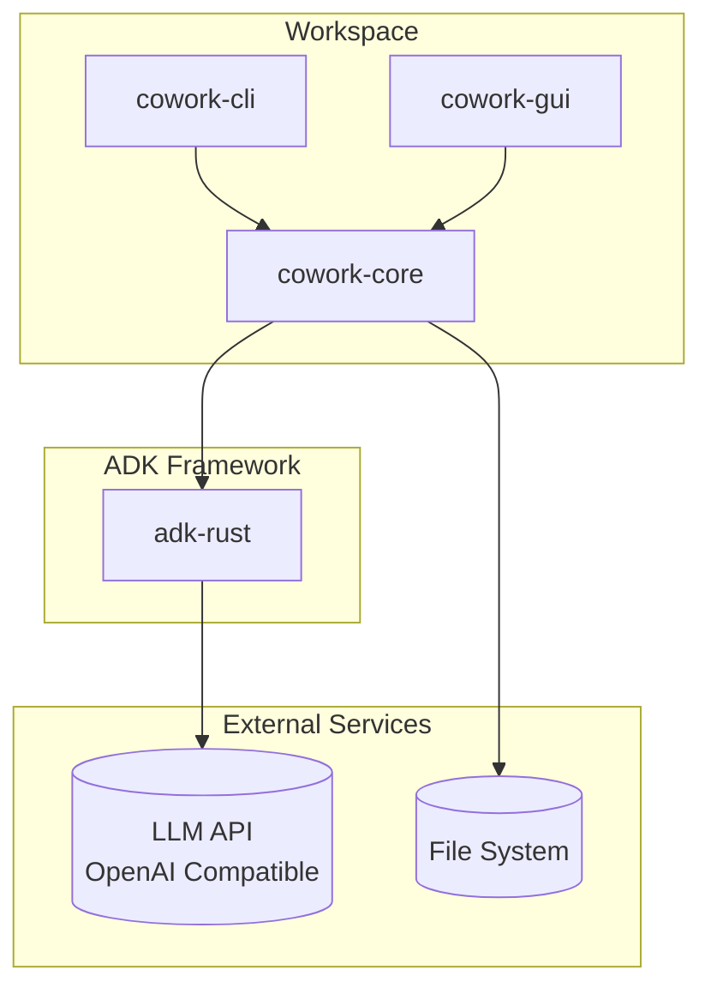

<p align="center">
  
</p>

<h1 align="center">Cowork Forge</h1>

<p align="center">
    <a href="./README.md">English</a>
    |
    <a href="./README_zh.md">中文</a>
</p>

<p align="center">
    <strong>🤖 Full-Stack AI Development Team - Complete Collaboration from Idea to Delivery 🤖</strong>
</p>
<p align="center">Cowork Forge is not just a code generator, but a complete virtual development team. It includes professional roles like Product Manager, Architect, Project Manager, and Engineer, working together through AI agent collaboration to transform your ideas into production-ready software systems.</p>

<p align="center">
  <a href="https://github.com/sopaco/cowork-forge/tree/main/litho.docs/en"></a>
  <a href="https://github.com/sopaco/cowork-forge/tree/main/litho.docs/zh"></a>
  <a href="https://github.com/sopaco/cowork-forge"></a>
  <a href="./LICENSE"></a>
</p>

<hr />

# 👋 What is Cowork Forge?

| Full-Role Agents **COLLABORATION** | A team that works together like **HUMANS** | High-quality product solutions with **ARTIFACTS** |
| :--- | :--- | :--- |
| |  |  |

<strong>Cowork Forge</strong> is a complete AI-powered development team system that simulates how real software teams collaborate. AI agents take on roles as Product Manager, Architect, Project Manager, and Engineer, working together to complete everything from ideation to delivery.

Unlike AI coding assistants that only generate code snippets, Cowork Forge provides end-to-end development lifecycle management:
- **Product Manager AI**: Transforms your ideas into detailed Product Requirements Documents (PRD)
- **Architect AI**: Designs complete technical architecture and system components
- **Project Manager AI**: Breaks down tasks, plans dependencies, and defines implementation paths
- **Engineer AI**: Implements code, ensures quality, and generates delivery reports

Each role uses Actor-Critic patterns for self-review and optimization, with human validation at critical decision points to ensure output quality and direction.

<p align="center">
  <strong>One person can have a complete development team - Cowork Forge makes AI agents work for you like a real team.</strong>
</p>

<div style="text-align: center; margin: 30px 0;">
  <table style="width: 100%; border-collapse: collapse; margin: 0 auto;">
    <tr>
      <th style="width: 50%; padding: 15px; background-color: #f8f9fa; border: 1px solid #e9ecef; text-align: center; font-weight: bold; color: #495057;">Traditional Development</th>
      <th style="width: 50%; padding: 15px; background-color: #f8f9fa; border: 1px solid #e9ecef; text-align: center; font-weight: bold; color: #495057;">Development with Cowork Forge</th>
    </tr>
    <tr>
      <td style="padding: 15px; border: 1px solid #e9ecef; vertical-align: top;">
        <p style="font-size: 14px; color: #6c757d; margin-bottom: 10px;"><strong>Requires Multiple Roles and Tools</strong></p>
        <ul style="font-size: 13px; color: #6c757d; line-height: 1.6;">
          <li>Need Product Manager to write PRD</li>
          <li>Need Architect to design technical solution</li>
          <li>Need Project Manager to break down tasks</li>
          <li>Need Engineer to write code</li>
          <li>High cost and long cycle for multi-role collaboration</li>
        </ul>
      </td>
      <td style="padding: 15px; border: 1px solid #e9ecef; vertical-align: top;">
        <p style="font-size: 14px; color: #6c757d; margin-bottom: 10px;"><strong>One System Covers All Roles</strong></p>
        <ul style="font-size: 13px; color: #6c757d; line-height: 1.6;">
          <li>AI Product Manager auto-generates professional PRD</li>
          <li>AI Architect designs complete technical solution</li>
          <li>AI Project Manager intelligently breaks down tasks</li>
          <li>AI Engineer implements high-quality code</li>
          <li>Full-process collaboration, human only validates key decisions</li>
        </ul>
      </td>
    </tr>
  </table>
</div>

<hr />

## ✨ Visual Walkthrough
> Cowork Forge is an intelligent development engine that can be called by various technology stacks (Python/Java/NodeJS) through FFI as the high-performance cowork-core library; easily integrated into workflows through cowork-cli; also includes a locally deployable GUI project that provides a friendly interactive interface. Using Cowork Forge GUI as an example, we can intuitively experience the complete lifecycle of software development through its interface.

|  |  |
| :--- | :--- |
| **📄 Live Artifact Preview**：Watch documents being written in real-time. View formatted **PRDs**, **System Designs**, and **Implementation Plans** as they are generated. Support for Markdown rendering allows for clear, structured documentation reviews.  | **💬 Interactive Agent Chat**：Collaborate directly with your AI team. Discuss requirements with the Product Manager, review architecture with the Architect, or give feedback to the Engineer. The chat interface keeps the context of your entire project history.  |
| **🌐 Built-in App Preview**：See the result instantly. Cowork Forge GUI includes a web view to preview your generated web applications immediately after the build completes, without leaving the tool.  | **📝 Task & Todo Management**：Keep track of progress. The system automatically generates and maintains a Todo list for the current iteration, checking off items as the agents complete them.  |
| **🚀 Project Dashboard**：The central hub for all your development initiatives. View active projects, check their status (Running, Paused, Completed), and quickly launch new ones from a clean, modern interface. | **⚡ Real-time Code Execution**：Monitor the **Coding Agent** as it writes files, runs builds, and executes tests. The built-in terminal view shows you exactly what commands are being run and their output, ensuring transparency and control.  |

---

## 🔄 Development Workflow

Cowork Forge GUI guides you through the standard **7-Stage Development Lifecycle**:

1.  **💡 Idea Intake**: Chat with the agent to define your concept.
2.  **📋 PRD Generation**: Review the generated Product Requirements Document.
3.  **🏗️ Architecture Design**: Approve the technical design and system boundaries.
4.  **📅 Implementation Planning**: See the task breakdown and timeline.
5.  **💻 Coding & Testing**: Watch code being written and tests passing.
6.  **✅ Quality Check**: Verify the implementation against requirements.
7.  **📦 Delivery**: Receive the final project report and artifacts.

# 🏆 Cowork Forge vs. Competitors

Cowork Forge stands out in the AI development tools landscape through its unique multi-agent architecture and comprehensive workflow coverage.

## Core Capabilities Comparison

| Capability | Cowork Forge | GitHub Copilot | Cursor AI | Aider |
|------------|------------------------|----------------|-----------|-------|
| **End-to-End Workflow** | ✅ Complete (Idea→Delivery) | ❌ Code completion only | ❌ Code editing focus | ❌ Code assistance only |
| **Multi-Agent Architecture** | ✅ 8 specialized agents | ❌ Single model | ❌ Single model | ❌ Single model |
| **PRD Generation** | ✅ Automated | ❌ N/A | ❌ N/A | ❌ N/A |
| **Technical Design** | ✅ C4 architecture docs | ❌ N/A | ❌ N/A | ❌ N/A |
| **Implementation Planning** | ✅ Task breakdown & milestones | ❌ N/A | ❌ N/A | ❌ N/A |
| **Incremental Updates** | ✅ Smart delta analysis | ❌ N/A | ❌ Limited | ❌ Limited |
| **Multi-Language Support** | ✅ Rust, Python, JS/TS | ✅ Many languages | ✅ Many languages | ✅ Many languages |
| **Human-in-the-Loop** | ✅ Critical decision points | ❌ N/A | ❌ Limited | ❌ Limited |
| **Automated Verification** | ✅ Build/test integration | ❌ N/A | ❌ N/A | ❌ N/A |
| **Safety Checks** | ✅ Multi-layer security | ❌ N/A | ❌ Basic | ❌ Basic |
| **Artifact Storage** | ✅ Versioned artifacts | ❌ N/A | ❌ N/A | ❌ N/A |
| **Open Source** | ✅ MIT License | ❌ Proprietary | ❌ Proprietary | ✅ MIT License |
| **Self-Hosted** | ✅ Local execution | ❌ Cloud only | ❌ Cloud only | ✅ Local execution |

## Key Differentiators

### 1. Complete Virtual Development Team

Unlike tools that only assist with writing code, Cowork Forge provides complete development team role coverage:
- **Product Manager Role**: Transforms vague ideas into structured Product Requirements Documents
- **Architect Role**: Designs complete technical architecture and system components
- **Project Manager Role**: Breaks down tasks, plans dependencies, and implementation paths
- **Engineer Role**: Implements code and performs quality verification

This full-role coverage ensures end-to-end continuity and professionalism from requirements analysis to code implementation.

### 2. Multi-Agent Collaboration
Cowork Forge's specialized agents work together like a real development team:
- <strong>Idea Agent</strong>: Captures and structures user requirements
- <strong>PRD Loop Agent</strong>: Generates comprehensive PRDs with actor-critic refinement
- <strong>Design Loop Agent</strong>: Creates technical architecture with actor-critic refinement
- <strong>Plan Loop Agent</strong>: Breaks down implementation tasks with actor-critic refinement
- <strong>Coding Loop Agent</strong>: Plans and executes code changes with actor-critic refinement
- <strong>Check Agent</strong>: Verifies code quality and completeness
- <strong>Delivery Agent</strong>: Generates comprehensive delivery reports
- <strong>Change Triage Agent</strong>: Analyzes and triages incremental change requests
- <strong>Code Patch Agent</strong>: Implements precise code patches for modifications
- <strong>Modify Delivery Agent</strong>: Generates modification delivery reports

### 3. Human-in-the-Loop Validation
Critical outputs require human confirmation before proceeding, ensuring:
- Accurate requirement capture
- Sound technical decisions
- Feasible implementation plans
- Safe code changes

This balance of automation and human control sets Cowork Forge apart from fully autonomous tools.

### 4. Incremental Code Updates
When requirements or designs change, Cowork Forge intelligently identifies affected files and updates only what's necessary—preserving your customizations and avoiding full regeneration.

### 5. Built-in Safety
Multi-layer security checks prevent:
- Dangerous command execution (rm -rf, sudo, etc.)
- Unauthorized file system access
- Malicious code injection
- Resource exhaustion

❤️ Like <strong>Cowork Forge</strong>? Star it 🌟 or [Sponsor Me](https://github.com/sponsors/sopaco)! ❤️

# 🌠 Features & Capabilities

- <strong>7-Stage Development Workflow:</strong> Comprehensive workflow covering Idea Intake → PRD Generation → Technical Design → Implementation Plan → Coding → Quality Check → Delivery, corresponding to the complete process of a real development team.
- <strong>Specialized AI Agents:</strong> Each stage handled by a dedicated agent with domain expertise. Four critical stages (PRD, Design, Plan, Coding) use actor-critic loops for iterative refinement, ensuring output quality meets professional standards.
- <strong>Intelligent Code Planning:</strong> Analyzes project structure, dependencies, and generates precise code change plans.
- <strong>Incremental Code Updates:</strong> Smart delta analysis updates only affected files, preserving existing modifications.
- <strong>Automated Quality Verification:</strong> Multi-language build/test integration with comprehensive error analysis and reporting.
- <strong>Human-in-the-Loop Validation:</strong> Critical outputs (PRD, design, plans) require human confirmation before proceeding.
- <strong>Artifact-Based Storage:</strong> Versioned storage of all stage outputs with JSON and Markdown formats.
- <strong>Todo List Management:</strong> Automatic task tracking with status inference and progress reporting.
- <strong>Multi-Language Project Support:</strong> Automatic detection and handling of Rust, Python, JavaScript/TypeScript projects.
- <strong>Security & Safety:</strong> Command validation, path access control, and watchdog monitoring for safe execution.

# 🏗️ Architecture

Cowork Forge is built as a Rust workspace with modular, hexagonal architecture based on the adk-rust framework:



## Key Components

### Rust Workspace Structure
The project is organized as a Rust workspace with multiple crates:
- `cowork-core`: Core library with domain logic, pipeline orchestration, and tools
- `cowork-cli`: Command-line interface for interacting with the system
- `cowork-gui`: Optional graphical user interface (Tauri + React based)

### Hexagonal Architecture
Cowork Forge implements a hexagonal (ports and adapters) architecture:
- **Domain Layer**: Pure business logic (Project, Iteration, Memory aggregates)
- **Application Layer**: Pipeline orchestration, stage execution
- **Infrastructure Layer**: Persistence, LLM integration, tools
- **Ports**: InteractiveBackend trait for CLI/GUI abstraction

### Iteration Architecture
Core concept that manages complete development cycles as independent, inheritable units:
- **Genesis Iterations**: Start new projects from scratch
- **Evolution Iterations**: Build upon existing iterations with inheritance modes
- **Inheritance Modes**: None (fresh start), Full (complete code + artifacts copy), Partial (artifacts only, regenerate code)

### ADK Framework Integration
Built on the adk-rust framework providing:
- Agent orchestration and lifecycle management
- LLM integration with OpenAI and compatible providers
- Tool system for safe code operations
- Session management for stateful interactions

### Pipeline Domain
Seven-stage development workflow with Actor-Critic pattern:
- **Idea Stage**: Capture and structure requirements
- **PRD Stage**: Generate product requirements with Actor-Critic refinement
- **Design Stage**: Create technical architecture with Actor-Critic refinement
- **Plan Stage**: Break down tasks with Actor-Critic refinement
- **Coding Stage**: Implement code with Actor-Critic refinement
- **Check Stage**: Verify quality and completeness
- **Delivery Stage**: Generate final delivery report

### Tools Module
Secure tool execution with workspace validation:
- File operations within project boundaries
- Command execution with safety checks
- Interactive tools for human-in-the-loop validation
- 30+ ADK tools for file, data, validation, and memory operations

### Persistence Layer
Data management and storage:
- Iteration storage and retrieval
- Artifact management with versioning
- Project memory system for cross-iteration knowledge retention

# 🧠 How It Works

Cowork Forge uses a sophisticated multi-stage workflow orchestrated by the `Pipeline Controller`:



# 🖥 Getting Started

### Prerequisites
- [**Rust**](https://www.rust-lang.org) (edition 2024)
- [**LLM API Access**](https://platform.openai.com/) (OpenAI or compatible provider)
- Git and language-specific build tools (cargo, npm, pip, etc.)

### Installation

Build from source:

```sh
# Clone the repository
git clone https://github.com/sopaco/cowork-forge.git
cd cowork-forge

# Build the entire workspace
cargo build --release

# The CLI binary will be available at:
# target/release/cowork
```

### Configuration

Cowork Forge uses a `config.toml` file for configuration. Create one in your project directory or use `--config` to specify a path:

```toml
# LLM Configuration
[llm]
api_base_url = "https://api.openai.com/v1"
api_key = "sk-your-openai-api-key"
model_name = "gpt-4"

# Optional: Embedding Configuration
[embedding]
api_base_url = "https://your-embedding-api.com/v1"
api_key = "your-embedding-api-key"
model_name = "text-embedding-ada-002"
```

# 🚀 Usage

Cowork Forge offers two ways to interact with your AI development team: the Command Line Interface (CLI) and the Graphical User Interface (GUI).

## 🖥️ Cowork CLI

### Iteration Management

```sh
# Initialize a new project
cowork init --name "My Project"

# Create a new iteration (Genesis)
cowork iter --project "my-project" "Build a REST API for task management"

# Create an evolution iteration
cowork iter --project "my-project" --base iter-1 --inherit partial "Add user profiles"

# List all iterations
cowork list

# Show iteration details
cowork show iter-1-1234567890

# Continue a paused iteration
cowork continue iter-1-1234567890

# Check status
cowork status
```

### Iteration Workflow

When you start an iteration, Cowork Forge guides you through the 7-stage workflow:

1. **Idea**: Your concept is structured into a formal specification
2. **PRD**: Product Requirements Document with actor-critic refinement
3. **Technical Design**: Architecture design with component specifications and actor-critic refinement
4. **Implementation Plan**: Task breakdown with dependencies and actor-critic refinement
5. **Coding**: Code implementation with actor-critic refinement and human validation
6. **Quality Check**: Verification of feature coverage and code completeness
7. **Delivery**: Final delivery report with implementation summary

At each critical stage, you'll be prompted to review and confirm the output before proceeding.

### Example Session Flow

```sh
# Initialize a new project
$ cowork init --name "My File Converter"

# Create a new iteration
$ cowork iter --title "Build a CLI tool" --description "A command-line tool for converting files between formats"

[Pipeline] Starting Genesis iteration: iter-1-1770536303
[Iteration] Stage 1/7: Idea Agent
[Idea Agent] Processing requirement...
[Idea Agent] Generated IdeaSpec at: .cowork-v2/iterations/iter-1-1770536303/artifacts/idea.md

Review the specification and provide feedback (or 'continue' to proceed):

> continue

[Iteration] Stage 2/7: PRD Loop Agent
[PRD Agent] Generating Product Requirements Document...
[PRD Agent] Generated PRD with 12 requirements at: .cowork-v2/iterations/iter-1-1770536303/artifacts/prd.md

Review the PRD and provide feedback (or 'continue' to proceed):

> continue

[Iteration] Stage 3/7: Design Loop Agent
[Design Agent] Creating technical architecture...
[Design Agent] Generated design at: .cowork-v2/iterations/iter-1-1770536303/artifacts/design.md

Review the design and provide feedback (or 'continue' to proceed):

> continue

... (continues through all 7 stages)

[Iteration] Stage 7/7: Delivery Agent
[Delivery Agent] Generating delivery report...
[Delivery Agent] Iteration completed successfully at: .cowork-v2/iterations/iter-1-1770536303/artifacts/delivery.md

Summary:
- 12 requirements implemented
- 4 modules created
- 15 test cases added
- Build: PASSED
- Tests: 15/15 PASSED

[Pipeline] Iteration iter-1-1770536303 completed successfully
```

### Managing Iterations

```sh
# List all iterations
$ cowork list
ID                     Title                    Status    Created At
iter-1-1770536303      Build a CLI tool         Completed 2023-12-01 10:30
iter-2-1770537500      Add batch processing      Paused    2023-12-01 14:45

# View iteration details
$ cowork show iter-1-1770536303

# Continue a paused iteration
$ cowork continue iter-2-1770537500

# Delete an iteration
$ cowork delete iter-2-1770537500

# Create an evolution iteration (based on existing)
$ cowork iter --title "Add batch processing" --base iter-1-1770536303 --inherit partial
```

### Inheritance Modes

When creating evolution iterations, you can choose from three inheritance modes:

| Mode        | Description                           | Use Case                          |
|-------------|---------------------------------------|-----------------------------------|
| `none`      | Fresh start, no inheritance           | Complete rewrites, new projects   |
| `full`      | Copy workspace code + artifacts       | Bug fixes, small enhancements     |
| `partial`   | Copy artifacts only, regenerate code  | Large features, architecture change|

### Configuration Management

```sh
# Initialize configuration file
cowork init --name "My Project"

# Use custom configuration
cowork iter --title "Your idea" --config ./custom-config.toml

# List iterations with detailed status
cowork list --all

# Check current project status
cowork status
```

## 🎨 Cowork GUI

The Cowork GUI provides a rich visual experience for managing your projects, monitoring agent progress, and previewing results.

### Features
- **Visual Dashboard**: Overview of all your projects and iterations.
- **Real-time Monitoring**: Watch agents work in real-time with detailed logs and status updates.
- **Interactive Chat**: Communicate with agents directly through a chat interface.
- **Built-in Preview**: Preview your generated web applications directly within the app.

### Running the GUI

To run the GUI from source:

1. Ensure you have Node.js and Rust installed.
2. Navigate to the GUI directory:
   ```sh
   cd crates/cowork-gui
   ```
3. Install frontend dependencies:
   ```sh
   npm install
   # or
   bun install
   ```
4. Start the application:
   ```sh
   cargo tauri dev
   ```

# 🌐 The Cowork Forge Ecosystem

Cowork Forge is organized as a modular Rust workspace based on the adk-rust framework:



- <strong>`cowork-core`</strong>: Core library containing domain logic, pipeline orchestration, tools, and persistence.
- <strong>`cowork-cli`</strong>: Command-line interface for iteration management and project interaction.
- <strong>`cowork-gui`</strong>: Graphical user interface based on Tauri framework with React frontend.

### Core Modules

<strong>cowork-core</strong> is organized into the following domain modules:

- <strong>`pipeline`</strong>: 7-stage pipeline orchestration managing iteration lifecycle and stage execution.
- <strong>`domain`</strong>: Core domain entities (Project, Iteration, Memory aggregates) with DDD patterns.
- <strong>`persistence`</strong>: JSON-based storage with workspace isolation.
- <strong>`tools`</strong>: 30+ ADK tools for file operations, command execution, and validation.
- <strong>`llm`</strong>: LLM integration with rate limiting (30 req/min, concurrency=1).
- <strong>`interaction`</strong>: InteractiveBackend trait for CLI/GUI abstraction.
- <strong>`memory`</strong>: Project memory system for cross-iteration knowledge retention.


# 🔒 Security

Cowork Forge implements multiple layers of security:

1. **Command Validation**: Dangerous commands are blocked before execution
2. **Path Access Control**: Restricted access to sensitive system directories
3. **Build Tool Whitelist**: Only authorized development tools can be executed
4. **Timeout Controls**: Prevents resource exhaustion from long-running commands
5. **Watchdog Monitoring**: Detects and prevents agent deviation from objectives

# 🤝 Contributing

We welcome all forms of contributions! Report bugs or submit feature requests through [GitHub Issues](https://github.com/sopaco/cowork-forge/issues).

### Development Process
1. Fork this project
2. Create a feature branch (`git checkout -b feature/amazing-feature`)
3. Commit your changes (`git commit -m 'Add some amazing feature'`)
4. Push to the branch (`git push origin feature/amazing-feature`)
5. Create a Pull Request

### Running Tests

```sh
# Run all tests
cargo test

# Run tests with coverage
cargo test --all-features

# Run specific module tests
cargo test -p cowork-core
```

# 📚 Documentation

Comprehensive documentation is available in the [docs](./docs/) directory:

- [Architecture Overview](./docs/architecture/overview.md) - System architecture and design principles
- [Iteration Architecture](./docs/architecture/iteration-architecture.md) - The core iteration system
- [Agent System](./docs/architecture/agent-system.md) - AI agent implementation details
- [Pipeline Workflow](./docs/architecture/pipeline.md) - Stage execution and management
- [Development Guide](./docs/development/) - Contributor resources and patterns

# 🪪 License

This project is licensed under the **MIT License**. See the [LICENSE](LICENSE) file for details.

# 🙏 Acknowledgments

- Built with [Rust](https://www.rust-lang.org/)
- Powered by [OpenAI](https://openai.com/) GPT models
- Inspired by modern software development practices and AI agent research

# 📬 Contact

- **GitHub**: [sopaco/cowork-forge](https://github.com/sopaco/cowork-forge)
- **Issues**: [GitHub Issues](https://github.com/sopaco/cowork-forge/issues)

---

**Transform your development workflow with Cowork Forge—the future of collaborative software development.** 🚀
