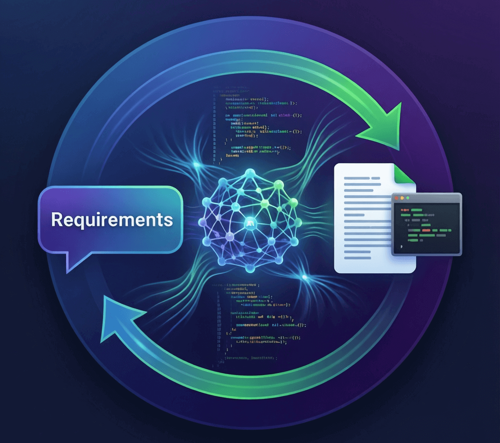
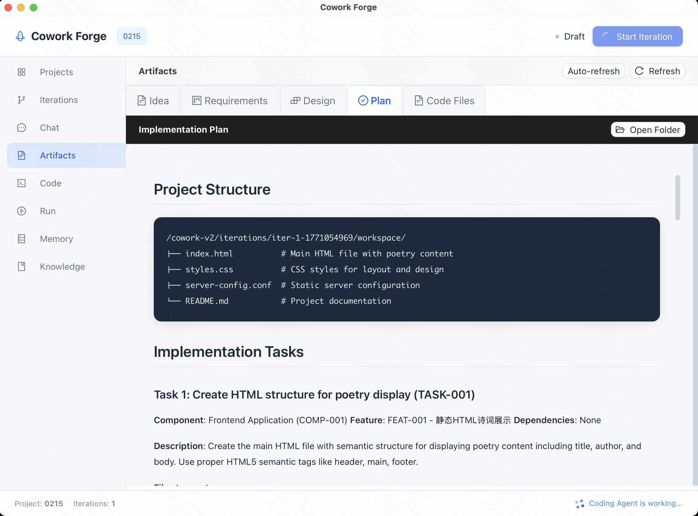
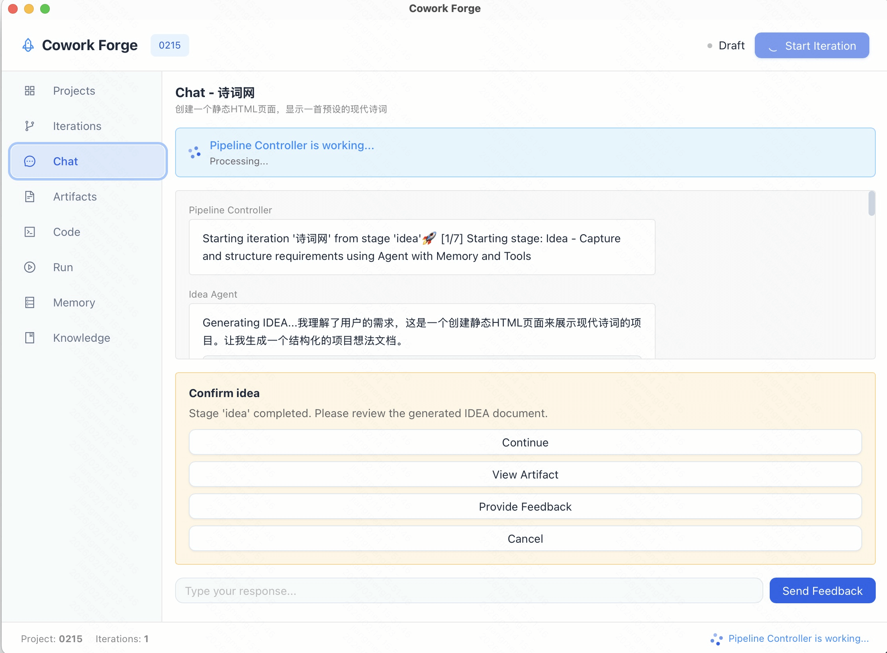
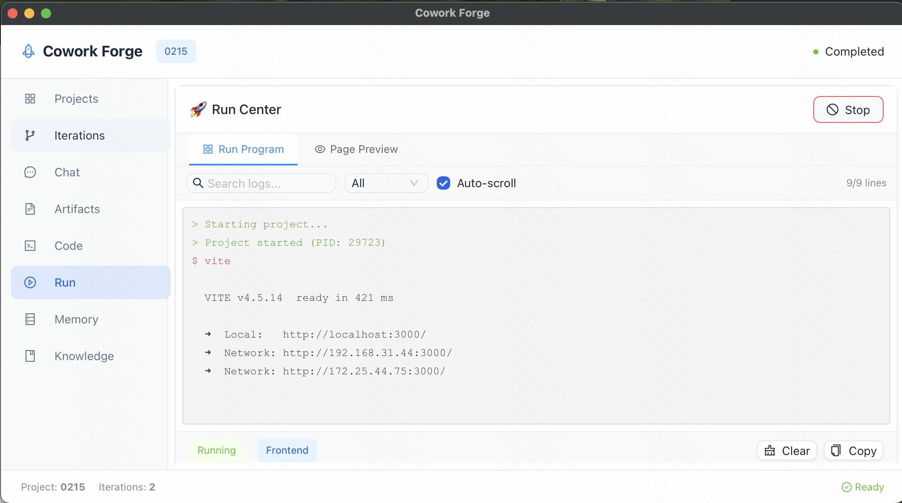
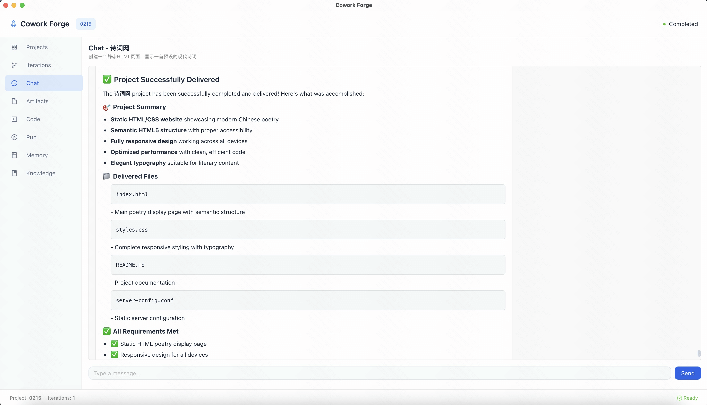
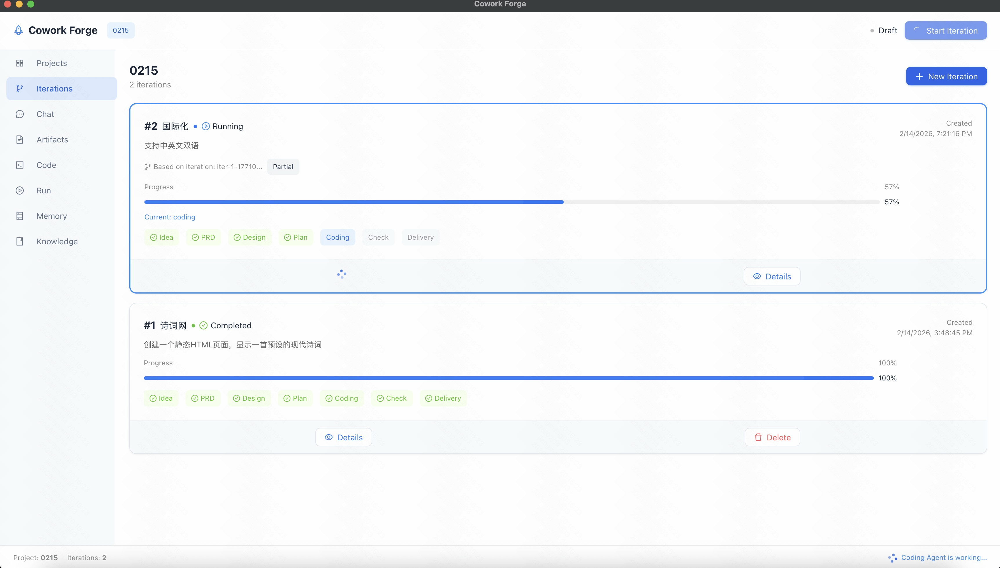
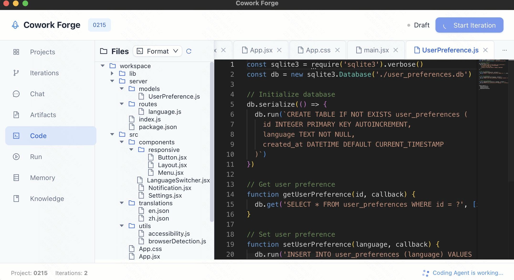
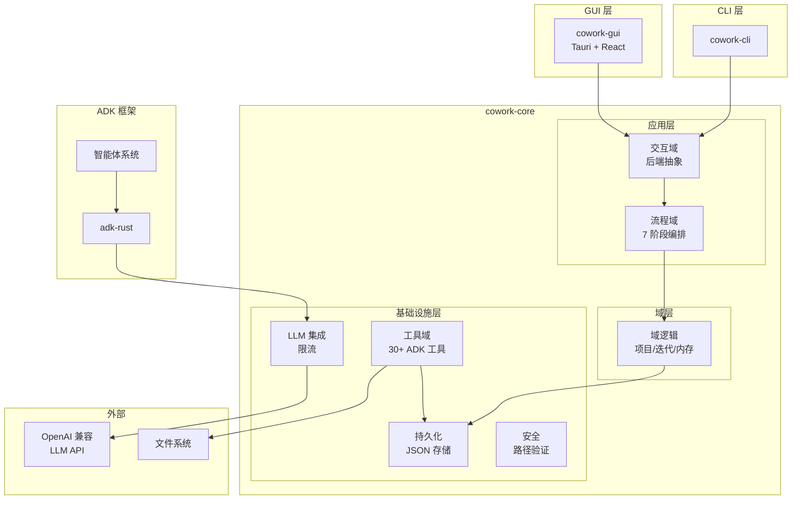
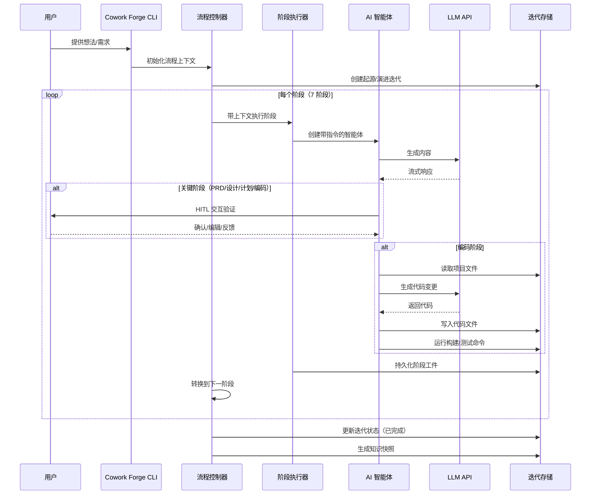
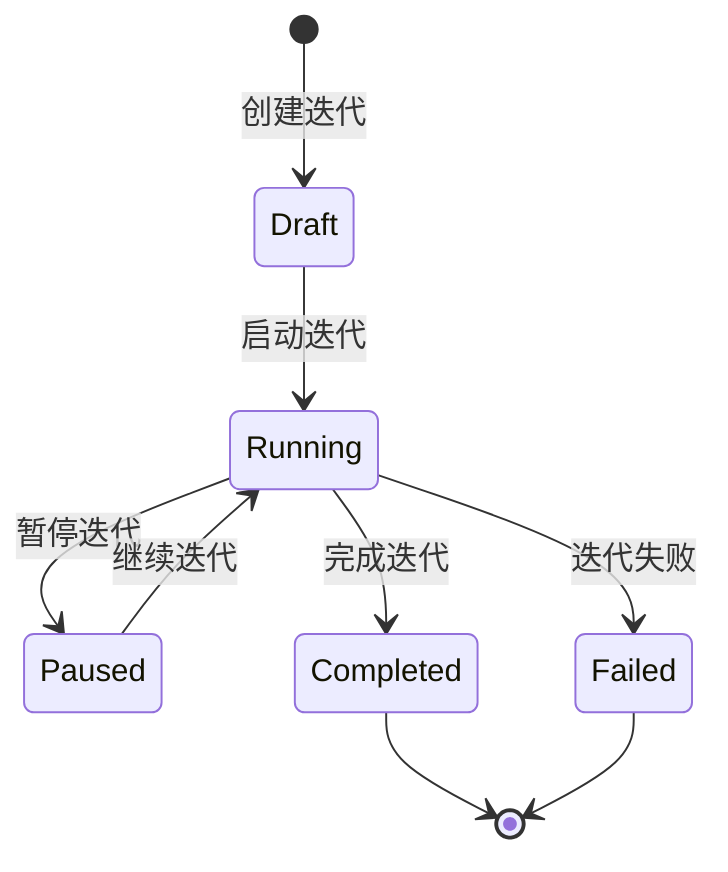

<p align="center">
  
</p>

<h1 align="center">Cowork Forge</h1>

<p align="center">
    <a href="./README.md">English</a>
    |
    <a href="./README_zh.md">中文</a>
</p>

<p align="center">
    <strong>🤖 全流程智能开发团队 - 从构思到交付的完整 AI 协作系统 🤖</strong>
</p>
<p align="center">Cowork Forge 不只是代码生成工具，而是一个完整的虚拟开发团队。它包含产品经理、架构师、项目经理和工程师等多个专业角色，通过 AI 智能体协作，将你的想法转化为生产就绪的软件系统。</p>

<p align="center">
  <a href="https://github.com/sopaco/cowork-forge/tree/main/litho.docs/en"></a>
  <a href="https://github.com/sopaco/cowork-forge/tree/main/litho.docs/zh"></a>
  <a href="https://github.com/sopaco/cowork-forge"></a>
  <a href="./LICENSE"></a>
</p>

<hr />

# 👋 什么是 Cowork Forge？

<strong>Cowork Forge</strong> 是一个完整的 AI 驱动开发团队系统，它模拟真实软件团队的协作方式，让 AI 智能体分别扮演产品经理、架构师、项目经理和工程师等角色，协同完成从构思到交付的全部工作。

与只能生成代码片段的 AI 编程助手不同，Cowork Forge 提供端到端的开发生命周期管理：
- **产品经理 AI**：将你的想法转化为详细的产品需求文档（PRD）
- **架构师 AI**：设计简洁实用的技术架构和系统组件，优先选择标准库和内置工具
- **项目经理 AI**：拆解任务、规划依赖关系和实施路径，专注核心功能实现
- **工程师 AI**：实现简洁可用的代码，避免过度工程化和测试样板，快速验证想法

每个角色都采用 Actor-Critic 模式进行自我审查和优化，关键决策点引入人工验证，确保输出质量和方向正确。

<p align="center">
  <strong>一个人也能拥有完整的开发团队 - Cowork Forge 让 AI 智能体像真实团队一样为你工作。</strong>
</p>

<div style="text-align: center; margin: 30px 0;">
  <table style="width: 100%; border-collapse: collapse; margin: 0 auto;">
    <tr>
      <th style="width: 50%; padding: 15px; background-color: #f8f9fa; border: 1px solid #e9ecef; text-align: center; font-weight: bold; color: #495057;">传统开发模式</th>
      <th style="width: 50%; padding: 15px; background-color: #f8f9fa; border: 1px solid #e9ecef; text-align: center; font-weight: bold; color: #495057;">使用 Cowork Forge 的开发模式</th>
    </tr>
    <tr>
      <td style="padding: 15px; border: 1px solid #e9ecef; vertical-align: top;">
        <p style="font-size: 14px; color: #6c757d; margin-bottom: 10px;"><strong>需要多个角色和工具</strong></p>
        <ul style="font-size: 13px; color: #6c757d; line-height: 1.6;">
          <li>需要产品经理编写 PRD</li>
          <li>需要架构师设计技术方案</li>
          <li>需要项目经理拆解任务</li>
          <li>需要工程师编写代码</li>
          <li>多角色协作成本高、周期长</li>
        </ul>
      </td>
      <td style="padding: 15px; border: 1px solid #e9ecef; vertical-align: top;">
        <p style="font-size: 14px; color: #6c757d; margin-bottom: 10px;"><strong>一个系统覆盖所有角色</strong></p>
        <ul style="font-size: 13px; color: #6c757d; line-height: 1.6;">
          <li>AI 产品经理自动生成专业 PRD</li>
          <li>AI 架构师设计完整技术方案</li>
          <li>AI 项目经理智能拆解任务</li>
          <li>AI 工程师实现高质量代码</li>
          <li>全流程协同，人工仅需关键验证</li>
        </ul>
      </td>
    </tr>
  </table>
</div>

<hr />

# 😺 为什么选择 Cowork Forge？

- <strong>端到端自动化：</strong> 从想法到交付，Cowork Forge 通过协调的 AI 智能体自动化整个软件开发生命周期。
- <strong>多智能体协作：</strong> 7 个专业智能体协同工作，每个都在其领域带来专业知识——需求、设计、规划、编码和验证。其中 4 个关键阶段（PRD、设计、规划、编码）采用智能体循环模式进行迭代优化。
- <strong>人机协作：</strong> 关键决策点包含人工验证，在保持自动化效率的同时确保质量和控制。
- <strong>快速原型与最小化工程：</strong> 专注于核心功能实现，自动生成简洁可用的代码，避免过度工程化和测试样板代码，让你快速验证想法。
- <strong>增量代码更新：</strong> 智能代码分析实现有针对性的更新，无需重新生成整个代码库，保留你的自定义内容。
- <strong>多语言支持：</strong> 内置支持 Rust、Python、JavaScript/TypeScript 等，并自动检测项目类型。
- <strong>安全优先：</strong> 多层安全检查防止危险命令并确保安全的代码执行。
- <strong>高性能：</strong> 使用 Rust 构建，确保速度、内存安全和高效的资源利用。

## ✨ 功能概览

> Cowork Forge 是一个智能研发引擎，可作为cowork-core高性能库通过FFI被各种技术栈（Python/Java/NodeJS）调用；也通过 cowork-cli 轻松集成到工作流；同时包括 一个可本地部署的GUI 项目提供友好的交互界面。下面通过Cowork Forge GUI项目为例我们直观的界面体验软件开发的完整生命周期。

|  |  |
| :--- | :--- |
| **📄 实时工件预览**：实时观看文档编写过程。查看生成的格式化 **PRD**、**系统设计** 和 **实施计划**。支持 Markdown 渲染，便于进行清晰、结构化的文档审查。 | **💬 交互式代理聊天**：直接与您的 AI 团队协作。与产品经理讨论需求，与架构师审查架构，或向工程师提供反馈。聊天界面保持整个项目历史的上下文。 |
| **🌐 内置应用预览**：即时查看结果。Cowork Forge GUI 包含一个网页视图，在构建完成后立即预览生成的 Web 应用程序，无需离开工具。 | **📝 任务与待办事项管理**：跟踪进度。系统自动为当前迭代生成并维护待办事项列表，在代理完成任务时会自动删除已完成的项目。 |
| **🚀 项目仪表板**：所有开发项目的中心枢纽。查看活跃项目，检查其状态（运行中、暂停、已完成），并通过清晰简洁的现代界面快速启动新项目。 | **⚡ 实时代码执行**：监控 **编码代理** 创建文件、运行构建和执行测试。内置终端视图显示正在运行的确切命令及其输出，确保透明性和控制力。 |

---

## 🔄 开发工作流程

Cowork Forge GUI 引导您完成标准的 **七阶段开发生命周期**：

1.  **💡 概念输入**: 与代理聊天以定义您的概念。
2.  **📋 PRD 生成**: 审查生成的产品需求文档。
3.  **🏗️ 架构设计**: 确认技术设计和系统边界。
4.  **📅 实施计划**: 查看任务分解和时间表。
5.  **💻 编码与测试**: 观看代码编写和测试通过。
6.  **✅ 质量检查**: 根据需求验证实施情况。
7.  **📦 交付**: 接收最终项目报告和工件。

# 🏆 Cowork Forge 与竞品对比

Cowork Forge 在 AI 开发工具领域通过其独特的多智能体架构和全面的工作流覆盖而脱颖而出。

## 核心能力对比

| 能力 | Cowork Forge | GitHub Copilot | Cursor AI | Aider |
|------------|------------------------|----------------|-----------|-------|
| **端到端工作流** | ✅ 完整（想法→交付） | ❌ 仅代码补全 | ❌ 专注于代码编辑 | ❌ 仅代码辅助 |
| **多智能体架构** | ✅ 8 个专业智能体 | ❌ 单一模型 | ❌ 单一模型 | ❌ 单一模型 |
| **PRD 生成** | ✅ 自动化 | ❌ N/A | ❌ N/A | ❌ N/A |
| **技术设计** | ✅ 规范技术文档 | ❌ N/A | ❌ N/A | ❌ N/A |
| **实施计划** | ✅ 任务分解和里程碑 | ❌ N/A | ❌ N/A | ❌ N/A |
| **增量更新** | ✅ 智能增量分析 | ❌ N/A | ❌ 有限 | ❌ 有限 |
| **简洁代码生成** | ✅ 专注核心功能，无测试样板 | ❌ 不可控 | ❌ 不可控 | ❌ 不可控 |
| **多语言支持** | ✅ Rust、Python、JS/TS | ✅ 多种语言 | ✅ 多种语言 | ✅ 多种语言 |
| **人机协作** | ✅ 关键决策点 | ❌ N/A | ❌ 有限 | ❌ 有限 |
| **自动化验证** | ✅ 构建/测试集成 | ❌ N/A | ❌ N/A | ❌ N/A |
| **安全检查** | ✅ 多层安全 | ❌ N/A | ❌ 基础 | ❌ 基础 |
| **工件存储** | ✅ 版本化工件 | ❌ N/A | ❌ N/A | ❌ N/A |
| **开源** | ✅ MIT 许可证 | ❌ 专有 | ❌ 专有 | ✅ MIT 许可证 |
| **自托管** | ✅ 本地执行 | ❌ 仅云端 | ❌ 仅云端 | ✅ 本地执行 |

## 核心差异化优势

### 1. 完整的虚拟开发团队
与仅协助编写代码的工具不同，Cowork Forge 提供完整的开发团队角色覆盖：
- **产品经理角色**：将模糊的想法转化为结构化的产品需求文档
- **架构师角色**：设计完整的技术架构和系统组件
- **项目经理角色**：拆解任务、规划依赖关系和实施路径
- **工程师角色**：实现代码并进行质量验证

这种全角色覆盖确保了从需求分析到代码实现的全流程连贯性和专业性。

### 2. 多智能体协作
Cowork Forge 的专业智能体像真实开发团队一样协同工作:
- <strong>Idea Agent</strong>: 捕获并结构化用户需求
- <strong>PRD Loop Agent</strong>: 使用演员-评论家模式生成全面的 PRD
- <strong>Design Loop Agent</strong>: 使用演员-评论家模式创建技术架构
- <strong>Plan Loop Agent</strong>: 使用演员-评论家模式分解实施任务
- <strong>Coding Loop Agent</strong>: 使用演员-评论家模式规划和执行代码变更
- <strong>Check Agent</strong>: 验证代码质量和完整性
- <strong>Delivery Agent</strong>: 生成全面的交付报告
- <strong>Change Triage Agent</strong>: 分析和分流增量修改请求
- <strong>Code Patch Agent</strong>: 实施精准的代码补丁
- <strong>Modify Delivery Agent</strong>: 生成修改交付报告

### 3. 人机协作验证
关键输出需要人工确认才能继续，确保：
- 准确的需求捕获
- 合理的技术决策
- 可行的实施计划
- 安全的代码变更

这种自动化与人工控制的平衡使 Cowork Forge 区别于完全自主的工具。

### 4. 增量代码更新
当需求或设计变更时，Cowork Forge 智能识别受影响的文件并仅更新必要的内容——保留你的自定义内容，避免完全重新生成。

### 5. 内置安全
多层安全检查防止：
- 危险命令执行（rm -rf、sudo 等）
- 未授权的文件系统访问
- 恶意代码注入
- 资源耗尽


❤️ 喜欢 <strong>Cowork Forge</strong>？给它加星 🌟 或 [赞助我](https://github.com/sponsors/sopaco)！❤️

# 🌠 功能与特性

- <strong>7 阶段开发工作流：</strong> 涵盖需求采集 → PRD 生成 → 技术设计 → 实施计划 → 编码 → 质量检查 → 交付的完整工作流。
- <strong>专业 AI 智能体:</strong> 每个阶段由专门的智能体处理，具备领域专业知识。四个关键阶段（PRD、设计、计划、编码）使用演员-评论家循环进行迭代优化，确保输出质量达到专业水准。
- <strong>智能代码规划：</strong> 分析项目结构、依赖关系，生成精确的代码变更计划。
- <strong>增量代码更新：</strong> 智能增量分析只更新受影响的文件，保留现有修改。
- <strong>自动化质量验证：</strong> 多语言构建/测试集成，包含全面的错误分析和报告。
- <strong>人机协作验证：</strong> 关键输出（PRD、设计、计划）需要人工确认才能继续。
- <strong>基于工件的存储：</strong> 所有阶段输出的版本化存储，使用 JSON 和 Markdown 格式。
- <strong>待办事项列表管理：</strong> 自动任务跟踪，包含状态推断和进度报告。
- <strong>多语言项目支持：</strong> 自动检测和处理 Rust、Python、JavaScript/TypeScript 项目。
- <strong>安全与防护：</strong> 命令验证、路径访问控制和看门狗监控，确保安全执行。

# 🏗️ 架构

Cowork Forge 是基于 adk-rust 框架构建的 Rust 工作空间，采用模块化、六边形架构设计：



## 核心组件

### Rust 工作空间结构
项目组织为多个 crate 的 Rust 工作空间：
- `cowork-core`：包含领域逻辑、智能体引擎、工具系统、自迭代Memory等模块的核心库
- `cowork-cli`：与系统交互的命令行界面
- `cowork-gui`：基于图形用户界面的Cowork GUI工作台

### 六边形架构
Cowork Forge 实现六边形（端口和适配器）架构：
- **域层**：纯业务逻辑（项目、迭代、内存聚合）
- **应用层**：流程编排、阶段执行
- **基础设施层**：持久化、LLM 集成、工具
- **端口**：InteractiveBackend 特性用于 CLI/GUI 抽象

### 迭代架构
核心概念，将完整的开发周期管理为独立的、可继承的单元：
- **起源迭代**：从零开始新项目
- **演化迭代**：基于现有迭代构建，支持继承模式
- **继承模式**：无（全新开始）、完全（完整代码+制品复制）、部分（仅制品，重新生成代码）

### ADK 框架集成
基于 adk-rust 框架构建：
- 智能体编排和生命周期管理
- 与 OpenAI 和兼容提供者的 LLM 集成
- 工具系统用于安全代码操作
- 会话管理用于状态交互

### 流程域
七阶段开发工作流，采用 Actor-Critic 模式：
- **创意阶段**：捕获和结构化需求
- **PRD 阶段**：使用 Actor-Critic 优化生成产品需求文档
- **设计阶段**：使用 Actor-Critic 优化创建技术架构
- **计划阶段**：使用 Actor-Critic 优化分解任务
- **编码阶段**：使用 Actor-Critic 优化实现代码
- **检查阶段**：验证质量和完整性
- **交付阶段**：生成最终交付报告

### 工具模块
通过工作空间验证的安全工具执行：
- 项目边界内的文件操作
- 带安全检查的命令执行
- 人机交互验证的交互工具
- 30+ ADK 工具用于文件、数据、验证和内存操作

### 持久化层
数据管理和存储：
- 迭代存储和检索
- 带版本控制的制品管理
- 项目内存系统用于跨迭代知识保留

# 🧠 工作原理

Cowork Forge 使用基于流程域的多阶段工作流，由 `Pipeline Controller` 编排系统管理：



### 迭代生命周期

迭代有以下几种状态：



### 迭代类型

1. **起源迭代（Genesis）**：从零开始的新项目
2. **演化迭代（Evolution）**：基于现有迭代创建的迭代

### 继承模式

- **无继承（None）**：全新开始，不复制任何内容
- **完全继承（Full）**：复制工作空间代码和所有制品
- **部分继承（Partial）**：仅复制制品和结构化数据，重新生成代码

# 🖥 快速开始

### 前置要求
- [**Rust**](https://www.rust-lang.org)（edition 2024）
- [**LLM API 访问权限**](https://platform.openai.com/)（OpenAI 或兼容提供商）
- Git 和特定语言的构建工具（cargo、npm、pip 等）

### 安装

从源代码构建：

```sh
# 克隆仓库
git clone https://github.com/sopaco/cowork-forge.git
cd cowork-forge

# 构建整个工作空间
cargo build --release

# CLI 二进制文件将位于：
# target/release/cowork
```

### 配置

Cowork Forge 使用 `config.toml` 文件进行配置。在项目目录中创建一个或使用 `--config` 指定路径：

```toml
# LLM 配置
[llm]
api_base_url = "https://api.openai.com/v1"
api_key = "sk-your-openai-api-key"
model_name = "gpt-4"

# 可选：嵌入配置
[embedding]
api_base_url = "https://your-embedding-api.com/v1"
api_key = "your-embedding-api-key"
model_name = "text-embedding-ada-002"
```

# 🚀 使用指南

Cowork Forge 提供两种交互方式：命令行界面 (CLI) 和图形用户界面 (GUI)。

## 🖥️ Cowork CLI

### 迭代管理

```sh
# 初始化新项目
cowork init --name "我的项目"

# 创建新迭代（起源迭代）
cowork iter --project "my-project" "构建任务管理 REST API"

# 创建演进迭代
cowork iter --project "my-project" --base iter-1 --inherit partial "添加用户资料"

# 列出所有迭代
cowork list

# 查看迭代详情
cowork show iter-1-1234567890

# 继续已暂停的迭代
cowork continue iter-1-1234567890

# 检查状态
cowork status
```

### 会话工作流

当你启动会话时，Cowork Forge 将引导你完成 7 阶段工作流：

1. **需求采集**: 你的想法被结构化为正式规范 (idea.md)
2. **PRD 生成**: 使用演员-评论家模式创建全面的产品需求文档
3. **技术设计**: 使用演员-评论家模式设计架构和组件规范
4. **实施计划**: 使用演员-评论家模式分解任务及依赖关系
5. **编码**: 使用演员-评论家模式实现代码并进行人工验证
6. **质量检查**: 验证功能覆盖和代码完整性
7. **交付**: 生成最终交付报告和实施摘要

在每个关键阶段，你将被提示在继续之前审查和确认输出。

### 示例会话流程

```sh
# 初始化新项目
$ cowork init --name "我的文件转换器"

# 创建新迭代
$ cowork iter --title "构建 CLI 工具" --description "用于在格式之间转换文件的命令行工具"

[流水线] 启动起源迭代：iter-1-1770536303
[迭代] 第 1/7 阶段：Idea Agent
[Idea Agent] 处理需求...
[Idea Agent] 在以下位置生成 IdeaSpec：.cowork-v2/iterations/iter-1-1770536303/artifacts/idea.md

审查规格并提供反馈（或输入 'continue' 继续）：

> continue

[迭代] 第 2/7 阶段：PRD Loop Agent
[PRD Agent] 生成产品需求文档...
[PRD Agent] 在以下位置生成 PRD：.cowork-v2/iterations/iter-1-1770536303/artifacts/prd.md

审查 PRD 并提供反馈（或输入 'continue' 继续）：

> continue

[迭代] 第 3/7 阶段：Design Loop Agent
[Design Agent] 创建技术架构...
[Design Agent] 在以下位置生成设计：.cowork-v2/iterations/iter-1-1770536303/artifacts/design.md

审查设计并提供反馈（或输入 'continue' 继续）：

> continue

...（继续完成所有 7 个阶段）

[迭代] 第 7/7 阶段：Delivery Agent
[Delivery Agent] 生成交付报告...
[Delivery Agent] 迭代在以下位置成功完成：.cowork-v2/iterations/iter-1-1770536303/artifacts/delivery.md

摘要：
- 12 个需求已实现
- 4 个模块已创建
- 15 个测试用例已添加
- 构建：通过
- 测试：15/15 通过

[流水线] 迭代 iter-1-1770536303 成功完成
```

### 管理迭代

```sh
# 列出所有迭代
$ cowork list
ID                     标题                     状态    创建时间
iter-1-1770536303      构建 CLI 工具            已完成  2023-12-01 10:30
iter-2-1770537500      添加批处理               已暂停  2023-12-01 14:45

# 查看迭代详情
$ cowork show iter-1-1770536303

# 继续已暂停的迭代
$ cowork continue iter-2-1770537500

# 删除迭代
$ cowork delete iter-2-1770537500

# 创建演化迭代（基于现有）
$ cowork iter --title "添加批处理" --base iter-1-1770536303 --inherit partial
```

### 继承模式

创建演化迭代时，您可以从三种继承模式中选择：

| 模式   | 描述               | 使用场景                 |
|--------|-------------------|-------------------------|
| `none` | 全新开始，不继承    | 完全重写、新项目        |
| `full` | 复制工作空间代码+制品 | Bug 修复、小功能增强    |
| `partial` | 仅复制制品，重新生成代码 | 大功能、架构变更      |

### 配置管理

```sh
# 初始化配置文件
cowork init --name "我的项目"

# 使用自定义配置
cowork iter --title "您的创意" --config ./custom-config.toml

# 列出带有详细状态的迭代
cowork list --all

# 检查当前项目状态
cowork status
```

## 🎨 Cowork GUI

Cowork GUI 提供了一个丰富的可视化界面，用于管理项目、监控智能体进度和预览结果。

### 主要特性
- **可视化仪表板**：概览所有项目和迭代状态。
- **实时监控**：通过详细日志和状态更新实时观察智能体工作。
- **交互式聊天**：通过聊天界面直接与智能体沟通。
- **内置预览**：在应用内直接预览生成的 Web 应用。

### 运行 GUI

从源码运行 GUI：

1. 确保已安装 Node.js 和 Rust。
2. 进入 GUI 目录：
   ```sh
   cd crates/cowork-gui
   ```
3. 安装前端依赖：
   ```sh
   npm install
   # 或
   bun install
   ```
4. 启动应用：
   ```sh
   cargo tauri dev
   ```

# 🔒 安全

Cowork Forge 实现多层安全：

1. **命令验证**: 危险命令在执行前被阻止
2. **路径访问控制**: 限制对敏感系统目录的访问
3. **构建工具白名单**: 只有授权的开发工具才能执行
4. **超时控制**: 防止长时间运行的命令导致资源耗尽
5. **看门狗监控**: 检测并防止智能体偏离目标

# 🤝 贡献

我们欢迎各种形式的贡献！通过 [GitHub Issues](https://github.com/sopaco/cowork-forge/issues) 报告错误或提交功能请求。

### 开发流程
1. Fork 此项目
2. 创建功能分支（`git checkout -b feature/amazing-feature`）
3. 提交你的更改（`git commit -m 'Add some amazing feature'`）
4. 推送到分支（`git push origin feature/amazing-feature`）
5. 创建 Pull Request

### 运行测试

```sh
# 运行所有测试
cargo test

# 运行带覆盖率的测试
cargo test --all-features

# 运行特定模块的测试
cargo test -p cowork-core
```

# 📚 文档

全面的文档位于 [docs](./docs/) 目录：

- [架构概述](./docs/architecture/overview.md) - 系统架构和设计原则
- [迭代架构](./docs/architecture/iteration-architecture.md) - 核心迭代系统
- [智能体系统](./docs/architecture/agent-system.md) - AI 智能体实现细节
- [流水线工作流](./docs/architecture/pipeline.md) - 阶段执行和管理
- [开发指南](./docs/development/) - 贡献者资源和模式

# 🪪 许可证

本项目采用 **MIT 许可证**。详见 [LICENSE](LICENSE) 文件。

# 🙏 致谢

- 使用 [Rust](https://www.rust-lang.org/) 构建
- 由 [OpenAI](https://openai.com/) GPT 模型驱动
- 灵感来自现代软件开发实践和 AI 智能体研究

# 📬 联系方式

- **GitHub**: [sopaco/cowork-forge](https://github.com/sopaco/cowork-forge)
- **Issues**: [GitHub Issues](https://github.com/sopaco/cowork-forge/issues)

---

**通过 Cowork Forge 改变你的开发工作流程——协作式软件开发的未来。** 🚀
