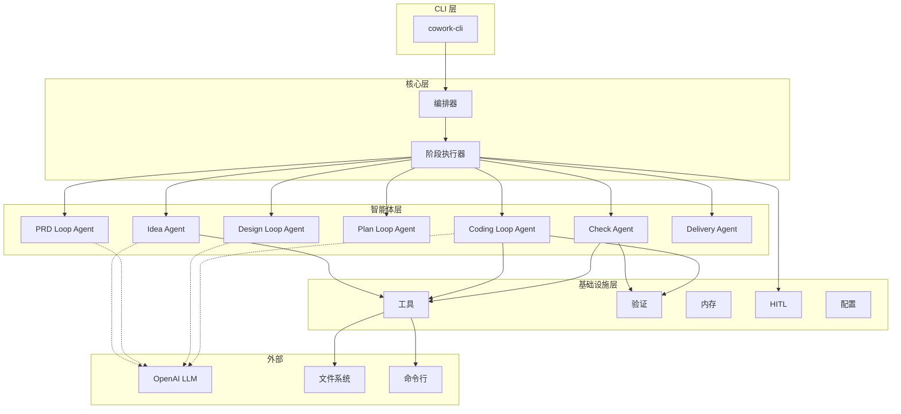

<p align="center">
  
</p>

<h1 align="center">Cowork Forge</h1>

<p align="center">
    <a href="./README.md">English</a>
    |
    <a href="./README_zh.md">中文</a>
</p>

<p align="center">
    <strong>🤖 全流程智能开发团队 - 从构思到交付的完整 AI 协作系统 🤖</strong>
</p>
<p align="center">Cowork Forge 不只是代码生成工具，而是一个完整的虚拟开发团队。它包含产品经理、架构师、项目经理和工程师等多个专业角色，通过 AI 智能体协作，将你的想法转化为生产就绪的软件系统。</p>

<p align="center">
  <a href="https://github.com/sopaco/cowork-forge/tree/main/litho.docs/en"></a>
  <a href="https://github.com/sopaco/cowork-forge/tree/main/litho.docs/zh"></a>
  <a href="https://github.com/sopaco/cowork-forge"></a>
  <a href="./LICENSE"></a>
</p>

<hr />

# 👋 什么是 Cowork Forge？

<strong>Cowork Forge</strong> 是一个完整的 AI 驱动开发团队系统，它模拟真实软件团队的协作方式，让 AI 智能体分别扮演产品经理、架构师、项目经理和工程师等角色，协同完成从构思到交付的全部工作。

与只能生成代码片段的 AI 编程助手不同，Cowork Forge 提供端到端的开发生命周期管理：
- **产品经理 AI**：将你的想法转化为详细的产品需求文档（PRD）
- **架构师 AI**：设计完整的技术架构和系统组件
- **项目经理 AI**：拆解任务、规划依赖关系和实施路径
- **工程师 AI**：实现代码、保证质量并生成交付报告

每个角色都采用 Actor-Critic 模式进行自我审查和优化，关键决策点引入人工验证，确保输出质量和方向正确。

<p align="center">
  <strong>一个人也能拥有完整的开发团队 - Cowork Forge 让 AI 智能体像真实团队一样为你工作。</strong>
</p>

<div style="text-align: center; margin: 30px 0;">
  <table style="width: 100%; border-collapse: collapse; margin: 0 auto;">
    <tr>
      <th style="width: 50%; padding: 15px; background-color: #f8f9fa; border: 1px solid #e9ecef; text-align: center; font-weight: bold; color: #495057;">传统开发模式</th>
      <th style="width: 50%; padding: 15px; background-color: #f8f9fa; border: 1px solid #e9ecef; text-align: center; font-weight: bold; color: #495057;">使用 Cowork Forge 的开发模式</th>
    </tr>
    <tr>
      <td style="padding: 15px; border: 1px solid #e9ecef; vertical-align: top;">
        <p style="font-size: 14px; color: #6c757d; margin-bottom: 10px;"><strong>需要多个角色和工具</strong></p>
        <ul style="font-size: 13px; color: #6c757d; line-height: 1.6;">
          <li>需要产品经理编写 PRD</li>
          <li>需要架构师设计技术方案</li>
          <li>需要项目经理拆解任务</li>
          <li>需要工程师编写代码</li>
          <li>多角色协作成本高、周期长</li>
        </ul>
      </td>
      <td style="padding: 15px; border: 1px solid #e9ecef; vertical-align: top;">
        <p style="font-size: 14px; color: #6c757d; margin-bottom: 10px;"><strong>一个系统覆盖所有角色</strong></p>
        <ul style="font-size: 13px; color: #6c757d; line-height: 1.6;">
          <li>AI 产品经理自动生成专业 PRD</li>
          <li>AI 架构师设计完整技术方案</li>
          <li>AI 项目经理智能拆解任务</li>
          <li>AI 工程师实现高质量代码</li>
          <li>全流程协同，人工仅需关键验证</li>
        </ul>
      </td>
    </tr>
  </table>
</div>

<hr />

# 😺 为什么选择 Cowork Forge？

- <strong>端到端自动化：</strong> 从想法到交付，Cowork Forge 通过协调的 AI 智能体自动化整个软件开发生命周期。
- <strong>多智能体协作：</strong> 7 个专业智能体协同工作，每个都在其领域带来专业知识——需求、设计、规划、编码和验证。其中 4 个关键阶段（PRD、设计、规划、编码）采用智能体循环模式进行迭代优化。
- <strong>人机协作：</strong> 关键决策点包含人工验证，在保持自动化效率的同时确保质量和控制。
- <strong>增量代码更新：</strong> 智能代码分析实现有针对性的更新，无需重新生成整个代码库，保留你的自定义内容。
- <strong>多语言支持：</strong> 内置支持 Rust、Python、JavaScript/TypeScript 等，并自动检测项目类型。
- <strong>安全优先：</strong> 多层安全检查防止危险命令并确保安全的代码执行。
- <strong>高性能：</strong> 使用 Rust 构建，确保速度、内存安全和高效的资源利用。

# 🏆 Cowork Forge 与竞品对比

Cowork Forge 在 AI 开发工具领域通过其独特的多智能体架构和全面的工作流覆盖而脱颖而出。

## 核心能力对比

| 能力 | Cowork Forge | GitHub Copilot | Cursor AI | Aider |
|------------|------------------------|----------------|-----------|-------|
| **端到端工作流** | ✅ 完整（想法→交付） | ❌ 仅代码补全 | ❌ 专注于代码编辑 | ❌ 仅代码辅助 |
| **多智能体架构** | ✅ 8 个专业智能体 | ❌ 单一模型 | ❌ 单一模型 | ❌ 单一模型 |
| **PRD 生成** | ✅ 自动化 | ❌ N/A | ❌ N/A | ❌ N/A |
| **技术设计** | ✅ C4 架构文档 | ❌ N/A | ❌ N/A | ❌ N/A |
| **实施计划** | ✅ 任务分解和里程碑 | ❌ N/A | ❌ N/A | ❌ N/A |
| **增量更新** | ✅ 智能增量分析 | ❌ N/A | ❌ 有限 | ❌ 有限 |
| **多语言支持** | ✅ Rust、Python、JS/TS | ✅ 多种语言 | ✅ 多种语言 | ✅ 多种语言 |
| **人机协作** | ✅ 关键决策点 | ❌ N/A | ❌ 有限 | ❌ 有限 |
| **自动化验证** | ✅ 构建/测试集成 | ❌ N/A | ❌ N/A | ❌ N/A |
| **安全检查** | ✅ 多层安全 | ❌ N/A | ❌ 基础 | ❌ 基础 |
| **工件存储** | ✅ 版本化工件 | ❌ N/A | ❌ N/A | ❌ N/A |
| **开源** | ✅ MIT 许可证 | ❌ 专有 | ❌ 专有 | ✅ MIT 许可证 |
| **自托管** | ✅ 本地执行 | ❌ 仅云端 | ❌ 仅云端 | ✅ 本地执行 |

## 核心差异化优势

### 1. 完整的虚拟开发团队
与仅协助编写代码的工具不同，Cowork Forge 提供完整的开发团队角色覆盖：
- **产品经理角色**：将模糊的想法转化为结构化的产品需求文档
- **架构师角色**：设计完整的技术架构和系统组件
- **项目经理角色**：拆解任务、规划依赖关系和实施路径
- **工程师角色**：实现代码并进行质量验证

这种全角色覆盖确保了从需求分析到代码实现的全流程连贯性和专业性。

### 2. 多智能体协作
Cowork Forge 的专业智能体像真实开发团队一样协同工作:
- <strong>Idea Agent</strong>: 捕获并结构化用户需求
- <strong>PRD Loop Agent</strong>: 使用演员-评论家模式生成全面的 PRD
- <strong>Design Loop Agent</strong>: 使用演员-评论家模式创建技术架构
- <strong>Plan Loop Agent</strong>: 使用演员-评论家模式分解实施任务
- <strong>Coding Loop Agent</strong>: 使用演员-评论家模式规划和执行代码变更
- <strong>Check Agent</strong>: 验证代码质量和完整性
- <strong>Delivery Agent</strong>: 生成全面的交付报告
- <strong>Modify Agent</strong>: 分析和处理增量修改请求
- <strong>Code Patch Agent</strong>: 实施精准的代码补丁
- <strong>Modify Delivery Agent</strong>: 生成修改交付报告

### 3. 人机协作验证
关键输出需要人工确认才能继续，确保：
- 准确的需求捕获
- 合理的技术决策
- 可行的实施计划
- 安全的代码变更

这种自动化与人工控制的平衡使 Cowork Forge 区别于完全自主的工具。

### 4. 增量代码更新
当需求或设计变更时，Cowork Forge 智能识别受影响的文件并仅更新必要的内容——保留你的自定义内容，避免完全重新生成。

### 5. 内置安全
多层安全检查防止：
- 危险命令执行（rm -rf、sudo 等）
- 未授权的文件系统访问
- 恶意代码注入
- 资源耗尽


❤️ 喜欢 <strong>Cowork Forge</strong>？给它加星 🌟 或 [赞助我](https://github.com/sponsors/sopaco)！❤️

# 🌠 功能与特性

- <strong>7 阶段开发工作流：</strong> 涵盖需求采集 → PRD 生成 → 技术设计 → 实施计划 → 编码 → 质量检查 → 交付的完整工作流。
- <strong>专业 AI 智能体:</strong> 每个阶段由专门的智能体处理，具备领域专业知识。四个关键阶段（PRD、设计、计划、编码）使用演员-评论家循环进行迭代优化，确保输出质量达到专业水准。
- <strong>智能代码规划：</strong> 分析项目结构、依赖关系，生成精确的代码变更计划。
- <strong>增量代码更新：</strong> 智能增量分析只更新受影响的文件，保留现有修改。
- <strong>自动化质量验证：</strong> 多语言构建/测试集成，包含全面的错误分析和报告。
- <strong>人机协作验证：</strong> 关键输出（PRD、设计、计划）需要人工确认才能继续。
- <strong>基于工件的存储：</strong> 所有阶段输出的版本化存储，使用 JSON 和 Markdown 格式。
- <strong>待办事项列表管理：</strong> 自动任务跟踪，包含状态推断和进度报告。
- <strong>多语言项目支持：</strong> 自动检测和处理 Rust、Python、JavaScript/TypeScript 项目。
- <strong>安全与防护：</strong> 命令验证、路径访问控制和看门狗监控，确保安全执行。

# 🏗️ 架构

Cowork Forge 采用模块化、领域驱动的架构构建：



## 核心组件

### 管道编排器
管理会话生命周期、阶段依赖和工作流执行，支持完整流程和部分流程的灵活组装。

### AI 智能体
专业智能体协同工作，每个负责开发生命周期的特定阶段。其中 4 个智能体（PRD、设计、规划、编码）使用演员-评论家循环模式进行迭代优化和人类反馈整合。包括：Idea、PRD、Design、Plan、Coding、Check、Delivery、Modify、CodePatch、ModifyDelivery。

### 提示词模板
为每个智能体提供专门的指令模板，定义其行为和输出格式。

### 工具模块
安全的文件操作和命令执行，包含安全检查和资源限制。

### LLM 集成层
管理与大语言模型的交互，包括速率限制、API 客户端和请求优化。

### 数据模块
定义系统的数据模型和会话管理机制。

### 存储模块
提供持久化数据管理和检索能力。

# 🧠 工作原理

Cowork Forge 使用由 `Orchestrator` 编排的复杂多阶段工作流：


# 🖥 快速开始

### 前置要求
- [**Rust**](https://www.rust-lang.org)（版本 1.70 或更高）
- [**OpenAI API 密钥**](https://platform.openai.com/) 用于 LLM 访问
- Git 和语言特定的构建工具（cargo、npm、pip 等）

### 安装

从源代码构建：

```sh
# 克隆仓库
git clone https://github.com/sopaco/cowork-forge.git
cd cowork-forge

# 构建项目
cargo build --release

# CLI 二进制文件将位于：
# target/release/cowork
```

### 配置

Cowork Forge 使用 `config.toml` 文件进行配置。在项目目录中创建一个或使用 `--config` 指定路径：

```toml
# LLM 配置
[llm]
api_base_url = "https://api.openai.com/v1"
api_key = "sk-your-openai-api-key"
model_name = "gpt-5-codex"
```

# 🚀 使用

### 启动新的开发会话

```sh
# 使用想法启动新项目
cowork new "构建任务管理应用的 REST API"

# 使用配置文件启动
cowork new "创建 Web 仪表板" --config ./config.toml

# 恢复现有项目
cowork resume
```

### 会话工作流

当你启动会话时，Cowork Forge 将引导你完成 7 阶段工作流：

1. **需求采集**: 你的想法被结构化为正式规范 (idea.md)
2. **PRD 生成**: 使用演员-评论家模式创建全面的产品需求文档
3. **技术设计**: 使用演员-评论家模式设计架构和组件规范
4. **实施计划**: 使用演员-评论家模式分解任务及依赖关系
5. **编码**: 使用演员-评论家模式实现代码并进行人工验证
6. **质量检查**: 验证功能覆盖和代码完整性
7. **交付**: 生成最终交付报告和实施摘要

在每个关键阶段，你将被提示在继续之前审查和确认输出。

### 示例会话流程

```sh
$ cowork new "构建文件转换的 CLI 工具"

[阶段 1/7] Idea Agent
正在分析你的需求...
生成的需求规格: "用于在格式之间转换文件的命令行工具"

你想要：
  [1] 接受并继续
  [2] 编辑规范
  [3] 重新生成
> 1

[阶段 2/7] PRD 生成智能体
正在生成产品需求文档...
创建了包含 12 个需求和 5 个用户故事的 PRD

在以下位置审查 PRD: .cowork/artifacts/session-001/prd.md
你想要：
  [1] 接受并继续
  [2] 编辑 PRD
  [3] 重新生成
> 1

[阶段 3/7] 设计智能体
正在创建技术架构...
生成了 C4 系统上下文和容器图

在以下位置审查设计: .cowork/artifacts/session-001/design.md
你想要：
  [1] 接受并继续
  [2] 编辑设计
  [3] 重新生成
> 1

... （继续完成所有 7 个阶段）

[交付] 会话完成！
交付报告: .cowork/artifacts/session-001/delivery.md

摘要:
- 12 个需求已实现
- 4 个模块已创建
- 15 个测试用例已添加
- 构建: 通过
- 测试: 15/15 通过
```

### 管理项目

```sh
# 查看项目状态
cowork status

# 从特定阶段修改
cowork modify --from prd
cowork modify --from design
cowork modify --from plan
cowork modify --from coding
```

### 配置管理

```sh
# 初始化配置文件
cowork init

# 使用详细日志
cowork new "你的想法" --verbose

# 启用 LLM 流式输出
cowork new "你的想法" --stream
```

# 🔒 安全

Cowork Forge 实现多层安全：

1. **命令验证**: 危险命令在执行前被阻止
2. **路径访问控制**: 限制对敏感系统目录的访问
3. **构建工具白名单**: 只有授权的开发工具才能执行
4. **超时控制**: 防止长时间运行的命令导致资源耗尽
5. **看门狗监控**: 检测并防止智能体偏离目标

# 🤝 贡献

我们欢迎各种形式的贡献！通过 [GitHub Issues](https://github.com/sopaco/cowork-forge/issues) 报告错误或提交功能请求。

### 开发流程
1. Fork 此项目
2. 创建功能分支（`git checkout -b feature/amazing-feature`）
3. 提交你的更改（`git commit -m 'Add some amazing feature'`）
4. 推送到分支（`git push origin feature/amazing-feature`）
5. 创建 Pull Request

### 运行测试

```sh
# 运行所有测试
cargo test

# 运行带覆盖率的测试
cargo test --all-features

# 运行特定模块的测试
cargo test -p cowork-core
```

# 📚 文档

全面的文档可在 [litho.docs](./litho.docs/) 目录中找到：

- [项目概述](./litho.docs/1、项目概述.md) - 系统上下文和架构
- [架构概述](./litho.docs/2、架构概览.md) - 详细的架构文档
- [核心工作流](./litho.docs/3、工作流程.md) - 工作流和流程文档
- [领域模块](./litho.docs/4、深入探索/) - 深入的领域分析

# 🪪 许可证

本项目采用 **MIT 许可证**。详见 [LICENSE](LICENSE) 文件。

# 🙏 致谢

- 使用 [Rust](https://www.rust-lang.org/) 构建
- 由 [OpenAI](https://openai.com/) GPT 模型驱动
- 灵感来自现代软件开发实践和 AI 智能体研究

# 📬 联系方式

- **GitHub**: [sopaco/cowork-forge](https://github.com/sopaco/cowork-forge)
- **Issues**: [GitHub Issues](https://github.com/sopaco/cowork-forge/issues)

---

**通过 Cowork Forge 改变你的开发工作流程——协作式软件开发的未来。** 🚀
