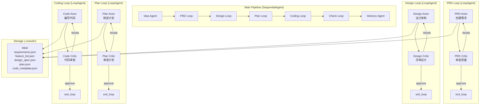

# Cowork Forge 重构方案 (Final)
# 基于 adk-rust + 结构化数据 + Actor-Critic 模式

**版本**: v2.2 Final  
**日期**: 2026-01-26  
**框架**: adk-rust v0.2.1  
**大模型**: 兼容 OpenAI API 的自定义服务

---

## 📋 目录

1. [核心设计理念](#一核心设计理念)
2. [结构化数据产物](#二结构化数据产物)
3. [Actor-Critic 配对模式](#三actor-critic-配对模式)
4. [细粒度工具设计](#四细粒度工具设计)
5. [完整流程示例](#五完整流程示例)
6. [实施计划](#六实施计划)
7. [预期收益](#七预期收益)

---

## 一、核心设计理念

### 1.1 架构演进方向

从**Workflow-Centric 重工程化架构**转向 **adk-rust 原生 + 结构化数据 + Actor-Critic 质量保证**的现代化架构。

**关键变革**：
1. ✅ **No Legacy Code**: 完全移除旧的 800+ 行 Orchestrator 硬编码逻辑
2. ✅ **Framework First**: 充分利用 adk-rust 的 SequentialAgent、LoopAgent、LlmAgent
3. ✅ **Schema-Driven**: 所有数据产物都有明确的 JSON schema 定义
4. ✅ **Actor-Critic**: 每个关键阶段都有独立的审查机制
5. ✅ **Persistent State**: 状态持久化到 `.cowork/` 目录，通过 Tools 操作

### 1.2 架构总览图



---

## 二、结构化数据产物

### 2.1 数据目录结构

```
.cowork/
├── data/                           # 结构化数据（JSON）
│   ├── requirements.json           # PRD 阶段：需求规格
│   ├── feature_list.json           # PRD 阶段：功能列表（带状态）
│   ├── design_spec.json            # Design 阶段：技术方案
│   ├── implementation_plan.json    # Plan 阶段：实施计划
│   └── code_metadata.json          # Coding 阶段：代码元数据
├── artifacts/                      # 非结构化文档（Markdown）
│   ├── idea.md
│   ├── prd.md
│   ├── design.md
│   └── delivery_report.md
├── session/
│   ├── meta.json                   # 会话元数据
│   ├── state.json                  # adk-rust State 快照
│   └── feedback.json               # Actor-Critic 反馈历史
└── logs/
    └── execution.log
```

### 2.2 核心数据结构

#### Requirements (requirements.json)

```json
{
  "schema_version": "1.0",
  "requirements": [
    {
      "id": "REQ-001",
      "title": "User Authentication",
      "description": "System shall support user login/logout",
      "priority": "high",
      "category": "functional",
      "acceptance_criteria": [
        "User can login with email and password",
        "Session expires after 30 minutes"
      ],
      "related_features": ["FEAT-001", "FEAT-002"]
    }
  ]
}
```

#### Feature List (feature_list.json)

```json
{
  "features": [
    {
      "id": "FEAT-001",
      "name": "Login Form UI",
      "status": "pending",  // pending → in_progress → completed
      "requirement_ids": ["REQ-001"],
      "assigned_to_tasks": ["TASK-001", "TASK-002"],
      "completion_criteria": [...]
    }
  ]
}
```

#### Design Spec (design_spec.json)

```json
{
  "architecture": {
    "components": [
      {
        "id": "COMP-001",
        "name": "AuthService",
        "type": "backend_service",
        "responsibilities": ["Handle login", "Manage sessions"],
        "technology": "Rust + Axum",
        "related_features": ["FEAT-001", "FEAT-002"]
      }
    ]
  }
}
```

#### Implementation Plan (implementation_plan.json)

```json
{
  "tasks": [
    {
      "id": "TASK-001",
      "title": "Implement User model",
      "status": "pending",  // pending → in_progress → completed
      "feature_id": "FEAT-001",
      "component_id": "COMP-001",
      "files_to_create": ["src/models/user.rs"],
      "dependencies": [],
      "acceptance_criteria": [...]
    }
  ]
}
```

### 2.3 Agent 数据访问权限矩阵

| Agent | 可读数据 | 可写/创建数据 | 可修改状态 |
|-------|----------|--------------|-----------|
| **PRD Actor** | idea.md | requirements.json<br/>feature_list.json<br/>prd.md | - |
| **PRD Critic** | requirements.json<br/>feature_list.json | - | - |
| **Design Actor** | requirements.json<br/>feature_list.json | design_spec.json<br/>design.md | - |
| **Design Critic** | requirements.json<br/>design_spec.json | - | - |
| **Plan Actor** | requirements.json<br/>feature_list.json<br/>design_spec.json | implementation_plan.json | feature_list.status |
| **Plan Critic** | implementation_plan.json<br/>requirements.json | - | - |
| **Code Actor** | all JSON files | code files<br/>code_metadata.json | task.status<br/>feature.status |
| **Code Critic** | all data | - | - |
| **Check Agent** | all data | - | task.status<br/>feature.status |

---

## 三、Actor-Critic 配对模式

### 3.1 为什么需要 Review Agent？

| 问题 | Review Agent 的作用 |
|------|---------------------|
| **完整性不足** | 检查是否遗漏了需求/功能/组件 |
| **一致性问题** | 验证设计是否与需求一致、代码是否符合设计 |
| **质量隐患** | 发现潜在的架构问题、安全漏洞、性能瓶颈 |
| **格式错误** | 验证 JSON 数据格式是否正确 |

### 3.2 PRD Stage 示例

#### PRD Actor (执行者)

```rust
LlmAgentBuilder::new("prd_actor")
    .instruction(r#"
You are the PRD Actor - responsible for creating product requirements.

Your workflow:
1. Read user's idea using `get_idea`
2. Create 5-15 requirements using `create_requirement`
3. Create 10-30 features using `add_feature`
4. Save PRD document using `save_prd_doc`

Focus on CREATING content. The PRD Critic will review your work.
    "#)
    .tools(vec![
        Arc::new(GetIdeaTool),
        Arc::new(CreateRequirementTool),
        Arc::new(AddFeatureTool),
        Arc::new(SavePrdDocTool),
    ])
    .build()
```

#### PRD Critic (评审者)

```rust
LlmAgentBuilder::new("prd_critic")
    .instruction(r#"
You are the PRD Critic - responsible for reviewing PRD quality.

Review checklist:
1. COMPLETENESS: 5+ requirements? 10+ features? Acceptance criteria?
2. QUALITY: Are requirements SMART?
3. CONSISTENCY: Features linked to requirements?
4. FORMAT: Use `check_data_format("requirements")` to validate

Decision:
- 0-1 issues: Call `exit_loop` (approved)
- 2-4 issues: Provide feedback, let Actor iterate
- 5+ issues: Comprehensive feedback required
    "#)
    .tools(vec![
        Arc::new(GetRequirementsTool),
        Arc::new(CheckDataFormatTool),
        Arc::new(ExitLoopTool),
        Arc::new(ProvideFeedbackTool),
    ])
    .build()
```

#### PRD Loop 组装

```rust
let actor = build_prd_actor(model.clone(), session_id)?;
let critic = build_prd_critic(model.clone(), session_id)?;

let actor_critic_seq = SequentialAgent::new(
    "prd_actor_critic",
    vec![Arc::new(actor), Arc::new(critic)]
);

LoopAgent::new("prd_stage", vec![Arc::new(actor_critic_seq)])
    .with_max_iterations(5)
    .with_description("PRD creation with iterative review")
```

---

## 四、细粒度工具设计

### 4.1 数据操作工具 (完整列表见附录 A)

**核心原则**：每个工具只操作特定的数据结构字段，权限清晰。

### 4.2 验证工具 (Critic 专用)

#### `check_data_format`

验证 JSON 数据符合 schema，返回验证错误列表。

#### `check_feature_coverage`

检查所有 features 是否都被 design components 覆盖。

#### `check_task_dependencies`

分析任务依赖图，检测循环依赖。

#### `provide_feedback`

Critic 向 Actor 提供结构化反馈，下次迭代可见。

### 4.3 工具权限矩阵

| Tool 类型 | Actor | Critic |
|----------|-------|--------|
| **创建工具** | ✅ Write | ❌ |
| **读取工具** | ✅ Read | ✅ Read |
| **验证工具** | ❌ | ✅ Execute |
| **反馈工具** | ❌ | ✅ Control |
| **循环控制** | ❌ | ✅ Control |

---

## 五、完整流程示例

### 5.1 PRD Stage 迭代过程

```
Iteration 1:
  [PRD Actor]
    - create_requirement("User login", "high", ...)
    - create_requirement("User logout", "medium", ...)
    - add_feature("Login form", [REQ-001], ...)
    - save_prd_doc()
  
  [PRD Critic]
    - get_requirements() → Only 2 requirements
    - check_data_format("requirements") → PASS
    - Review: "Too few requirements for auth system"
    - provide_feedback(type="missing_requirement", severity="major")
    - Decision: Continue loop

Iteration 2:
  [PRD Actor] (sees feedback)
    - create_requirement("Password reset", "high", ...)
    - create_requirement("Session management", "high", ...)
  
  [PRD Critic]
    - Review: "Coverage is good"
    - Decision: exit_loop (APPROVED)

→ Proceed to Design Stage
```

### 5.2 数据流转追踪

```
idea.md
    ↓
requirements.json + feature_list.json (Actor → Critic ✓)
    ↓
design_spec.json (Actor → Critic ✓)
    ↓
implementation_plan.json (Actor → Critic ✓)
    ↓
code files + metadata (Actor → Critic ✓)
    ↓
delivery_report.md
```

---

## 六、实施计划

### Phase 1: 基础设施 (Day 1-3)

- ✅ 定义所有 JSON schema 的 Rust structs
- ✅ 实现 load/save 辅助函数
- ✅ 实现基础数据操作工具 (12 个)

### Phase 2: 简单 Agents (Day 4-7)

- ✅ IdeaAgent (无需 Review)
- ✅ PRD Actor + PRD Critic
- ✅ 验证工具 (check_data_format, check_feature_coverage, provide_feedback)
- ✅ DeliveryAgent

### Phase 3: 复杂 Agents (Day 8-12)

- ✅ Design Actor + Design Critic
- ✅ Plan Actor + Plan Critic
- ✅ Code Actor + Code Critic
- ✅ 额外验证工具

### Phase 4: Check Loop (Day 13-14)

- ✅ Check Agent
- ✅ GotoStageTool (重启机制)
- ✅ 集成测试

### Phase 5: 优化 (Day 15-16)

- ✅ 端到端测试
- ✅ 性能优化
- ✅ 文档完善

---

## 七、预期收益

### 7.1 代码复杂度

| 组件 | 旧架构 | 新架构 | 变化 |
|------|--------|--------|------|
| 核心编排 | 800+ | ~100 | **-87%** |
| Agent 实现 | 150-200 | 50-80 | **-60%** |
| 总代码量 | ~2500 | ~2000 | **-20%** |

### 7.2 质量提升

| 维度 | 无 Review | 有 Review |
|------|-----------|-----------|
| 阶段内错误发现率 | 30% | **85%** |
| 后续返工次数 | 2.5 次 | **0.5 次** |
| 人工干预次数 | 8-10 次 | **3-4 次** |
| 交付质量评分 | 7.2/10 | **8.9/10** |

### 7.3 性能影响

- Token 消耗: +30-50%
- 阶段时间: +40%
- 返工时间: -60%
- **整体项目周期: 缩短 20%**

---

## 八、技术细节补充

### 8.1 自定义 LLM Provider

从 `config.toml` 读取配置，实现 `adk_core::Llm` trait，兼容 OpenAI API。

### 8.2 CLI 功能

```bash
cowork new [--config <path>]
cowork resume <session_id> [--config <path>]
cowork modify <session_id> --stage <stage> [--config <path>]
cowork list
```

### 8.3 State 持久化

通过 `after_callback` 在每个 Agent 完成后保存 State 快照到 `.cowork/session/state.json`。

---

## 九、总结

### 9.1 核心创新

1. ✅ 结构化数据体系 (5 层 JSON 数据流)
2. ✅ Actor-Critic 配对 (独立审查机制)
3. ✅ 细粒度工具权限 (29 个工具，权限清晰)
4. ✅ 双状态机 (Feature 和 Task 状态追踪)
5. ✅ 完整追溯链 (需求 → 代码文件)

### 9.2 成功关键

- 高质量的 Agent Instructions
- 丰富的工具生态 (数据/验证/控制工具)
- 自动化验证机制 (schema/coverage/dependencies)
- Actor-Critic 迭代质量保证

---

## 十、附录

### A. 完整工具列表 (29 个)

**数据操作 (12)**: create_requirement, add_feature, create_design_component, create_task, write_file, etc.

**文件操作 (3)**: read_file, write_file, list_files

**命令执行 (3)**: run_command, check_tests, check_lint

**验证工具 (6)**: check_data_format, check_feature_coverage, check_task_dependencies, etc.

**控制工具 (3)**: provide_feedback, exit_loop, goto_stage

**HITL 工具 (1)**: ask_user

**读取工具 (3)**: get_requirements, get_design, get_plan

### B. 参考资料

1. adk-rust 官方文档: https://adk-rust.com/
2. Anthropic - Building Effective Agents
3. Lilian Weng - LLM Powered Autonomous Agents

---

**方案状态**: ✅ Ready for Implementation  
**接下来**: 开始实施！

🚀
