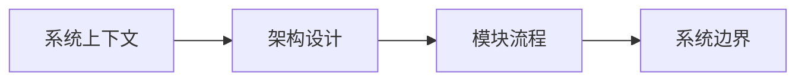

# Cowork Forge 技术文档索引

## 文档概述

本技术文档库采用 C4 模型（Context、Container、Component、Code）组织，全面阐述 Cowork Forge 的系统架构、技术设计和实现细节。文档适用于开发团队成员、架构师和技术决策者，帮助理解系统设计理念和实现方案。

## 文档清单

| 文档 | 层级 | 内容描述 |
|------|------|----------|
| [系统上下文](c01-context.md) | C1 | 系统概览、用户故事、技术栈和核心概念 |
| [架构设计](c02-architecture.md) | C2 | 总体架构、组件关系、部署模型和技术选型 |
| [模块与功能流程](c03-modules.md) | C3 | 核心模块详解、迭代执行流程和数据流 |
| [系统边界](c04-boundaries.md) | C4 | 边界定义、安全约束和接口规范 |
| [重点子系统技术方案](c05-subsystems.md) | 详细设计 | 六大子系统的详细设计和实现 |

## 阅读路径

### 新成员入门

推荐按照文档顺序阅读，从宏观到微观逐步理解系统全貌。

### 特定问题排查

| 问题类型 | 推荐文档 |
|----------|----------|
| 了解系统定位和用户价值 | 系统上下文 |
| 理解组件关系和技术选型 | 架构设计 |
| 修改或扩展功能 | 模块与功能流程 |
| 安全审计和接口对接 | 系统边界 |
| 深度理解核心模块实现 | 重点子系统技术方案 |

## 核心概念速查

### 迭代阶段

Cowork Forge 采用七阶段迭代模型：

1. **Idea** - 需求分析和创意生成
2. **PRD** - 产品需求文档编写
3. **Design** - 技术方案设计
4. **Plan** - 实现计划制定
5. **Coding** - 代码生成和实现
6. **Check** - 代码检查和验证
7. **Delivery** - 成果整理和交付

### 关键子系统

- **AI 智能体系统**：基于 Actor-Critic 模式的多智能体协作
- **迭代流水线**：七阶段流水线的编排和执行
- **工具系统**：文件操作、命令执行、代码分析等能力
- **项目运行系统**：开发服务器的启动和管理
- **持久化系统**：迭代数据和项目记忆的存储
- **LLM 集成层**：统一的大语言模型调用接口

## 版本信息

| 项目 | 说明 |
|------|------|
| 当前版本 | v2.0 |
| 文档更新日期 | 2026年2月 |
| 技术栈 | Rust + Tauri 2.x + React |
