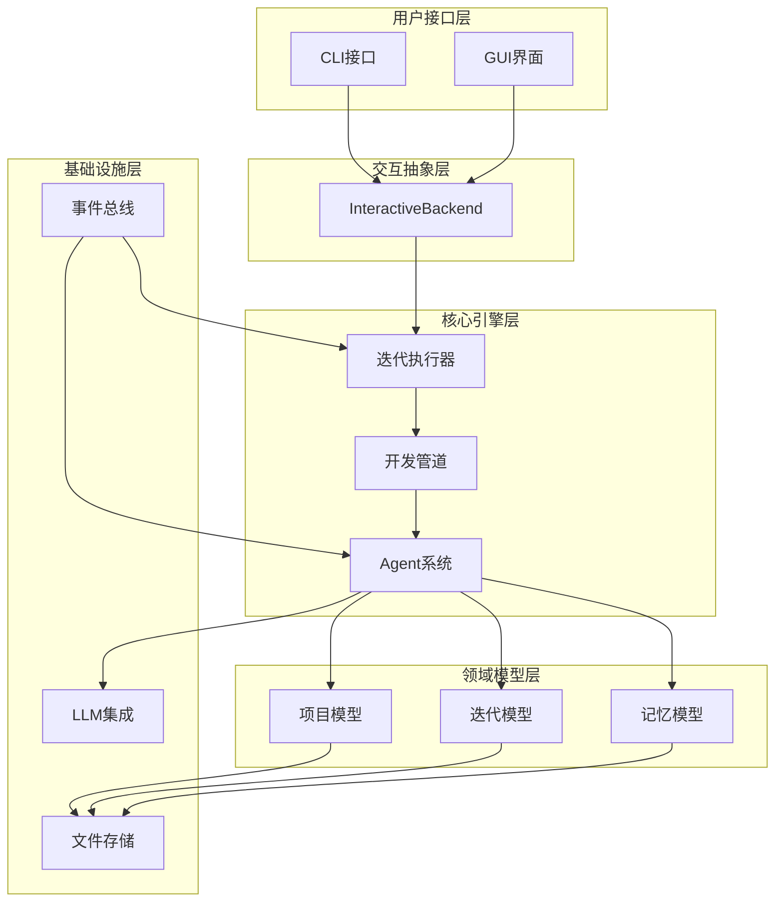

# 架构设计文档

本目录包含 Cowork Forge 系统的架构设计文档，详细介绍了系统的整体架构、设计原理和关键组件。

## 文档列表

- [整体架构](./overview.md) - 系统整体架构和设计理念
- [领域模型](./domain-model.md) - 核心领域模型和业务实体
- [迭代架构](./iteration-architecture.md) - 迭代驱动的开发架构
- [Agent系统](./agent-system.md) - Agent协作机制和角色分工
- [人机交互](./hitl.md) - 人机协作和交互设计
- [记忆系统](./memory-system.md) - 项目记忆和知识沉淀机制
- [事件系统](./event-system.md) - 事件驱动架构和通信机制
- [存储设计](./storage-design.md) - 数据持久化和存储策略
- [扩展性设计](./extensibility.md) - 系统扩展性和插件机制

## 架构图

