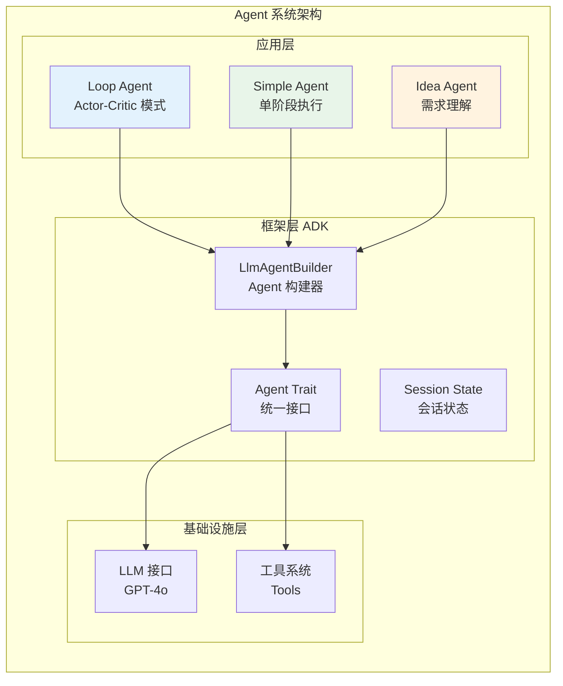
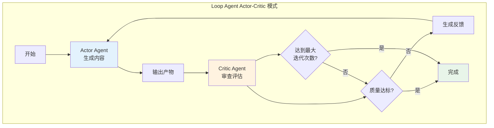
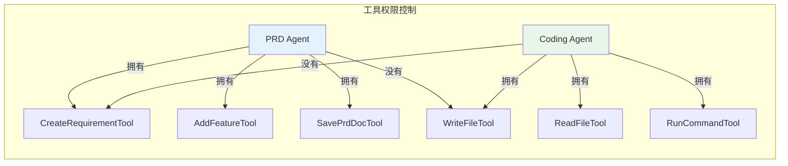
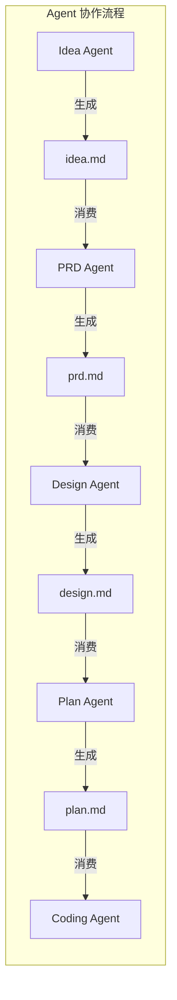
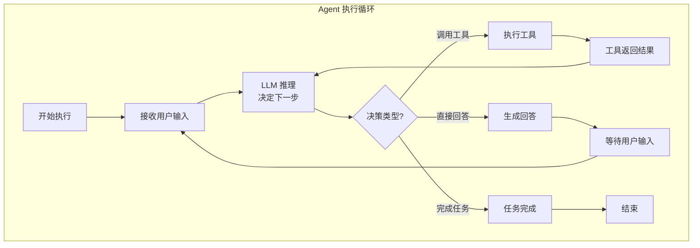

# Agent 系统设计与实现

你有没有想过，为什么单个 AI 模型很难完成复杂的软件开发任务？就像一个人很难同时扮演产品经理、架构师、开发工程师和测试工程师的角色。Cowork Forge 的解决方案是构建一个多 Agent 协作系统——每个 Agent 专注于特定领域，通过协作完成复杂的开发任务。

## Agent 系统概览

Cowork Forge 的 Agent 系统基于 ADK-Rust 框架构建，采用分层架构设计：



这个架构的核心思想是**分层抽象**：底层提供基础能力（LLM、工具），框架层提供构建机制，应用层实现具体的业务逻辑。

## Agent 类型与职责

Cowork Forge 定义了三种主要的 Agent 类型，分别适用于不同的场景：

### 1. Simple Agent：简单执行

适用于不需要迭代改进的场景，如 Check 和 Delivery 阶段：

```rustnpub fn create_check_agent(model: Arc<dyn Llm>) -> Result<Arc<dyn Agent>> {
    let agent = LlmAgentBuilder::new("check_agent")
        .instruction(&CHECK_INSTRUCTION)
        .model(model)
        .tool(Arc::new(ListFilesTool))
        .tool(Arc::new(ReadFileTool))
        .tool(Arc::new(RunCommandTool))
        .tool(Arc::new(SaveCheckReportTool))
        .build()?;

    Ok(Arc::new(agent))
}
```

Simple Agent 的特点是**一次执行，直接输出**。它接收任务指令，调用工具完成工作，然后返回结果。没有内部的迭代循环，逻辑简单直接。

### 2. Loop Agent：Actor-Critic 模式

适用于需要质量保证的关键阶段，如 PRD、Design、Plan、Coding：



Loop Agent 由两个子 Agent 组成：
- **Actor**：负责生成内容，如编写需求文档、设计架构、编写代码
- **Critic**：负责审查 Actor 的输出，评估质量并提供改进建议

这种设计的灵感来自于**代码审查（Code Review）**的实践。优秀的开发者写完代码后不会立即提交，而是先自我审查。Actor-Critic 模式将这种实践自动化，让 AI 也能"自我审查"。

### 3. Idea Agent：需求理解

Idea 阶段使用特殊的 Agent 来处理需求理解：

```rustnpub fn create_idea_agent(model: Arc<dyn Llm>) -> Result<Arc<dyn Agent>> {
    let agent = LlmAgentBuilder::new("idea_agent")
        .instruction(&IDEA_INSTRUCTION)
        .model(model)
        .tool(Arc::new(SaveIdeaDocTool))
        .tool(Arc::new(RequestConfirmationTool))
        .build()?;

    Ok(Arc::new(agent))
}
```

Idea Agent 虽然也是 Simple Agent，但它的提示词设计有特殊考量——重点在于**理解用户意图**和**澄清需求**，而不是直接产出技术方案。

## Agent 构建机制

### LlmAgentBuilder：链式构建

ADK 框架提供了流畅的 Builder API 来构建 Agent：

```rustnlet agent = LlmAgentBuilder::new("agent_name")
    .instruction(&INSTRUCTION)           // 设置系统提示词
    .model(model)                         // 设置 LLM 模型
    .tool(Arc::new(Tool1))               // 注册工具1
    .tool(Arc::new(Tool2))               // 注册工具2
    .tool(Arc::new(Tool3))               // 注册工具3
    .build()?;                           // 构建 Agent
```

这种链式 API 的优势在于：
- **可读性强**：一眼就能看出 Agent 的配置
- **灵活组合**：可以根据需要选择不同的工具和模型
- **类型安全**：编译期检查确保配置正确

### 工具注册与权限控制

每个 Agent 只能访问显式注册的工具，这是安全设计的重要一环：



最小权限原则确保即使某个 Agent 出现行为异常，其影响范围也是有限的。

## 各阶段 Agent 详解

### PRD Agent：需求工程

PRD 阶段使用 Loop Agent，Actor 和 Critic 分工明确：

**Actor 职责**：
- 分析用户需求，提取功能点
- 创建结构化需求（使用 `CreateRequirementTool`）
- 细化功能列表（使用 `AddFeatureTool`）
- 生成 PRD 文档（使用 `SavePrdDocTool`）

**Critic 职责**：
- 审查需求的完整性
- 检查功能描述是否清晰
- 验证需求之间的一致性
- 提供改进建议（使用 `ProvideFeedbackTool`）

```mermaid
sequenceDiagram
    participant Actor as PRD Actor
    participant Critic as PRD Critic
    participant Tools as 工具系统

    Actor->>Tools: create_requirement()
    Actor->>Tools: add_feature()
    Actor->>Tools: save_prd_doc()

    Critic->>Tools: get_requirements()
    Critic->>Critic: 分析需求质量

    alt 发现问题
        Critic->>Tools: provide_feedback()
        Critic->>Actor: 反馈问题
        Actor->>Actor: 根据反馈修订
    else 质量达标
        Critic->>Critic: 确认通过
    end
```

### Design Agent：架构设计

Design Agent 同样使用 Loop Agent，专注于系统架构设计：

**Actor 职责**：
- 设计系统整体架构
- 定义模块划分和接口
- 选择技术栈
- 生成设计文档

**Critic 职责**：
- 评估架构的合理性
- 检查模块间的耦合度
- 验证技术选型的适用性
- 识别潜在的技术风险

Design 阶段的一个关键设计是**技术栈感知**。Agent 会参考 `tech_stack.rs` 中定义的可用技术，确保设计符合项目约束。

### Plan Agent：任务规划

Plan Agent 负责将设计转化为可执行的任务列表：

**Actor 职责**：
- 分析设计文档，识别实现任务
- 创建任务依赖图
- 估算任务工作量
- 生成实现计划

**Critic 职责**：
- 检查任务的完整性
- 验证依赖关系的合理性
- 评估计划的可行性
- 识别遗漏的关键任务

Plan 阶段的输出是一个结构化的实现计划，包含任务列表、依赖关系、执行顺序等信息。这为 Coding 阶段提供了清晰的路线图。

### Coding Agent：代码实现

Coding Agent 是最复杂的 Agent，需要处理实际的代码编写：

**Actor 职责**：
- 按照实现计划编写代码
- 创建、修改、删除文件
- 运行测试验证实现
- 记录代码元数据

**Critic 职责**：
- 代码审查（Code Review）
- 检查代码风格和质量
- 验证是否符合设计
- 识别潜在的 Bug

Coding Agent 的特殊之处在于**文件操作能力**。它可以直接读写文件系统，这是其他 Agent 所不具备的权限。

```rustn// Coding Agent 注册的工具
let coding_actor = LlmAgentBuilder::new("coding_actor")
    .tool(Arc::new(ListFilesTool))
    .tool(Arc::new(ReadFileTool))
    .tool(Arc::new(WriteFileTool))      // 文件写入权限
    .tool(Arc::new(RunCommandTool))     // 命令执行权限
    .tool(Arc::new(CreateTaskTool))
    .tool(Arc::new(UpdateTaskStatusTool))
    .tool(Arc::new(SaveCodeMetadataTool))
    .build()?;
```

### Check Agent：质量检查

Check Agent 是 Simple Agent，专注于质量验证：

- 运行代码检查工具（lint、format）
- 执行测试套件
- 检查代码覆盖率
- 生成质量报告

Check Agent 的设计理念是**自动化验证**。它不需要人工确认，因为质量检查应该是客观、可自动化的。

### Delivery Agent：交付报告

Delivery Agent 生成最终的交付报告：

- 汇总项目信息
- 整理实现的功能列表
- 记录已知问题和限制
- 生成使用说明

Delivery 阶段标志着迭代的完成，交付报告是用户了解项目成果的主要途径。

## Agent 间的协作机制

### 通过工件协作

Agent 之间不直接通信，而是通过**工件（Artifacts）**进行协作：



这种设计的优势：
- **松耦合**：Agent 之间没有直接依赖
- **可追溯**：每个阶段的产出都是明确的文档
- **可审查**：用户可以随时查看中间产物

### 通过记忆共享上下文

除了工件，Agent 还通过**记忆系统**共享上下文：

```rustn// Agent 可以查询项目记忆
let memory_tool = QueryProjectMemoryTool;

// Agent 可以保存洞察到记忆
let save_insight_tool = SaveIterationInsightTool;
```

记忆系统让 Agent 能够"记住"之前的决策和经验，避免重复犯错。

## Agent 执行流程

### 会话状态管理

每次 Agent 执行都会创建一个会话状态：

```rustnpub struct SessionState {
    pub context: HashMap<String, Value>,    // 上下文数据
    pub artifacts: Vec<Artifact>,           // 已生成的工件
    pub feedback_history: Vec<Feedback>,    // 反馈历史
    pub execution_count: u32,               // 执行次数
}
```

会话状态的作用：
- **保持上下文**：Agent 可以访问之前的执行结果
- **检测模式**：通过 feedback_history 检测 UPDATE MODE
- **限制执行**：防止无限循环

### 执行循环

Agent 的执行遵循一个标准循环：



这个循环的核心是**LLM 的决策能力**。Agent 会根据当前状态决定是调用工具、直接回答还是完成任务。

## Agent 的提示词工程

### 提示词结构设计

每个 Agent 都有精心设计的系统提示词，通常包含以下部分：

```markdown
# 角色定义
你是 [角色名称]，负责 [职责描述]。

## 核心任务
[具体任务描述]

## 可用工具
[工具列表及使用说明]

## 输出格式
[期望的输出格式]

## 约束条件
[必须遵守的规则]

## 工作流程
[执行步骤]
```

### 双模式支持：NEW vs UPDATE

关键阶段的 Agent 支持两种工作模式：

**NEW MODE**：
- 从零开始创建内容
- 不受已有内容限制
- 适合全新开发

**UPDATE MODE**：
- 基于已有内容修改
- 精准定位变更点
- 适合反馈修订

模式检测逻辑：

```rustnif !feedback_history.is_empty() {
    // 有反馈历史，进入 UPDATE MODE
    instruction.push_str("\n\n## UPDATE MODE\n你正在根据用户反馈修订已有内容...");
} else {
    // 无反馈历史，进入 NEW MODE
    instruction.push_str("\n\n## NEW MODE\n你正在从零开始创建内容...");
}
```

### 强制工具调用

某些操作必须通过工具完成，这是通过提示词强制实现的：

```markdown
## 重要规则
- 你必须调用 `save_prd_doc()` 工具来保存 PRD 文档
- 不要直接在回复中输出文档内容
- 只有通过工具保存的内容才会被系统识别
```

这种设计确保了：
- **结构化输出**：文档被保存为特定格式，便于后续处理
- **可追溯性**：系统知道哪些内容被正式"提交"
- **一致性**：所有 Agent 遵循相同的输出规范

## Agent 的性能优化

### 最大迭代限制

Loop Agent 设置了最大迭代次数，防止无限循环：

```rustnlet mut loop_agent = LoopAgent::new("prd_loop", vec![actor, critic]);
loop_agent = loop_agent.with_max_iterations(1);  // PRD 阶段最多1轮
```

不同阶段的限制：
- PRD/Design/Plan：1 轮（快速收敛）
- Coding：5 轮（代码需要更多迭代优化）

### Token 预算管理

ADK 框架提供了 Token 使用监控，可以设置预算上限：

```rustnlet agent = LlmAgentBuilder::new("agent")
    .with_token_budget(100000)  // 10万 Token 上限
    .build()?;
```

### 重试与容错

Agent 执行失败时会自动重试：

```rustnfor attempt in 1..=3 {
    match agent.execute(...).await {
        Ok(result) => return Ok(result),
        Err(e) if attempt < 3 => {
            warn!("执行失败，{}秒后重试...", attempt * 2);
            sleep(Duration::from_secs(attempt * 2)).await;
        }
        Err(e) => return Err(e),
    }
}
```

## 总结

Cowork Forge 的 Agent 系统是一个精心设计的**多 Agent 协作框架**。通过 Actor-Critic 模式保证质量，通过工件和记忆实现协作，通过工具系统扩展能力，通过提示词工程控制行为。

这个设计的核心思想是：**专业分工，协作共赢**。每个 Agent 专注于自己的领域，通过结构化的协作完成复杂的软件开发任务。这种设计既发挥了 AI 的自动化能力，又保留了人类的判断力和创造力。

在下一章中，我们将探讨迭代架构——Cowork Forge 最核心的创新之一，它如何让软件开发成为一个可演进、可继承的过程。
