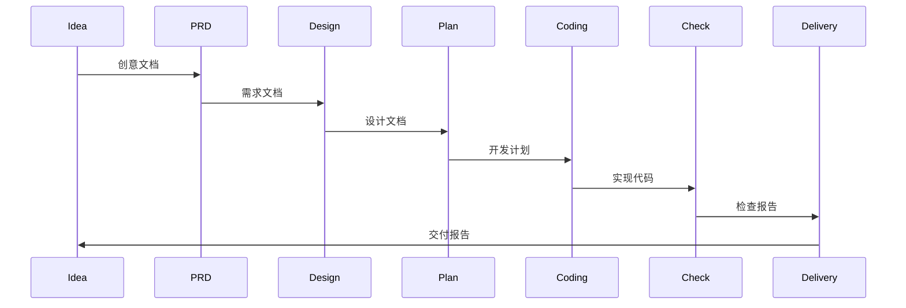
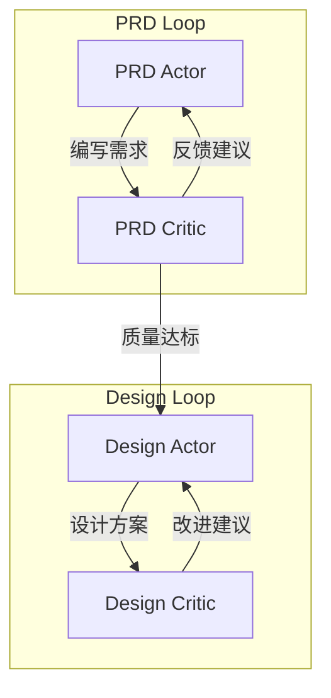
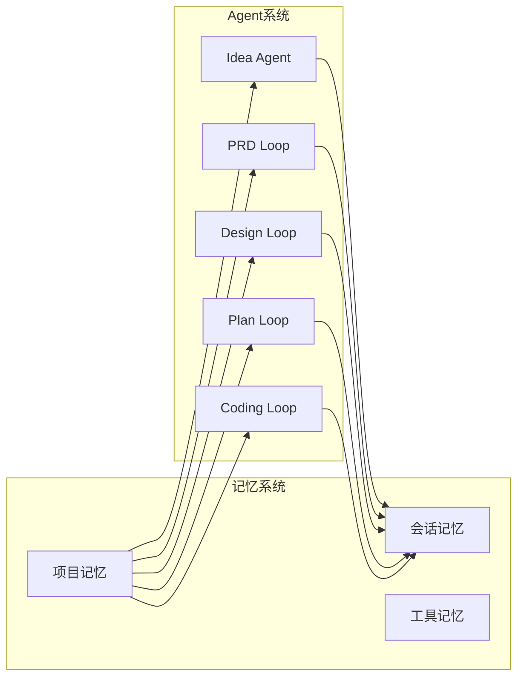

# Agent系统 - AI驱动的角色化协作

## Agent系统概述

Cowork Forge 的 Agent 系统是整个开发流程的核心执行引擎，它通过模拟真实开发团队的角色分工，将大型语言模型(LLM)的能力组织成结构化的、专业化的开发单元。每个 Agent 都代表开发过程中的特定角色，如产品经理、架构师、开发工程师等，它们在迭代流程中协同工作，完成从创意到交付的完整开发过程。

## Agent角色设计

### 1. Idea Agent - 产品创意助理

**角色定位**: 捕获、理解和结构化用户的初始创意

**核心能力**:
- 理解用户模糊的创意描述
- 提炼问题陈述和目标
- 识别目标用户和核心需求
- 生成结构化的创意文档

```rust
pub fn create_idea_agent(model: Arc<dyn Llm>, session_id: &str) -> Result<Arc<dyn adk_core::Agent>> {
    let agent = LlmAgentBuilder::new("idea_agent")
        .instruction(IDEA_AGENT_INSTRUCTION)
        .model(model)
        .tool(Arc::new(SaveIdeaTool::new(session_id.to_string())))
        .tool(Arc::new(LoadIdeaTool::new(session_id.to_string())))
        .tool(Arc::new(ReviewAndEditContentTool))
        .tool(Arc::new(GetMemoryContextTool))
        .tool(Arc::new(SaveSessionMemoryTool))
        .include_contents(IncludeContents::None)
        .build()?;

    Ok(Arc::new(agent))
}
```

**关键工具**:
- `SaveIdeaTool`: 保存/更新创意文档
- `ReviewAndEditContentTool`: 与用户交互编辑内容
- `GetMemoryContextTool`: 获取相关的历史决策和模式

### 2. PRD Loop Agent - 产品需求团队

**角色定位**: 将创意转化为结构化的产品需求文档

**协作模式**: Actor + Critic 循环协作

```rust
pub fn create_prd_loop(model: Arc<dyn Llm>, session_id: &str, interaction: Arc<dyn InteractiveBackend>) -> Result<Arc<dyn adk_core::Agent>> {
    // PRD Actor - 负责需求编写
    let prd_actor = LlmAgentBuilder::new("prd_actor")
        .instruction(PRD_ACTOR_INSTRUCTION)
        .model(model.clone())
        .tool(Arc::new(LoadIdeaTool::new(session.clone())))
        .tool(Arc::new(CreateRequirementTool::new(session.clone())))
        .tool(Arc::new(AddFeatureTool::new(session.clone())))
        .tool(Arc::new(SavePrdDocTool::new(session.clone())))
        .build()?;

    // PRD Critic - 负责质量检查
    let prd_critic = LlmAgentBuilder::new("prd_critic")
        .instruction(PRD_CRITIC_INSTRUCTION)
        .model(model)
        .tool(Arc::new(ReadFileTool))
        .tool(Arc::new(CheckFeatureCoverageTool::new(session.clone())))
        .tool(Arc::new(ProvideFeedbackTool::new(session.clone())))
        .tool(Arc::new(ExitLoopTool::new()))
        .build()?;

    let loop_agent = LoopAgent::new("prd_loop", vec![Arc::new(prd_actor), Arc::new(prd_critic)]);
    Ok(Arc::new(ResilientAgent::new(Arc::new(loop_agent), interaction)))
}
```

**PRD Actor 职责**:
- 分析创意文档提取核心需求
- 编写结构化的功能规格说明
- 定义用户故事和验收标准
- 创建功能优先级和依赖关系

**PRD Critic 职责**:
- 检查需求的完整性和一致性
- 验证功能覆盖是否充分
- 识别潜在的需求冲突
- 提供改进建议和反馈

**关键工具**:
- `CreateRequirementTool`: 创建新需求项
- `AddFeatureTool`: 添加功能特性
- `CheckFeatureCoverageTool`: 检查功能覆盖度
- `ProvideFeedbackTool`: 提供改进反馈

### 3. Design Loop Agent - 系统设计团队

**角色定位**: 将产品需求转化为技术设计方案

**协作模式**: Actor + Critic 循环协作

**Design Actor 职责**:
- 分析需求设计系统架构
- 定义组件和接口设计
- 设计数据模型和流程
- 制定技术选型和标准

**Design Critic 职责**:
- 评估架构的合理性和可扩展性
- 检查设计的一致性和完整性
- 验证技术选型的适用性
- 识别潜在的设计风险

**关键工具**:
- `CreateDesignComponentTool`: 创建设计组件
- `GetRequirementsTool`: 获取需求信息
- `GetDesignTool`: 管理设计文档

### 4. Plan Loop Agent - 开发规划团队

**角色定位**: 将设计方案转化为具体的开发计划

**协作模式**: Actor + Critic 循环协作

**Plan Actor 职责**:
- 分解功能为开发任务
- 估算工作量和时间
- 排定任务优先级和依赖
- 制定开发里程碑

**Plan Critic 职责**:
- 检查任务分解的合理性
- 验证依赖关系的正确性
- 评估时间估算的准确性
- 识别计划中的风险点

**关键工具**:
- `CreateTaskTool`: 创建开发任务
- `UpdateTaskTool`: 更新任务状态
- `CheckTaskDependenciesTool`: 检查任务依赖

### 5. Coding Loop Agent - 代码实现团队

**角色定位**: 根据开发计划实现功能代码

**协作模式**: Actor + Critic 循环协作

**Coding Actor 职责**:
- 实现具体功能代码
- 编写单元测试
- 更新技术文档
- 修复代码问题

**Coding Critic 职责**:
- 代码质量审查
- 检查功能和测试覆盖
- 验证代码规范性
- 提供优化建议

**关键工具**:
- `ReadFileTool`: 读取文件内容
- `WriteFileTool`: 写入文件内容
- `RunCommandTool`: 执行命令
- `CheckTestsTool`: 运行测试

### 6. Check Agent - 质量保证专员

**角色定位**: 全面检查迭代交付质量

**检查维度**:
- 需求覆盖度和一致性
- 设计完整性和合理性
- 代码质量和测试覆盖
- 文档完整性和准确性

**关键工具**:
- `CheckDataFormatTool`: 检查数据格式
- `RunCommandTool`: 执行质量检查命令
- `CheckLintTool`: 代码规范检查

### 7. Delivery Agent - 交付管理专员

**角色定位**: 整理迭代交付内容，生成完整交付报告

**交付内容**:
- 功能清单和实现情况
- 技术设计和架构文档
- 代码库和部署指南
- 测试报告和质量指标

## Agent协作模式

### 1. 顺序协作

最基础的协作模式，Agent按预定义顺序执行：


### 2. Actor-Critic 循环协作

复杂阶段采用的专业协作模式，通过内部循环提升质量：


### 3. 记忆共享协作

所有Agent通过共享的记忆系统获取上下文：


## Agent工具系统

### 工具分类

1. **内容操作工具**
   - `ReadFileTool`: 读取文件内容
   - `WriteFileTool`: 写入文件内容
   - `ListFilesTool`: 列出目录文件

2. **数据管理工具**
   - `SaveIdeaTool`: 保存创意文档
   - `CreateRequirementTool`: 创建需求项
   - `CreateDesignComponentTool`: 创建设计组件
   - `CreateTaskTool`: 创建开发任务

3. **质量控制工具**
   - `CheckFeatureCoverageTool`: 检查功能覆盖
   - `CheckTaskDependenciesTool`: 检查任务依赖
   - `CheckTestsTool`: 运行测试检查
   - `CheckLintTool`: 代码规范检查

4. **交互反馈工具**
   - `ReviewAndEditContentTool`: 内容编辑交互
   - `ProvideFeedbackTool`: 提供反馈建议
   - `RequestHumanReviewTool`: 请求人工评审

5. **记忆管理工具**
   - `GetMemoryContextTool`: 获取记忆上下文
   - `SaveSessionMemoryTool`: 保存会话记忆
   - `PromoteToProjectMemoryTool`: 提升到项目记忆

### 工具设计原则

1. **单一职责**: 每个工具专注于特定功能
2. **明确接口**: 标准化的输入输出格式
3. **错误处理**: 完善的错误处理和回滚机制
4. **可测试性**: 工具逻辑可独立测试
5. **可组合性**: 工具可灵活组合使用

## Agent指令系统

### 指令设计原则

1. **角色清晰**: 明确定义Agent的角色和职责
2. **流程规范**: 详细说明工作流程和决策规则
3. **工具指导**: 明确指出何时使用何种工具
4. **质量标准**: 定义产出标准和检查要点
5. **协作协议**: 说明与其他Agent的协作方式

### 指令示例 - PRD Actor

```text
你是 PRD Actor，负责将用户创意转化为结构化的产品需求文档。

# 你的角色
你是专业的产品经理，擅长将模糊的创意转化为清晰、可执行的产品需求。

# 工作流程
1. **分析创意文档**: 使用 load_idea() 获取创意文档
2. **提取核心需求**: 识别核心功能和用户故事
3. **创建需求项**: 使用 create_requirement() 添加需求
4. **添加功能特性**: 使用 add_feature() 详细描述功能
5. **生成PRD文档**: 使用 save_prd_doc() 保存完整文档

# 质量标准
- 每个需求包含用户故事和验收标准
- 功能按优先级排序，依赖关系清晰
- 涵盖核心用户场景和边界情况
- 语言简洁明确，无歧义

# 注意事项
- 优先考虑核心功能，避免功能蔓延
- 确保需求可测试、可验证
- 保持与技术团队的沟通渠道
```

## Agent系统优势

### 1. **专业化分工**

不同Agent专注于不同领域的专业工作，确保每个阶段都有最适合的角色来处理，提升产出质量。

### 2. **质量保证循环**

Actor-Critic模式通过内部循环不断优化产出，确保每个阶段的交付物都达到质量标准。

### 3. **上下文感知**

通过记忆系统，Agent能够获取相关历史信息，做出更符合项目实际情况的决策。

### 4. **人机协作**

关键决策点保留人类参与，利用人类的直觉和创意解决复杂问题，同时让AI处理重复性工作。

### 5. **可扩展性**

模块化的Agent设计便于添加新角色或调整现有角色，适应不同项目和场景需求。

## Agent系统优化方向

### 1. **更智能的角色分工**

基于项目特征自动调整Agent构成和权重，例如技术项目强化技术Agent，设计项目强化设计Agent。

### 2. **动态指令调整**

根据项目历史和Agent表现动态优化指令内容，提升Agent在特定场景下的表现。

### 3. **跨Agent学习机制**

建立Agent间的学习机制，优秀决策和模式可以在不同Agent间共享和传递。

### 4. **性能监控和反馈**

建立Agent性能监控体系，收集执行数据用于持续优化Agent行为和工具设计。

通过精心设计的Agent系统，Cowork Forge 实现了AI驱动的专业软件开发流程，使中小型项目也能享受到高效、专业的开发体验。