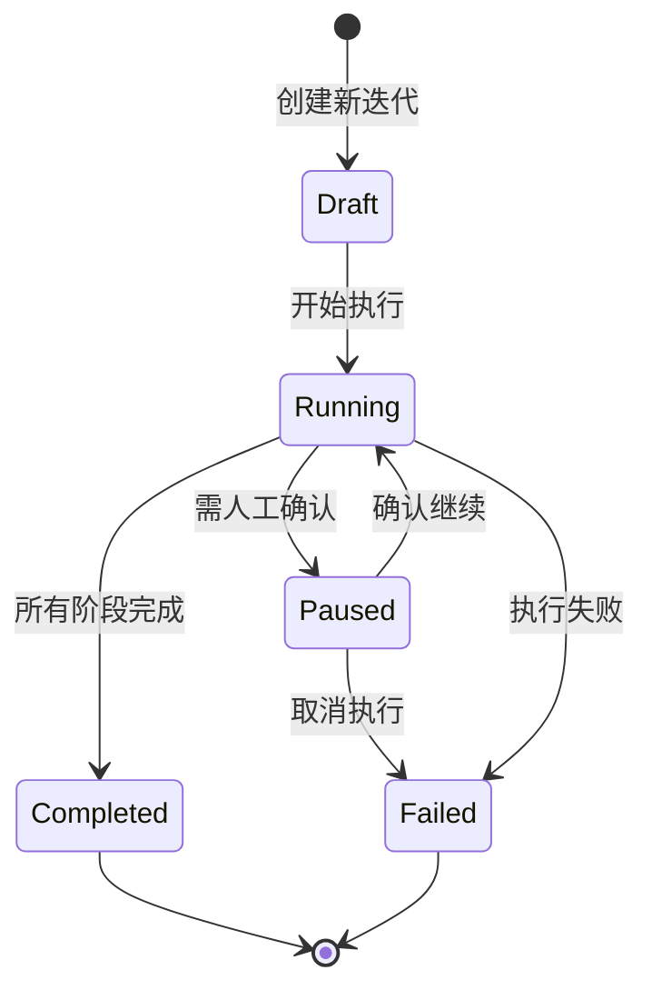
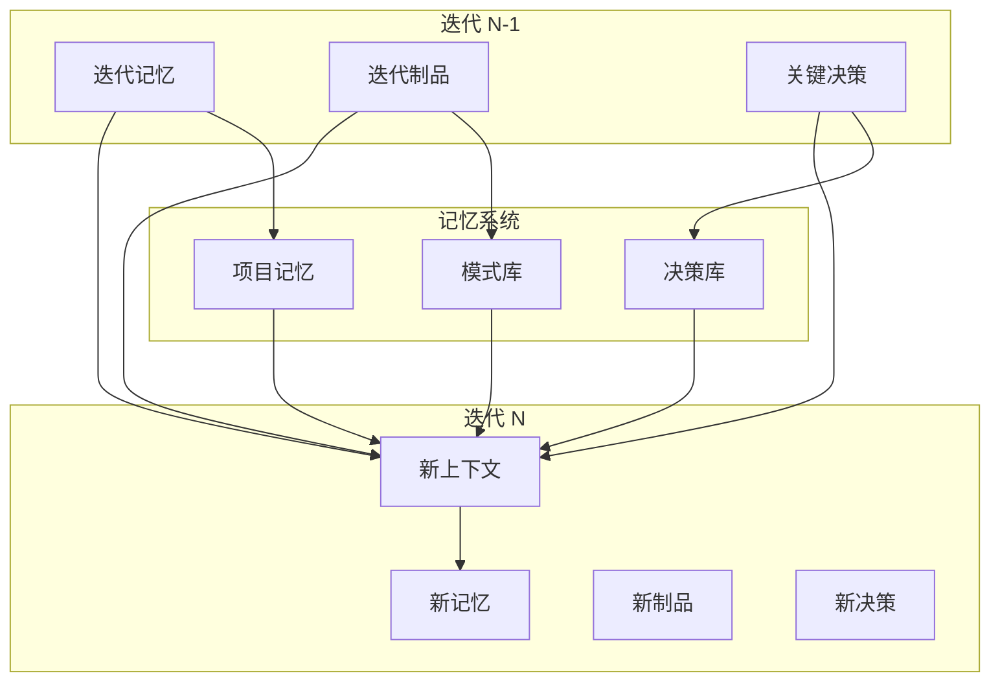

# 迭代架构 - Cowork Forge 的核心设计理念

## 什么是迭代架构

迭代架构是 Cowork Forge 的核心设计理念，它将软件开发过程抽象为一系列可管理、可继承、可演进的迭代单元。每个迭代都代表一个完整的开发周期，从需求分析到最终交付，形成闭环。

## 迭代的两种类型

### 起始迭代 (Genesis)

起始迭代代表一个全新项目的开始，它从零开始构建整个系统。

```rust
pub struct Iteration {
    // ...
    pub base_iteration_id: Option<String>,  // None for Genesis
    pub inheritance: InheritanceMode,       // InheritanceMode::None
    // ...
}

impl Iteration {
    pub fn create_genesis(project: &Project, title: String, description: String) -> Self {
        // 从零创建新迭代
    }
}
```

**使用场景**:
- 全新的项目开发
- 完全重写现有系统
- 原型到产品的转化
- 技术栈完全更换的项目

**优势**:
- 全面的系统审视
- 无历史包袱
- 架构和技术的最佳实践应用
- 完整的文档生成

### 演化迭代 (Evolution)

演化迭代基于现有迭代进行扩展和优化，通过继承机制减少重复工作。

```rust
pub struct Iteration {
    // ...
    pub base_iteration_id: Option<String>,  // Some(ID) for Evolution
    pub inheritance: InheritanceMode,       // Full, Partial, or Custom
    // ...
}

impl Iteration {
    pub fn create_evolution(
        project: &Project,
        title: String,
        description: String,
        base_iteration_id: String,
        inheritance: InheritanceMode,
    ) -> Self {
        // 基于基础迭代创建演化迭代
    }
}
```

**三种继承模式**:

1. **完全继承 (Full)**
   - 继承所有代码文件
   - 继承所有文档和制品
   - 从计划阶段开始开发
   - 适用于功能扩展和小幅修改

2. **部分继承 (Partial)**
   - 仅继承制品定义和设计文档
   - 不继承源代码
   - 从设计或需求阶段开始
   - 适用于架构调整和重大变更

3. **自定义继承 (Custom)**
   - 根据变更描述自动判断起始阶段
   - 智能分析变更影响范围
   - 动态确定需要继承的内容
   - 适用于各类复杂场景

## 智能起始阶段判断

系统通过分析变更描述的语义，自动确定合适的起始阶段：

```rust
fn analyze_change_scope(description: &str) -> String {
    let desc_lower = description.to_lowercase();

    // 架构变更 -> 从idea开始
    let arch_keywords = ["架构", "architecture", "重构", "rewrite", "重新设计", "redesign"];
    for kw in &arch_keywords {
        if desc_lower.contains(kw) {
            return "idea".to_string();
        }
    }

    // 需求变更 -> 从prd开始
    let req_keywords = ["需求", "requirement", "功能", "feature", "添加", "add"];
    for kw in &req_keywords {
        if desc_lower.contains(kw) {
            return "prd".to_string();
        }
    }

    // 设计变更 -> 从design开始
    let design_keywords = ["设计", "design", "数据库", "database", "接口", "api"];
    for kw in &design_keywords {
        if desc_lower.contains(kw) {
            return "design".to_string();
        }
    }

    // 默认：代码变更 -> 从plan开始
    "plan".to_string()
}
```

## 迭代生命周期



1. **Draft (草稿)**
   - 迭代已创建但未开始
   - 可以修改标题和描述
   - 可以调整继承设置

2. **Running (运行中)**
   - 正在执行开发流程
   - 当前阶段实时更新
   - 可以暂停等待人工确认

3. **Paused (已暂停)**
   - 等待人工确认或反馈
   - 当前阶段保持不变
   - 可以继续或取消

4. **Completed (已完成)**
   - 所有阶段成功完成
   - 生成完整制品和文档
   - 可以作为新迭代的基础

5. **Failed (失败)**
   - 执行过程中出现错误
   - 需要手动干预修复
   - 可以重新启动或放弃

## 迭代制品管理

每个迭代产生一组结构化的制品，它们是开发过程的核心产出：

```rust
pub struct Artifacts {
    pub idea: Option<String>,      // 创意文档
    pub prd: Option<String>,       // 产品需求文档
    pub design: Option<String>,    // 设计文档
    pub plan: Option<String>,      // 开发计划
    pub delivery: Option<String>,  // 交付报告
}
```

**制品特点**:

- **版本化**: 每个制品都关联特定迭代版本
- **可追溯**: 可以追踪制品的变更历史
- **可复用**: 演化迭代可以引用和修改历史制品
- **结构化**: 标准化的格式和内容要求

## 迭代上下文继承

迭代间的上下文传递是系统智能化的关键：



## 迭代执行引擎

迭代执行器负责协调整个迭代流程：

```rust
pub struct IterationExecutor {
    project_store: Arc<dyn ProjectStore>,
    iteration_store: Arc<dyn IterationStore>,
    interaction: Arc<dyn InteractiveBackend>,
}

impl IterationExecutor {
    pub async fn execute(&self, project: &mut Project, iteration_id: &str) -> anyhow::Result<()> {
        // 1. 加载迭代
        let mut iteration = self.iteration_store.load(iteration_id)?;
        
        // 2. 准备工作空间
        let workspace = self.prepare_workspace(&iteration).await?;
        
        // 3. 创建执行上下文
        let ctx = PipelineContext::new(project.clone(), iteration.clone(), workspace);
        
        // 4. 确定起始阶段
        let start_stage = iteration.determine_start_stage();
        
        // 5. 获取阶段序列
        let stages = get_stages_from(&start_stage);
        
        // 6. 执行阶段序列
        for stage in stages {
            // 执行阶段并处理结果
            // ...
        }
        
        Ok(())
    }
}
```

## 迭代架构的优势

### 1. **可预测的开发流程**

每个迭代都遵循标准化的阶段序列，开发过程变得可预测、可管理、可优化。项目管理者可以清楚了解每个迭代的进度和状态。

### 2. **知识的沉淀和复用**

通过迭代制品和记忆系统，项目中的决策和模式得以保存和复用，减少重复劳动，提升长期效率。

### 3. **渐进式系统演进**

演化迭代机制支持系统的渐进式演进，避免了大型重构的风险，让系统能够持续适应变化的需求。

### 4. **风险控制和回滚**

每个迭代都是相对独立的边界，如果出现问题可以轻松回滚到上一个稳定的迭代状态。

### 5. **灵活的团队协作**

不同团队成员可以专注不同迭代的开发，通过标准化的制品和上下文实现高效协作。

## 迭代架构最佳实践

### 1. **合理的迭代粒度**

- 迭代应该足够小以保持专注，但又足够大以交付价值
- 一般建议1-4周的迭代周期
- 每个迭代应该有明确的业务目标

### 2. **高质量的制品产出**

- 每个阶段的制品都应该结构清晰、内容完整
- 制品不仅服务当前迭代，还要为未来迭代提供价值
- 定期评审和改进制品模板

### 3. **有效的上下文管理**

- 及时记录关键决策和理由
- 维护清晰的技术模式库
- 定期整理和优化项目记忆

### 4. **合理的人机协作**

- 在关键决策点保留人工确认
- 利用人类的创意解决复杂问题
- 让AI处理重复性和模式化工作

### 5. **持续的反馈和改进**

- 收集每个迭代的反馈数据
- 定期回顾和优化流程
- 调整Agent指令和工具以提升效率

## 总结

迭代架构是 Cowork Forge 的核心创新，它通过将软件开发抽象为可管理的迭代单元，实现了AI驱动开发的流程化和工程化。这种架构不仅提升了开发效率，更重要的是保证了开发过程的可预测性和质量，使其成为中小型项目全链路开发的理想解决方案。