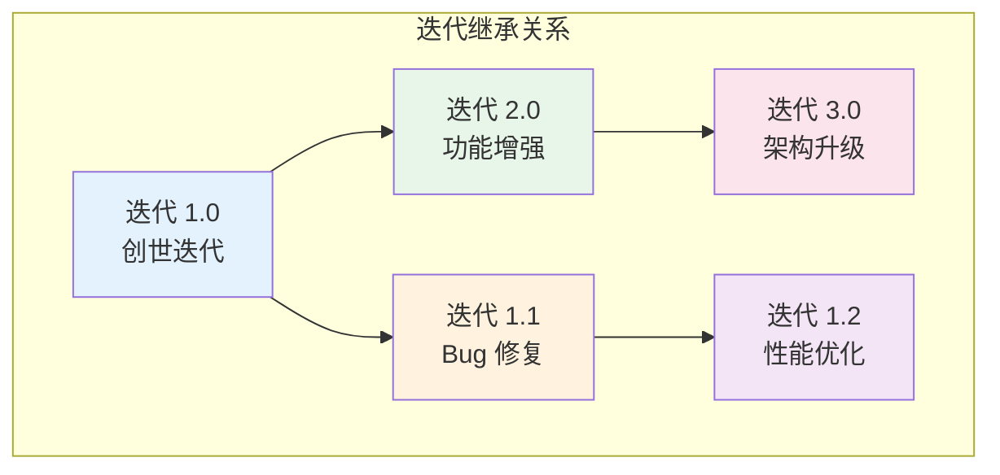
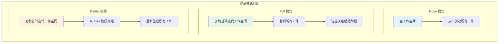
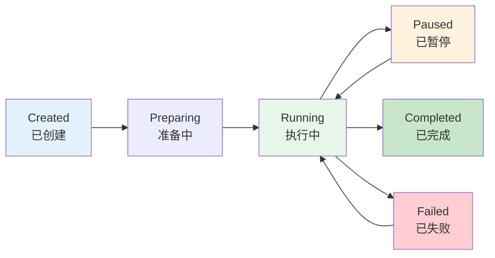

# 迭代架构设计

你有没有想过，为什么传统的 AI 编程工具很难处理复杂的、持续演进的项目？它们通常只能生成一次性的代码，当需求变更时，要么从头再来，要么在已有代码上"打补丁"，很快就会导致代码质量下降。Cowork Forge 的核心创新之一——**迭代架构**，正是为了解决这个问题而设计的。

## 什么是迭代架构

迭代架构将软件开发建模为一系列**可继承的迭代单元**。每个迭代是一个完整的开发周期，包含从需求到交付的所有工件。更重要的是，迭代之间可以建立继承关系，新的迭代可以选择性地复用历史迭代的成果。



这种设计的灵感来自于**版本控制系统**（如 Git）的分支模型。就像代码可以通过分支进行并行开发和版本管理一样，软件功能也可以通过迭代进行演进式开发。

## 核心概念

### 迭代（Iteration）

迭代是 Cowork Forge 的核心实体，代表一个完整的开发周期：

```rustnpub struct Iteration {
    pub id: String,                           // 唯一标识
    pub number: u32,                          // 迭代序号
    pub title: String,                        // 标题
    pub description: String,                  // 描述（变更内容）
    pub base_iteration_id: Option<String>,    // 基础迭代（继承自）
    pub inheritance: InheritanceMode,         // 继承模式
    pub status: IterationStatus,              // 状态
    pub artifacts: Artifacts,                 // 工件集合
    pub current_stage: Option<String>,        // 当前阶段
}
```

### 继承模式（InheritanceMode）

继承模式决定了新迭代如何复用历史成果：

| 模式 | 说明 | 适用场景 |
|------|------|----------|
| **None** | 创世模式，从零开始 | 全新项目 |
| **Full** | 完整继承，复制代码和所有工件 | 功能增强、架构升级 |
| **Partial** | 部分继承，复制代码但重新生成工件 | 重大重构、技术栈变更 |



### 迭代状态（IterationStatus）

迭代在其生命周期中会经历不同的状态：



状态设计考虑了实际使用场景：
- **Created**：迭代刚创建，尚未开始执行
- **Preparing**：正在准备工作空间
- **Running**：Pipeline 正在执行
- **Paused**：等待用户确认或输入
- **Completed**：所有阶段执行完成
- **Failed**：执行过程中发生错误

## 迭代创建流程

### 创世迭代（Genesis Iteration）

创世迭代是项目的第一个迭代，从零开始：

```rustnpub async fn create_genesis_iteration(
    &self,
    title: String,
    description: String,
) -> Result<Iteration> {
    let iteration = Iteration {
        id: generate_uuid(),
        number: 1,
        title,
        description,
        base_iteration_id: None,        // 无基础迭代
        inheritance: InheritanceMode::None,
        status: IterationStatus::Created,
        artifacts: Artifacts::default(),
        current_stage: None,
    };

    // 保存迭代元数据
    self.iteration_store.save_iteration(&iteration)?;

    // 准备工作空间（空目录）
    self.prepare_workspace(&iteration).await?;

    Ok(iteration)
}
```

创世迭代的特点：
- `base_iteration_id` 为 `None`
- `inheritance` 为 `InheritanceMode::None`
- 工作空间是空的
- 从 Idea 阶段开始执行

### 演进迭代（Evolution Iteration）

演进迭代基于已有迭代进行开发：

```rustnpub async fn create_evolution_iteration(
    &self,
    title: String,
    description: String,    // 变更描述
    base_iteration_id: String,
    inheritance: InheritanceMode,
) -> Result<Iteration> {
    let base_iteration = self.iteration_store
        .get_iteration(&base_iteration_id)?;

    let iteration = Iteration {
        id: generate_uuid(),
        number: base_iteration.number + 1,
        title,
        description,
        base_iteration_id: Some(base_iteration_id),
        inheritance,
        status: IterationStatus::Created,
        artifacts: Artifacts::default(),
        current_stage: None,
    };

    // 保存迭代元数据
    self.iteration_store.save_iteration(&iteration)?;

    // 准备工作空间（可能复制基础迭代）
    self.prepare_workspace(&iteration).await?;

    Ok(iteration)
}
```

演进迭代的核心价值在于**复用**。不需要从头开始，而是在已有基础上进行改进。

## 工作空间继承机制

### 准备工作空间

工作空间继承是迭代架构的核心实现：

```rustnpub async fn prepare_workspace(&self, iteration: &Iteration) -> Result<()> {
    let workspace_dir = get_workspace_dir(&iteration.id);

    match iteration.inheritance {
        InheritanceMode::None => {
            // 创世迭代：创建空目录
            fs::create_dir_all(&workspace_dir).await?;
        }
        InheritanceMode::Full | InheritanceMode::Partial => {
            // 演进迭代：复制基础迭代工作空间
            let base_id = iteration.base_iteration_id.as_ref()
                .ok_or_else(|| Error::InvalidState("Missing base iteration"))?;
            let base_workspace = get_workspace_dir(base_id);

            // 递归复制目录
            copy_dir_recursive(&base_workspace, &workspace_dir).await?;
        }
    }

    // 创建子目录
    fs::create_dir_all(workspace_dir.join("artifacts")).await?;
    fs::create_dir_all(workspace_dir.join("data")).await?;
    fs::create_dir_all(workspace_dir.join("memory")).await?;

    Ok(())
}
```

### 智能起始阶段判定

对于 Full 继承模式，系统会智能决定从哪个阶段开始执行：

```rustnfn determine_start_stage(&self, iteration: &Iteration) -> String {
    match iteration.inheritance {
        InheritanceMode::None => "idea".to_string(),
        InheritanceMode::Partial => "idea".to_string(),
        InheritanceMode::Full => {
            // 分析变更描述，智能决定起始阶段
            analyze_change_scope(&iteration.description)
        }
    }
}
```

变更范围分析逻辑：

```rustnfn analyze_change_scope(description: &str) -> String {
    let desc_lower = description.to_lowercase();

    // 关键词匹配
    if desc_lower.contains("fix") || desc_lower.contains("bug") {
        // Bug 修复：从 Coding 阶段开始
        "coding".to_string()
    } else if desc_lower.contains("refactor") || desc_lower.contains("重构") {
        // 重构：从 Design 阶段开始
        "design".to_string()
    } else if desc_lower.contains("feature") || desc_lower.contains("功能") {
        // 新功能：从 PRD 阶段开始
        "prd".to_string()
    } else if desc_lower.contains("architecture") || desc_lower.contains("架构") {
        // 架构调整：从 Design 阶段开始
        "design".to_string()
    } else {
        // 默认：从 Idea 阶段开始
        "idea".to_string()
    }
}
```

这种智能判定避免了不必要的重复工作。如果只是修复一个小 Bug，不需要重新走完整的需求分析和架构设计流程。

## 迭代执行与断点续传

### 执行流程

迭代执行遵循 Pipeline 流程，但支持断点续传：

```rustnpub async fn execute(&self, iteration_id: &str) -> Result<()> {
    let iteration = self.iteration_store.get_iteration(iteration_id)?;

    // 确定起始阶段
    let start_stage = iteration.current_stage
        .unwrap_or_else(|| self.determine_start_stage(&iteration));

    // 按顺序执行各个阶段
    for stage_name in self.get_stages_from(&start_stage) {
        // 更新当前阶段
        self.iteration_store.update_current_stage(iteration_id, &stage_name)?;

        // 执行阶段
        let result = self.execute_stage(&iteration, &stage_name).await?;

        // 处理阶段结果
        match result {
            StageResult::Completed => continue,
            StageResult::Paused => {
                // 暂停，等待用户继续
                self.iteration_store.update_status(iteration_id, IterationStatus::Paused)?;
                return Ok(());
            }
            StageResult::Failed(e) => {
                self.iteration_store.update_status(iteration_id, IterationStatus::Failed)?;
                return Err(e);
            }
        }
    }

    // 标记完成
    self.iteration_store.update_status(iteration_id, IterationStatus::Completed)?;

    // 生成知识快照
    self.generate_knowledge_snapshot(iteration_id).await?;

    Ok(())
}
```

### 断点续传机制

断点续传让迭代执行可以暂停和恢复：

```rustnpub async fn continue_iteration(&self, iteration_id: &str) -> Result<()> {
    let iteration = self.iteration_store.get_iteration(iteration_id)?;

    // 验证状态
    if iteration.status != IterationStatus::Paused {
        return Err(Error::InvalidState("Iteration is not paused"));
    }

    // 从当前阶段继续
    let current_stage = iteration.current_stage
        .ok_or_else(|| Error::InvalidState("No current stage"))?;

    // 恢复执行
    self.execute_pipeline(&iteration, Some(&current_stage)).await
}
```

断点续传的价值：
- **应对中断**：用户可以暂停执行，稍后继续
- **增量修正**：发现某个阶段有问题时，可以回到该阶段重新执行
- **灵活调度**：长时间运行的迭代可以分多次完成

## 工件管理

### 工件集合

每个迭代都有一个工件集合，记录生成的所有文档：

```rustnpub struct Artifacts {
    pub idea_doc: Option<String>,           // idea.md 路径
    pub prd_doc: Option<String>,            // prd.md 路径
    pub design_doc: Option<String>,         // design.md 路径
    pub plan_doc: Option<String>,           // plan.md 路径
    pub delivery_report: Option<String>,    // delivery_report.md 路径
}
```

### 工件生成与验证

每个阶段完成后，系统会验证工件是否正确生成：

```rustnfn validate_artifacts(&self, iteration: &Iteration) -> Result<()> {
    let workspace_dir = get_workspace_dir(&iteration.id);

    // 验证必需工件
    let required_artifacts = match iteration.current_stage.as_deref() {
        Some("idea") => vec!["artifacts/idea.md"],
        Some("prd") => vec!["artifacts/prd.md", "data/requirements.json"],
        Some("design") => vec!["artifacts/design.md", "data/design_spec.json"],
        Some("plan") => vec!["artifacts/plan.md", "data/implementation_plan.json"],
        Some("coding") => vec!["data/code_metadata.json"],
        Some("check") => vec!["artifacts/check_report.md"],
        Some("delivery") => vec!["artifacts/delivery_report.md"],
        _ => vec![],
    };

    for artifact in required_artifacts {
        let path = workspace_dir.join(artifact);
        if !path.exists() {
            return Err(Error::MissingArtifact(artifact.to_string()));
        }
    }

    Ok(())
}
```

## 记忆与知识传承

### 迭代级记忆

每个迭代都有自己的记忆，记录执行过程中的洞察：

```rustnpub struct IterationMemory {
    pub iteration_id: String,
    pub insights: Vec<Insight>,      // 洞察
    pub issues: Vec<Issue>,          // 遇到的问题
    pub learnings: Vec<Learning>,    // 学习到的东西
}
```

### 知识快照

迭代完成后，系统会生成知识快照，供后续迭代参考：

```rustnpub async fn generate_knowledge_snapshot(&self, iteration_id: &str) -> Result<()> {
    let iteration = self.iteration_store.get_iteration(iteration_id)?;

    // 收集迭代记忆
    let memory = self.memory_store.get_iteration_memory(iteration_id)?;

    // 生成知识摘要
    let knowledge = IterationKnowledge {
        iteration_id: iteration_id.to_string(),
        title: iteration.title.clone(),
        summary: generate_summary(&iteration, &memory),
        key_decisions: extract_decisions(&memory),
        patterns: extract_patterns(&memory),
        tech_stack: extract_tech_stack(&iteration),
    };

    // 保存到项目记忆
    self.memory_store.save_iteration_knowledge(&knowledge)?;

    Ok(())
}
```

知识传承的价值：
- **避免重复犯错**：后续迭代可以了解之前遇到的问题
- **保持架构一致性**：了解之前的架构决策，避免冲突
- **加速开发**：复用已验证的模式和最佳实践

## 迭代间的比较与回溯

### 迭代比较

系统支持比较不同迭代的差异：

```rustnpub fn compare_iterations(&self, iter1_id: &str, iter2_id: &str) -> Result<Comparison> {
    let iter1 = self.iteration_store.get_iteration(iter1_id)?;
    let iter2 = self.iteration_store.get_iteration(iter2_id)?;

    // 比较工件
    let artifact_diff = compare_artifacts(&iter1.artifacts, &iter2.artifacts)?;

    // 比较代码
    let code_diff = compare_code(
        &get_workspace_dir(iter1_id),
        &get_workspace_dir(iter2_id)
    )?;

    Ok(Comparison {
        iteration1: iter1,
        iteration2: iter2,
        artifact_diff,
        code_diff,
    })
}
```

### 迭代回溯

如果发现新迭代有问题，可以回溯到之前的迭代：

```rustnpub async fn rollback_to_iteration(&self, target_id: &str) -> Result<()> {
    let target = self.iteration_store.get_iteration(target_id)?;

    // 验证目标迭代已完成
    if target.status != IterationStatus::Completed {
        return Err(Error::InvalidState("Target iteration is not completed"));
    }

    // 更新项目当前迭代
    self.project_store.update_current_iteration(target_id)?;

    // 可选：删除后续迭代
    // self.cleanup_later_iterations(target.number).await?;

    Ok(())
}
```

## 实际应用场景

### 场景一：MVP 开发

```bash
# 1. 创建创世迭代，开发 MVP
cowork iter --title "MVP 版本" --description "实现核心功能"

# 迭代 1.0：完成从 Idea 到 Delivery 的完整流程
```

### 场景二：功能迭代

```bash
# 2. 基于 MVP 添加新功能
cowork iter --title "用户系统" --description "添加登录注册功能" \
    --base iter-1-xxx --inherit full

# 迭代 2.0：
# - 复制迭代 1.0 的工作空间
# - 智能决定从 PRD 阶段开始（因为是新功能）
# - 复用已有的基础架构
```

### 场景三：Bug 修复

```bash
# 3. 修复线上 Bug
cowork iter --title "修复登录 Bug" --description "修复 OAuth 登录失败的问题" \
    --base iter-2-xxx --inherit full

# 迭代 2.1：
# - 复制迭代 2.0 的工作空间
# - 智能决定从 Coding 阶段开始（因为是 Bug 修复）
# - 快速定位并修复问题
```

### 场景四：架构升级

```bash
# 4. 技术栈升级
cowork iter --title "升级到 React 18" --description "将前端框架升级到 React 18" \
    --base iter-2-xxx --inherit partial

# 迭代 3.0：
# - 复制迭代 2.0 的代码
# - 从 Idea 阶段开始（重新评估架构）
# - 重新生成所有工件
```

## 设计权衡与思考

### 为什么不用 Git 分支？

你可能会问，Git 已经提供了强大的分支和版本管理能力，为什么还要设计迭代架构？

**关键区别在于语义层面**：

| 维度 | Git 分支 | Cowork Forge 迭代 |
|------|----------|-------------------|
| **抽象层级** | 代码层面 | 功能层面 |
| **上下文** | 仅代码变更 | 完整的开发上下文（需求、设计、代码） |
| **AI 感知** | 无 | AI 可以理解迭代目的和变更范围 |
| **工件管理** | 仅代码 | 包含所有工件（文档、设计、代码） |

迭代架构在 Git 之上增加了一层**语义抽象**，让 AI 能够理解"这个迭代是要做什么"，从而做出更智能的决策。

### 存储开销考量

每个迭代都复制工作空间，会不会导致存储爆炸？

**实际情况**：
- 迭代之间是**增量复制**，不是全量复制
- 可以定期清理旧的、已合并的迭代
- 工件采用文本格式，压缩率高

**权衡**：用存储空间换取开发效率和可追溯性，是值得的。

### 与持续集成的关系

迭代架构与 CI/CD 不是替代关系，而是**互补关系**：

- **迭代**：面向开发过程，管理功能演进
- **CI/CD**：面向交付过程，自动化构建和部署

一个典型的集成方式是：迭代完成后，自动触发 CI 流程进行构建和测试。

## 总结

Cowork Forge 的迭代架构是系统最核心的创新之一。它将软件开发从"一次性生成"转变为"演进式开发"，带来了几个关键价值：

1. **支持持续演进**：软件可以通过多次迭代逐步完善，而不是一次性交付
2. **降低变更成本**：小的需求变更不需要从头开始，基于已有迭代演进即可
3. **保留完整上下文**：每个迭代都有完整的开发记录，便于回溯和理解
4. **智能复用**：通过继承模式和智能起始阶段判定，最大化复用历史成果

这种设计的核心思想是：**软件开发是一个持续的过程，而不是一次性的事件**。迭代架构为这个过程提供了结构化的支持，让 AI 和人类能够更好地协作完成复杂的软件开发任务。
