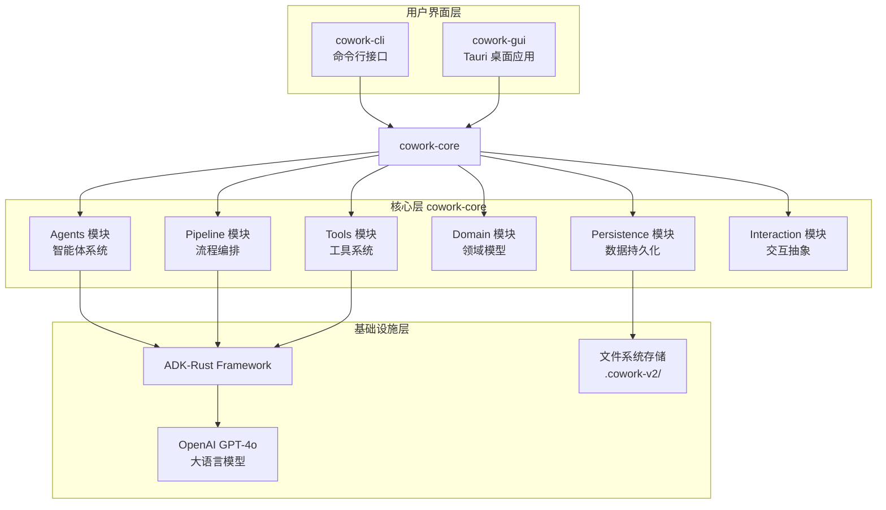
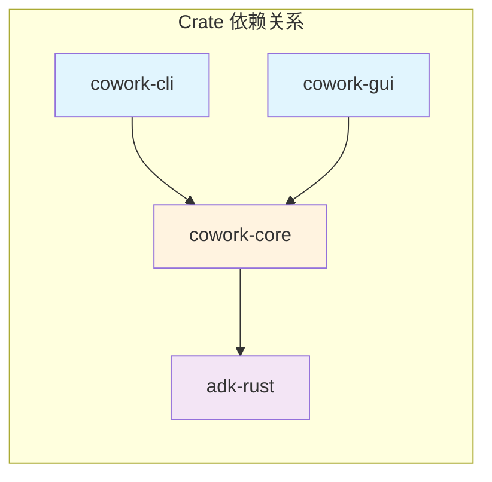
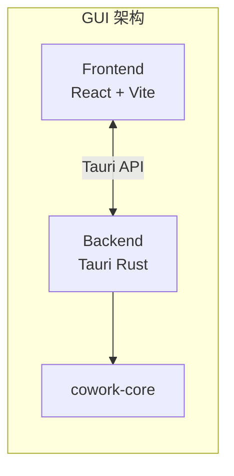
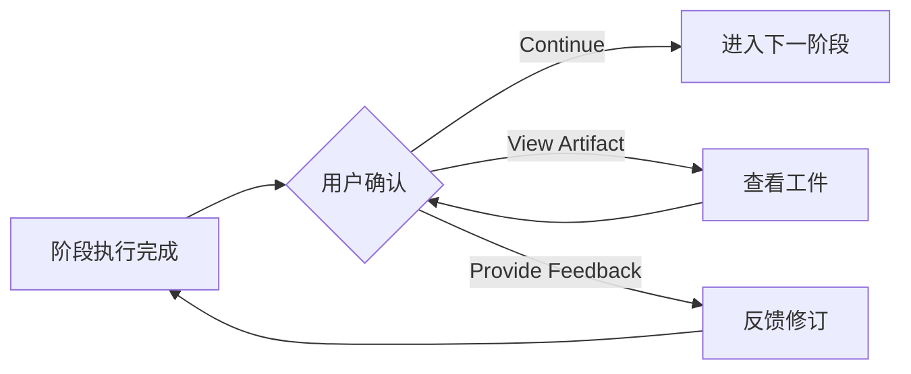
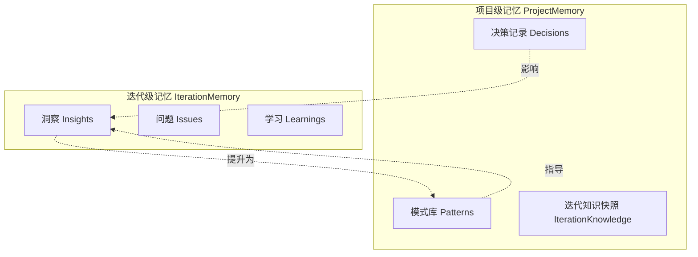

# Cowork Forge 系统架构概述

你有没有想过，如果 AI 能够像一个真正的开发团队一样协作工作，软件开发会变成什么样？不是简单的代码补全，而是从需求分析到最终交付的完整流程。Cowork Forge 正是基于这样的愿景诞生的——它模拟了一个虚拟的软件开发团队，通过多个专业 Agent 的协作，将你的想法转化为生产就绪的软件系统。

## 系统定位

Cowork Forge 是一个基于 Rust 和 ADK（Agent Development Kit）框架构建的 AI 驱动软件开发系统。它不是一个简单的代码生成工具，而是一个完整的"虚拟开发团队"——包含需求分析师、架构师、项目经理、开发工程师、测试工程师等不同角色的 Agent，它们通过结构化的协作流程，共同完成软件开发的各个阶段。

## 整体架构

让我们从整体视角来看看 Cowork Forge 的架构设计：



这个分层架构有几个显著特点：

**清晰的职责分离**：用户界面层只负责交互，核心层处理业务逻辑，基础设施层提供底层能力。这种分离使得系统易于扩展——你可以轻松添加新的交互方式（比如 Web 界面）而不影响核心逻辑。

**多入口设计**：同时支持 CLI 和 GUI 两种交互方式，满足不同场景的需求。CLI 适合自动化脚本和高级用户，GUI 提供更直观的可视化体验。

**框架抽象**：基于 ADK-Rust 框架构建，利用其提供的 Agent 构建、工具系统、LLM 集成等能力，专注于业务逻辑的实现。

## Crate 结构与职责

Cowork Forge 采用 Rust Workspace 组织代码，包含三个主要 Crate：



### cowork-core：核心库

这是整个系统的心脏，包含了所有的领域逻辑和核心实现。它的内部模块划分遵循了领域驱动设计的思想：

| 模块 | 职责 | 核心文件 |
|------|------|----------|
| **domain** | 领域模型定义 | `domain/project.rs`, `domain/iteration.rs`, `domain/memory.rs` |
| **pipeline** | 开发流程编排 | `pipeline/executor.rs`, `pipeline/stage_executor.rs` |
| **agents** | Agent 构建与管理 | `agents/mod.rs`, `agents/hitl.rs`, `agents/iterative_assistant.rs` |
| **tools** | 工具系统实现 | `tools/file_tools.rs`, `tools/data_tools.rs`, `tools/artifact_tools.rs` 等 |
| **instructions** | 提示词模板 | `instructions/*.rs`（每个阶段一个文件） |
| **persistence** | 数据持久化 | `persistence/project_store.rs`, `persistence/iteration_store.rs` |
| **interaction** | 交互抽象层 | `interaction/mod.rs`, `interaction/cli.rs`, `interaction/tauri.rs` |
| **llm** | LLM 配置与管理 | `llm/config.rs`, `llm/rate_limiter.rs` |

### cowork-cli：命令行接口

提供简洁的命令行交互方式，主要命令包括：

- `cowork init <name>` - 初始化新项目
- `cowork iter --title <title> --description <desc>` - 创建并执行迭代
- `cowork list` - 列出所有迭代
- `cowork continue <iteration_id>` - 继续暂停的迭代
- `cowork status` - 查看项目状态

CLI 的设计哲学是**简单直接**——用最少的命令完成最常用的操作，同时将复杂逻辑下沉到 core 层。

### cowork-gui：桌面应用

基于 Tauri 框架构建的跨平台桌面应用，提供可视化界面：



GUI 层通过 `TauriBackend` 实现了 `InteractiveBackend` trait，将 CLI 的文本交互转化为图形界面元素。

## 核心设计思想

### 1. 迭代即核心

Cowork Forge 将软件开发建模为**可继承的迭代单元**，这是系统最核心的设计思想。每个迭代是一个完整的开发周期，包含从需求到交付的所有工件。更重要的是，迭代之间可以建立继承关系——新的迭代可以选择性地复用历史迭代的成果。

这种设计的价值在于：
- **支持演进式开发**：软件不是一次性建成的，而是通过多次迭代逐步完善
- **降低变更成本**：小的需求变更不需要从头开始，基于已有迭代演进即可
- **保留历史上下文**：每个迭代都有完整的上下文，便于回溯和理解

### 2. Actor-Critic 质量保证

在关键阶段（PRD、Design、Plan、Coding），系统采用 Actor-Critic 模式确保输出质量：

```mermaid
sequenceDiagram
    participant Actor as Actor Agent
    participant Critic as Critic Agent
    participant Output as 输出产物

    loop 直到质量达标或达到最大迭代次数
        Actor->>Output: 生成内容
        Output->>Critic: 提交审查
        Critic->>Critic: 质量评估
        alt 质量不达标
            Critic->>Actor: 提供反馈
        else 质量达标
            Critic->>Output: 确认通过
        end
    end
```

这就像是一个有经验的开发者在写完代码后会进行自我审查，发现潜在问题并改进。Actor 负责"做"，Critic 负责"审"，两者协作产生更高质量的输出。

### 3. Human-in-the-Loop 人机协作

AI 不是万能的，关键决策需要人类参与。Cowork Forge 在每个关键阶段后都会暂停，等待用户确认：



这种人机协作模式确保了：
- **方向可控**：用户可以随时纠正 AI 的偏差
- **质量把关**：关键工件需要人工审查后才能进入下一阶段
- **灵活调整**：支持反馈修订，AI 会根据反馈重新生成内容

### 4. 双层记忆系统

为了让 AI 具备"长期记忆"能力，系统设计了双层记忆架构：



项目级记忆跨迭代持久化，包含重要的架构决策和可复用的模式；迭代级记忆记录当前迭代的具体洞察。这种设计让 AI 能够"记住"之前的决策，避免重复犯错。

## 数据流与存储

Cowork Forge 采用文件系统作为存储后端，数据结构如下：

```
.cowork-v2/
├── project.json                    # 项目元数据
├── iterations/
│   ├── iter-1-xxx.json            # 迭代元数据
│   └── iter-2-xxx.json
├── iterations/{id}/
│   ├── workspace/                 # 代码工作空间
│   ├── artifacts/                 # 生成的文档
│   │   ├── idea.md
│   │   ├── prd.md
│   │   ├── design.md
│   │   ├── plan.md
│   │   └── delivery_report.md
│   ├── data/                      # 结构化数据
│   │   ├── requirements.json
│   │   ├── feature_list.json
│   │   ├── design_spec.json
│   │   └── implementation_plan.json
│   ├── summaries/                 # 文档摘要（用于知识生成）
│   │   ├── idea_summary.txt
│   │   ├── prd_summary.txt
│   │   └── ...
│   └── memory/                    # 迭代记忆
│       └── memory.json
└── memory/
    └── project/
        └── memory.json            # 项目级记忆
```

这种存储设计的优势：
- **透明可查看**：所有数据都是纯文本，便于调试和理解
- **版本控制友好**：可以与 Git 结合，追踪变更历史
- **易于备份迁移**：简单的文件复制即可完成备份

## 安全设计

作为一个会执行代码和文件操作的 AI 系统，安全性是重中之重：

### 路径安全

```rust
fn validate_path_security_within_workspace(path: &str, workspace_dir: &Path) -> Result<PathBuf, String> {
    // 规则 1: 拒绝绝对路径
    if path_obj.is_absolute() { ... }
    
    // 规则 2: 拒绝父目录访问 (..)
    if path.contains("..") { ... }
    
    // 规则 3: 验证路径在工作空间内
    if !full_path_stripped.starts_with(&workspace_stripped) { ... }
}
```

### 命令执行安全

自动检测并阻止可能阻塞的长时间运行命令：

```rust
fn is_blocking_service_command(command: &str) -> bool {
    let blocking_patterns = vec![
        "http.server", "npm run dev", "npm start", 
        "uvicorn", "gunicorn", "cargo run", "vite", ...
    ];
    ...
}
```

### 工作空间隔离

每个迭代都有独立的工作空间，防止不同迭代之间的相互干扰。

## 技术栈

| 层级 | 技术选择 | 说明 |
|------|----------|------|
| 编程语言 | Rust | 类型安全、性能优异、并发友好 |
| AI 框架 | ADK-Rust | Agent 开发工具包 |
| LLM 模型 | OpenAI GPT-4o | 强大的推理和代码生成能力 |
| GUI 框架 | Tauri + React | 跨平台桌面应用 |
| 存储 | 文件系统 | 简单、透明、版本控制友好 |

## 关键特性总览

### ResilientAgent 错误恢复

系统引入了 `ResilientAgent` 包装器，为 Agent 执行提供自动错误恢复能力：

- 最多 3 次重试尝试
- 失败时用户可选择：重试、提供指导后重试、中止
- 流式输出期间的错误处理

### GotoStage 流程控制

`GotoStageTool` 允许 Agent 在检测到质量问题时跳转到之前的阶段重新执行：

- 支持 prd、design、plan、coding 阶段跳转
- 保留反馈历史，支持增量修正
- 避免 Pipeline 从头开始

### 流式输出

系统支持 LLM 输出的实时流式展示：

- 30 字符/块的节流控制
- 50ms 最小输出间隔
- 通过 `MessageLevel::Stream` 区分流式消息

### 智能起始阶段判定

对于演进迭代，系统会分析变更描述自动决定起始阶段：

- Bug 修复 → 从 Coding 开始
- 重构 → 从 Design 开始  
- 新功能 → 从 PRD 开始
- 架构调整 → 从 Design 开始

## 总结

Cowork Forge 的架构设计体现了几个关键思想：**迭代驱动**的开发模式、**Actor-Critic** 的质量保证、**人机协作**的交互方式、**双层记忆**的上下文管理。这些设计共同构成了一个完整的 AI 驱动软件开发平台。

这个架构的优势在于：
- **模块化**：清晰的模块划分，易于理解和维护
- **可扩展**：基于 Trait 的设计，方便添加新功能
- **安全可靠**：多层安全机制保护系统
- **灵活交互**：同时支持 CLI 和 GUI

在后续章节中，我们将深入探讨 Pipeline 流程、Agent 系统、工具系统等核心模块的设计与实现。