# Cowork Forge 整体架构设计

## 设计理念

Cowork Forge 基于"迭代驱动"的核心理念，构建了一个AI与人类协作的软件开发系统。系统通过模拟真实开发团队的角色分工和协作流程，将大型语言模型(LLM)的能力结构化、流程化，实现从创意到交付的全链路智能化开发。

## 核心设计原则

### 1. 迭代驱动
- **迭代是核心概念**：所有开发活动都在迭代单元内进行
- **支持渐进演进**：通过继承机制实现功能的增量开发
- **完整的生命周期**：每个迭代包含从需求到交付的完整流程

### 2. 角色化Agent
- **专业分工**：不同Agent负责不同阶段的专业工作
- **协作机制**：Agent间通过共享上下文和结构化数据协作
- **人机协作**：关键节点保留人类参与和决策权

### 3. 记忆系统
- **知识沉淀**：将开发过程中的决策和模式固化为可复用的知识
- **上下文感知**：基于历史记忆为当前开发提供上下文
- **持续学习**：迭代过程中不断积累和优化知识

### 4. 可扩展性
- **模块化设计**：各组件职责单一，接口清晰
- **插件机制**：支持自定义Agent、阶段和工具
- **多端支持**：统一的后端，支持多种前端交互

## 分层架构

```mermaid
graph TB
    subgraph "用户接口层 (Presentation)"
        CLI[CLI命令行]
        GUI[GUI桌面应用]
    end
    
    subgraph "交互抽象层 (Interaction)"
        Backend[InteractiveBackend]
        Event[事件总线]
    end
    
    subgraph "核心服务层 (Core)"
        Executor[迭代执行器]
        Pipeline[开发管道]
        StageEngine[阶段引擎]
        AgentRuntime[Agent运行时]
    end
    
    subgraph "领域模型层 (Domain)"
        Project[项目管理]
        Iteration[迭代控制]
        Memory[记忆管理]
        Artifact[制品管理]
    end
    
    subgraph "基础设施层 (Infrastructure)"
        LLMService[LLM服务]
        FileStore[文件存储]
        Config[配置管理]
    end
    
    CLI --> Backend
    GUI --> Backend
    Backend --> Executor
    Backend --> Event
    Event --> Executor
    Event --> AgentRuntime
    Executor --> Pipeline
    Pipeline --> StageEngine
    StageEngine --> AgentRuntime
    AgentRuntime --> Project
    AgentRuntime --> Iteration
    AgentRuntime --> Memory
    AgentRuntime --> Artifact
    Project --> FileStore
    Iteration --> FileStore
    Memory --> FileStore
    Artifact --> FileStore
    AgentRuntime --> LLMService
    Executor --> Config
```



## 核心组件说明

### 1. 用户接口层

**CLI (cowork-cli)**
```rust
// 基于clap的命令行接口
#[derive(Subcommand)]
enum Commands {
    Iter { /* 创建迭代 */ },
    List { /* 查看迭代列表 */ },
    Continue { /* 继续暂停的迭代 */ },
    Init { /* 初始化项目 */ },
    // ...
}
```

**GUI (cowork-gui)**
- 基于Tauri的桌面应用
- 提供可视化的开发流程展示
- 支持更友好的交互方式

### 2. 交互抽象层

**InteractiveBackend 特征**
```rust
#[async_trait]
pub trait InteractiveBackend: Send + Sync {
    async fn show_message(&self, level: MessageLevel, content: String);
    async fn request_input(&self, prompt: &str, options: Vec<InputOption>, initial_content: Option<String>) -> Result<InputResponse>;
    async fn show_progress(&self, task_id: String, progress: ProgressInfo);
    async fn submit_response(&self, request_id: String, response: String) -> Result<()>;
    fn event_bus(&self) -> Arc<EventBus>;
}
```

- 解耦核心逻辑与具体UI实现
- 支持异步交互和进度展示
- 提供统一的人机协作接口

### 3. 核心服务层

**迭代执行器 (IterationExecutor)**
- 管理迭代的完整生命周期
- 控制阶段执行顺序和状态转换
- 处理异常和重试逻辑
- 协调人机交互流程

**开发管道 (Pipeline)**
- 定义标准的开发阶段序列
- 支持从任意阶段开始执行
- 提供阶段执行上下文
- 处理阶段间的数据流转

**Agent运行时**
- 基于adk-rust框架构建
- 管理Agent的创建和执行
- 提供工具调用和LLM交互
- 控制Agent间的协作流程

### 4. 领域模型层

**项目管理 (Project)**
```rust
pub struct Project {
    pub id: String,
    pub name: String,
    pub created_at: DateTime<Utc>,
    pub updated_at: DateTime<Utc>,
    pub metadata: ProjectMetadata,
    pub current_iteration_id: Option<String>,
    pub iterations: Vec<IterationSummary>,
}
```

**迭代控制 (Iteration)**
```rust
pub struct Iteration {
    pub id: String,
    pub number: u32,
    pub title: String,
    pub description: String,
    pub base_iteration_id: Option<String>,
    pub inheritance: InheritanceMode,
    pub status: IterationStatus,
    // ...
}
```

**记忆管理 (Memory)**
- 项目级记忆：跨迭代的知识沉淀
- 迭代级记忆：当前迭代的上下文和洞察
- 智能查询：基于关键词的上下文检索

### 5. 基础设施层

**LLM服务**
- 抽象LLM调用和响应处理
- 支持多种LLM提供商
- 流式响应和错误处理
- 提示词管理和优化

**文件存储**
- 基于文件系统的简单持久化
- 结构化的目录和文件组织
- 原子性写入和备份机制

**配置管理**
- 支持文件和环境变量配置
- 灵活的LLM和服务配置
- 运行时参数调整

## 数据流和控制流

### 开发流程数据流


### 事件驱动机制


## 架构优势

### 1. **清晰的职责分离**
- 每一层的职责明确，依赖关系清晰
- 专注于单一职责，降低系统复杂度
- 便于独立测试和维护

### 2. **良好的可扩展性**
- 新增前端无需修改后端逻辑
- 新增阶段或Agent不影响现有流程
- 支持插件式功能扩展

### 3. **灵活的人机协作**
- 可配置的人机交互点
- 支持多种交互模式
- 适应不同开发场景

### 4. **强大的上下文管理**
- 记忆系统提供持久的上下文
- 迭代间上下文继承和传递
- 智能的历史信息查询

## 架构演变路径

1. **当前版本 (2.0)**
   - 基于迭代架构的完整实现
   - 标准化的Agent协作机制
   - 基础的人机交互支持

2. **短期演进**
   - 增强GUI界面的可视化能力
   - 完善错误处理和恢复机制
   - 优化记忆系统的查询和索引

3. **中期目标**
   - 支持多项目和团队协作
   - 集成版本控制和CI/CD
   - 开发自定义插件机制

4. **长期愿景**
   - 分布式Agent协作
   - 实时多用户协作
   - 智能化的开发决策支持