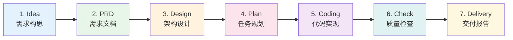
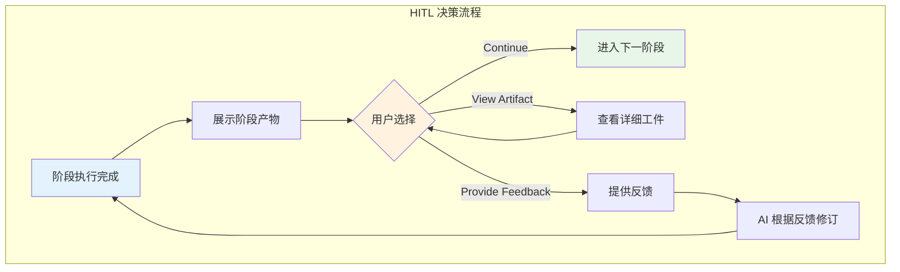
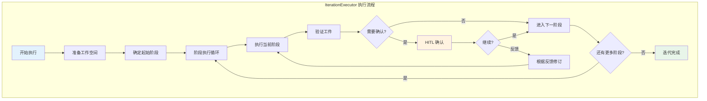
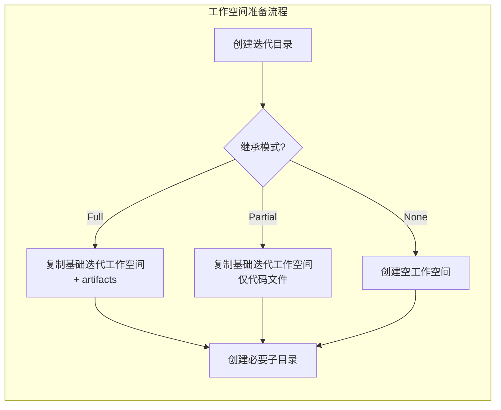
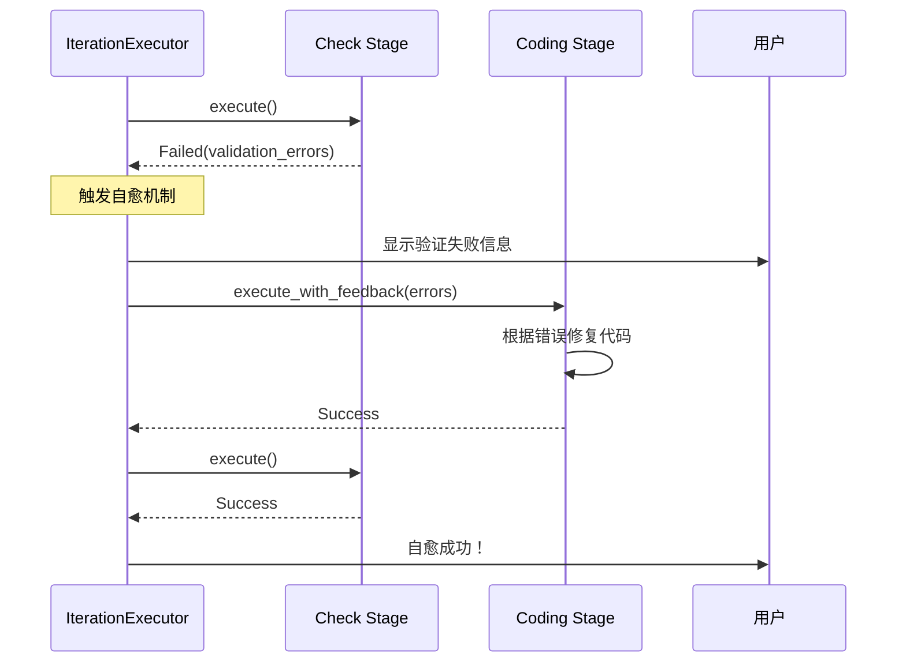
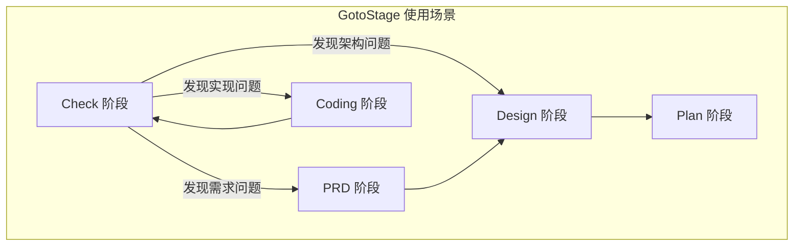
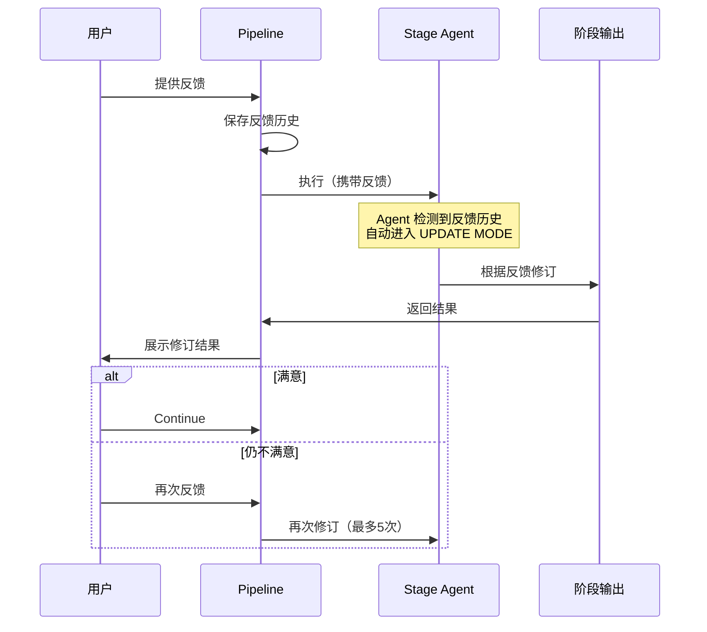

# Pipeline 流程设计与实现

你有没有想过，为什么很多 AI 编程工具只能生成零散的代码片段，而无法完成一个完整的项目？问题的关键在于缺乏结构化的流程。Cowork Forge 的 Pipeline 正是为了解决这个痛点而设计的——它将软件开发过程建模为七个明确的阶段，每个阶段有清晰的输入输出，形成一个完整的价值流。

## Pipeline 概览

Cowork Forge 采用经典的瀑布模型作为基础框架，但加入了 AI 驱动的自动化和人工确认的灵活性：



这七个阶段覆盖了软件开发的完整生命周期。让我们深入看看每个阶段的具体职责：

| 阶段 | 职责 | 关键输出 | 确认方式 |
|------|------|----------|----------|
| **Idea** | 理解用户需求，生成初步想法文档 | `idea.md` | HITL 确认 |
| **PRD** | 细化需求，创建完整的产品需求文档 | `prd.md`, `requirements.json` | HITL 确认 |
| **Design** | 设计系统架构和技术方案 | `design.md`, `design_spec.json` | HITL 确认 |
| **Plan** | 制定实现计划，分解任务 | `plan.md`, `implementation_plan.json` | HITL 确认 |
| **Coding** | 编写代码实现 | 代码文件 | HITL 确认 |
| **Check** | 质量检查和测试 | `check_report.md` | 自动执行 |
| **Delivery** | 生成交付报告 | `delivery_report.md` | 自动执行 |

## 阶段设计哲学

### 为什么需要七个阶段？

你可能会问，为什么不能简化流程，让 AI 一口气完成所有工作？这里有几个关键考量：

**分而治之降低复杂度**：每个阶段只关注一个核心问题。PRD 阶段只关注"做什么"，Design 阶段只关注"怎么做"，Coding 阶段只关注"具体实现"。这种分离让 AI 能够更专注，也更容易产生高质量的输出。

**人工介入的关键节点**：前五个阶段都需要人工确认，这是为了确保方向正确。想象一下，如果 AI 在误解需求的情况下直接写了几千行代码，那将是灾难性的。通过在关键节点暂停，用户可以及时纠正偏差。

**可追溯的工件链**：每个阶段产生明确的文档和结构化数据，形成完整的追溯链。当出现问题时，可以回溯到具体阶段查看当时的决策依据。

### HITL（Human-in-the-Loop）设计

人机协作是 Pipeline 的核心设计理念。在关键阶段完成后，系统会暂停并等待用户决策：



用户有三个选择：
- **Continue**：满意当前结果，进入下一阶段
- **View Artifact**：查看生成的详细文档，了解更多细节
- **Provide Feedback**：对当前结果提出修改意见，AI 会根据反馈重新生成

这种设计让用户始终掌控全局，同时充分利用 AI 的自动化能力。

## Pipeline 核心组件

### Stage Trait：阶段的抽象

所有阶段都实现了统一的 `Stage` trait，这是 Pipeline 可扩展的基础：

```rust
#[async_trait::async_trait]
pub trait Stage: Send + Sync {
    /// 阶段名称
    fn name(&self) -> &str;

    /// 阶段描述
    fn description(&self) -> &str;

    /// 是否需要人工确认
    fn needs_confirmation(&self) -> bool { false }

    /// 执行阶段逻辑
    async fn execute(
        &self,
        ctx: &PipelineContext,
        interaction: Arc<dyn InteractiveBackend>,
    ) -> StageResult;

    /// 带反馈执行（用于修订场景）
    async fn execute_with_feedback(
        &self,
        ctx: &PipelineContext,
        interaction: Arc<dyn InteractiveBackend>,
        feedback: &str,
    ) -> StageResult;
}
```

这个设计的精妙之处在于**统一抽象**：无论是简单的 Check 阶段还是复杂的 Coding 阶段，都遵循相同的接口。这让我们可以：
- 轻松添加新阶段
- 统一处理阶段执行和错误恢复
- 支持条件执行（比如跳过某些阶段）

### PipelineContext：执行上下文

`PipelineContext` 贯穿整个 Pipeline 执行过程，携带所有必要的信息：

```rust
pub struct PipelineContext {
    pub project: Project,
    pub iteration: Iteration,
    pub workspace_dir: PathBuf,
    pub artifacts_dir: PathBuf,
    pub data_dir: PathBuf,
    pub llm_config: LlmConfig,
}
```

上下文对象确保了：
- **状态一致性**：所有阶段访问的是同一套项目、迭代数据
- **路径管理**：统一管理工作空间、工件、数据目录
- **配置传递**：LLM 配置等参数一次性传递

### IterationExecutor：迭代执行器

`IterationExecutor` 是 Pipeline 的"导演"，负责编排整个执行流程：



执行器处理的关键逻辑包括：
- **断点续传**：支持从任意阶段继续执行
- **工件验证**：确保每个阶段都产生了预期的输出
- **重试机制**：阶段执行失败时自动重试（最多3次）
- **反馈循环**：支持用户反馈和 AI 修订的循环（最多5次）

## 阶段执行细节

### 阶段执行流程

每个阶段的执行遵循固定的模式：

```rust
pub async fn execute_stage_with_instruction(
    ctx: &PipelineContext,
    interaction: Arc<dyn InteractiveBackend>,
    stage_name: &str,
    instruction: &str,
    feedback: Option<&str>,
) -> StageResult {
    // 1. 构建 Agent
    let agent = create_agent_for_stage(stage_name, ctx)?;

    // 2. 准备会话状态
    let session_state = prepare_session_state(ctx, feedback)?;

    // 3. 执行 Agent（支持流式输出）
    let result = agent.execute(&instruction, session_state, ...).await?;

    // 4. 验证执行结果
    validate_stage_output(ctx, stage_name)?;

    // 5. 返回阶段结果
    Ok(StageOutput { ... })
}
```

这个流程确保了：
- **一致性**：所有阶段使用相同的执行框架
- **可观测性**：可以追踪每个阶段的执行状态
- **可恢复性**：失败时可以从中断点恢复

### 流式输出与节流控制

系统支持 LLM 输出的实时流式展示，提供更好的用户体验：

```rust
// 流式输出节流配置
const STREAM_CHUNK_SIZE: usize = 30;    // 每块 30 字符
const MIN_STREAM_INTERVAL_MS: u64 = 50;  // 最小间隔 50ms

async fn handle_stream_event(event: Event, interaction: &dyn InteractiveBackend) {
    match event {
        Event::Content(content) => {
            // 通过 Stream 消息级别输出
            interaction.show_message(
                MessageLevel::Stream,
                content.text,
                Some(agent_name)
            ).await;
        }
        // ...
    }
}
```

流式输出的特点：
- **实时反馈**：用户可以看到 AI 的"思考过程"
- **节流控制**：避免 UI 刷新过于频繁
- **消息级别区分**：`MessageLevel::Stream` 专门用于流式内容

### 智能起始阶段判定

对于演进迭代（Evolution Iteration），系统会智能判定从哪个阶段开始执行：

```rust
impl Iteration {
    pub fn determine_start_stage(&self) -> String {
        match self.inheritance {
            InheritanceMode::None => "idea".to_string(),
            InheritanceMode::Full | InheritanceMode::Partial => {
                // 分析变更描述，智能决定起始阶段
                analyze_change_scope(&self.description)
            }
        }
    }
}

fn analyze_change_scope(description: &str) -> String {
    let desc_lower = description.to_lowercase();

    if desc_lower.contains("fix") || desc_lower.contains("bug") {
        "coding".to_string()      // Bug 修复：从 Coding 开始
    } else if desc_lower.contains("refactor") || desc_lower.contains("重构") {
        "design".to_string()       // 重构：从 Design 开始
    } else if desc_lower.contains("feature") || desc_lower.contains("功能") {
        "prd".to_string()          // 新功能：从 PRD 开始
    } else if desc_lower.contains("architecture") || desc_lower.contains("架构") {
        "design".to_string()       // 架构调整：从 Design 开始
    } else {
        "idea".to_string()         // 默认：从 Idea 开始
    }
}
```

这种智能判定避免了不必要的重复工作。如果只是修复一个小 Bug，不需要重新走完整的需求分析和架构设计流程。

## 工作空间管理

### 工作空间准备

在执行 Pipeline 之前，系统需要准备工作空间：



三种继承模式的区别：

| 模式 | 工作空间 | 工件 | 起始阶段 | 适用场景 |
|------|----------|------|----------|----------|
| None | 空 | 无 | Idea | 全新项目 |
| Full | 复制 | 复制 | 智能判定 | 功能增强 |
| Partial | 复制代码 | 不复制 | Idea | 架构重构 |

### 工件验证机制

每个阶段完成后，系统会验证是否产生了预期的工件：

```rust
async fn check_artifact_exists(&self, stage_name: &str, workspace: &Path) -> bool {
    match stage_name {
        "idea" => artifacts_dir.join("idea.md").exists(),
        "prd" => artifacts_dir.join("prd.md").exists() ||
                 iteration_dir.join("data/requirements.json").exists(),
        "design" => artifacts_dir.join("design.md").exists() ||
                    iteration_dir.join("data/design_spec.json").exists(),
        "plan" => artifacts_dir.join("plan.md").exists() ||
                  iteration_dir.join("data/implementation_plan.json").exists(),
        "coding" => {
            // 检查代码文件是否存在
            // 并检查是否有 TODO/FIXME/占位符等问题
            self.check_code_quality(workspace).await
        },
        "delivery" => artifacts_dir.join("delivery_report.md").exists(),
        _ => true,
    }
}
```

### 代码质量检查

对于 Coding 阶段，系统会执行更严格的质量检查：

```rust
fn check_code_quality(&self, workspace: &Path) -> bool {
    let code_extensions = ["rs", "js", "jsx", "ts", "tsx", "py", "java", "go", ...];
    let mut has_code_files = false;
    let mut issues = Vec::new();

    // 遍历代码文件
    for file in find_code_files(workspace, &code_extensions) {
        let content = fs::read_to_string(&file)?;

        // 检查空文件
        if content.trim().is_empty() {
            issues.push(format!("Empty file: {}", file.display()));
        }

        // 检查 TODO/FIXME
        if content.to_lowercase().contains("todo:") {
            issues.push(format!("TODO found in: {}", file.display()));
        }

        // 检查占位符代码
        let placeholder_patterns = ["todo: implement", "// placeholder", ...];
        for pattern in &placeholder_patterns {
            if content.to_lowercase().contains(pattern) {
                issues.push(format!("Placeholder in: {}", file.display()));
            }
        }
    }

    has_code_files && issues.is_empty()
}
```

## 错误处理与恢复

### 错误恢复与自愈机制

IterationExecutor 内置了多层错误恢复能力，包括阶段重试和自愈机制：

#### 阶段重试机制

每个阶段执行失败时会自动重试（最多 3 次）：

```rustnconst MAX_STAGE_RETRIES: u32 = 3;
const RETRY_DELAY_MS: u64 = 2000;

for attempt in 0..MAX_STAGE_RETRIES {
    if attempt > 0 {
        interaction.show_message(
            MessageLevel::Warning,
            format!("Stage '{}' retry {}/{}...", stage_name, attempt, MAX_STAGE_RETRIES - 1),
        ).await;
        tokio::time::sleep(Duration::from_millis(RETRY_DELAY_MS)).await;
    }

    match stage.execute(&ctx, interaction.clone()).await {
        StageResult::Success(path) => return Ok(path),
        StageResult::Failed(e) => {
            last_error = Some(e);
            continue;
        }
    }
}
```

#### Check 阶段自愈机制

当 Check 阶段失败时，系统会尝试自动修复问题：



这种自愈机制允许系统在遇到验证错误时自动返回 Coding 阶段进行修复，而不是直接失败：

```rustn// Check 阶段失败后的自愈逻辑
if stage_name == "check" {
    let feedback = format!(
        "Validation failed with the following issues:\n\n{}\n\nPlease fix these issues in the code.", 
        error
    );
    
    // 返回 Coding 阶段修复问题
    let coding_stage = CodingStage;
    match coding_stage.execute_with_feedback(&ctx, interaction.clone(), &feedback).await {
        StageResult::Success(_) => {
            // 修复成功，重新运行 Check
            match stage.execute(&ctx, interaction.clone()).await {
                StageResult::Success(_) => {
                    // 自愈成功！
                }
                // ...
            }
        }
        // ...
    }
}
```

#### 用户反馈循环

对于关键阶段（Idea、PRD、Design、Plan、Coding），系统支持用户反馈循环：

```rustnconst MAX_FEEDBACK_LOOPS: u32 = 5;

loop {
    let result = if let Some(ref feedback) = current_feedback {
        stage.execute_with_feedback(&ctx, interaction.clone(), feedback).await
    } else {
        stage.execute(&ctx, interaction.clone()).await
    };
    
    match result {
        StageResult::Success(_) => break,
        // 用户可以提供反馈让 Agent 修订
        // ...
    }
}
```
const RETRY_DELAY_MS: u64 = 2000;

for attempt in 0..MAX_STAGE_RETRIES {
    if attempt > 0 {
        interaction.show_message(
            MessageLevel::Warning,
            format!("Stage '{}' retry {}/{}...", stage_name, attempt, MAX_STAGE_RETRIES - 1),
            None,
        ).await;
        tokio::time::sleep(Duration::from_millis(RETRY_DELAY_MS)).await;
    }

    match stage.execute(&ctx, interaction.clone()).await {
        StageResult::Success(path) => return Ok(path),
        StageResult::Failed(e) => {
            last_error = Some(e);
            continue;
        }
    }
}
```

### 断点续传机制

Pipeline 支持从任意阶段继续执行：

```rust
pub async fn continue_iteration(&self, iteration_id: &str) -> Result<()> {
    let iteration = self.iteration_store.load(iteration_id)?;

    // 验证状态
    if iteration.status != IterationStatus::Paused {
        return Err(Error::InvalidState("Iteration is not paused"));
    }

    // 从当前阶段继续
    let current_stage = iteration.current_stage
        .ok_or_else(|| Error::InvalidState("No current stage"))?;

    // 恢复执行
    self.execute_pipeline(&iteration, Some(&current_stage)).await
}
```

断点续传的价值：
- **应对中断**：用户可以暂停执行，稍后继续
- **增量修正**：发现某个阶段有问题时，可以回到该阶段重新执行
- **灵活调度**：长时间运行的 Pipeline 可以分多次完成

## GotoStage 流程控制

### 动态阶段跳转

`GotoStageTool` 允许 Agent 在检测到质量问题时跳转到之前的阶段重新执行：

```rust
pub struct GotoStageTool;

impl Tool for GotoStageTool {
    fn name(&self) -> &str { "goto_stage" }

    fn description(&self) -> &str {
        "Jump to a specific stage in the pipeline when quality issues are detected"
    }

    fn parameters(&self) -> Value {
        json!({
            "type": "object",
            "required": ["stage_name"],
            "properties": {
                "stage_name": {
                    "type": "string",
                    "enum": ["prd", "design", "plan", "coding"],
                    "description": "Target stage name"
                },
                "reason": {
                    "type": "string",
                    "description": "Reason for jumping to this stage"
                }
            }
        })
    }

    async fn execute(&self, args: Value) -> Result<Value, ToolError> {
        let stage_name = args["stage_name"].as_str().unwrap();
        let reason = args["reason"].as_str().unwrap_or("No reason provided");

        // 设置恢复阶段
        set_resume_stage(stage_name).await?;

        Ok(json!({
            "success": true,
            "message": format!("Will resume from {} stage", stage_name)
        }))
    }
}
```

### 使用场景

GotoStage 在以下场景特别有用：

1. **Check 阶段发现问题**：质量检查发现架构问题，跳回 Design 阶段
2. **需求变更**：发现需求理解有误，跳回 PRD 阶段
3. **实现偏差**：代码实现偏离设计，跳回 Plan 或 Coding 阶段



## 反馈循环机制

### 反馈处理流程

当用户对阶段结果不满意时，可以发起反馈修订：



### UPDATE MODE 设计

Agent 通过检测反馈历史自动进入 UPDATE MODE：

```rust
// 在提示词中动态添加模式指示
if !feedback_history.is_empty() {
    instruction.push_str("\n\n## UPDATE MODE\n你正在根据用户反馈修订已有内容...");
    instruction.push_str("\n\n历史反馈:\n");
    for feedback in feedback_history {
        instruction.push_str(&format!("- {}\n", feedback));
    }
} else {
    instruction.push_str("\n\n## NEW MODE\n你正在从零开始创建内容...");
}
```

### 反馈历史持久化

反馈历史会被保存，支持跨阶段查看：

```
.cowork-v2/iterations/{id}/session/feedback.json
```

```json
{
    "feedbacks": [
        {
            "stage": "prd",
            "timestamp": "2024-01-15T10:30:00Z",
            "content": "需要增加用户认证功能的需求",
            "iteration": 1
        }
    ]
}
```

## Pipeline 的扩展性

### 添加新阶段

添加新阶段只需要实现 `Stage` trait：

```rust
pub struct NewStage;

#[async_trait::async_trait]
impl Stage for NewStage {
    fn name(&self) -> &str { "new_stage" }

    fn description(&self) -> &str { "新阶段描述" }

    fn needs_confirmation(&self) -> bool { true }

    async fn execute(
        &self,
        ctx: &PipelineContext,
        interaction: Arc<dyn InteractiveBackend>,
    ) -> StageResult {
        // 阶段逻辑
        let agent = create_new_stage_agent(&ctx.llm_config)?;
        let result = agent.execute(...).await?;
        Ok(result)
    }

    async fn execute_with_feedback(
        &self,
        ctx: &PipelineContext,
        interaction: Arc<dyn InteractiveBackend>,
        feedback: &str,
    ) -> StageResult {
        // 带反馈的执行逻辑
        ...
    }
}
```

然后在 Pipeline 配置中注册新阶段即可。

## 总结

Cowork Forge 的 Pipeline 设计体现了**结构化流程**与**灵活执行**的平衡。七个阶段覆盖完整的软件开发生命周期，HITL 机制确保人工可控，智能起始阶段判定提高效率，反馈循环支持增量修正。

关键特性：

1. **阶段重试与自愈**：阶段失败自动重试（3次），Check 失败后自动返回 Coding 修复
2. **GotoStage**：动态阶段跳转，避免从头开始
3. **流式输出**：实时展示 AI 思考过程，带节流控制
4. **智能起始**：根据变更描述自动判定起始阶段
5. **反馈循环**：最多 5 次反馈修订，支持增量更新

这个设计的核心思想是：**AI 负责执行，人类负责决策**。Pipeline 提供了清晰的执行框架，但关键决策点始终由人类掌控。这种人机协作模式既发挥了 AI 的自动化能力，又保留了人类的判断力和创造力。

在下一章中，我们将深入探讨 Agent 系统的设计——Pipeline 的执行者，以及它们如何实现各个阶段的具体任务。