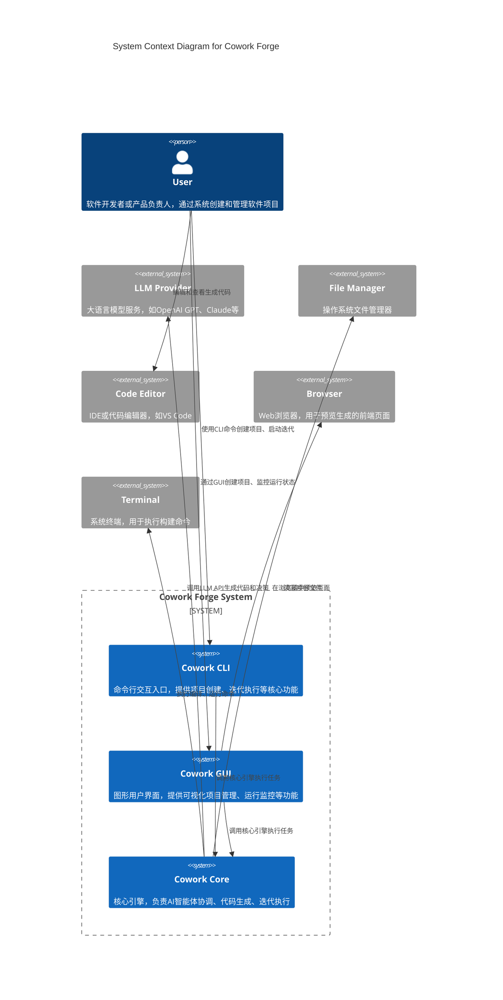
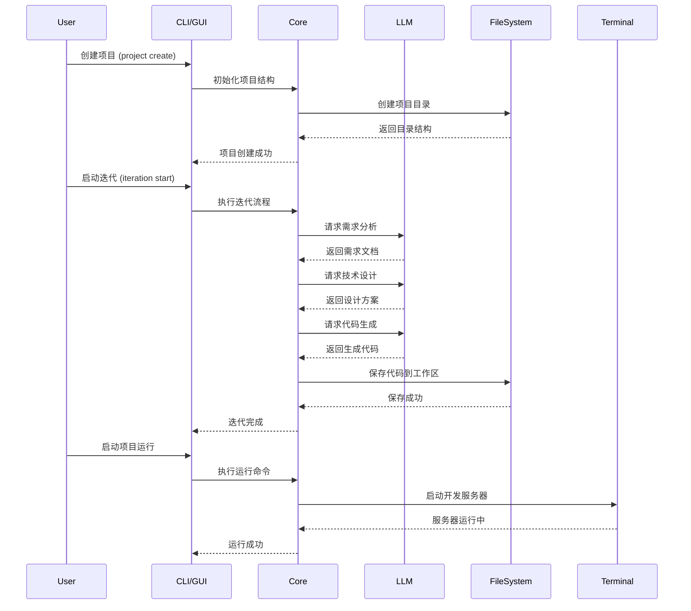

# Cowork Forge 系统上下文

## 1. 系统概述

Cowork Forge 是一个基于 Rust 的 AI 驱动软件开发系统，它模拟了一个完整的虚拟开发团队，通过多智能体协作将用户想法转化为可交付的软件产品。系统采用迭代式开发流程，支持从需求分析到代码交付的完整软件生命周期。

## 2. 系统上下文图

## 3. 主要参与者

| 参与者 | 描述 | 交互方式 |
|--------|------|----------|
| 产品负责人 | 提出软件需求，定义产品愿景 | CLI命令或GUI输入 |
| AI架构师 | 分析需求，设计技术方案 | 自动参与Design阶段 |
| AI工程师 | 实现代码生成和优化 | 自动参与Coding阶段 |
| AI测试工程师 | 验证代码质量和功能正确性 | 自动参与Check阶段 |
| 项目经理 | 协调迭代计划和管理交付 | 自动参与Plan阶段 |

## 4. 外部系统集成

### 4.1 大语言模型 (LLM Provider)

Cowork Forge 通过统一的 LLM 配置层与各种大语言模型集成：

- **支持的模型**: OpenAI GPT-4/GPT-3.5、Claude、Gemini 等
- **配置方式**: 通过 `config.toml` 文件配置 API 端点和密钥
- **主要用途**: 代码生成、需求分析、技术设计、决策推理

### 4.2 文件系统

- **项目存储**: 每个项目独立目录，包含迭代历史和交付产物
- **迭代快照**: 保存每个迭代的完整状态，支持回溯和复现
- **交付产物**: 最终代码可交付到指定目录

### 4.3 浏览器

- **前端预览**: 开发服务器启动后，通过 iframe 在 GUI 中实时预览
- **热重载**: 支持开发模式下的热更新预览

## 5. 用户使用流程

## 6. 质量属性

| 质量属性 | 描述 | 保障措施 |
|----------|------|----------|
| 可用性 | 系统需保持高可用，支持随时启动迭代 | 状态持久化、本地优先 |
| 可扩展性 | 支持新增智能体类型和工具 | 模块化架构、插件化设计 |
| 可维护性 | 代码结构清晰，易于理解和修改 | 分层架构、领域驱动设计 |
| 安全性 | 保护用户代码和配置隐私 | 沙箱执行、权限控制 |
| 性能 | 快速响应用户操作 | 异步IO、增量更新 |

## 7. 系统边界说明

Cowork Forge 的系统边界清晰定义了内外交互：

- **内部**: 核心引擎 (cowork-core) 包含所有业务逻辑
- **外部**: 用户通过 CLI/GUI 交互，LLM 提供智能能力，文件系统存储数据
- **边界**: 通过明确定义的 API 接口通信，内部实现对外部透明
