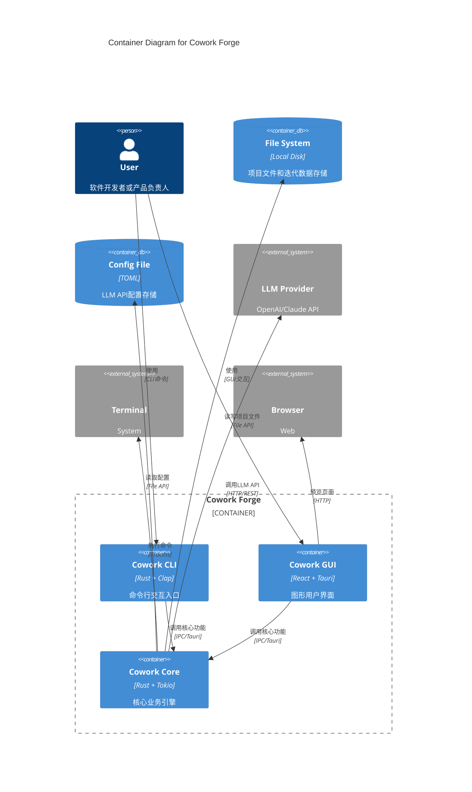
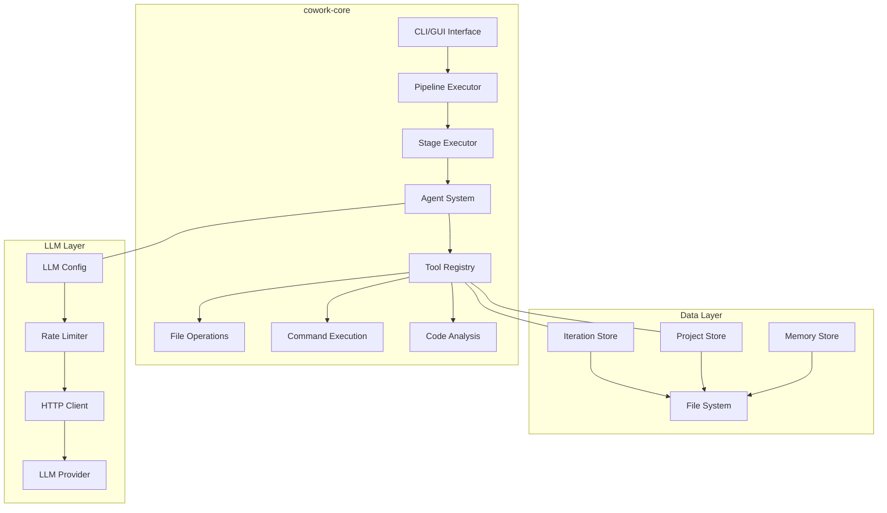
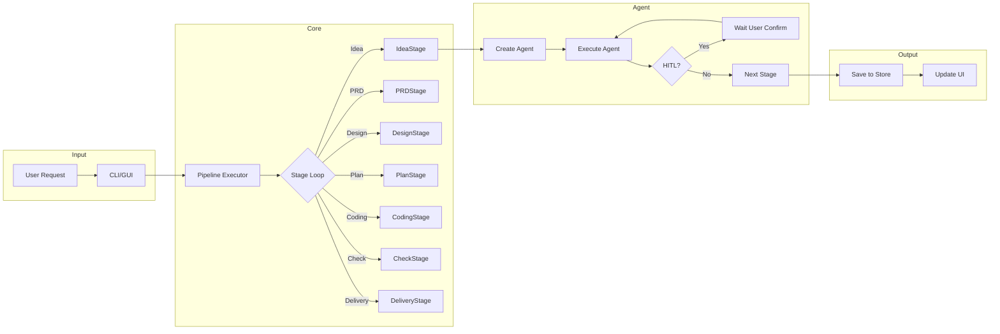
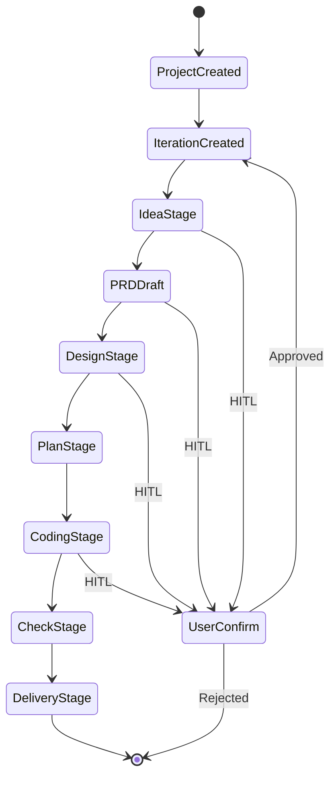
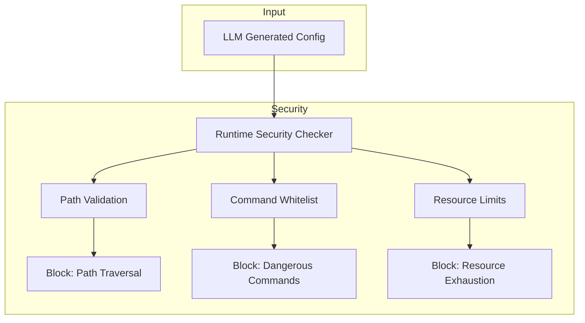

# Cowork Forge 架构设计

## 1. 架构概述

Cowork Forge 采用分层 + 模块化架构，整体分为三个核心层次：入口层、核心引擎层和交互层。这种架构设计确保了系统的高内聚低耦合，便于扩展和维护。

## 2. 容器图

## 3. 核心组件架构

### 3.1 工作空间结构

### 3.2 模块职责

| 模块 | 职责 | 关键类/函数 |
|------|------|-------------|
| `pipeline` | 迭代流程编排 | `PipelineExecutor`, `StageExecutor` |
| `agents` | AI智能体管理 | `IterativeAssistant`, `StageAgent` |
| `tools` | 工具注册与执行 | `ToolRegistry`, 各类Tool |
| `domain` | 领域实体定义 | `Iteration`, `Project`, `Memory` |
| `persistence` | 数据持久化 | `IterationStore`, `ProjectStore` |
| `llm` | LLM调用封装 | `LLMClient`, `RateLimiter` |
| `instructions` | 智能体提示词 | 各阶段指令模板 |
| `interaction` | 交互后端抽象 | `CliBackend`, `TauriBackend` |

## 4. 核心技术选型

### 4.1 技术栈矩阵

| 层次 | 技术 | 版本 | 用途 |
|------|------|------|------|
| 入口层 | Rust CLI | stable | 命令行工具 |
| 入口层 | Tauri | 2.x | 桌面应用框架 |
| 入口层 | React | 18.x | UI框架 |
| 核心层 | Rust | stable | 核心业务逻辑 |
| 核心层 | Tokio | 1.x | 异步运行时 |
| 核心层 | adk-rust | 0.2.x | AI智能体框架 |
| 数据层 | JSON | - | 结构化数据存储 |
| 数据层 | TOML | - | 配置文件格式 |

### 4.2 架构模式

**分层架构**:
- **入口层**: 处理用户输入，解析命令或GUI事件
- **核心层**: 包含所有业务逻辑，处理迭代执行
- **数据层**: 负责数据持久化和状态管理
- **交互层**: 抽象不同交互后端（CLI/GUI）

**异步架构**:
- 使用 Tokio 异步运行时处理 I/O 密集型任务
- LLM API 调用完全异步化
- 文件操作和进程管理采用异步 API

**事件驱动**:
- 智能体事件通过事件总线传播
- 前端通过 Tauri 事件监听后端状态变化
- 支持实时日志流式输出

## 5. 数据流设计

### 5.1 迭代执行数据流

### 5.2 状态管理

## 6. 扩展性设计

### 6.1 工具扩展

系统采用插件化工具注册机制，新增工具只需：

1. 实现 `Tool` trait
2. 在工具注册表中添加实例
3. 定义工具描述和参数模式

### 6.2 智能体扩展

新增智能体类型需要：

1. 在 `agents` 模块中添加智能体实现
2. 在 `instructions` 中定义提示词模板
3. 在 `pipeline/stages` 中集成新阶段

### 6.3 项目类型支持

通过 `TechStack` 抽象支持新项目类型：

- 检测项目特征（文件结构、配置文件）
- 匹配对应的生成器
- 生成类型感知的运行配置

## 7. 安全架构

### 7.1 运行时安全

### 7.2 安全策略

- **路径验证**: 防止路径遍历攻击
- **命令白名单**: 只允许安全的系统命令
- **资源限制**: 防止恶意代码耗尽系统资源
- **沙箱执行**: 代码生成在隔离环境中进行
