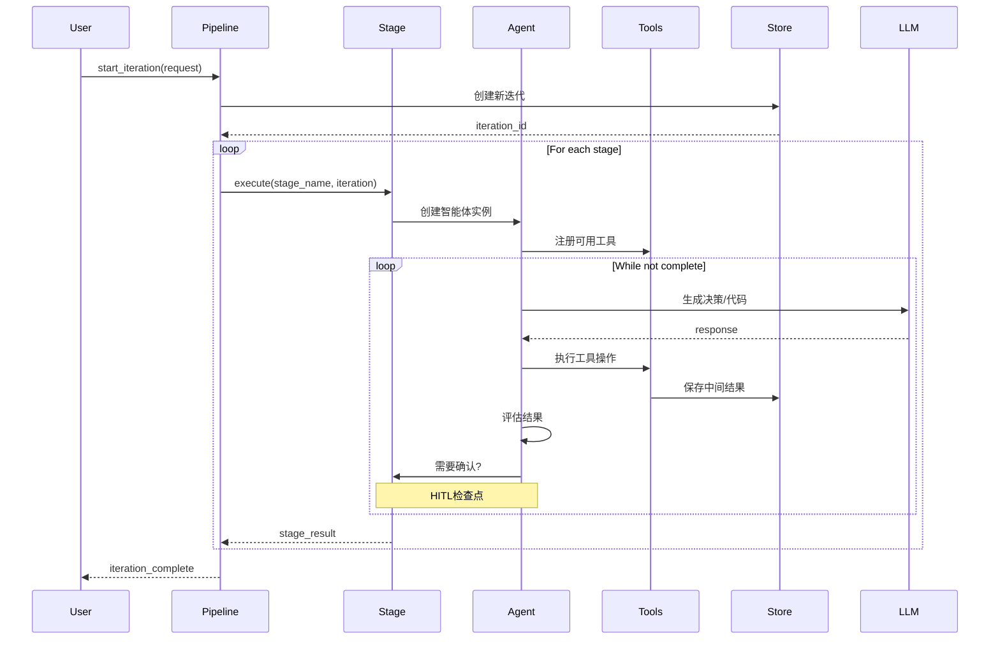
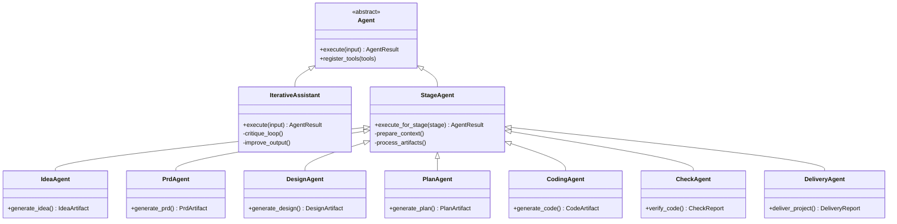
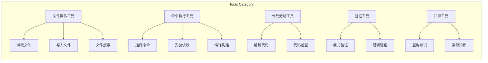
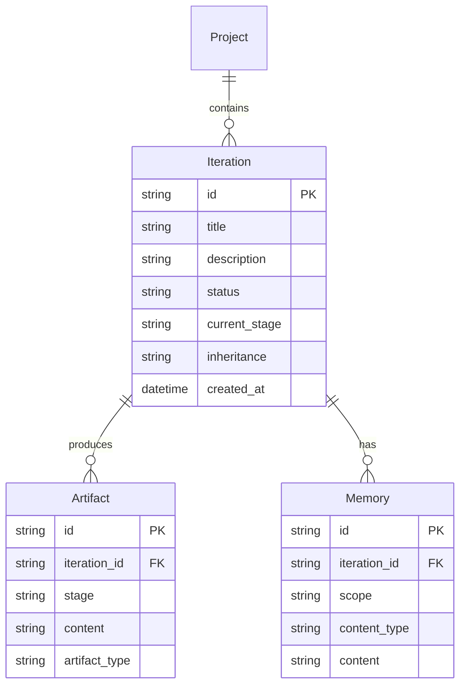
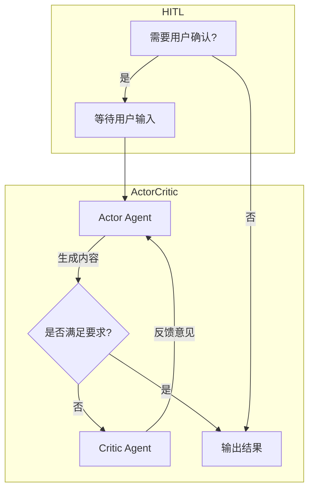
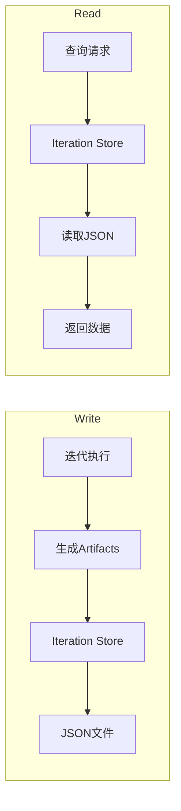
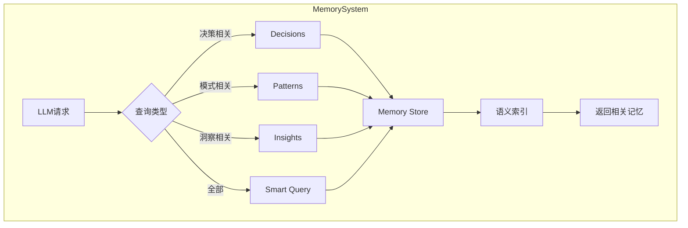
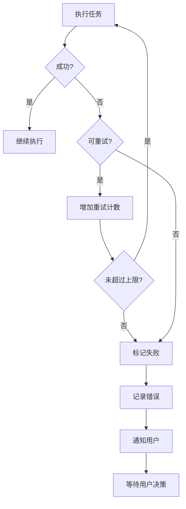

# Cowork Forge 模块与功能流程

## 1. 模块概览

Cowork Forge 的核心功能由多个模块协同完成，每个模块承担特定职责。本文档详细介绍各模块的功能及其交互流程。

## 2. 模块结构

```mermaid
graph TB
    subgraph "Entry Layer"
        CLI[CLI Entry] --> Core
        GUI[GUI Entry] --> Core
    end
    
    subgraph "cowork-core"
        Core[Pipeline Executor]
        
        subgraph "Agent System"
            Core --> Agents[Agents Module]
            Agents --> Iterative[Iterative Assistant]
            Agents --> Stage[Stage Agent]
        end
        
        subgraph "Tools"
            Core --> Tools[Tool Registry]
            Tools --> FileOps[File Operations]
            Tools --> CmdExec[Command Execution]
            Tools --> CodeAnalysis[Code Analysis]
            Tools --> Validation[Validation Tools]
            Tools --> Knowledge[Knowledge Tools]
        end
        
        subgraph "Domain"
            Core --> Domain[Domain Models]
            Domain --> Iteration[Iteration]
            Domain --> Project[Project]
            Domain --> Memory[Memory]
        end
        
        subgraph "Persistence"
            Core --> Persistence[Persistence Layer]
            Persistence --> IterStore[Iteration Store]
            Persistence --> ProjStore[Project Store]
            Persistence --> MemStore[Memory Store]
        end
    end
    
    subgraph "Infrastructure"
        LLM[LLM Provider]
        FS[File System]
    end
    
    Core --> LLM
    Core --> FS
```

## 3. 核心模块详解

### 3.1 Pipeline 模块

Pipeline 模块是整个系统的调度中心，负责协调各个阶段的执行。



### 3.2 Agents 模块

Agents 模块实现了多种专业AI智能体，用于不同阶段的软件开发任务。



### 3.3 Tools 模块

Tools 模块提供了智能体执行任务所需的各种工具能力。



### 3.4 Domain 模块

Domain 模块定义了系统的核心领域模型。



## 4. 迭代执行流程

### 4.1 七阶段流水线

Cowork Forge 采用七阶段迭代模型，每个阶段有明确的输入输出：

```mermaid
flowchart LR
    subgraph Stage1[Idea 阶段]
        I1[用户需求] --> I2[AI生成创意]
        I2 --> I3[创意文档]
    end
    
    subgraph Stage2[PRD 阶段]
        P1[创意文档] --> P2[AI分析需求]
        P2 --> P3[需求规格说明]
    end
    
    subgraph Stage3[Design 阶段]
        D1[需求规格] --> D2[AI设计架构]
        D2 --> D3[技术设计方案]
    end
    
    subgraph Stage4[Plan 阶段]
        Pl1[设计方案] --> Pl2[AI规划任务]
        Pl2 --> Pl3[实现计划]
    end
    
    subgraph Stage5[Coding 阶段]
        C1[实现计划] --> C2[AI生成代码]
        C2 --> C3[代码产物]
    end
    
    subgraph Stage6[Check 阶段]
        Ch1[代码产物] --> Ch2[AI检查验证]
        Ch2 --> Ch3[检查报告]
    end
    
    subgraph Stage7[Delivery 阶段]
        De1[检查报告] --> De2[AI整理交付]
        De2 --> De3[最终交付物]
    end
    
    I3 --> P1
    P3 --> D1
    D3 --> Pl1
    Pl3 --> C1
    C3 --> Ch1
    Ch3 --> De1
```



### 4.2 Actor-Critic 模式

在 PRD、Design、Plan、Coding 阶段，采用 Actor-Critic 双智能体循环优化：



## 5. 数据持久化流程

### 5.1 迭代数据存储



### 5.2 内存系统

系统维护两类内存：

- **执行内存**: 当前迭代的上下文和决策记录
- **项目内存**: 跨迭代的知识积累



## 6. 错误处理流程


