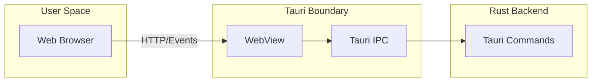
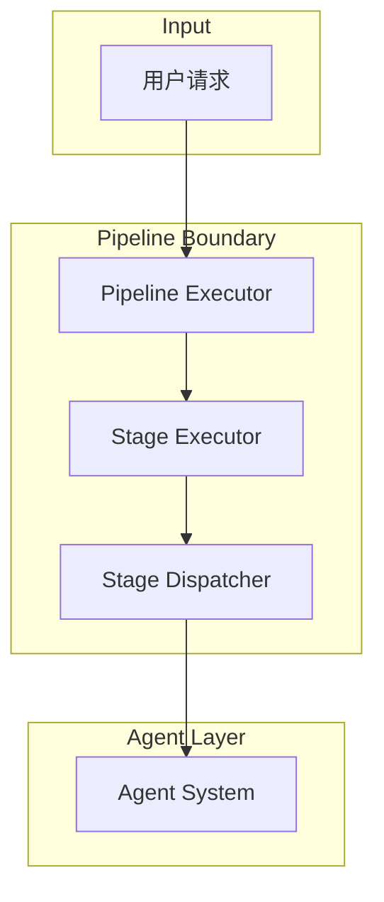
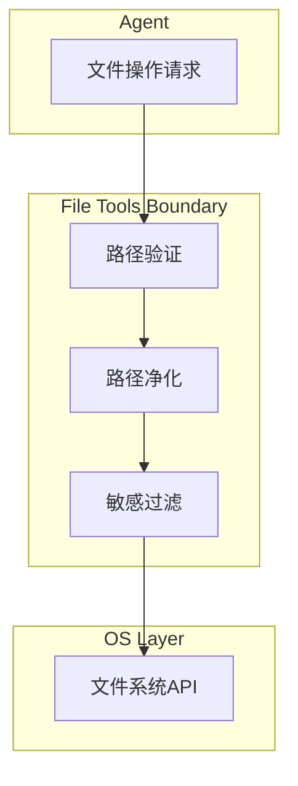
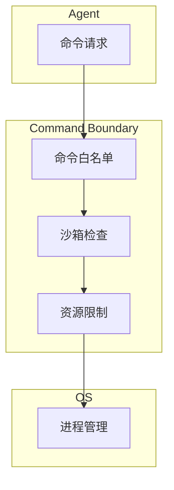
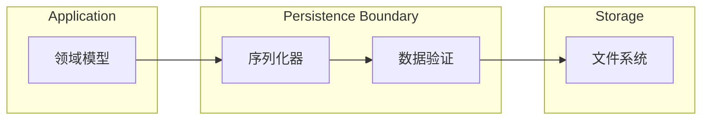
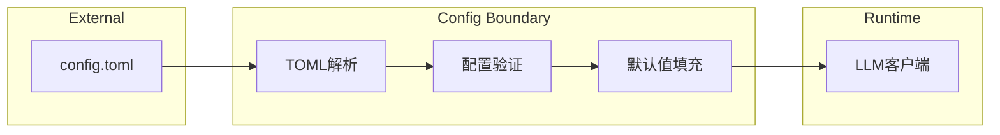
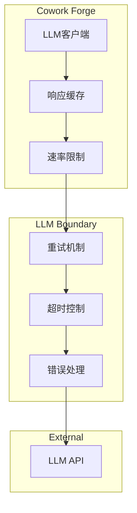
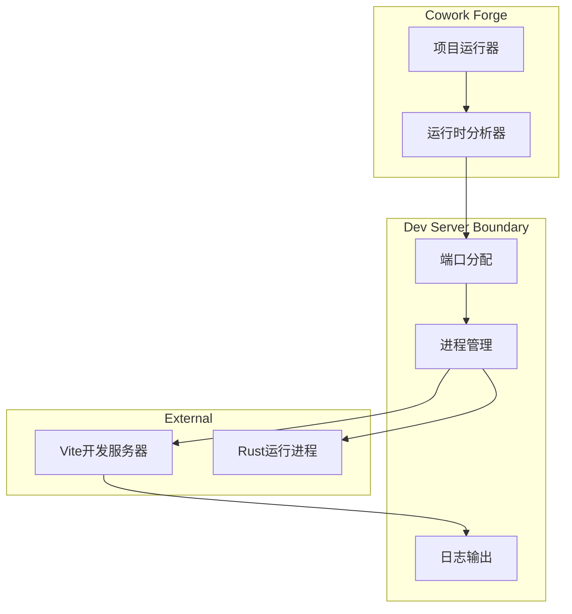

# Cowork Forge 系统边界

## 1. 边界概述

系统边界定义了 Cowork Forge 与外部环境之间的交互接口和数据流。清晰的边界划分有助于：
- 降低模块耦合度
- 明确责任边界
- 便于测试和维护
- 支持技术栈替换

## 2. 一级边界：用户交互边界

### 2.1 CLI 交互边界

```mermaid
graph LR
    subgraph "User Space"
        User[用户终端]
    end
    
    subgraph "CLI Boundary"
        CLI[CLI Entry]
        Parser[命令解析]
        Validator[输入验证]
    end
    
    subgraph "Core"
        Core[Core Engine]
    end
    
    User -->|Shell命令| CLI
    CLI --> Parser
    Parser --> Validator
    Validator --> Core
```

**边界接口**:
| 接口 | 说明 | 数据格式 |
|------|------|----------|
| `project create` | 创建新项目 | CLI参数 |
| `project open` | 打开已有项目 | 项目路径 |
| `iteration start` | 启动迭代 | 迭代配置 |
| `iteration continue` | 继续迭代 | 迭代ID |
| `iteration goto` | 跳转阶段 | 目标阶段 |

### 2.2 GUI 交互边界



**边界接口**:
| 接口 | 说明 | 数据格式 |
|------|------|----------|
| `gui_get_project` | 获取当前项目 | JSON |
| `gui_execute_iteration` | 执行迭代 | iteration_id |
| `start_iteration_project` | 启动项目运行 | iteration_id |
| `stop_iteration_project` | 停止项目运行 | iteration_id |

## 3. 二级边界：核心引擎边界

### 3.1 Pipeline 边界



**边界约束**:
- Pipeline 不直接访问文件系统
- 所有外部操作通过 Tools 模块代理
- 阶段切换由 Dispatcher 统一管理

### 3.2 Agent 边界

```mermaid
graph LR
    subgraph "Pipeline"
        Input[Stage Input]
    end
    
    subgraph "Agent Boundary"
        Factory[Agent Factory]
        Context[Context Builder]
    end
    
    subgraph "LLM"
        LLM[LLM API]
    end
    
    Input --> Factory
    Factory --> Context
    Context --> LLM
```

**边界接口**:
| 接口 | 说明 |
|------|------|
| `create_agent(stage)` | 根据阶段创建智能体 |
| `execute_agent(agent, input)` | 执行智能体任务 |
| `register_tools(tools)` | 注册可用工具 |

## 4. 三级边界：工具层边界

### 4.1 文件操作边界



**安全约束**:
- 所有路径必须经过验证
- 禁止路径遍历攻击
- 限制可操作目录范围

### 4.2 命令执行边界



**白名单命令**:
- `git`: 版本控制
- `npm/bun/yarn`: 包管理
- `cargo`: Rust构建
- `python`: Python脚本
- `mkdir/copy/del`: 文件操作

## 5. 数据边界

### 5.1 持久化边界



### 5.2 配置边界



## 6. 外部系统边界

### 6.1 LLM Provider 边界



### 6.2 开发服务器边界



## 7. 边界检查清单

| 边界类型 | 检查项 | 验证方式 |
|----------|--------|----------|
| 用户输入 | 参数格式验证 | Schema验证 |
| 用户输入 | 恶意输入过滤 | 安全过滤 |
| 文件操作 | 路径遍历检查 | 正则验证 |
| 命令执行 | 白名单检查 | 命令匹配 |
| 命令执行 | 资源限制 | 超时/内存限制 |
| LLM调用 | 速率限制 | 令牌桶算法 |
| LLM调用 | 错误重试 | 指数退避 |
| 数据存储 | 序列化安全 | JSON验证 |
| 配置加载 | 默认值处理 | 空值检查 |
