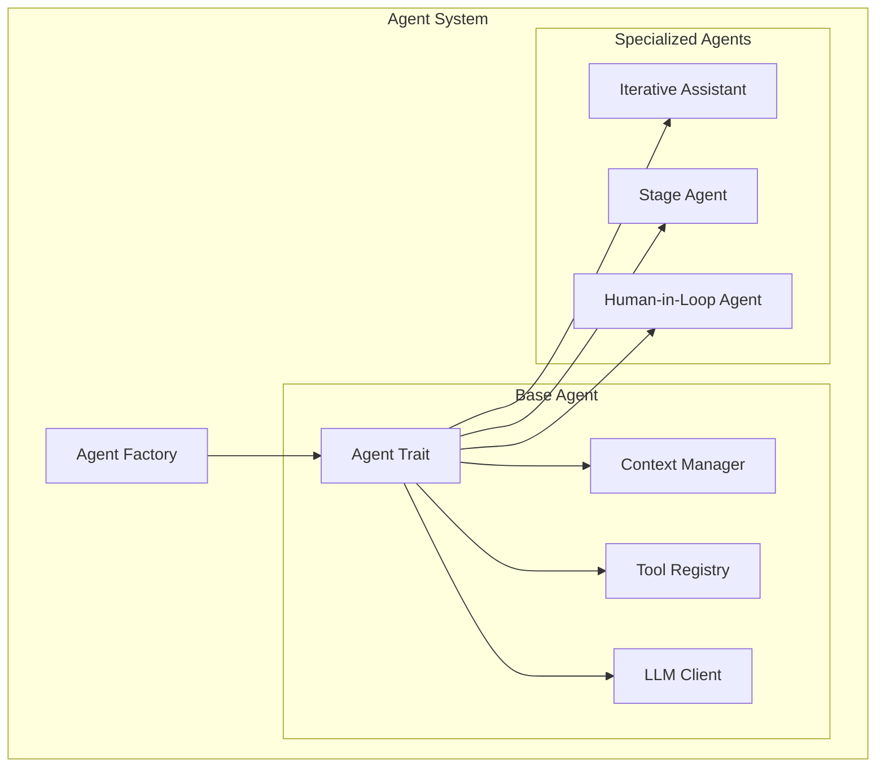
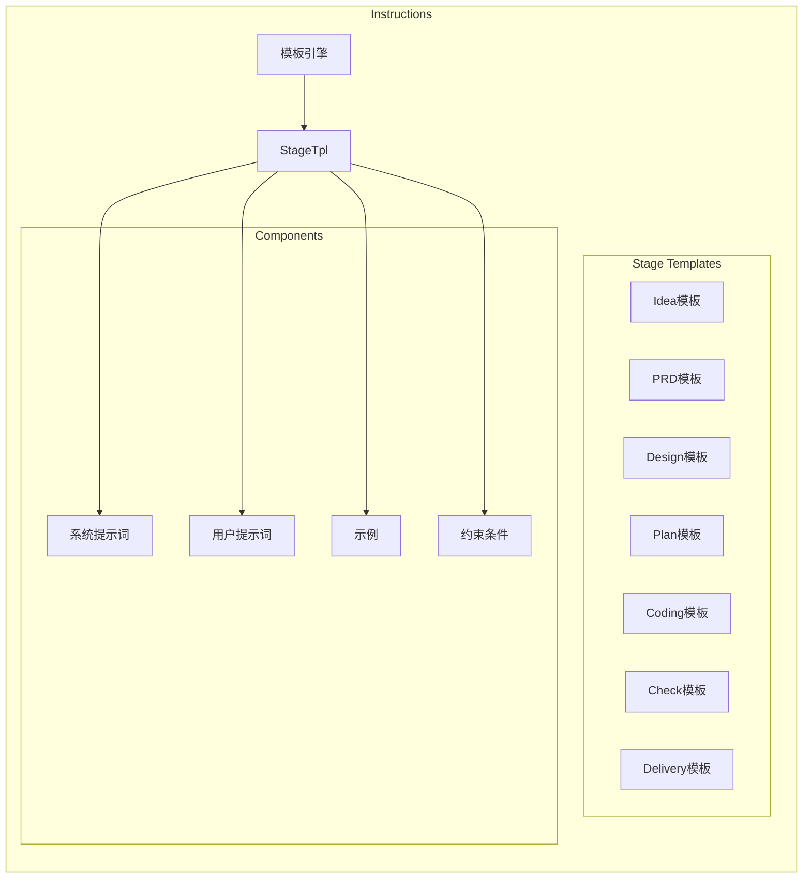
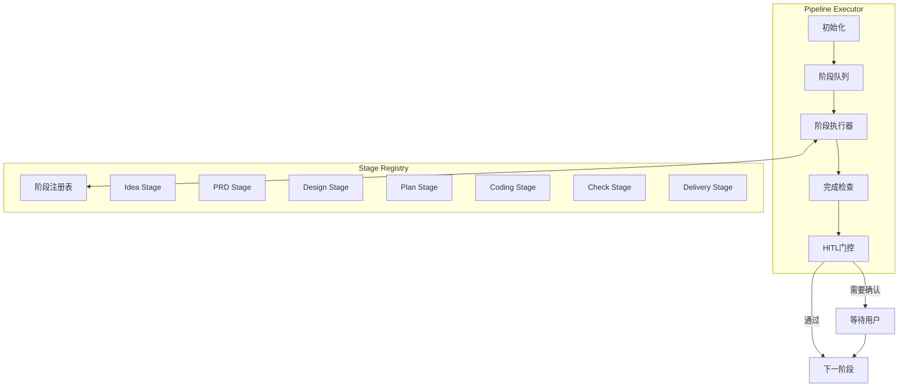
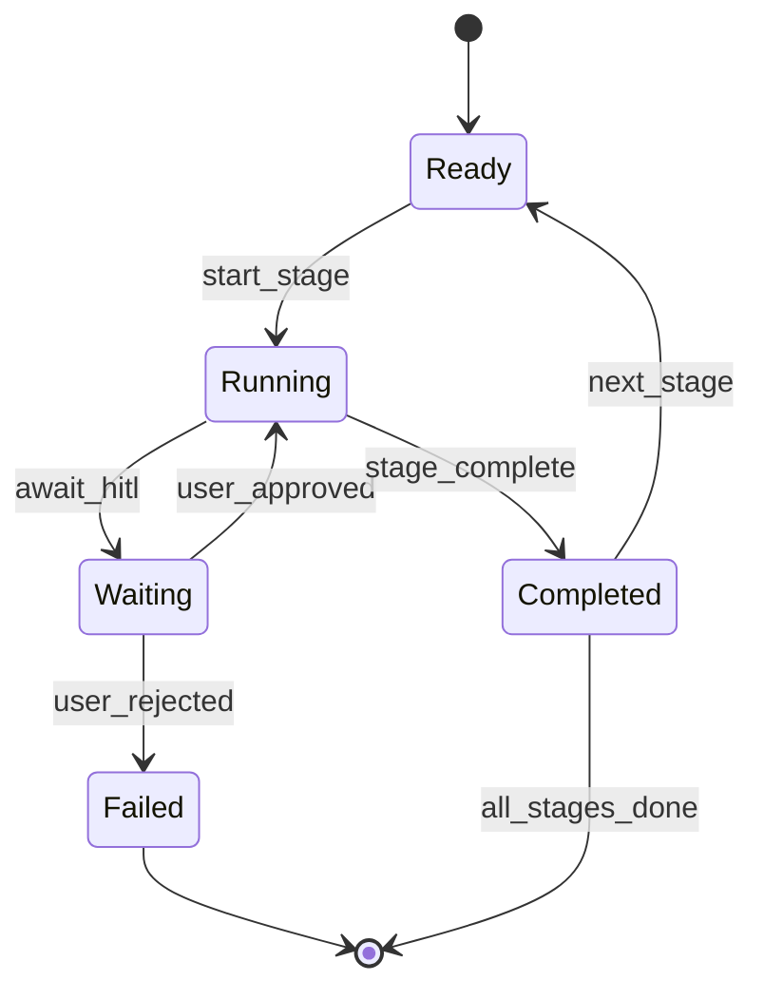
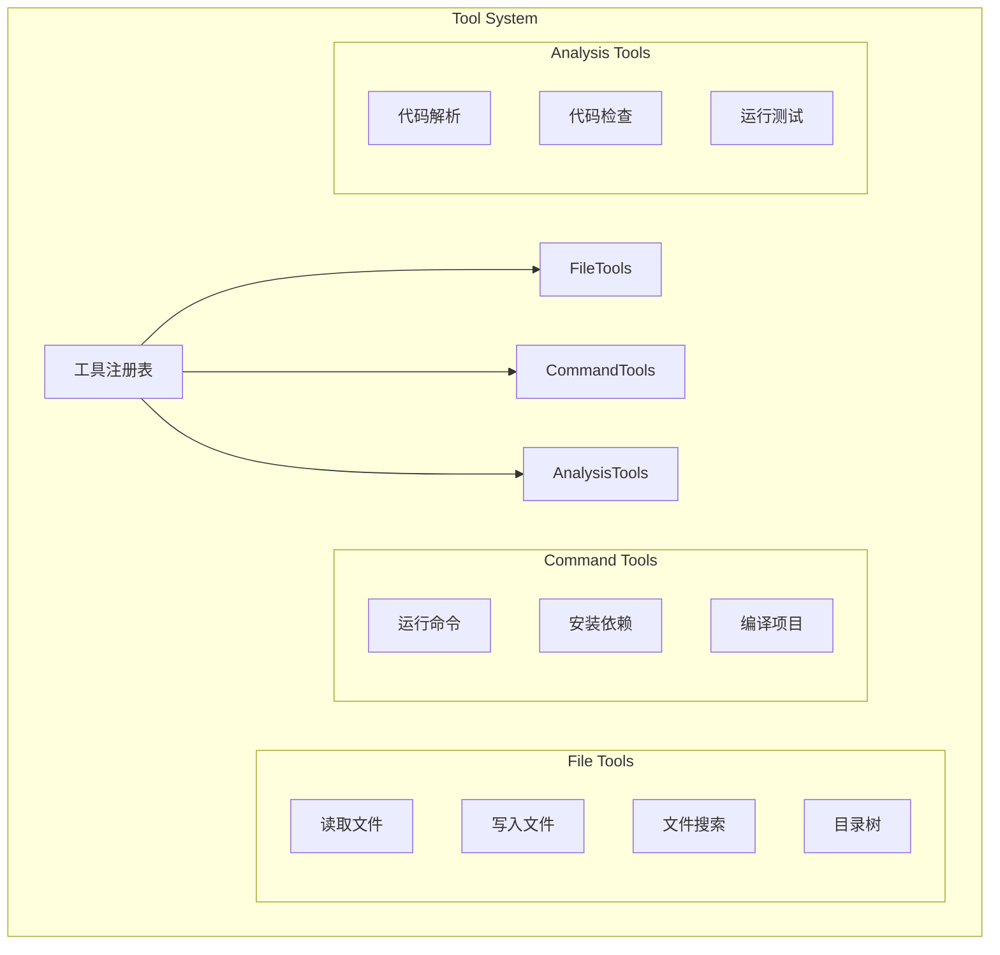
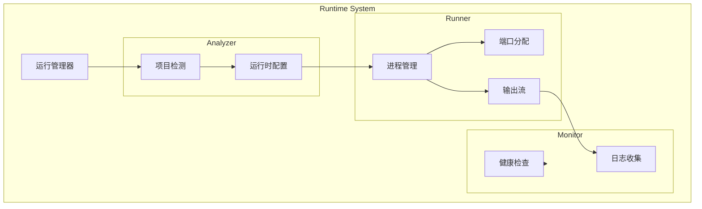
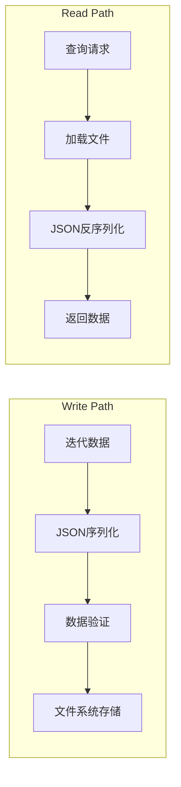
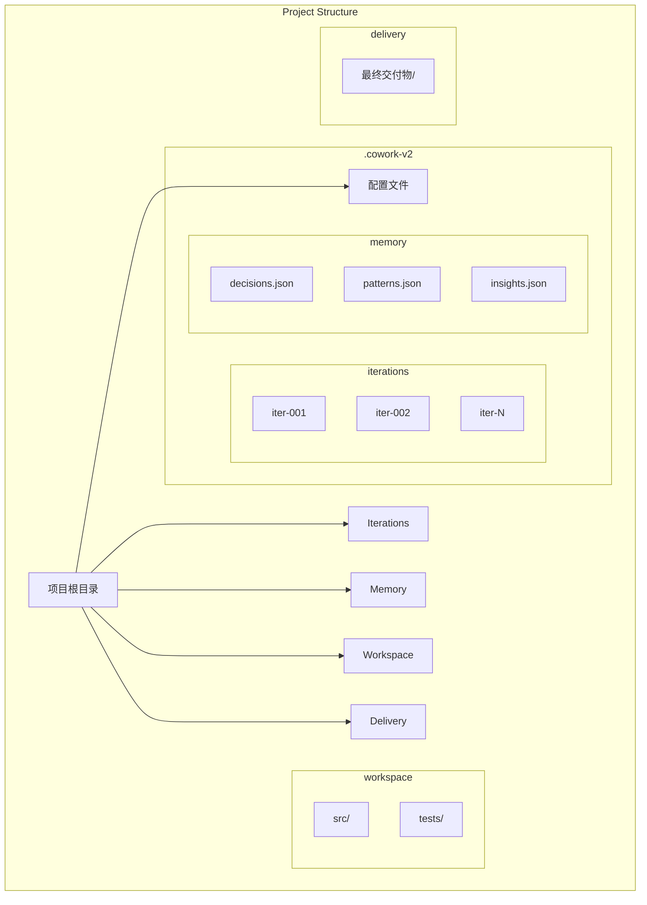

# Cowork Forge 重点子系统详细技术方案

## 1. AI 智能体系统

### 1.1 系统架构

AI 智能体系统是 Cowork Forge 的核心，负责模拟虚拟开发团队执行软件开发任务。系统采用 Actor-Critic 模式，支持多轮迭代优化。



### 1.2 核心接口设计

```rust
// Agent trait 定义
pub trait Agent {
    async fn execute(&self, input: &AgentInput) -> Result<AgentOutput, AgentError>;
    fn register_tools(&mut self, tools: Vec<Box<dyn Tool>>);
    fn get_name(&self) -> &str;
}

// 迭代助手实现
pub struct IterativeAssistant {
    actor: Box<dyn Agent>,
    critic: Box<dyn Agent>,
    max_iterations: u32,
    convergence_threshold: f32,
}

impl IterativeAssistant {
    pub async fn execute(&self, input: &AgentInput) -> Result<AgentOutput, AgentError> {
        let mut iteration = 0;
        let mut last_output: Option<AgentOutput> = None;
        
        loop {
            // Actor 生成
            let output = self.actor.execute(input).await?;
            
            // Critic 评估
            let critique = self.critic.evaluate(&output).await?;
            
            // 检查是否满足要求
            if critique.score >= self.convergence_threshold {
                return Ok(output);
            }
            
            // 改进输出
            let improved = self.actor.improve(&output, &critique.feedback).await?;
            last_output = Some(improved);
            
            iteration += 1;
            if iteration >= self.max_iterations {
                break;
            }
        }
        
        last_output.ok_or(AgentError::MaxIterationsReached)
    }
}
```

### 1.3 提示词模板系统



## 2. 迭代流水线系统

### 2.1 流水线架构

迭代流水线负责协调七个阶段的执行，支持条件跳转和并行处理。



### 2.2 阶段执行器实现

```rust
pub struct StageExecutor {
    stages: HashMap<StageName, Box<dyn StageHandler>>,
    current: Option<StageName>,
    context: ExecutionContext,
}

impl StageExecutor {
    pub async fn execute(&mut self, stage: StageName, ctx: &ExecutionContext) 
        -> Result<StageResult, ExecutionError> {
            
        let handler = self.stages.get(&stage)
            .ok_or(ExecutionError::StageNotFound(stage))?;
        
        // 准备上下文
        let enriched_ctx = self.context.enrich(handler.required_context());
        
        // 执行阶段
        let result = handler.execute(&enriched_ctx).await?;
        
        // 检查是否需要用户确认
        if result.requires_confirmation() {
            ctx.emit_event(Event::NeedConfirmation(result));
        }
        
        Ok(result)
    }
}
```

### 2.3 阶段状态机



## 3. 工具系统

### 3.1 工具注册与执行

工具系统为智能体提供与外部环境交互的能力。采用注册制设计，支持运行时动态添加新工具。



### 3.2 工具接口设计

```rust
pub trait Tool: Send + Sync {
    fn name(&self) -> &str;
    fn description(&self) -> &str;
    fn parameters(&self) -> &ToolSchema;
    async fn execute(&self, params: Value) -> Result<ToolResult, ToolError>;
}

pub struct FileReadTool {
    allowed_directories: Vec<PathBuf>,
}

impl Tool for FileReadTool {
    async fn execute(&self, params: Value) -> Result<ToolResult, ToolError> {
        let path = params["path"].as_str()
            .ok_or(ToolError::InvalidParameters)?;
        
        // 安全检查：路径验证
        let resolved = self.validate_path(path)?;
        
        // 读取文件
        let content = tokio::fs::read_to_string(&resolved).await?;
        
        Ok(ToolResult::success(serde_json::json!({
            "content": content,
            "path": resolved.display()
        })))
    }
    
    fn validate_path(&self, path: &str) -> Result<PathBuf, ToolError> {
        let p = PathBuf::from(path);
        
        // 检查路径遍历攻击
        if p.components().any(|c| c == Component::ParentDir) {
            return Err(ToolError::SecurityViolation("Path traversal detected"));
        }
        
        // 检查是否在允许目录内
        let abs = std::env::current_dir()
            .map_err(|_| ToolError::InternalError)?
            .join(&p);
            
        for allowed in &self.allowed_directories {
            if abs.starts_with(allowed) {
                return Ok(p);
            }
        }
        
        Err(ToolError::SecurityViolation("Path outside allowed directory"))
    }
}
```

### 3.3 命令执行器

```rust
pub struct CommandExecutor {
    whitelist: HashSet<String>,
    timeout: Duration,
    working_directory: PathBuf,
}

impl CommandExecutor {
    pub async fn execute(&self, cmd: &str, args: &[String]) 
        -> Result<CommandOutput, CommandError> {
        
        // 白名单检查
        if !self.whitelist.contains(cmd) {
            return Err(CommandError::NotAllowed(cmd.to_string()));
        }
        
        // 创建命令
        let mut command = Command::new(cmd);
        command.args(args)
            .current_dir(&self.working_directory)
            .creation_flags(CREATE_NO_WINDOW); // Windows无窗口
        
        // 设置超时
        let output = tokio::time::timeout(self.timeout, command.output())
            .await
            .map_err(|_| CommandError::Timeout)?
            .map_err(|e| CommandError::ExecutionFailed(e.to_string()))?;
        
        Ok(CommandOutput {
            stdout: String::from_utf8_lossy(&output.stdout).to_string(),
            stderr: String::from_utf8_lossy(&output.stderr).to_string(),
            status: output.status.code(),
        })
    }
}
```

## 4. 项目运行系统

### 4.1 运行时架构

项目运行系统负责启动和管理开发服务器，支持前端和后端服务的启动。



### 4.2 运行时检测

系统通过 LLM 分析项目结构，生成运行配置：

```rust
pub struct RuntimeAnalyzer {
    llm_client: Option<LLMClient>,
    project_detectors: Vec<Box<dyn ProjectDetector>>,
}

impl RuntimeAnalyzer {
    pub async fn analyze(&self, workspace: &Path) 
        -> Result<ProjectRuntimeConfig, RuntimeError> {
        
        // 1. 收集项目信息
        let info = self.collect_project_info(workspace)?;
        
        // 2. 使用LLM分析
        if let Some(ref client) = self.llm_client {
            let config = client.analyze_project(&info).await?;
            return Ok(config);
        }
        
        // 3. 后备：启发式分析
        self.analyze_with_heuristic(&info, workspace)
    }
}
```

### 4.3 进程管理

```rust
pub struct ProjectRunner {
    processes: HashMap<String, ProjectProcess>,
    app_handle: Option<tauri::AppHandle>,
}

pub async fn start(&self, id: String, cmd: String, dir: String) 
    -> Result<u32, RunnerError> {
    
    let mut child = Command::new("cmd")
        .args(["/C", &cmd])
        .current_dir(&dir)
        .stdout(Stdio::piped())
        .stderr(Stdio::piped())
        .spawn()
        .map_err(|e| RunnerError::StartFailed(e.to_string()))?;
    
    let pid = child.id().unwrap();
    
    // 启动输出监听任务
    self.spawn_output_listener(id.clone(), child.stdout.take().unwrap());
    
    // 存储进程信息
    self.processes.insert(id, ProjectProcess {
        child,
        output_tx: tx,
    });
    
    Ok(pid)
}
```

## 5. 内存与持久化系统

### 5.1 迭代存储



### 5.2 项目结构



## 6. LLM 集成层

### 6.1 客户端设计

```rust
pub struct LLMClient {
    config: LLMConfig,
    http_client: reqwest::Client,
    rate_limiter: RateLimiter,
    cache: LruCache<String, CachedResponse>,
}

impl LLMClient {
    pub async fn chat(&self, request: ChatRequest) 
        -> Result<ChatResponse, LLMError> {
        
        // 速率限制检查
        self.rate_limiter.acquire().await;
        
        // 检查缓存
        let cache_key = request.cache_key();
        if let Some(response) = self.cache.get(&cache_key) {
            return Ok(response.clone());
        }
        
        // 发送请求
        let response = self.http_client
            .post(&self.config.api_url)
            .header("Authorization", format!("Bearer {}", self.config.api_key))
            .json(&request)
            .send()
            .await
            .map_err(LLMError::NetworkError)?;
        
        // 处理响应
        let chat_response: ChatResponse = response.json().await?;
        
        // 缓存响应
        self.cache.put(cache_key, chat_response.clone());
        
        Ok(chat_response)
    }
}
```

### 6.2 速率限制

```rust
pub struct RateLimiter {
    tokens: Arc<Mutex<f64>>,
    refill_rate: f64,
    capacity: f64,
}

impl RateLimiter {
    pub async fn acquire(&self) {
        loop {
            let mut tokens = self.tokens.lock().unwrap();
            
            if *tokens >= 1.0 {
                *tokens -= 1.0;
                return;
            }
            
            drop(tokens);
            tokio::time::sleep(Duration::from_millis(100)).await;
        }
    }
}
```
