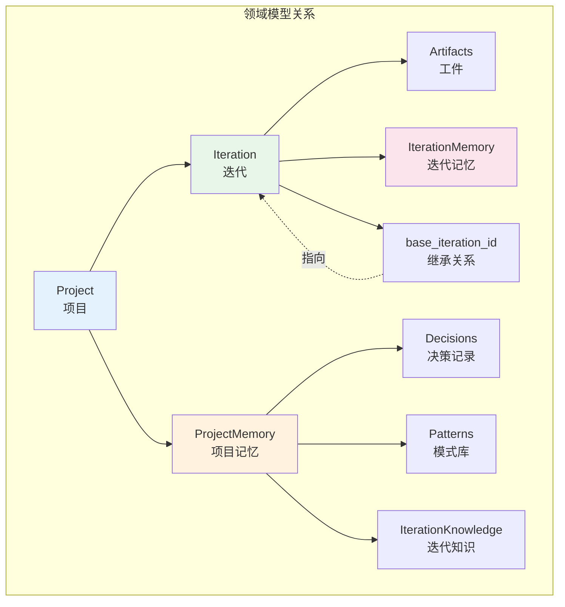
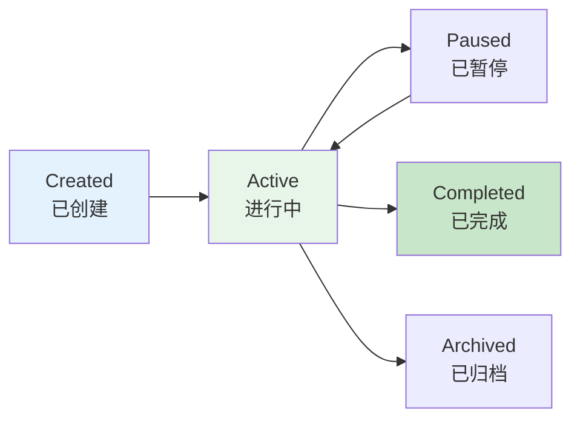
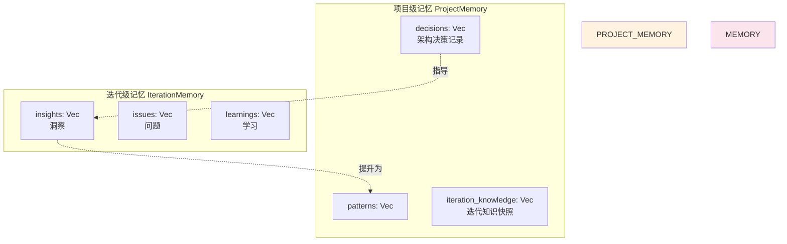

# 领域模型设计

你有没有想过，一个复杂的 AI 驱动开发系统是如何组织和管理数据的？在 Cowork Forge 中，领域模型是整个系统的骨架——它定义了项目、迭代、记忆等核心概念，以及它们之间的关系。良好的领域设计让系统更易于理解、扩展和维护。

## 领域模型概览

Cowork Forge 的领域模型围绕**软件开发过程**构建，核心实体包括：



这种设计的核心思想是**分层管理**：项目级数据跨迭代持久化，迭代级数据专注于当前开发周期。

## Project（项目）

Project 是最高层级的聚合根，代表一个软件项目：

```rustn#[derive(Debug, Clone, Serialize, Deserialize)]
pub struct Project {
    pub id: String,                           // 唯一标识（UUID）
    pub name: String,                         // 项目名称
    pub created_at: DateTime<Utc>,           // 创建时间
    pub updated_at: DateTime<Utc>,           // 更新时间
    pub metadata: ProjectMetadata,           // 项目元数据
    pub current_iteration_id: Option<String>, // 当前迭代
    pub iterations: Vec<IterationSummary>,   // 迭代列表
}
```

### 项目元数据

```rustn#[derive(Debug, Clone, Serialize, Deserialize)]
pub struct ProjectMetadata {
    pub description: Option<String>,         // 项目描述
    pub tech_stack: Option<TechStack>,       // 技术栈
    pub tags: Vec<String>,                   // 标签
    pub custom_fields: HashMap<String, Value>, // 自定义字段
}
```

元数据设计的灵活性体现在 `custom_fields`，它允许存储项目特定的额外信息，而不需要修改核心模型。

### 项目生命周期



## Iteration（迭代）

Iteration 是 Cowork Forge 最核心的领域概念，代表一个完整的开发周期：

```rustn#[derive(Debug, Clone, Serialize, Deserialize)]
pub struct Iteration {
    pub id: String,                           // 唯一标识
    pub number: u32,                          // 迭代序号（1, 2, 3...）
    pub title: String,                        // 迭代标题
    pub description: String,                  // 变更描述
    pub base_iteration_id: Option<String>,    // 基础迭代（继承自）
    pub inheritance: InheritanceMode,         // 继承模式
    pub status: IterationStatus,              // 迭代状态
    pub artifacts: Artifacts,                 // 生成的工件
    pub current_stage: Option<String>,        // 当前执行阶段
    pub created_at: DateTime<Utc>,           // 创建时间
    pub started_at: Option<DateTime<Utc>>,   // 开始时间
    pub completed_at: Option<DateTime<Utc>>, // 完成时间
}
```

### 继承模式（InheritanceMode）

```rustn#[derive(Debug, Clone, Copy, Serialize, Deserialize, PartialEq)]
#[serde(rename_all = "snake_case")]
pub enum InheritanceMode {
    None,      // 创世迭代，从零开始
    Full,      // 完整继承，复制代码和所有工件
    Partial,   // 部分继承，复制代码但重新生成工件
}
```

继承模式是迭代架构的核心，它决定了新迭代如何复用历史成果：

| 模式 | 工作空间 | 工件 | 起始阶段 | 适用场景 |
|------|----------|------|----------|----------|
| None | 空 | 无 | Idea | 全新项目 |
| Full | 复制 | 复制 | 智能判定 | 功能增强 |
| Partial | 复制 | 重新生成 | Idea | 架构重构 |

### 迭代状态（IterationStatus）

```rustn#[derive(Debug, Clone, Copy, Serialize, Deserialize, PartialEq)]
#[serde(rename_all = "snake_case")]
pub enum IterationStatus {
    Created,     // 已创建，尚未开始
    Preparing,   // 准备工作空间中
    Running,     // Pipeline 执行中
    Paused,      // 暂停，等待用户确认
    Completed,   // 已完成
    Failed,      // 执行失败
    Cancelled,   // 已取消
}
```

状态设计考虑了实际使用场景：
- **Created → Preparing**：开始执行，准备工作空间
- **Preparing → Running**：准备完成，开始 Pipeline
- **Running → Paused**：阶段完成，等待用户确认
- **Paused → Running**：用户确认，继续执行
- **Running → Completed**：所有阶段执行完成
- **Running → Failed**：执行过程中出错

### 迭代摘要

为了在项目级别高效展示迭代列表，使用轻量级的 IterationSummary：

```rustn#[derive(Debug, Clone, Serialize, Deserialize)]
pub struct IterationSummary {
    pub id: String,
    pub number: u32,
    pub title: String,
    pub status: IterationStatus,
    pub created_at: DateTime<Utc>,
    pub completed_at: Option<DateTime<Utc>>,
}
```

这种设计避免了在列表展示时加载完整的迭代数据，提高性能。

## Artifacts（工件）

Artifacts 记录了迭代生成的所有文档：

```rustn#[derive(Debug, Clone, Default, Serialize, Deserialize)]
pub struct Artifacts {
    pub idea_doc: Option<String>,           // idea.md 路径
    pub prd_doc: Option<String>,            // prd.md 路径
    pub design_doc: Option<String>,         // design.md 路径
    pub plan_doc: Option<String>,           // plan.md 路径
    pub delivery_report: Option<String>,    // delivery_report.md 路径
}
```

工件设计遵循**可选性原则**：不是所有迭代都会生成所有工件。例如，一个 Bug 修复迭代可能直接从 Coding 阶段开始，不会生成 PRD 和 Design 文档。

## Memory（记忆系统）

记忆系统是 Cowork Forge 的"大脑"，让 AI 能够学习和积累经验。

### 双层记忆架构



### 项目级记忆

```rustn#[derive(Debug, Clone, Serialize, Deserialize)]
pub struct ProjectMemory {
    pub project_id: String,
    pub decisions: Vec<Decision>,                    // 架构决策
    pub patterns: Vec<Pattern>,                      // 模式库
    pub iteration_knowledge: Vec<IterationKnowledge>, // 迭代知识
    pub updated_at: DateTime<Utc>,
}
```

#### 决策记录（Decision）

```rustn#[derive(Debug, Clone, Serialize, Deserialize)]
pub struct Decision {
    pub id: String,
    pub title: String,                        // 决策标题
    pub context: String,                      // 决策背景
    pub decision: String,                     // 决策内容
    pub rationale: String,                    // 决策理由
    pub consequences: Vec<String>,            // 影响
    pub created_at: DateTime<Utc>,
    pub iteration_id: Option<String>,         // 关联迭代
}
```

决策记录的价值在于**保持一致性**。当后续迭代面临相似选择时，可以参考之前的决策，避免反复横跳。

#### 模式库（Pattern）

```rustn#[derive(Debug, Clone, Serialize, Deserialize)]
pub struct Pattern {
    pub id: String,
    pub name: String,                         // 模式名称
    pub category: PatternCategory,            // 模式类别
    pub description: String,                  // 描述
    pub usage: String,                        // 使用场景
    pub example: Option<String>,              // 示例
    pub created_at: DateTime<Utc>,
}

#[derive(Debug, Clone, Copy, Serialize, Deserialize)]
pub enum PatternCategory {
    Architecture,    // 架构模式
    Design,          // 设计模式
    Implementation,  // 实现模式
    Testing,         // 测试模式
    Deployment,      // 部署模式
}
```

模式库让 AI 能够**复用已验证的解决方案**，提高开发效率和代码质量。

#### 迭代知识（IterationKnowledge）

```rustn#[derive(Debug, Clone, Serialize, Deserialize)]
pub struct IterationKnowledge {
    pub iteration_id: String,
    pub title: String,                        // 迭代标题
    pub summary: String,                      // 摘要
    pub key_decisions: Vec<String>,           // 关键决策
    pub patterns_used: Vec<String>,           // 使用的模式
    pub tech_stack: TechStackSnapshot,        // 技术栈快照
    pub created_at: DateTime<Utc>,
}
```

迭代知识是迭代完成后的"总结报告"，供后续迭代快速了解历史上下文。

### 迭代级记忆

```rustn#[derive(Debug, Clone, Serialize, Deserialize)]
pub struct IterationMemory {
    pub iteration_id: String,
    pub insights: Vec<Insight>,               // 洞察
    pub issues: Vec<Issue>,                   // 问题
    pub learnings: Vec<Learning>,             // 学习
    pub updated_at: DateTime<Utc>,
}
```

#### 洞察（Insight）

```rustn#[derive(Debug, Clone, Serialize, Deserialize)]
pub struct Insight {
    pub id: String,
    pub content: String,                      // 洞察内容
    pub category: InsightCategory,            // 类别
    pub importance: ImportanceLevel,          // 重要程度
    pub created_at: DateTime<Utc>,
    pub source_stage: Option<String>,         // 来源阶段
}

#[derive(Debug, Clone, Copy, Serialize, Deserialize)]
pub enum InsightCategory {
    Architecture,    // 架构洞察
    Design,          // 设计洞察
    Implementation,  // 实现洞察
    Performance,     // 性能洞察
    Security,        // 安全洞察
}
```

洞察是 Agent 在执行过程中的"顿悟"——发现更好的实现方式、识别潜在问题、总结最佳实践。

#### 问题（Issue）

```rustn#[derive(Debug, Clone, Serialize, Deserialize)]
pub struct Issue {
    pub id: String,
    pub description: String,                  // 问题描述
    pub severity: IssueSeverity,              // 严重程度
    pub status: IssueStatus,                  // 状态
    pub solution: Option<String>,             // 解决方案
    pub created_at: DateTime<Utc>,
    pub resolved_at: Option<DateTime<Utc>>,
}

#[derive(Debug, Clone, Copy, Serialize, Deserialize)]
pub enum IssueSeverity {
    Critical,    // 严重
    High,        // 高
    Medium,      // 中
    Low,         // 低
}
```

问题记录让 AI 能够**追踪已知问题**，避免重复踩坑。

#### 学习（Learning）

```rustn#[derive(Debug, Clone, Serialize, Deserialize)]
pub struct Learning {
    pub id: String,
    pub content: String,                      // 学习内容
    pub context: String,                      // 上下文
    pub applicability: String,                // 适用场景
    pub created_at: DateTime<Utc>,
}
```

学习记录是 Agent 的"成长记录"，记录了在实践中获得的经验和教训。

## 数据模型（结构化数据）

除了领域实体，Cowork Forge 还定义了一系列结构化数据模型，用于存储 Pipeline 各阶段的输出。

### 需求模型

```rustn#[derive(Debug, Clone, Serialize, Deserialize)]
pub struct Requirement {
    pub id: String,                           // REQ-001
    pub title: String,                        // 标题
    pub description: String,                  // 详细描述
    pub priority: Priority,                   // 优先级
    pub status: RequirementStatus,            // 状态
    pub acceptance_criteria: Vec<String>,     // 验收标准
    pub dependencies: Vec<String>,            // 依赖的需求
}

#[derive(Debug, Clone, Copy, Serialize, Deserialize)]
pub enum Priority {
    High,
    Medium,
    Low,
}
```

### 功能模型

```rustn#[derive(Debug, Clone, Serialize, Deserialize)]
pub struct Feature {
    pub id: String,                           // FEAT-001
    pub requirement_id: String,               // 关联需求
    pub name: String,                         // 功能名称
    pub description: String,                  // 描述
    pub acceptance_criteria: Vec<String>,     // 验收标准
}
```

### 任务模型

```rustn#[derive(Debug, Clone, Serialize, Deserialize)]
pub struct Task {
    pub id: String,                           // TASK-001
    pub title: String,                        // 标题
    pub description: String,                  // 描述
    pub status: TaskStatus,                   // 状态
    pub priority: Priority,                   // 优先级
    pub dependencies: Vec<String>,            // 依赖任务
    pub estimated_effort: Option<String>,     // 预估工作量
    pub assigned_stage: String,               // 所属阶段
}

#[derive(Debug, Clone, Copy, Serialize, Deserialize)]
pub enum TaskStatus {
    Pending,      // 待处理
    InProgress,   // 进行中
    Completed,    // 已完成
    Blocked,      // 被阻塞
}
```

### 设计规范模型

```rustn#[derive(Debug, Clone, Serialize, Deserialize)]
pub struct DesignSpec {
    pub architecture_overview: String,        // 架构概述
    pub components: Vec<Component>,           // 组件列表
    pub data_models: Vec<DataModel>,          // 数据模型
    pub api_definitions: Vec<ApiDefinition>, // API 定义
    pub tech_stack: TechStack,                // 技术栈
}

#[derive(Debug, Clone, Serialize, Deserialize)]
pub struct Component {
    pub name: String,
    pub responsibility: String,               // 职责
    pub interfaces: Vec<Interface>,           // 接口
    pub dependencies: Vec<String>,            // 依赖
}
```

## 技术栈模型

技术栈定义了项目使用的技术：

```rustn#[derive(Debug, Clone, Serialize, Deserialize)]
pub struct TechStack {
    pub frontend: Option<FrontendStack>,      // 前端技术栈
    pub backend: Option<BackendStack>,        // 后端技术栈
    pub database: Option<DatabaseStack>,      // 数据库
    pub infrastructure: Option<InfraStack>,   // 基础设施
}

#[derive(Debug, Clone, Serialize, Deserialize)]
pub struct FrontendStack {
    pub framework: String,                    // React, Vue, Angular
    pub language: String,                     // TypeScript, JavaScript
    pub styling: Option<String>,              // CSS, Tailwind, Styled Components
    pub state_management: Option<String>,     // Redux, Zustand, Context
}

#[derive(Debug, Clone, Serialize, Deserialize)]
pub struct BackendStack {
    pub framework: String,                    // Express, FastAPI, Spring
    pub language: String,                     // Node.js, Python, Java
    pub runtime: Option<String>,              // Deno, Bun
}
```

技术栈信息用于：
- 指导 Design Agent 的架构设计
- 为 Coding Agent 提供上下文
- 生成一致的项目文档

## 领域事件

Cowork Forge 使用领域事件来解耦模块间的通信：

```rustn#[derive(Debug, Clone)]
pub enum DomainEvent {
    // 项目事件
    ProjectCreated { project_id: String },
    ProjectUpdated { project_id: String },

    // 迭代事件
    IterationCreated { iteration_id: String },
    IterationStarted { iteration_id: String },
    IterationPaused { iteration_id: String, stage: String },
    IterationResumed { iteration_id: String },
    IterationCompleted { iteration_id: String },
    IterationFailed { iteration_id: String, error: String },

    // 阶段事件
    StageStarted { iteration_id: String, stage: String },
    StageCompleted { iteration_id: String, stage: String },
    StageFailed { iteration_id: String, stage: String, error: String },

    // 工件事件
    ArtifactGenerated { iteration_id: String, artifact_type: String },

    // 记忆事件
    InsightRecorded { iteration_id: String, insight_id: String },
    DecisionRecorded { project_id: String, decision_id: String },
}
```

领域事件的价值：
- **解耦**：模块间不直接依赖，通过事件通信
- **可扩展**：易于添加新的事件处理器
- **可追踪**：完整的变更历史

## 数据持久化

### 存储结构

领域数据以 JSON 格式存储在文件系统中：

```
.cowork-v2/
├── project.json                    # Project 实体
├── iterations/
│   ├── iter-1-xxx.json            # Iteration 实体
│   ├── iter-2-xxx.json
│   └── ...
├── iterations/{id}/
│   ├── workspace/                 # 代码工作空间
│   ├── artifacts/                 # 工件文档
│   ├── data/                      # 结构化数据
│   │   ├── requirements.json      # Vec<Requirement>
│   │   ├── feature_list.json      # Vec<Feature>
│   │   ├── design_spec.json       # DesignSpec
│   │   ├── implementation_plan.json # Vec<Task>
│   │   └── code_metadata.json     # CodeMetadata
│   └── memory/
│       └── memory.json            # IterationMemory
└── memory/
    └── project/
        └── memory.json            # ProjectMemory
```

### 存储层设计

```rustn// 项目存储
pub struct ProjectStore {
    storage_dir: PathBuf,
}

impl ProjectStore {
    pub fn save_project(&self, project: &Project) -> Result<()> {
        let path = self.storage_dir.join("project.json");
        let json = serde_json::to_string_pretty(project)?;
        fs::write(path, json)?;
        Ok(())
    }

    pub fn get_project(&self) -> Result<Project> {
        let path = self.storage_dir.join("project.json");
        let json = fs::read_to_string(path)?;
        let project = serde_json::from_str(&json)?;
        Ok(project)
    }
}

// 迭代存储
pub struct IterationStore {
    storage_dir: PathBuf,
}

impl IterationStore {
    pub fn save_iteration(&self, iteration: &Iteration) -> Result<()> {
        let path = self.iterations_dir()
            .join(format!("{}.json", iteration.id));
        let json = serde_json::to_string_pretty(iteration)?;
        fs::write(path, json)?;
        Ok(())
    }

    pub fn get_iteration(&self, id: &str) -> Result<Iteration> {
        let path = self.iterations_dir().join(format!("{}.json", id));
        let json = fs::read_to_string(path)?;
        let iteration = serde_json::from_str(&json)?;
        Ok(iteration)
    }

    pub fn list_iterations(&self) -> Result<Vec<IterationSummary>> {
        // 读取所有迭代，返回摘要列表
        ...
    }
}
```

## 领域模型的设计原则

### 1. 聚合根设计

Project 和 Iteration 是聚合根，它们管理着自己的子实体：
- Project 管理 Iteration 列表
- Iteration 管理 Artifacts 和 Memory

### 2. 值对象与实体

- **实体**：Project、Iteration、Decision（有唯一标识）
- **值对象**：Artifacts、TechStack（通过属性定义）

### 3. 不变量保护

领域模型内置业务规则：

```rustnimpl Iteration {
    pub fn can_transition_to(&self, new_status: IterationStatus) -> bool {
        match (self.status, new_status) {
            (Created, Preparing) => true,
            (Preparing, Running) => true,
            (Running, Paused) => true,
            (Paused, Running) => true,
            (Running, Completed) => true,
            (Running, Failed) => true,
            _ => false,
        }
    }
}
```

### 4. 富领域模型

领域模型不仅是数据结构，还包含业务逻辑：

```rustnimpl Project {
    pub fn add_iteration(&mut self, iteration: Iteration) -> Result<()> {
        // 验证迭代序号
        if iteration.number != self.iterations.len() as u32 + 1 {
            return Err(Error::InvalidIterationNumber);
        }

        // 添加到列表
        self.iterations.push(IterationSummary::from(&iteration));
        self.current_iteration_id = Some(iteration.id.clone());
        self.updated_at = Utc::now();

        Ok(())
    }
}
```

## 总结

Cowork Forge 的领域模型是一个精心设计的**富领域模型**，它不仅定义了数据结构，还封装了业务逻辑和规则。

核心设计决策：

1. **分层管理**：项目级记忆跨迭代持久化，迭代级记忆专注于当前周期
2. **继承关系**：迭代之间可以建立继承关系，支持演进式开发
3. **状态机设计**：迭代状态有明确的转换规则
4. **事件驱动**：通过领域事件解耦模块通信
5. **文件存储**：使用 JSON 文件存储，简单透明

这个领域模型支撑起了 Cowork Forge 的核心功能，让 AI 驱动的软件开发成为可能。
