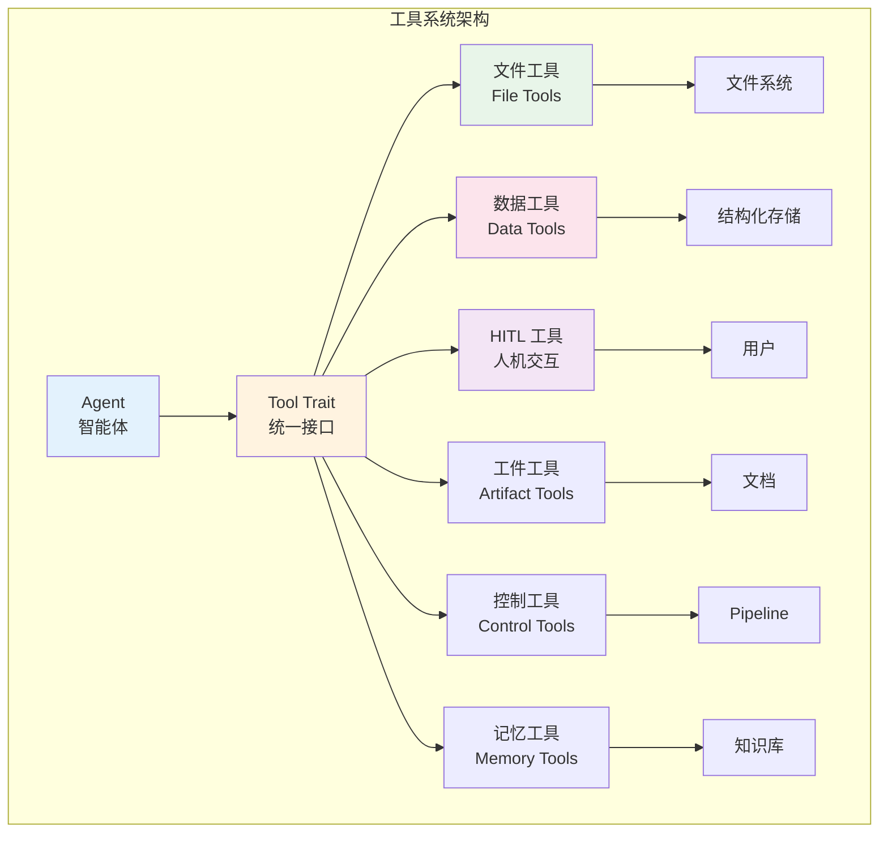
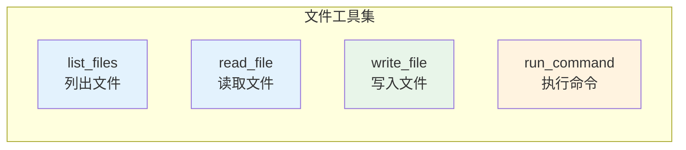
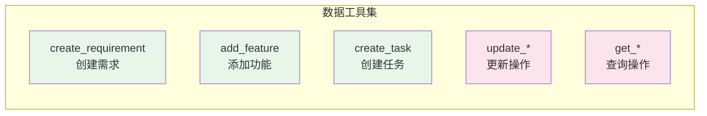
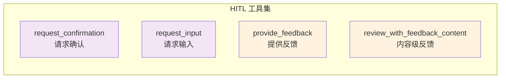

# 工具系统设计与实现

你有没有想过，当 AI Agent 需要与外部世界交互时——比如读写文件、执行命令、获取用户输入——它是如何安全、可控地完成这些操作的？Cowork Forge 的工具系统正是为了解决这个问题而设计的。它既是 Agent 能力的延伸，也是系统安全的重要保障。

## 工具系统概览

工具系统是 Cowork Forge 与外部环境交互的桥梁。Agent 本身只是一个"思考者"，而工具赋予它"行动力"。



## Tool Trait：统一抽象

所有工具都实现了统一的 `Tool` trait，这是工具系统可扩展的基础：

```rustn#[async_trait::async_trait]
pub trait Tool: Send + Sync {
    /// 工具名称
    fn name(&self) -> &str;

    /// 工具描述（用于 LLM 理解）
    fn description(&self) -> &str;

    /// 参数模式（JSON Schema）
    fn parameters(&self) -> Value;

    /// 执行工具
    async fn execute(&self, args: Value) -> Result<Value, ToolError>;
}
```

这个设计的精妙之处在于**声明式定义**：
- `name` 和 `description` 告诉 LLM 这个工具是做什么的
- `parameters` 定义了工具需要的参数（使用 JSON Schema）
- `execute` 是实际的执行逻辑

LLM 根据这些信息决定何时调用哪个工具，以及传入什么参数。

## 工具分类详解

### 1. 文件工具（File Tools）

文件工具是 Agent 与文件系统交互的主要方式：



#### 路径安全机制

文件工具最核心的设计是**路径安全验证**：

```rustnfn validate_path_security_within_workspace(
    path: &str,
    workspace_dir: &Path
) -> Result<PathBuf, String> {
    let path_obj = Path::new(path);

    // 规则 1: 拒绝绝对路径
    if path_obj.is_absolute() {
        return Err("Security: Absolute paths are not allowed".to_string());
    }

    // 规则 2: 拒绝父目录访问 (..)
    if path.contains("..") {
        return Err("Security: Parent directory access is not allowed".to_string());
    }

    // 规则 3: 规范化路径
    let normalized = path_obj.components()
        .filter(|c| !matches!(c, Component::CurDir))
        .collect::<PathBuf>();

    // 规则 4: 验证路径在工作空间内
    let full_path = workspace_dir.join(&normalized);
    let full_path_absolute = full_path.canonicalize()
        .map_err(|_| "Security: Path does not exist".to_string())?;

    let workspace_absolute = workspace_dir.canonicalize()
        .map_err(|_| "Security: Invalid workspace".to_string())?;

    if !full_path_absolute.starts_with(&workspace_absolute) {
        return Err("Security: Path escapes workspace directory".to_string());
    }

    Ok(full_path_absolute)
}
```

这套安全机制确保了：
- **沙箱隔离**：Agent 只能访问工作空间内的文件
- **防止目录遍历**：`..` 等路径被严格禁止
- **绝对路径禁止**：避免访问系统敏感目录

#### 命令执行安全

`run_command` 工具还包含额外的安全层——阻塞命令检测：

```rustnfn is_blocking_service_command(command: &str) -> bool {
    let blocking_patterns = vec![
        "http.server",
        "npm run dev",
        "npm start",
        "uvicorn",
        "gunicorn",
        "cargo run",
        "vite",
        "next dev",
        "webpack-dev-server",
    ];

    blocking_patterns.iter().any(|pattern| command.contains(pattern))
}
```

这类命令会启动长时间运行的服务，阻塞 Pipeline 执行。系统会拒绝执行这些命令，并提示用户使用其他方式。

### 2. 数据工具（Data Tools）

数据工具用于操作结构化数据，是 Agent 与领域模型交互的桥梁：



数据工具的特点是**强类型**：

```rustn// 创建需求工具
pub struct CreateRequirementTool;

#[async_trait::async_trait]
impl Tool for CreateRequirementTool {
    fn name(&self) -> &str {
        "create_requirement"
    }

    fn description(&self) -> &str {
        "Create a new requirement in the PRD"
    }

    fn parameters(&self) -> Value {
        json!({
            "type": "object",
            "required": ["id", "title", "description", "priority"],
            "properties": {
                "id": {
                    "type": "string",
                    "description": "Unique requirement ID (e.g., REQ-001)"
                },
                "title": {
                    "type": "string",
                    "description": "Short requirement title"
                },
                "description": {
                    "type": "string",
                    "description": "Detailed requirement description"
                },
                "priority": {
                    "type": "string",
                    "enum": ["high", "medium", "low"],
                    "description": "Requirement priority"
                }
            }
        })
    }

    async fn execute(&self, args: Value) -> Result<Value, ToolError> {
        let req: Requirement = serde_json::from_value(args)?;
        // 保存到数据存储
        save_requirement(req).await?;
        Ok(json!({"success": true}))
    }
}
```

这种设计的价值：
- **结构化输出**：Agent 生成的数据是结构化的，便于后续处理
- **验证机制**：JSON Schema 确保数据格式正确
- **类型安全**：Rust 的类型系统保证运行时安全

### 3. HITL 工具（人机交互工具）

HITL 工具实现了 Agent 与用户的交互：



#### 确认请求工具

```rustn// 请求用户确认
pub struct RequestConfirmationTool {
    pub interaction: Arc<dyn InteractiveBackend>,
}

#[async_trait::async_trait]
impl Tool for RequestConfirmationTool {
    fn name(&self) -> &str {
        "request_confirmation"
    }

    fn description(&self) -> &str {
        "Request user confirmation to proceed to the next stage"
    }

    fn parameters(&self) -> Value {
        json!({
            "type": "object",
            "required": ["stage_name", "message"],
            "properties": {
                "stage_name": {
                    "type": "string",
                    "description": "Name of the completed stage"
                },
                "message": {
                    "type": "string",
                    "description": "Message to display to the user"
                }
            }
        })
    }

    async fn execute(&self, args: Value) -> Result<Value, ToolError> {
        let stage_name = args["stage_name"].as_str().unwrap();
        let message = args["message"].as_str().unwrap();

        // 调用交互后端
        let response = self.interaction
            .request_confirmation(stage_name, message)
            .await?;

        Ok(json!({"user_response": response}))
    }
}
```

HITL 工具的特殊之处在于**同步阻塞**：当调用这些工具时，Agent 执行会暂停，等待用户响应。这种设计确保了人工确认的时机。

### 4. 工件工具（Artifact Tools）

工件工具用于保存各阶段生成的文档：

```rustn// 保存 PRD 文档工具
pub struct SavePrdDocTool;

#[async_trait::async_trait]
impl Tool for SavePrdDocTool {
    fn name(&self) -> &str {
        "save_prd_doc"
    }

    fn description(&self) -> &str {
        "Save the PRD document to the artifacts directory"
    }

    async fn execute(&self, args: Value) -> Result<Value, ToolError> {
        let content = args["content"].as_str().unwrap();
        let path = get_artifacts_dir().join("prd.md");

        fs::write(&path, content).await?;

        Ok(json!({
            "success": true,
            "path": path.to_string_lossy()
        }))
    }
}
```

工件工具的特点是**强制规范化**：Agent 必须通过工具保存工件，而不是直接在回复中输出内容。这确保了：
- 工件被保存到正确的位置
- 使用统一的格式和命名规范
- 系统可以追踪哪些工件已生成

### 5. 控制工具（Control Tools）

控制工具用于控制 Pipeline 执行流程：

```rustn// 跳转到指定阶段工具
pub struct GotoStageTool;

#[async_trait::async_trait]
impl Tool for GotoStageTool {
    fn name(&self) -> &str {
        "goto_stage"
    }

    fn description(&self) -> &str {
        "Jump to a specific stage in the pipeline"
    }

    fn parameters(&self) -> Value {
        json!({
            "type": "object",
            "required": ["stage_name"],
            "properties": {
                "stage_name": {
                    "type": "string",
                    "enum": ["idea", "prd", "design", "plan", "coding", "check", "delivery"],
                    "description": "Target stage name"
                },
                "reason": {
                    "type": "string",
                    "description": "Reason for jumping to this stage"
                }
            }
        })
    }

    async fn execute(&self, args: Value) -> Result<Value, ToolError> {
        let stage_name = args["stage_name"].as_str().unwrap();
        let reason = args["reason"].as_str().unwrap_or("No reason provided");

        // 设置 Pipeline 状态，下次从指定阶段开始
        set_resume_stage(stage_name).await?;

        Ok(json!({
            "success": true,
            "message": format!("Will resume from {} stage", stage_name)
        }))
    }
}
```

`GotoStageTool` 支持增量更新场景。当用户反馈"需要修改需求"时，Agent 可以调用此工具回到 PRD 阶段，而不是重新开始整个 Pipeline。

### 6. 记忆工具（Memory Tools）

记忆工具用于操作双层记忆系统，包括查询、保存和提升功能：

```rustn// 查询记忆工具
pub struct QueryMemoryTool {
    iteration_id: String,
}

impl Tool for QueryMemoryTool {
    fn name(&self) -> &str { "query_memory" }
    
    fn description(&self) -> &str {
        "Query memory to retrieve decisions, patterns, and insights"
    }
    
    // 支持三种 scope: project（项目级）、iteration（迭代级）、smart（智能合并）
}

// 保存洞察工具
pub struct SaveInsightTool {
    iteration_id: String,
}

// 保存问题工具
pub struct SaveIssueTool {
    iteration_id: String,
}

// 保存学习工具
pub struct SaveLearningTool {
    iteration_id: String,
}

// 提升为决策工具（迭代级 → 项目级）
pub struct PromoteToDecisionTool {
    iteration_id: String,
}

// 提升为模式工具（迭代级 → 项目级）
pub struct PromoteToPatternTool {
    iteration_id: String,
}
```

记忆工具让 Agent 具备了"长期记忆"能力：
- **QueryMemoryTool**：查询项目决策、模式和洞察，支持智能合并查询
- **SaveInsightTool**：保存当前迭代的洞察，记录重要发现
- **SaveIssueTool**：保存遇到的问题，便于追踪和解决
- **SaveLearningTool**：保存学习内容，积累经验
- **PromoteToDecisionTool**：将洞察提升为项目级决策，跨迭代持久化
- **PromoteToPatternTool**：将学习提升为项目级模式，复用最佳实践

### 7. 智能文件读取工具

为避免上下文溢出，系统提供了智能文件读取工具：

```rustn// 截断式文件读取工具
pub struct ReadFileTruncatedTool;

impl Tool for ReadFileTruncatedTool {
    fn name(&self) -> &str { "read_file_truncated" }
    
    fn description(&self) -> &str {
        "Read a file with intelligent truncation to prevent context overflow"
    }
    
    // 参数: path, max_chars (default: 2000), prefer_structure (default: true)
    // 对代码文件优先提取结构（函数、类等）
    // 对其他文件进行智能截断
}

// 带调用限制的文件读取工具
pub struct ReadFileWithLimitTool {
    max_calls: usize,
    call_count: Arc<AtomicUsize>,
}

impl Tool for ReadFileWithLimitTool {
    fn name(&self) -> &str { "read_file_with_limit" }
    
    // 用于知识生成阶段，防止过度读取文件消耗 Token
}
```

这些工具在知识生成阶段特别有用，可以在获取必要信息的同时控制 Token 消耗。

## 工具注册与权限控制

### Agent 级别的工具注册

每个 Agent 只能访问显式注册的工具：

```rustn// PRD Agent 的工具注册
let prd_actor = LlmAgentBuilder::new("prd_actor")
    .tool(Arc::new(CreateRequirementTool))
    .tool(Arc::new(AddFeatureTool))
    .tool(Arc::new(SavePrdDocTool))
    .tool(Arc::new(RequestConfirmationTool))
    .tool(Arc::new(ProvideFeedbackTool))
    .build()?;

// Coding Agent 的工具注册
let coding_actor = LlmAgentBuilder::new("coding_actor")
    .tool(Arc::new(ListFilesTool))
    .tool(Arc::new(ReadFileTool))
    .tool(Arc::new(WriteFileTool))      // PRD Agent 没有此工具
    .tool(Arc::new(RunCommandTool))     // PRD Agent 没有此工具
    .tool(Arc::new(CreateTaskTool))
    .tool(Arc::new(UpdateTaskStatusTool))
    .build()?;
```

这种**最小权限原则**确保了：
- 即使 Agent 出现行为异常，影响范围也是有限的
- 不同阶段的 Agent 有明确的职责边界
- 系统更容易审计和调试

### 工具执行日志

所有工具调用都会被记录，便于追踪和审计：

```rustnpub struct ToolExecutionLog {
    pub timestamp: DateTime<Utc>,
    pub agent_name: String,
    pub tool_name: String,
    pub arguments: Value,
    pub result: Result<Value, ToolError>,
    pub duration_ms: u64,
}
```

执行日志的价值：
- **问题排查**：当出现问题时，可以回溯工具调用链
- **性能分析**：识别慢工具，优化性能
- **安全审计**：检测异常工具调用模式

## 工具系统的扩展性

### 添加新工具

添加新工具只需要实现 `Tool` trait：

```rustn// 1. 定义工具结构体
pub struct MyNewTool;

// 2. 实现 Tool trait
#[async_trait::async_trait]
impl Tool for MyNewTool {
    fn name(&self) -> &str {
        "my_new_tool"
    }

    fn description(&self) -> &str {
        "Description for LLM to understand"
    }

    fn parameters(&self) -> Value {
        json!({
            "type": "object",
            "required": ["param1"],
            "properties": {
                "param1": {"type": "string"}
            }
        })
    }

    async fn execute(&self, args: Value) -> Result<Value, ToolError> {
        // 实现工具逻辑
        let result = do_something(args).await?;
        Ok(json!({"result": result}))
    }
}

// 3. 注册到 Agent
let agent = LlmAgentBuilder::new("agent")
    .tool(Arc::new(MyNewTool))
    .build()?;
```

### 工具组合模式

复杂操作可以通过组合多个工具实现：

```rustn// 示例：创建需求并自动保存到 PRD
pub async fn create_and_save_requirement(
    create_tool: &CreateRequirementTool,
    save_tool: &SavePrdDocTool,
    req_data: Value,
) -> Result<Value> {
    // 1. 创建需求
    let req_result = create_tool.execute(req_data).await?;

    // 2. 更新 PRD 文档
    let prd_content = generate_prd_content().await?;
    save_tool.execute(json!({"content": prd_content})).await?;

    Ok(req_result)
}
```

## 错误处理与容错

### 工具错误类型

```rustnpub enum ToolError {
    InvalidArguments(String),      // 参数错误
    ExecutionFailed(String),       // 执行失败
    SecurityViolation(String),     // 安全违规
    NotFound(String),              // 资源不存在
    Timeout,                       // 执行超时
    InternalError(String),         // 内部错误
}
```

### 错误恢复策略

```rustn// 重试机制
pub async fn execute_with_retry(
    tool: &dyn Tool,
    args: Value,
    max_retries: u32,
) -> Result<Value, ToolError> {
    let mut last_error = None;

    for attempt in 1..=max_retries {
        match tool.execute(args.clone()).await {
            Ok(result) => return Ok(result),
            Err(e) => {
                last_error = Some(e);
                if attempt < max_retries {
                    let delay = Duration::from_secs(2_u64.pow(attempt));
                    tokio::time::sleep(delay).await;
                }
            }
        }
    }

    Err(last_error.unwrap())
}
```

## 总结

Cowork Forge 的工具系统是一个精心设计的**能力扩展框架**。通过统一的 Tool trait、严格的安全机制、细粒度的权限控制，它既赋予了 Agent 强大的行动力，又确保了系统的安全可控。

这个设计的核心思想是：**工具是 Agent 的能力边界**。Agent 能做什么，取决于它拥有什么工具；系统有多安全，取决于工具的权限控制有多严格。

工具系统的几个关键设计决策：

1. **路径安全**：多层验证确保 Agent 只能在沙箱内操作
2. **最小权限**：每个 Agent 只能访问必要的工具
3. **强制规范**：工件必须通过工具保存，确保格式统一
4. **可扩展性**：简单的 trait 接口，易于添加新工具

在下一章中，我们将探讨领域模型——Cowork Forge 的核心数据结构，以及它们如何支撑整个系统的运作。
