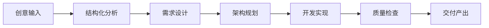
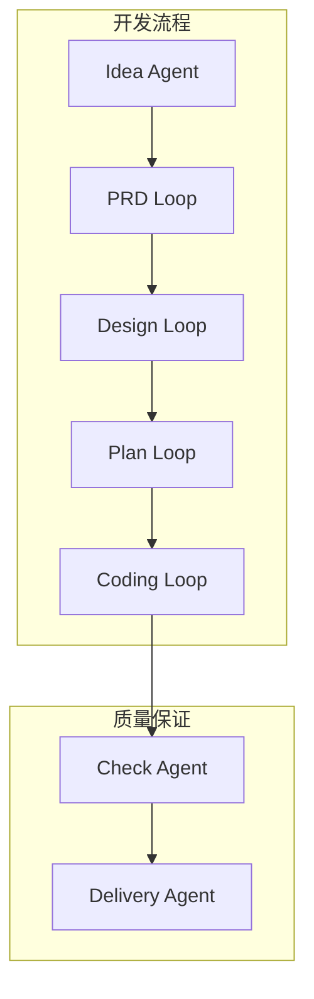

# 功能特性文档

本目录包含 Cowork Forge 系统的详细功能特性介绍，帮助用户了解系统的各项功能和使用方法。

## 文档列表

- [迭代管理](./iteration-management.md) - 迭代创建、执行和管理功能
- [人机协作](./hitl-features.md) - 人机交互和协作功能详解
- [记忆系统](./memory-features.md) - 项目记忆和知识管理功能
- [多端支持](./multi-interface.md) - CLI和GUI界面功能对比
- [配置管理](./configuration.md) - 系统配置和个性化设置
- [扩展功能](./extensions.md) - 插件和自定义扩展功能
- [集成功能](./integrations.md) - 外部服务和工具集成

## 核心特性概览

### 🔄 迭代驱动开发

**功能亮点**:
- 支持起源迭代和演化迭代两种模式
- 智能起始阶段判断，减少重复工作
- 迭代制品管理和版本追踪
- 灵活的继承机制（完全/部分/自定义）

### 🤖 全角色Agent协作

**功能亮点**:
- 7个专业角色Agent，覆盖开发全流程
- Actor-Critic循环协作模式确保质量
- 丰富的专业工具集支持各阶段工作
- 智能决策支持和建议

### 🧠 智能记忆系统

**功能亮点**:
- 项目级和迭代级双层记忆结构
- 智能关键词查询和上下文检索
- 决策历史和模式库持续积累
- 记忆内容自动提取和分类

### 👥 灵活的人机协作

**功能亮点**:
- 关键节点人工确认机制
- 多轮反馈和修订支持
- 内容编辑和实时预览
- 灵活的交互模式切换

### 🖥️ 多端界面支持

**功能亮点**:
- 命令行界面，适合专业开发者
- 图形界面，提供可视化交互体验
- 统一的后端API，确保功能一致性
- 实时状态同步和进度展示

### 🔧 强大的扩展能力

**功能亮点**:
- 模块化架构，支持组件自定义
- 插件机制，允许功能扩展
- 多种LLM提供商支持
- 灵活的配置和定制选项
