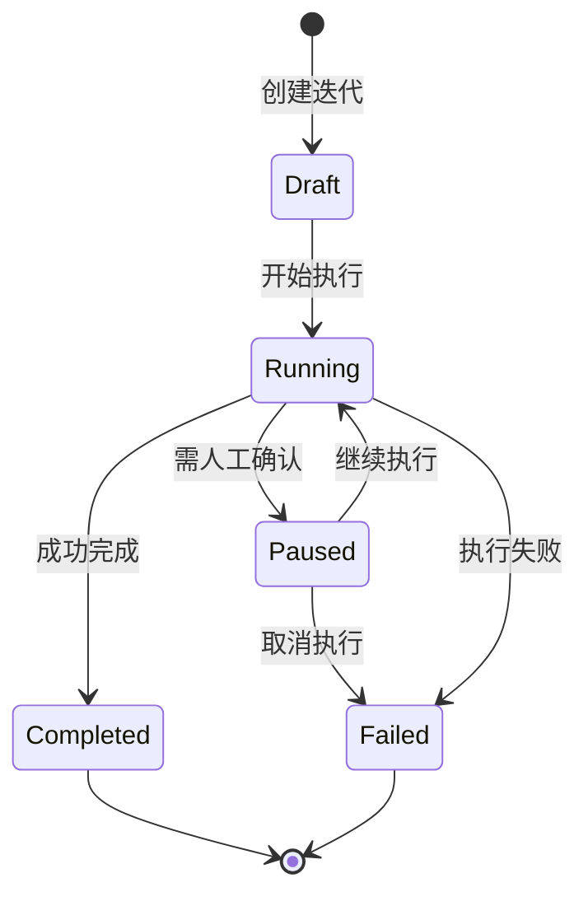
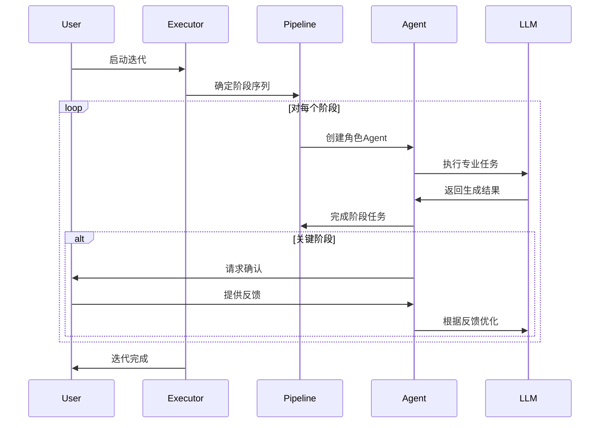
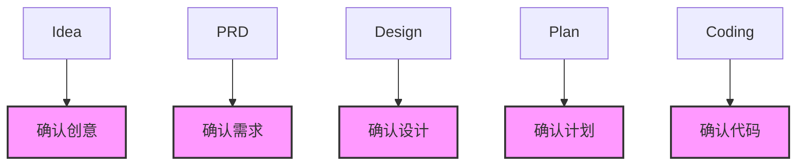
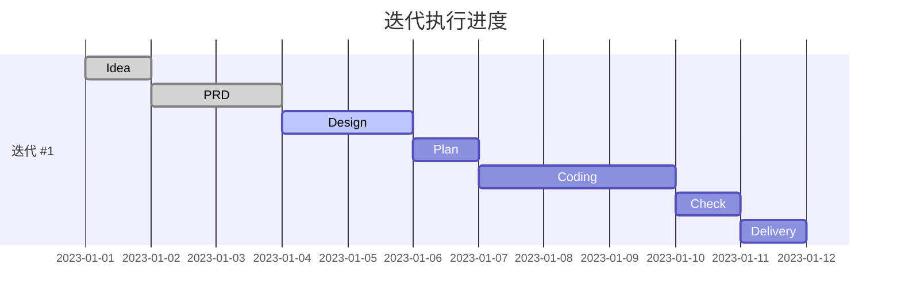

# 迭代管理功能详解

迭代管理是 Cowork Forge 系统的核心功能，提供了完整的迭代生命周期管理能力。通过迭代管理，用户可以创建、执行、监控和管理开发迭代，实现结构化的软件开发流程。

## 迭代生命周期



## 创建迭代

### 创建起源迭代（Genesis）

起源迭代适用于全新项目或完全重写现有系统的场景。

```bash
# 命令行创建起源迭代
cowork iter "实现用户认证系统" --description "包含注册、登录、密码重置功能的完整认证系统"
```

```rust
// API创建起源迭代
let iteration = iteration_executor.create_genesis_iteration(
    project,
    "实现用户认证系统",
    "包含注册、登录、密码重置功能的完整认证系统"
).await?;
```

**关键参数**:
- `title`: 迭代标题，简明描述迭代目标
- `description`: 详细描述，帮助Agent理解需求
- 自动分配迭代编号和唯一ID

### 创建演化迭代（Evolution）

演化迭代基于现有迭代进行扩展和优化，通过继承机制减少重复工作。

```bash
# 命令行创建演化迭代
cowork iter "添加第三方登录" --description "支持微信、QQ、GitHub第三方登录" --base "iter-1-1234567890"
```

```rust
// API创建演化迭代
let iteration = iteration_executor.create_evolution_iteration(
    project,
    "添加第三方登录",
    "支持微信、QQ、GitHub第三方登录",
    "iter-1-1234567890",
    InheritanceMode::Partial  // 部分继承模式
).await?;
```

**继承模式选择**:

| 模式 | 继承内容 | 适用场景 | 起始阶段 |
|------|----------|----------|----------|
| Full | 所有代码和制品 | 功能扩展、小幅修改 | Plan |
| Partial | 仅设计和文档 | 架构调整、重大变更 | Design/PRD |
| None | 不继承任何内容 | 完全新功能 | Idea |

### 智能起始阶段判断

系统根据变更描述自动分析合适的起始阶段：

```rust
fn analyze_change_scope(description: &str) -> String {
    let desc_lower = description.to_lowercase();
    
    // 架构变更关键词
    if contains_any(&desc_lower, &["架构", "architecture", "重构", "rewrite"]) {
        return "idea";
    }
    
    // 需求变更关键词
    if contains_any(&desc_lower, &["需求", "requirement", "功能", "feature"]) {
        return "prd";
    }
    
    // 设计变更关键词
    if contains_any(&desc_lower, &["设计", "design", "数据库", "database"]) {
        return "design";
    }
    
    // 默认：代码变更
    "plan"
}
```

## 执行迭代

### 自动执行流程

迭代执行器自动管理整个开发流程：



### 阶段执行策略

每个阶段的执行包含以下策略：

1. **重试机制**: 最多3次自动重试
2. **反馈循环**: 最多5轮人工反馈
3. **错误处理**: 自动诊断和恢复
4. **进度跟踪**: 实时状态更新

```rust
for stage in stages {
    let mut attempt = 0;
    const MAX_RETRIES: u32 = 3;
    
    while attempt < MAX_RETRIES {
        match stage.execute(&ctx, interaction.clone()).await {
            StageResult::Success(artifact) => {
                iteration.complete_stage(&stage_name, artifact);
                break;
            }
            StageResult::NeedsRevision(feedback) => {
                // 进入反馈循环
                handle_feedback_loop(&stage, &feedback).await;
            }
            StageResult::Failed(error) => {
                attempt += 1;
                if attempt >= MAX_RETRIES {
                    iteration.fail();
                    return Err(error);
                }
            }
        }
    }
}
```

### 人机协作点

系统在关键节点设置人机协作点：



**协作交互方式**:

1. **内容确认**: 查看生成内容并确认
2. **内容编辑**: 直接编辑生成的内容
3. **反馈建议**: 提供修改建议和反馈
4. **跳过确认**: 跳过当前确认（不推荐）

## 监控迭代

### 状态查询

```bash
# 查看所有迭代
cowork list

# 查看包括已完成的迭代
cowork list --all

# 查看特定迭代详情
cowork show iter-1-1234567890

# 查看当前项目状态
cowork status
```

### 迭代详情信息

```rust
pub struct Iteration {
    pub id: String,
    pub number: u32,
    pub title: String,
    pub description: String,
    pub status: IterationStatus,
    pub current_stage: Option<String>,
    pub completed_stages: Vec<String>,
    pub started_at: DateTime<Utc>,
    pub completed_at: Option<DateTime<Utc>>,
    pub artifacts: Artifacts,
}
```

**关键指标**:
- 迭代编号和ID
- 当前执行状态
- 已完成阶段列表
- 生成制品和文档
- 时间戳和持续时长

### 可视化进度展示

GUI界面提供迭代的可视化进度展示：



## 管理迭代

### 继续暂停的迭代

当迭代在等待人工确认时暂停，用户可以继续执行：

```bash
# 继续当前迭代
cowork continue

# 继续指定迭代
cowork continue iter-1-1234567890
```

### 删除迭代

```bash
# 删除指定迭代
cowork delete iter-1-1234567890
```

**安全机制**:
- 禁止删除正在执行中的迭代
- 当前迭代不能直接删除
- 删除前自动备份关键制品

### 迭代制品管理

每个迭代生成一组标准制品：

| 制品 | 描述 | 格式 | 位置 |
|------|------|------|------|
| idea | 创意文档 | Markdown | `.cowork-v2/iterations/{id}/artifacts/idea.md` |
| prd | 产品需求文档 | Markdown | `.cowork-v2/iterations/{id}/artifacts/prd.md` |
| design | 设计文档 | Markdown | `.cowork-v2/iterations/{id}/artifacts/design.md` |
| plan | 开发计划 | Markdown | `.cowork-v2/iterations/{id}/artifacts/plan.md` |
| delivery | 交付报告 | Markdown | `.cowork-v2/iterations/{id}/artifacts/delivery.md` |

## 最佳实践

### 1. 合理的迭代粒度

- **小型迭代**: 1-2周，适合单一功能模块
- **中型迭代**: 3-4周，适合多个相关功能
- **大型迭代**: 1-2个月，适合系统级重构

### 2. 清晰的迭代描述

好的迭代描述应该包含：
- 明确的业务目标
- 核心功能点清单
- 关键技术要求
- 成功验收标准

### 3. 选择合适的继承模式

- **新增功能**: 使用Full继承，从计划阶段开始
- **架构调整**: 使用Partial继承，从设计阶段开始
- **重大变更**: 使用None继承，从创意阶段开始

### 4. 有效的人机协作

- **定期确认**: 不要跳过关键确认点
- **及时反馈**: 提供具体、可操作的反馈
- **渐进优化**: 通过多轮反馈逐步完善结果

通过有效的迭代管理，开发团队可以显著提升开发效率和产品质量，实现真正的敏捷开发和持续交付。