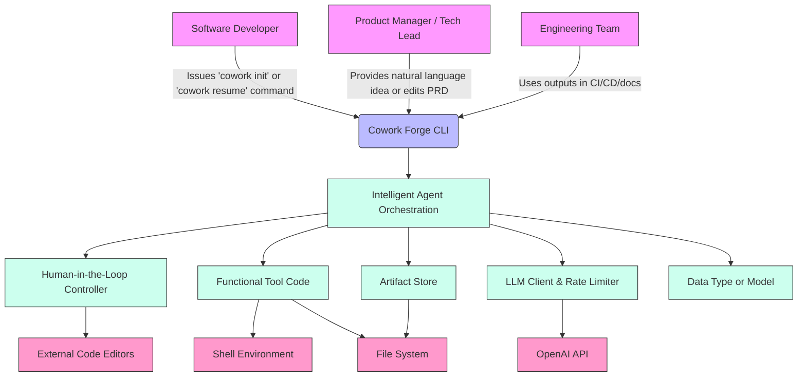

# System Context Overview

## 1. Project Introduction

**Project Name**: Cowork Forge  
**Generation Time**: 2026-01-27 10:30:53 (UTC)  
**Timestamp**: 1769509853

Cowork Forge is an AI-powered, multi-agent command-line tool designed to automate the end-to-end software development lifecycle—from initial ideation to final delivery—by orchestrating specialized AI agents that collaborate with human developers through structured, resumable workflows. It transforms vague natural language ideas into fully documented, validated, and implemented codebases while preserving human oversight at critical decision points.

The system’s core value lies in its ability to **reduce cognitive load and manual repetition** for developers and technical leads by automating high-effort, high-precision tasks such as requirement elicitation, architectural design, implementation planning, and code generation. By enforcing consistency through structured artifact management and integrating automated quality gates, Cowork Forge ensures that AI-generated outputs are not only rapid but also reliable, auditable, and aligned with project goals.

Technically, Cowork Forge is a **stateful, pipeline-driven system** built on a modular, agent-based architecture. It leverages Large Language Models (LLMs) as reasoning engines, but does not replace human judgment—it enhances it. All intermediate and final artifacts (requirements, designs, code plans, reports) are persisted as versionable JSON and Markdown files under a `.cowork/` directory, making the entire development process transparent, inspectable, and resumeable. This file-based “single source of truth” enables seamless interruption and resumption of workflows, a critical feature for real-world development environments where context switching is common.

Cowork Forge is not a full IDE or CI/CD platform; rather, it is a **co-pilot for the software development lifecycle**, operating as a CLI tool that integrates with existing developer toolchains—launching editors, invoking build tools, and generating artifacts that fit naturally into existing workflows.

---

## 2. Target Users

Cowork Forge serves three primary user personas, each with distinct needs and interaction patterns:

### **Software Developers**
- **Description**: Professional developers seeking to accelerate project setup and reduce boilerplate work while retaining full control over design and implementation.
- **Usage Scenarios**:
  - Initiating a new project by describing a feature in natural language (e.g., “Build a Rust API that authenticates users via JWT and stores data in SQLite”).
  - Pausing development to review generated code or design documents in their preferred editor (e.g., VSCode), then resuming the workflow.
  - Using the `cowork resume` command to pick up a partially completed project after a break or context switch.
- **Key Needs**:
  - Automate repetitive tasks (project scaffolding, boilerplate code, test stubs).
  - Maintain architectural control through human-in-the-loop (HITL) validation.
  - Avoid context loss by resuming interrupted workflows with full artifact persistence.
  - Receive structured, well-documented outputs that conform to team standards.

### **Product Managers / Technical Leads**
- **Description**: Non-coding stakeholders who define product requirements and need structured, auditable deliverables without manual documentation.
- **Usage Scenarios**:
  - Converting a product vision or Jira ticket into a formal Product Requirements Document (PRD) via natural language input.
  - Reviewing and approving the generated PRD, design document, and implementation plan before code generation begins.
  - Receiving an automated Delivery Report summarizing what was built, what’s missing, and potential risks.
- **Key Needs**:
  - Transform vague ideas into formal, structured documentation (PRDs, design specs).
  - Ensure alignment between requirements and implementation via traceability.
  - Approve or reject AI-generated artifacts before code is written.
  - Obtain a clear, concise delivery summary for stakeholder reporting.

### **Engineering Teams**
- **Description**: Teams adopting AI-augmented development practices and seeking standardized, auditable, and repeatable workflows.
- **Usage Scenarios**:
  - Enforcing a consistent development pipeline across multiple projects and teams.
  - Auditing AI-generated artifacts for compliance, security, or quality standards.
  - Integrating Cowork Forge outputs (PRDs, CheckReports, delivery docs) into existing documentation or CI/CD pipelines.
- **Key Needs**:
  - Standardize development workflows to reduce variability and onboarding time.
  - Track progress and decision history through versioned artifact logs in `.cowork/`.
  - Audit AI outputs for completeness, coverage, and correctness via automated validation reports.
  - Enable reproducibility: any team member can resume a project from its last state.

---

## 3. System Boundaries

Cowork Forge defines a clear and intentional system boundary that separates its autonomous logic from external systems it depends on or interacts with. This boundary ensures modularity, security, and maintainability.

### **Included Components (Within System Boundary)**

The following components are **internally developed and tightly integrated** into the Cowork Forge system:

- **`cowork-cli` and `cowork-cli-v2`**: CLI entry points that parse user commands (`init`, `resume`, `modify`, `inspect`, `export`) and delegate execution to the core engine.
- **`cowork-core` and `cowork-core-v2`**: Core business logic modules containing all AI agents, orchestration pipeline, tools, and data models.
- **Intelligent Agent Orchestration**: The pipeline engine that sequences specialized agents (IdeaIntake, PRD, Design, Plan, Coding, Check, Delivery, CodeUpdater, etc.) in a deterministic, resumable flow.
- **Human-in-the-Loop (HITL) Controller**: Manages all user interactions—text input, confirmation prompts, and file editing via external editors.
- **Functional Tool Code**: Secure, sandboxed tools for file I/O, command execution, validation, and artifact management (e.g., `read_file`, `RunCommandTool`, `CheckFeatureCoverageTool`).
- **Artifact Store (`FileArtifactStore`)**: Persistent storage layer managing all `.cowork/` directory operations—serializing and deserializing artifacts using `serde_json`.
- **Data Models**: Structured data contracts (e.g., `PRD`, `DesignDoc`, `CheckReport`, `SessionMetadata`) that define the common language between agents and storage.
- **Configuration Management**: Loads system-wide settings from `config.toml` or environment variables (LLM model, rate limits, log levels).
- **LLM Client & Rate Limiter**: Wraps external LLM APIs with rate-limiting logic to ensure compliance with usage policies.
- **Artifact Envelope (`ArtifactEnvelope<T>`)**: Generic wrapper that adds metadata (timestamp, stage, author) to all artifacts for traceability.

> **Note**: All components are written in Rust and organized into a monorepo with crates for CLI, core, and v2 modules, enabling modular development and versioned evolution.

### **Excluded Components (External Dependencies)**

The following systems are **explicitly excluded** from the Cowork Forge system boundary:

- **External LLM Services (e.g., OpenAI API)**: Used as a black-box reasoning engine via API calls; not owned or maintained by Cowork Forge.
- **Host Operating System Shell**: Only invoked for command execution (e.g., `cargo check`); no OS-level control beyond process spawning.
- **Version Control Systems (e.g., Git)**: Artifacts are file-based and versionable, but Cowork Forge does not interact with Git repositories or perform commits.
- **Build Tools (e.g., Cargo, npm)**: Invoked only via command execution for validation; no dependency resolution, compilation, or packaging logic.
- **External Code Editors (e.g., VSCode, Vim)**: Launched via HITL for user review, but not controlled or integrated beyond process invocation.
- **CI/CD Pipelines**: Outputs (e.g., PRDs, CheckReports) may be consumed by CI/CD, but Cowork Forge does not trigger or manage pipelines.
- **Database Systems**: All data is stored in flat files under `.cowork/`; no SQL, NoSQL, or in-memory databases are used.

> **Architectural Decision**: By excluding version control, build tools, and CI/CD, Cowork Forge remains a **lightweight, portable, and non-intrusive** tool that integrates into existing developer environments without imposing new infrastructure.

---

## 4. External System Interactions

Cowork Forge interacts with four external systems through well-defined, secure, and constrained interfaces. These interactions are critical to its functionality but are abstracted behind internal abstractions to maintain system integrity.

| External System | Interaction Type | Description | Dependency Criticality | Security Considerations |
|-----------------|------------------|-------------|------------------------|--------------------------|
| **OpenAI API** | API Call | Provides LLM reasoning, text generation, and structured output parsing for all AI agents. Used to generate PRDs, designs, code plans, and delivery reports. | High | API keys are loaded from config or env; rate limiting enforced internally; no sensitive data sent beyond project context. |
| **Shell Environment** | Command Execution | Executes system commands (e.g., `cargo check`, `npm test`, `ls`, `pwd`) to validate project structure, compile code, and detect project type (Rust, Node.js, Python). | High | Commands are sandboxed; dangerous operations (e.g., `rm -rf`, `sudo`) are blocked by tooling; only whitelisted commands allowed. |
| **File System** | File I/O | Persistent storage for all artifacts under `.cowork/`. Reads/writes JSON (structured data) and Markdown (human-readable docs). | Critical | All file operations are path-sanitized; traversal attacks prevented via `canonicalize` and `.gitignore` awareness. |
| **External Code Editors** | Process Invocation | Launched via `std::process::Command` to allow users to review and edit generated files (e.g., `idea.md`, `PRD.md`, `README.md`). | Medium | Editor is invoked using user’s default (`$EDITOR` or `code`); no file locking or real-time sync; edits are saved to disk and reloaded by system. |

### **Dependency Relationship Analysis**

- **OpenAI API** is the **primary external dependency** for AI reasoning. Failure here halts agent execution but does not corrupt state—workflows can be resumed once connectivity is restored.
- **Shell Environment** is **operationally critical** for validation. Without it, the `Check` agent cannot verify build integrity, reducing confidence in generated code.
- **File System** is the **foundation of persistence**. Loss of `.cowork/` directory means loss of all workflow state. Backups are the user’s responsibility.
- **External Editors** are **user experience critical** but not system-critical. If no editor is available, HITL falls back to terminal text input (limited functionality).

> **Architectural Decision**: All external interactions are **encapsulated within tool modules** (e.g., `RunCommandTool`, `HitlController`) that enforce safety, logging, and retry logic. This ensures that changes to external systems (e.g., switching from OpenAI to Anthropic) require only tool replacement, not system-wide refactoring.

---

## 5. System Context Diagram

### **Key Interaction Flows**

1. **Initiation Flow**:  
   A user runs `cowork init` → CLI loads config → Orchestration creates pipeline → IdeaIntake agent uses LLM to generate `IdeaSpec` → HITL controller opens `idea.md` in editor → User reviews → System persists artifact → Pipeline proceeds to PRD, Design, etc.

2. **Resumption Flow**:  
   User runs `cowork resume` → CLI detects `.cowork/` → ArtifactStore loads last completed stage → Orchestration resumes from next stage (e.g., Plan) → All prior artifacts are reloaded → HITL triggered if needed → Workflow continues.

3. **Verification Flow**:  
   After code generation, Check Agent loads PRD and TodoList → Uses Validation Tools to check file coverage → Executes `cargo check` via Shell → Generates `CheckReport` → Persists to ArtifactStore → Delivery Agent aggregates all artifacts into final `DELIVERY.md`.

4. **Incremental Update Flow**:  
   User runs `cowork modify` → CodeUpdater agent compares old vs. new PRD → Maps deltas to source files → Coding agent applies incremental edits via `replace_line_range` → HITL confirms changes → Check Agent revalidates → Delivery Report updated.

### **Architecture Decision Summary**

- **File-Based State**: All state is stored in files, not databases, enabling portability, auditability, and simplicity.
- **Agent-Orchestrated Pipeline**: Sequential, deterministic workflow ensures consistency and enables resumability.
- **HITL as a First-Class Citizen**: Human review is not optional—it is a required stage in the pipeline.
- **Tool Abstraction**: External interactions are hidden behind safe, reusable tools, enabling secure and testable agent behavior.
- **No External Dependencies Beyond LLM and Shell**: Keeps the system lightweight and embeddable in any development environment.

---

## 6. Technical Architecture Overview

### **Main Technology Stack**

| Layer | Technology | Role |
|-------|------------|------|
| **Language** | Rust | Primary language for performance, safety, and concurrency. Enables zero-cost abstractions and memory safety in CLI and agent logic. |
| **LLM Interface** | OpenAI API (gpt-4-turbo, gpt-3.5-turbo) | Core reasoning engine for text generation, structured output parsing, and decision-making. |
| **Serialization** | `serde_json` | Standardized serialization of all artifacts (IdeaSpec, PRD, CheckReport, etc.) to/from JSON. |
| **CLI Framework** | `clap` | Command-line argument parsing and subcommand routing. |
| **HITL Interface** | `dialoguer` crate | Terminal-based user interaction (prompts, confirmations, multi-line input). |
| **Configuration** | `config` + `toml` | Loads settings from `config.toml` and environment variables. |
| **File System** | Standard Rust `std::fs` + path sanitization | Secure, path-aware file operations with `.gitignore` filtering. |
| **Command Execution** | `std::process::Command` | Safe, sandboxed shell execution with output capture and blocking of dangerous commands. |

### **Architecture Patterns**

- **Pipeline Pattern**: Workflows are modeled as ordered sequences of stages (agents), each producing an artifact consumed by the next. Enables modularity and resumability.
- **Agent-Based Architecture**: Each stage is a stateless, independent agent implementing `StageAgent` trait. This allows easy extension (e.g., adding a “SecurityReview” agent).
- **Event-Driven State Management**: Artifacts act as events that transition the system from one state to another. The `.cowork/` directory is the system’s event log.
- **Tool-Based Interaction**: All external interactions (file, command, editor) are encapsulated as tools. Agents cannot directly access the file system—they must use tools, enabling sandboxing and testing.
- **Human-in-the-Loop (HITL) Integration**: HITL is not an afterthought—it is a required stage in the pipeline. The system pauses and waits for human input before proceeding.

### **Key Design Decisions**

1. **File System as the Single Source of Truth**  
   Rather than using a database, all state is persisted as files. This decision prioritizes **transparency, auditability, and simplicity**. Developers can inspect, diff, and version artifacts using standard tools (Git, diff, grep).

2. **No In-Memory State Between Stages**  
   Each agent reads artifacts from disk and writes to disk. This ensures **resumability**—even if the process crashes, the state is preserved.

3. **Strict Separation of Concerns**  
   The CLI is a thin facade. The core logic resides in `cowork-core`. Tools are reusable and testable. Agents are stateless. This enables **unit testing of agents without CLI or external dependencies**.

4. **Rate Limiting at the LLM Client Layer**  
   Rate limiting is enforced by a decorator (`RateLimitedLlm`) around the LLM client, not in the agents. This ensures **compliance with API terms** without burdening business logic.

5. **Validation as a Dedicated Agent**  
   The `CheckAgent` is not a post-step—it is a first-class agent with its own tools, logic, and output (`CheckReport`). This makes quality gates **explicit, configurable, and auditable**.

6. **Incremental Updates via Delta Mapping**  
   Instead of regenerating code on every change, the system maps requirement deltas to source files and applies targeted edits. This preserves developer modifications and reduces noise.

---

## Conclusion

Cowork Forge represents a novel paradigm in AI-assisted software development: **not automation for automation’s sake, but augmentation through structured collaboration**. By combining the scalability of LLMs with the precision of human judgment, and by anchoring all state in transparent, versionable artifacts, it delivers a development experience that is both powerful and trustworthy.

Its C4 SystemContext reveals a system that is **highly focused, intentionally bounded, and deeply integrated with the developer’s existing workflow**. It does not attempt to replace Git, CI/CD, or editors—it enhances them. This makes Cowork Forge not just a tool, but a **new standard for AI-augmented software development**—one where the human remains in control, and the machine becomes a disciplined, reliable co-pilot.
