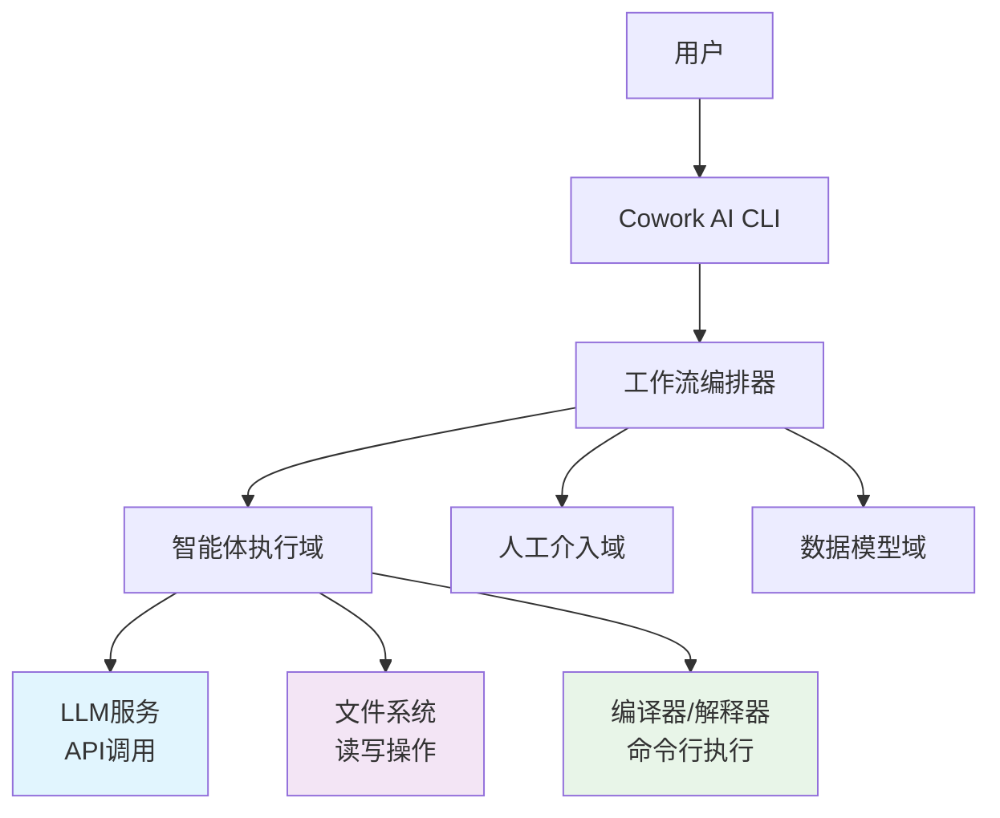
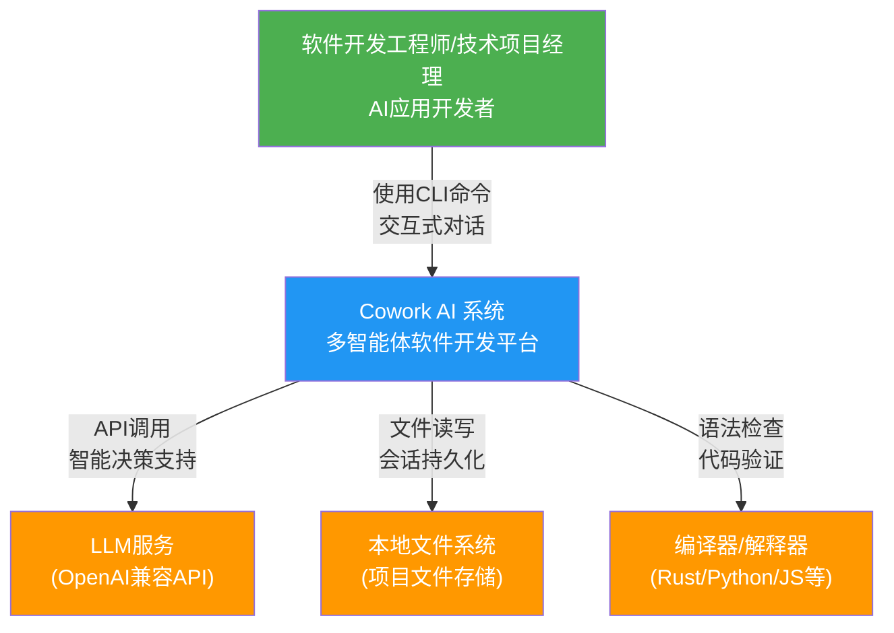

# Cowork AI 多智能体软件开发系统 - 系统上下文架构文档

*文档生成时间：2026-01-21 10:01:27 (UTC)  
文档版本：1.0  
基于研究材料置信度：9.5/10*

## 1. 项目介绍

### 1.1 项目概述
Cowork AI 多智能体软件开发系统是一个基于人工智能的创新型开发工具，采用命令行界面（CLI）提供完整的软件开发生命周期管理。系统通过多智能体协同工作模式，实现了从创意输入到代码交付的全流程自动化。

### 1.2 核心价值主张
- **开发效率提升**：通过AI驱动的自动化流程，显著减少人工编码工作量，加速从概念到实现的过程
- **质量保证**：集成多层质量检查机制，确保生成的代码符合行业标准和最佳实践
- **迭代支持**：支持多轮迭代开发和需求变更管理，保护用户自定义修改
- **智能决策**：利用大语言模型实现智能化的技术决策和代码生成

### 1.3 技术特性
- **多智能体架构**：8个专业智能体分别负责不同开发阶段，实现职责分离和专业化处理
- **工作流编排**：基于状态机的流程管理，支持会话持久化和断点续传
- **模块化设计**：清晰的域边界和接口定义，确保系统的可维护性和可扩展性
- **人工介入机制**：在关键决策点提供人工审核和反馈通道，平衡自动化与人工控制

## 2. 目标用户分析

### 2.1 主要用户角色

#### 2.1.1 软件开发工程师
- **核心需求**：快速将创意转化为可执行代码，自动化处理重复性编码任务
- **使用场景**：日常开发中的原型创建、功能实现、代码重构
- **技术背景**：熟悉命令行工具和软件开发流程，具备基本的编程知识

#### 2.1.2 技术项目经理
- **核心需求**：结构化需求文档生成，开发进度跟踪和技术方案评审
- **使用场景**：项目规划阶段的需求分析，开发过程中的质量监控
- **业务价值**：提升需求管理的规范性和开发过程的可视化程度

#### 2.1.3 AI应用开发者
- **核心需求**：多智能体协同工作流程，LLM集成和会话状态管理
- **使用场景**：AI驱动应用的快速开发和迭代实验
- **技术特性**：关注系统的智能决策能力和扩展性

### 2.2 用户交互模式
- **主要入口**：命令行界面（CLI），支持命令参数和交互式对话
- **会话管理**：支持新会话创建和现有会话恢复，确保开发连续性
- **反馈机制**：通过人工介入点收集用户反馈，指导后续迭代方向

## 3. 系统边界定义

### 3.1 系统范围界定

#### 3.1.1 包含的核心组件
```plaintext
┌─────────────────────────────────────────────────────────────┐
│                    Cowork AI 系统边界                        │
├─────────────────────────────────────────────────────────────┤
│  ✅ 命令行界面(CLI)和用户交互                                │
│  ✅ 工作流程编排器(Orchestrator)                            │
│  ✅ 多智能体系统(8个专业智能体)                             │
│  ✅ 人工介入(HITL)控制器                                    │
│  ✅ 工件存储和会话管理系统                                   │
│  ✅ 文件操作工具集                                          │
│  ✅ 配置管理和模型服务集成                                  │
└─────────────────────────────────────────────────────────────┘
```

#### 3.1.2 明确排除的外部组件
- **图形用户界面(GUI)**：系统专注于命令行交互，不提供可视化界面
- **版本控制系统集成**：如Git等VCS集成不在当前版本范围内
- **CI/CD流水线**：持续集成和部署功能需要额外扩展
- **云端部署运维**：系统设计为本地运行工具，不包含云原生特性
- **团队协作功能**：当前版本专注于单用户场景，团队协作需后续开发
- **第三方API集成**：除LLM服务外，不集成其他外部API服务

### 3.2 架构决策依据
系统边界的设计基于以下考虑：
- **专注核心价值**：集中资源实现AI驱动开发的本质需求
- **技术可行性**：确保初始版本的可靠性和稳定性
- **渐进式扩展**：为未来功能扩展预留架构空间

## 4. 外部系统交互

### 4.1 关键外部依赖系统

#### 4.1.1 OpenAI兼容的LLM服务
- **交互类型**：API调用
- **功能角色**：为所有智能体提供大语言模型能力
- **关键用途**：需求分析、技术设计、代码生成、质量检查等决策过程
- **依赖强度**：高（系统核心能力的基础依赖）

#### 4.1.2 本地文件系统
- **交互类型**：读写操作
- **功能角色**：项目文件存储、代码管理、会话持久化
- **关键用途**：代码文件生成修改、工件数据存储、配置管理
- **技术特性**：支持异步文件操作和增量编辑功能

#### 4.1.3 编译器/解释器
- **交互类型**：命令行执行
- **功能角色**：代码语法检查和验证
- **支持语言**：Rust、Python、JavaScript等主流开发语言
- **质量保证**：集成到代码检查阶段，确保生成代码的可执行性

### 4.2 交互模式分析



### 4.3 依赖管理策略
- **容错设计**：针对外部服务不可用情况设计降级方案
- **配置灵活**：支持多种LLM服务提供商和本地模型部署
- **性能优化**：异步调用和批量处理优化外部交互效率

## 5. 系统上下文图

### 5.1 C4 SystemContext 图示



### 5.2 关键数据流说明

#### 5.2.1 用户到系统交互流
1. **创意输入**：用户通过CLI提供初始需求或创意描述
2. **流程控制**：系统引导用户完成各个开发阶段
3. **反馈收集**：在关键决策点获取用户确认和指导

#### 5.2.2 系统到外部系统数据流
1. **LLM服务调用**：智能体将结构化数据发送给LLM，获取决策建议
2. **文件系统操作**：生成和修改代码文件，保存会话状态数据
3. **代码验证**：调用编译器进行语法检查和功能验证

### 5.3 架构决策记录

| 决策项 | 决策内容 |  rationale |
|-------|---------|------------|
| CLI优先策略 | 采用命令行界面而非GUI | 聚焦开发人员工作习惯，降低系统复杂度 |
| 多智能体架构 | 8个专业智能体分工协作 | 实现关注点分离，提高系统可维护性 |
| 外部服务抽象 | 统一LLM服务接口 | 支持多提供商切换，提高系统灵活性 |
| 会话持久化 | 基于文件系统的状态管理 | 确保开发过程的可恢复性和连续性 |

## 6. 技术架构概述

### 6.1 核心架构模式

#### 6.1.1 分层架构设计
系统采用清晰的三层架构模式：
- **核心业务域**：工作流编排、智能体执行、数据模型等核心逻辑
- **基础设施域**：配置管理、用户界面、库接口等支撑组件
- **工具支持域**：文件操作、工具函数等通用能力

#### 6.1.2 事件驱动协调
- **工作流引擎**：基于状态机的流程控制，管理8阶段开发生命周期
- **智能体协作**：通过标准接口实现智能体间的数据传递和协调
- **错误恢复**：完善的异常处理机制，支持从失败点重新开始

### 6.2 关键技术栈

| 技术领域 | 技术选型 | 选择理由 |
|---------|---------|----------|
| 编程语言 | Rust | 性能优异，内存安全，适合系统级编程 |
| 架构模式 | 多智能体系统 | 自然匹配AI驱动开发的工作流程 |
| 持久化 | 文件系统+JSON | 简单可靠，易于调试和迁移 |
| 配置管理 | TOML格式 | 可读性好，类型安全，生态成熟 |

### 6.3 质量属性设计

#### 6.3.1 可维护性
- **模块化设计**：清晰的域边界和接口定义
- **代码组织**：基于Cargo工作区的模块化管理
- **文档支持**：完整的架构文档和代码注释

#### 6.3.2 可扩展性
- **插件化架构**：支持新智能体的轻松集成
- **配置驱动**：通过配置文件支持功能扩展
- **接口抽象**：统一的外部服务接口，支持多提供商

#### 6.3.3 可靠性
- **错误处理**：全面的错误处理和数据验证机制
- **状态恢复**：会话持久化支持中断恢复
- **质量检查**：多层验证确保输出质量

### 6.4 演进路线规划
当前架构为未来扩展预留了充分空间：
- **团队协作**：可通过扩展数据模型域支持多用户场景
- **云原生**：基础设施域可演进支持容器化部署
- **生态集成**：工具支持域为第三方工具集成提供基础

---

**文档说明**：本系统上下文文档基于现有研究材料生成，准确反映了Cowork AI系统的架构现状和设计理念。随着系统演进，建议定期更新本文档以保持与实际架构的一致性。

*文档结束*