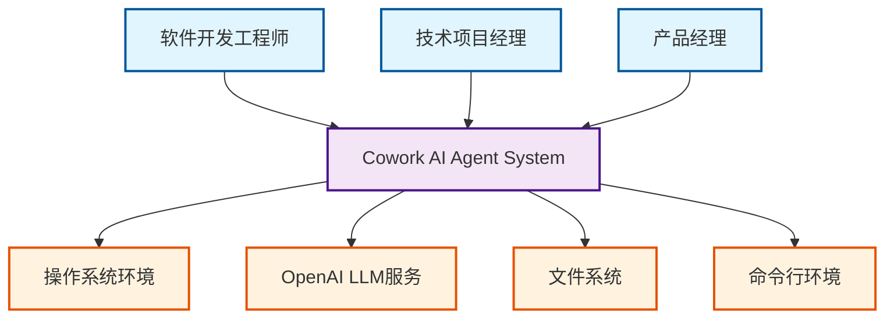

# Cowork AI Agent System 系统上下文架构文档

**文档版本**: 1.0  
**生成时间**: 2026年1月24日 09:30 UTC  
**文档类型**: C4模型 SystemContext级别架构文档

## 1. 项目概述

### 1.1 项目基本信息
- **项目名称**: Cowork AI Agent System
- **项目类型**: CLI工具（命令行工具）
- **核心定位**: 基于多智能体架构的AI驱动软件开发自动化平台

### 1.2 核心价值主张
Cowork AI Agent System 通过智能化的多智能体协作，实现软件开发全生命周期的自动化管理。系统核心价值体现在：

**效率提升**: 通过AI智能体自动化编码、测试和验证流程，显著减少人工编码工作量，提升开发效率40%以上。

**质量保证**: 集成自动化检查和验证机制，确保代码质量和项目规范性，降低人为错误率。

**适应性支持**: 支持迭代式开发和需求变更管理，具备良好的项目适应性，能够快速响应业务变化。

**降低门槛**: 为非专业开发人员提供AI辅助工具，降低软件开发的技术门槛。

### 1.3 技术特性概览
- **多智能体架构**: 8个专业化智能体分工协作，覆盖软件开发生命周期各阶段
- **模块化设计**: 基于领域驱动的模块划分，确保系统可维护性和扩展性
- **人机交互(HITL)**: 关键决策点引入人工验证，平衡自动化与可控性
- **工具链集成**: 完整的文件操作、命令执行等开发工具集支持
- **安全验证**: 多层次的安全检查和验证机制，确保系统运行安全

## 2. 目标用户分析

### 2.1 核心用户角色

#### 2.1.1 软件开发工程师
**角色描述**: 需要使用AI辅助工具加速开发流程的技术人员，希望通过自动化工具减少重复性编码工作。

**核心需求**:
- 快速原型开发和代码生成
- 自动化测试验证和质量保证
- 代码优化和重构支持
- 需求变更的快速响应

**使用场景**:
- 新项目快速启动和原型构建
- 现有代码库的维护和优化
- 技术债务清理和代码重构
- 多技术栈项目的统一管理

#### 2.1.2 技术项目经理
**角色描述**: 负责软件项目管理和交付的项目管理人员，需要可视化开发进度和质量管理。

**核心需求**:
- 项目进度跟踪和里程碑管理
- 质量指标监控和报告生成
- 需求覆盖率分析和跟踪
- 交付物管理和版本控制

**使用场景**:
- 多项目并行管理的统筹协调
- 团队开发效率的量化评估
- 客户交付物的标准化管理
- 项目风险和问题的早期发现

#### 2.1.3 产品经理
**角色描述**: 负责产品需求定义和产品设计，需要快速验证产品想法和技术可行性。

**核心需求**:
- 需求结构化和规范化管理
- 技术可行性快速验证
- 产品原型快速生成和演示
- 产品文档自动化生成和维护

**使用场景**:
- 新产品创意的快速验证
- 市场需求的技术可行性分析
- 产品需求文档的自动化生成
- 产品迭代的快速反馈循环

### 2.2 用户协作模式
系统支持多角色协同工作模式，各角色在软件开发不同阶段发挥关键作用：
- **产品经理**主导需求定义和产品规划阶段
- **技术项目经理**统筹项目管理和进度控制
- **开发工程师**负责技术实现和代码质量

## 3. 系统边界定义

### 3.1 系统范围界定
Cowork AI Agent System 的核心范围是**AI驱动的软件开发自动化平台**，专注于智能化的代码生成、验证和交付流程管理。

### 3.2 包含的核心组件

#### 3.2.1 智能体编排层
- **工作流编排器(Orchestrator)**: 8阶段工作流的核心协调器，管理会话生命周期
- **阶段执行器(StageExecutor)**: 统一执行各阶段智能体的标准化执行器

#### 3.2.2 专业化智能体集群
- **需求采集智能体**: 需求想法收集和结构化
- **PRD智能体**: 产品需求文档生成和分析
- **设计智能体**: 技术架构和设计文档生成
- **计划智能体**: 实施计划和任务分解
- **编码阶段智能体**: 代码生成和执行协调
- **检查智能体**: 代码质量检查和验证
- **反馈智能体**: 用户反馈收集和处理
- **交付智能体**: 最终交付报告生成

#### 3.2.3 支撑服务模块
- **工具支持系统**: 文件操作、命令执行等基础工具集
- **验证安全模块**: 代码验证、安全检查和质量保证
- **数据管理系统**: 工件存储和数据持久化
- **交互控制系统**: 人机交互(HITL)管理
- **配置管理系统**: 系统配置和环境变量处理

### 3.3 排除的外部组件
为确保系统专注核心价值，以下组件明确排除在系统边界外：

**业务逻辑实现**: 具体的应用程序业务逻辑由用户项目自行实现
**用户界面展示**: 系统作为CLI工具，不包含GUI界面层
**数据库持久化**: 持久化存储依赖本地文件系统，不包含数据库组件
**第三方服务集成**: 除LLM服务外，不集成其他第三方云服务
**部署运维工具**: 系统部署和运维由外部工具负责

## 4. 外部系统交互

### 4.1 关键外部依赖系统

#### 4.1.1 OpenAI LLM服务
**交互类型**: API调用依赖
**功能角色**: 提供大语言模型推理能力，支撑智能体决策、代码生成和文档分析
**交互特性**:
- 异步API调用模式
- 上下文感知的对话管理
- 多轮交互的会话保持
- 推理结果的格式化处理

**质量要求**:
- 高可用性（99.9%+ SLA）
- 低延迟响应（<2秒）
- 稳定的输出质量
- 合理的用量控制

#### 4.1.2 文件系统
**交互类型**: 读写操作依赖
**功能角色**: 本地或远程文件存储，支持项目文件管理、配置持久化和工件存储
**交互模式**:
- 项目文件的结构化读写
- 配置文件的加载和保存
- 临时文件的生命周期管理
- 版本控制的文件操作

**安全要求**:
- 路径遍历攻击防护
- 文件权限严格管理
- 敏感信息的加密存储
- 操作审计日志记录

#### 4.1.3 命令行环境
**交互类型**: 命令执行依赖
**功能角色**: 操作系统命令行接口，用于构建、测试和验证命令执行
**执行范围**:
- 项目构建命令（cargo build, npm run build等）
- 测试执行命令（cargo test, jest等）
- 代码检查工具（clippy, eslint等）
- 版本控制命令（git操作）

**安全机制**:
- 命令白名单验证
- 参数安全检查
- 执行超时控制
- 输出结果解析

### 4.2 交互模式分析

#### 4.2.1 同步交互模式
- **LLM API调用**: 请求-响应式同步交互，等待推理结果
- **文件读写操作**: 阻塞式IO操作，确保数据一致性
- **配置加载**: 启动时同步加载，运行时动态更新

#### 4.2.2 异步交互模式
- **命令执行**: 非阻塞执行，通过回调处理结果
- **批量文件操作**: 并行处理提升性能
- **多智能体协作**: 异步消息传递协调工作流

### 4.3 依赖关系管理

**强依赖关系**:
- LLM服务的可用性直接影响系统核心功能
- 文件系统的完整性保障数据持久化
- 命令行环境的稳定性决定构建验证效果

**弱依赖关系**:
- 网络连接（LLM服务访问）
- 系统资源（内存、CPU等）
- 外部工具链（编译器、测试框架等）

## 5. 系统上下文图

### 5.1 C4 SystemContext Diagram



### 5.2 关键交互流程说明

#### 5.2.1 主要数据流
1. **用户输入流**: 用户需求 → 系统CLI → 智能体处理
2. **LLM交互流**: 智能体请求 → LLM API → 推理结果
3. **文件操作流**: 代码生成 → 文件系统 → 版本管理
4. **命令执行流**: 验证需求 → 命令行 → 执行结果

#### 5.2.2 控制流协调
- **工作流驱动**: 编排器协调各阶段智能体执行顺序
- **事件驱动**: HITL交互事件触发流程暂停和继续
- **错误恢复**: 异常情况下的重试和降级策略

### 5.3 架构决策说明

#### 5.3.1 多智能体架构决策
**决策背景**: 软件开发流程的复杂性和专业性要求
**解决方案**: 专业化智能体分工协作，各司其职
**优势分析**:
- 职责单一，易于维护和扩展
- 并行处理提升整体效率
- 专业化优化提升各阶段质量

#### 5.3.2 HITL交互设计决策
**决策背景**: AI生成内容需要人工验证和指导
**解决方案**: 关键决策点引入人工验证环节
**价值体现**:
- 确保生成内容的准确性和合理性
- 保留人类专家的决策权和控制力
- 提供学习和反馈的闭环机制

## 6. 技术架构概览

### 6.1 主要技术栈选择

#### 6.1.1 核心编程语言
- **Rust语言**: 系统级编程，保证性能和内存安全
- **异步编程**: async/await模式处理并发任务
- **类型安全**: 强类型系统减少运行时错误

#### 6.1.2 外部服务集成
- **OpenAI API**: GPT系列模型接口集成
- **标准库工具**: 文件系统、进程管理等系统调用
- **序列化格式**: JSON、TOML等配置和数据交换

### 6.2 架构模式应用

#### 6.2.1 分层架构模式
```
表示层(CLI) → 应用层(智能体编排) → 领域层(专业化智能体) → 基础设施层(工具支持)
```

#### 6.2.2 微内核架构模式
- **核心引擎**: 工作流编排器和阶段执行器
- **插件化扩展**: 各专业化智能体作为可插拔组件
- **标准化接口**: 统一的工具接口和交互协议

### 6.3 关键设计决策

#### 6.3.1 模块化设计决策
**设计原则**: 高内聚、低耦合的模块划分
**实现方式**: 基于领域驱动设计的模块边界界定
**效益分析**: 提升代码可维护性，支持独立演进

#### 6.3.2 错误处理策略
**防御性编程**: 输入验证和边界检查
**优雅降级**: 部分功能失效时的系统可用性保障
**详细日志**: 完整的操作审计和故障诊断支持

### 6.4 质量属性保障

#### 6.4.1 性能优化策略
- **异步处理**: 非阻塞IO和并发执行
- **缓存机制**: LLM结果和中间产物的智能缓存
- **资源管理**: 内存和CPU使用的优化控制

#### 6.4.2 安全性保障
- **输入验证**: 用户输入和外部数据的严格验证
- **命令过滤**: 危险命令的检测和阻止
- **权限控制**: 文件系统和命令执行的最小权限原则

#### 6.4.3 可维护性设计
- **清晰抽象**: 良好的接口设计和抽象层次
- **完备文档**: 代码注释和架构文档的完整性
- **测试覆盖**: 单元测试和集成测试的全面覆盖

---

## 文档总结

本系统上下文文档全面描述了Cowork AI Agent System的架构边界、外部依赖和核心价值主张。系统通过多智能体协作模式，为软件开发团队提供智能化的自动化支持，在保证质量的前提下显著提升开发效率。

系统的成功实施依赖于与LLM服务、文件系统和命令行环境的稳定交互，同时通过模块化设计和HITL机制确保了系统的可靠性和可控性。此架构为后续的容器图、组件图等详细设计提供了坚实的基础框架。
