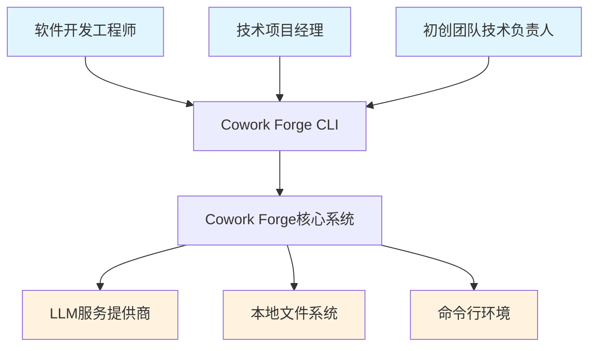
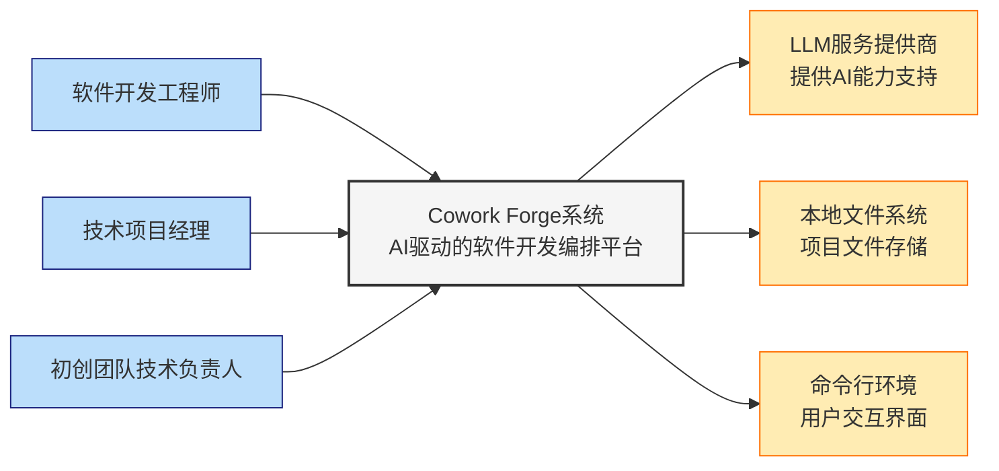

# Cowork Forge 系统上下文架构文档

*文档生成时间：2026-01-29 07:06:01 (UTC)*
*文档版本：1.0*

## 1. 项目概述

### 1.1 项目简介
Cowork Forge 是一个基于AI智能体的软件开发编排系统，通过多智能体协作和人工介入循环（HITL）机制，实现从需求收集到代码交付的完整软件开发流程自动化。系统采用Rust语言构建，具有高性能、内存安全和并发处理能力。

### 1.2 核心价值主张
- **开发效率提升**：通过AI智能体自动化软件开发全流程，显著减少人工编码时间
- **质量保证**：内置质量检查和多层次验证机制，确保代码质量和系统稳定性
- **可控性保障**：人机协作模式在关键决策点引入人工审核，平衡自动化与可控性
- **成本优化**：降低软件开发门槛，支持资源有限团队快速实现产品概念验证

### 1.3 技术特性
- **模块化架构**：采用分层设计，支持高内聚低耦合的组件开发
- **会话管理**：完整的项目状态跟踪和流程恢复机制
- **可扩展性**：插件化智能体架构，支持工作流定制和功能扩展
- **安全性**：安全的文件操作和命令执行环境

## 2. 目标用户分析

### 2.1 主要用户角色

#### 2.1.1 软件开发工程师
- **用户画像**：具备基础编程知识的技术人员，日常从事代码开发和维护工作
- **核心需求**：
  - 快速原型开发和代码生成
  - 自动化重复性编码任务
  - 项目规范化管理和代码质量保证
  - 增量修改和功能扩展支持

#### 2.1.2 技术项目经理
- **用户画像**：负责项目规划、进度跟踪和质量管理的技术管理者
- **核心需求**：
  - 自动化生成产品需求文档和设计文档
  - 项目进度可视化跟踪和报告生成
  - 设计规范检查和合规性验证
  - 交付质量评估和风险识别

#### 2.1.3 初创团队技术负责人
- **用户画像**：资源有限但需要快速验证产品概念的团队领导者
- **核心需求**：
  - 快速MVP开发和概念验证
  - 成本控制和资源优化利用
  - 技术债务管理和代码质量维护
  - 团队协作和知识传承支持

### 2.2 使用场景分析

#### 2.2.1 全新项目开发场景
用户通过命令行启动新项目创建流程，系统通过多智能体协作完成需求分析、架构设计、编码实现到最终交付的全流程。

#### 2.2.2 现有项目修改场景
用户提交变更请求，系统分析影响范围，智能实施代码修改，生成变更报告，确保修改的准确性和完整性。

#### 2.2.3 人工审核介入场景
在关键决策点（如架构设计评审、重大修改确认），系统暂停自动化流程，等待用户审核确认后继续执行。

## 3. 系统边界界定

### 3.1 系统范围定义
Cowork Forge 系统的核心边界涵盖AI驱动的软件开发编排全流程，具体包括：

**包含的核心组件**：
- 命令行接口(CLI)系统：用户交互入口点
- 会话管理和状态跟踪：项目生命周期管理
- 多智能体工作流引擎：流程编排和执行控制
- LLM集成和配置管理：AI能力接入和优化
- 文件操作和安全管理：安全的系统交互环境
- 数据模型和持久化存储：状态持久化和恢复
- 验证工具和质量管理：质量保证体系
- 人工介入循环(HITL)机制：人机协作支持

### 3.2 排除的外部依赖
系统明确排除以下组件，这些功能由外部系统或未来扩展实现：

**排除的外部组件**：
- 代码编译和构建系统：由外部构建工具处理
- 测试框架和自动化测试：专门的测试基础设施
- 部署和运维工具：独立的部署流水线
- 版本控制系统集成：外部版本管理工具
- 用户界面开发：专注于后端编排引擎
- 数据库管理系统：使用文件系统进行数据持久化
- 网络服务和API网关：纯本地命令行工具

## 4. 外部系统交互

### 4.1 外部系统依赖关系

#### 4.1.1 LLM服务提供商
- **交互类型**：API调用依赖
- **描述**：集成第三方大语言模型服务（如OpenAI等）提供AI能力
- **关键交互**：
  - 智能体指令生成和执行
  - 代码分析和生成
  - 文档创建和验证
- **依赖强度**：高（核心业务功能依赖）

#### 4.1.2 本地文件系统
- **交互类型**：文件读写操作
- **描述**：操作系统提供的文件存储和管理服务
- **关键交互**：
  - 项目文件读写和管理
  - 会话状态持久化存储
  - 配置文件和模板管理
- **依赖强度**：高（数据持久化依赖）

#### 4.1.3 命令行环境
- **交互类型**：命令行输入输出
- **描述**：用户通过终端与系统交互的操作环境
- **关键交互**：
  - 用户命令接收和解析
  - 执行进度和结果输出
  - 人工审核交互界面
- **依赖强度**：中（用户交互通道）

### 4.2 依赖关系分析

## 5. 系统上下文图

### 5.1 C4 SystemContext 图示

### 5.2 关键交互流程

#### 5.2.1 主要数据流
1. **用户指令流**：用户 → CLI接口 → 工作流引擎 → 智能体执行
2. **AI服务流**：智能体指令 → LLM集成 → 外部API → 响应处理
3. **数据持久化流**：会话状态 → 存储管理 → 文件系统 → 状态恢复
4. **用户反馈流**：人工介入点 → 交互工具 → 用户输入 → 流程继续

#### 5.2.2 架构决策说明
- **命令行优先设计**：专注于开发效率工具定位，避免复杂UI带来的维护成本
- **模块化智能体架构**：支持灵活的工作流组合和功能扩展
- **会话持久化机制**：确保长时间运行流程的可靠性和可恢复性
- **人工介入循环**：在自动化与可控性之间取得平衡的关键设计

## 6. 技术架构概览

### 6.1 主要技术栈
- **编程语言**：Rust（系统级编程，内存安全，高性能）
- **架构模式**：分层架构 + 模块化设计
- **AI集成**：基于API的大语言模型集成
- **数据持久化**：文件系统 + 结构化数据序列化
- **并发处理**：异步编程模型支持

### 6.2 核心架构模式

#### 6.2.1 分层架构设计
系统采用清晰的分层架构，确保各层职责分离：

1. **用户接口层**：命令行交互和用户输入处理
2. **核心业务层**：工作流编排和智能体执行管理
3. **基础设施层**：工具功能和服务支持
4. **数据持久层**：状态管理和存储抽象

#### 6.2.2 领域驱动设计
基于领域模块的分析，系统划分为五个核心领域：
- 智能体指令域（核心业务逻辑）
- 工作流编排域（流程控制）
- 工具功能域（基础设施服务）
- 数据存储域（持久化管理）
- 用户接口域（交互入口）

### 6.3 关键设计决策

#### 6.3.1 智能体协作模式
采用专门化的智能体分工协作模式，每个智能体负责特定开发阶段，通过工作流引擎协调执行顺序和数据传递。

#### 6.3.2 错误处理和恢复
内置完善的错误检测和恢复机制，支持流程中断后的状态恢复和继续执行，确保长时间运行流程的可靠性。

#### 6.3.3 可扩展性设计
模块化的智能体架构支持新功能的插件化集成，工作流引擎支持自定义流程组合，满足不同项目的特定需求。

## 7. 总结与展望

Cowork Forge 作为一个创新的AI驱动软件开发编排系统，通过智能体协作和人工介入的平衡设计，在提高开发效率的同时确保过程可控性。系统的模块化架构和清晰的责任分离为后续功能扩展和维护提供了良好的基础。

未来的架构演进可能包括更丰富的智能体类型支持、更灵活的工作流定制能力，以及与企业现有开发工具的深度集成。当前的系统上下文架构为这些演进方向预留了足够的扩展空间。

---
*文档版本控制：v1.0 | 生成时间：2026-01-29 07:06:01 (UTC) | 基于研究数据置信度：95%*