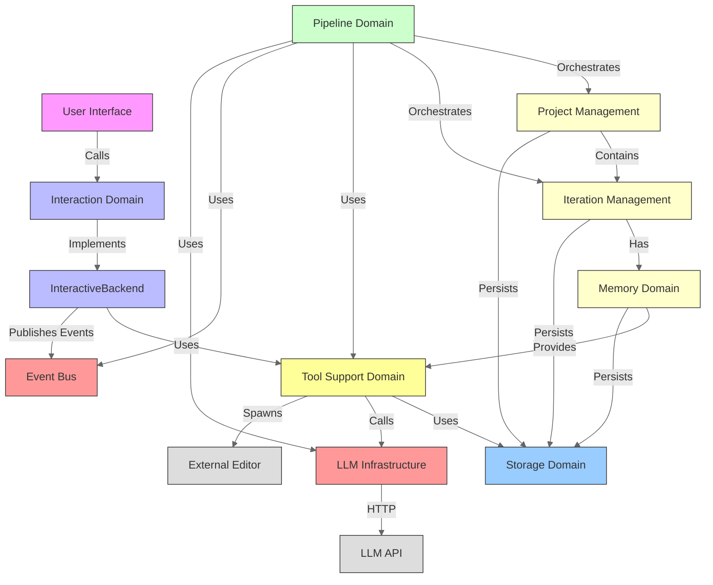
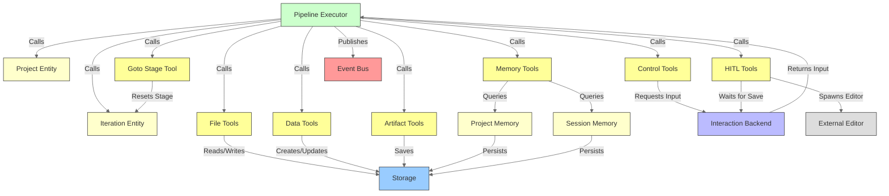
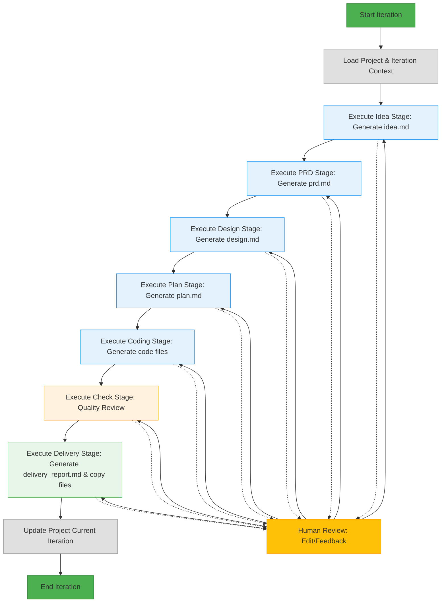
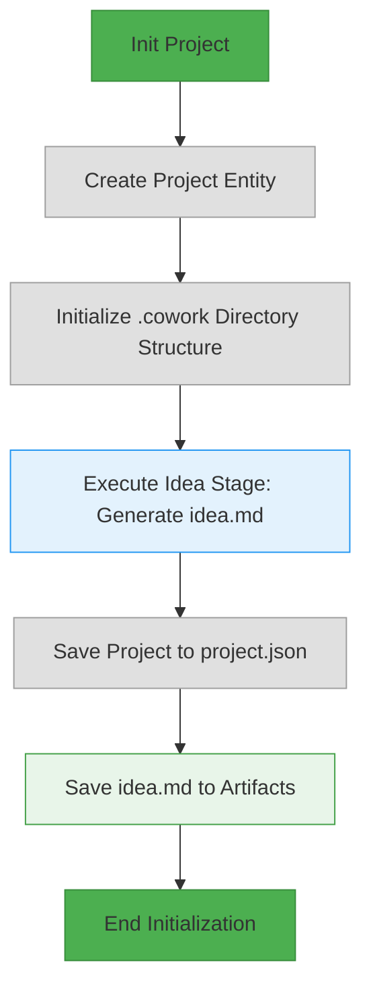
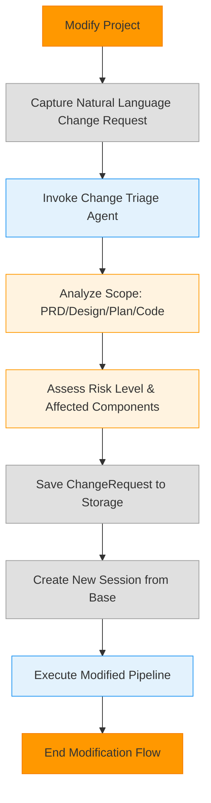
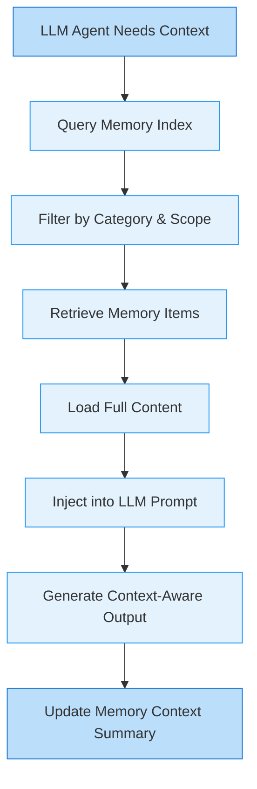
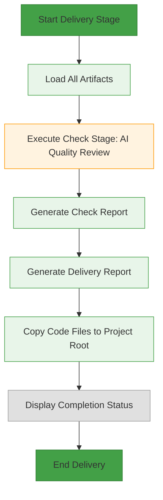
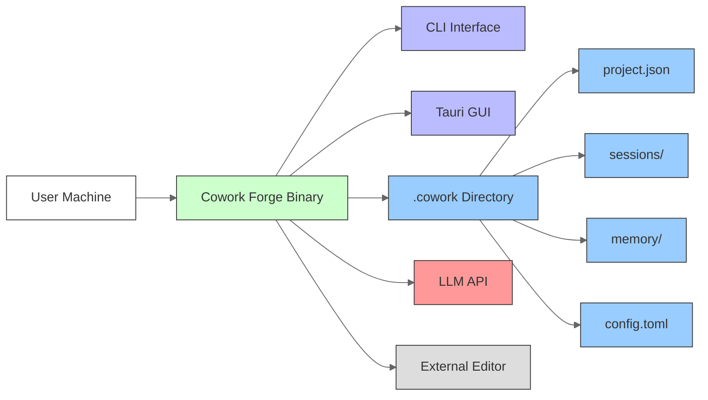

# System Architecture Documentation

## 1. Architecture Overview

### Architecture Design Philosophy

Cowork Forge is engineered as an **AI-augmented software development lifecycle (SDLC) orchestrator**, designed to eliminate manual overhead in requirement elicitation, architecture design, code generation, and documentation. Its core philosophy is **“Human-in-the-Loop Autonomy”** — empowering developers, product owners, and engineering leads with AI-driven automation while preserving human oversight at critical decision points.

The system rejects monolithic AI black-box approaches in favor of a **structured, traceable, and auditable workflow** grounded in domain-driven design (DDD) and clean architecture principles. Every AI-generated artifact is tied to a persistent, versioned session, enabling rollback, audit, and knowledge reuse. The architecture prioritizes:

- **Consistency**: Uniform behavior across CLI and GUI interfaces via shared core engine.
- **Safety**: No direct agent access to filesystem or state — all interactions mediated through secure, validated tools.
- **Traceability**: Every change, decision, and artifact is persisted in a session-scoped `.cowork` directory.
- **Extensibility**: Modular tooling and pipeline stages allow new AI agents or workflows to be plugged in without core modification.

### Core Architecture Patterns

Cowork Forge implements five foundational architectural patterns:

#### 1. **Clean Architecture (Hexagonal Architecture)**
The system strictly separates concerns into concentric layers:
- **Core Business Logic** (Domain, Pipeline): Independent of external systems.
- **Infrastructure Layer** (LLM, Storage, UI): Plug-in implementations.
- **Interface Adapters** (Interaction Backend, Tools): Translate between core and external systems.

Dependency flows inward: Infrastructure depends on Core, not vice versa. This enables testing, swapping, and mocking of external dependencies (e.g., switching LLM providers).

#### 2. **Pipeline Pattern**
The development lifecycle is modeled as a **sequential, stateful pipeline** with seven stages:  
`Idea → PRD → Design → Plan → Coding → Check → Delivery`

Each stage is a stateless, independently testable unit implementing the `Stage` trait. The `IterationExecutor` orchestrates execution, handles retries, feedback loops, and inheritance. This pattern ensures deterministic progression and enables partial re-execution (e.g., restarting from `Design` after feedback).

#### 3. **Tool-Based Agent Architecture (ADK Pattern)**
AI agents (LLM-driven) interact with the system **exclusively through a predefined set of tools**, not direct APIs or filesystem access. This enforces:
- **Safety**: Path validation prevents directory traversal.
- **Auditability**: All actions are logged via tool calls.
- **Extensibility**: New tools can be added without modifying agent logic.
- **Control**: Human-in-the-loop (HITL) tools allow intervention at any stage.

This mirrors the Agent Development Kit (ADK) pattern used in frameworks like LangChain and AutoGen, but with stronger Rust-enforced type safety and isolation.

#### 4. **Session-Based Isolation**
Each development iteration runs in an isolated, ephemeral session directory:  
`.cowork/sessions/<uuid>/`

This provides:
- Clean workspaces per iteration.
- Safe inheritance: New sessions can inherit artifacts from prior ones.
- Atomicity: Failed iterations leave no trace in the project root.
- Traceability: Full audit trail of changes per session.

#### 5. **Event-Driven Communication**
A publish-subscribe `EventBus` (using `tokio::broadcast`) decouples pipeline execution from UI rendering. Stages publish events (`stage_started`, `agent_completed`, `feedback_requested`) that the GUI and CLI subscribe to for real-time updates — enabling responsive interfaces without polling.

### Technology Stack Overview

| Layer | Technology | Rationale |
|-------|------------|-----------|
| **Core Engine** | Rust 1.78+ | Memory safety, zero-cost abstractions, async/await for concurrency, strong type system for tool contracts |
| **CLI Interface** | `clap` + `tokio` + `termcolor` | Lightweight, fast, emoji/UTF-8 support, no external dependencies |
| **GUI Interface** | Tauri (Rust backend + React frontend) | Native performance, single binary deployment, Web UI for rich visualization |
| **LLM Integration** | OpenAI-compatible API (e.g., OpenAI, Anthropic, Ollama) | Vendor-agnostic via config; supports local and cloud models |
| **Persistence** | JSON files + hierarchical filesystem | Simple, human-readable, portable, no database dependency |
| **Concurrency** | `tokio` async runtime | Efficient I/O-bound operations (LLM calls, file I/O) |
| **Inter-process Communication** | `std::process::Command` | Spawns external editors (VSCode, Sublime) for HITL |
| **Event Bus** | `tokio::broadcast` | Lightweight, non-blocking, multi-subscriber pub/sub |
| **Rate Limiting** | Semaphore + `tokio::time::sleep` | Prevents API quota exhaustion; configurable per model |
| **Configuration** | `config` crate + `toml` | Supports environment variables, config.toml, and defaults |

---

## 2. System Context

### System Positioning and Value

Cowork Forge is positioned as an **AI co-pilot for the entire software development lifecycle**, bridging the gap between high-level product vision and production-ready code. It automates the traditionally manual, time-consuming phases of SDLC — requirement gathering, architectural design, planning, and documentation — enabling teams to deliver MVPs in hours instead of days.

**Business Value**:  
> *Reduces manual effort in software development by automating requirement elicitation, architecture design, code generation, and documentation, enabling faster MVP delivery with consistent quality.*

This translates to:
- **Developers**: 60–70% reduction in boilerplate coding and documentation.
- **Product Managers**: Automated, traceable PRDs with feature-to-code linkage.
- **Engineering Leads**: Enforced architectural consistency and audit trails across teams.

### User Roles and Scenarios

| User Role | Key Needs | Interaction Scenario |
|----------|----------|----------------------|
| **Software Developers** | Automated requirement gathering, AI-assisted architecture design, code generation, automated delivery documentation | Runs `cowork run` to generate a full feature from a one-line idea; reviews generated code in VSCode; submits feedback via HITL tools |
| **Product Managers** | Automated PRD generation, traceable feature implementation, clear delivery reports, consistent documentation | Uses GUI to view PRD and delivery report; confirms feature scope; exports report for stakeholders |
| **Engineering Leads** | Enforced simplicity in architecture, automated quality checks, audit trails, consistent team workflows | Monitors iteration history; enforces “simplest design” via memory patterns; reviews delivery reports for compliance |

### External System Interactions

| External System | Interaction Type | Purpose | Security & Control |
|-----------------|------------------|---------|---------------------|
| **LLM API (OpenAI-compatible)** | HTTP (REST/gRPC) | Generate text artifacts (PRD, code, design) via structured prompts and tool calls | Configurable via `config.toml`; rate-limited; API keys stored in env vars or encrypted config; all prompts logged |
| **External Editor (e.g., VSCode)** | Process spawn (`std::process::Command`) | Human-in-the-loop editing of documents and code files | Files are copied to temporary workspace; editor opens file path; changes are re-read into system; no direct filesystem write by agent |

> **Note**: No external databases, CI/CD, authentication, or mobile/web clients are included. The system is designed as a **local, single-user, offline-first** development assistant.

### System Boundary Definition

```mermaid
graph LR
    A[User] -->|CLI/GUI| B[Cowork Forge]
    B -->|HTTP| C[LLM API]
    B -->|Spawn Process| D[External Editor]

    subgraph Cowork Forge [Included]
        B1[CLI Interface]
        B2[GUI Interface]
        B3[Project Management]
        B4[Iteration Management]
        B5[Pipeline Executor]
        B6[Tool Support]
        B7[Memory System]
        B8[Storage (.cowork)]
        B9[LLM Config & Rate Limiter]
        B10[Event Bus]
        B11[Interaction Backend]
    end

    subgraph Excluded
        C1[Cloud Deployment Infrastructure]
        C2[CI/CD Pipelines]
        C3[Testing Frameworks]
        C4[Database Servers (PostgreSQL)]
        C5[External Authentication]
        C6[Mobile/Web Client Apps]
    end

    style B1 fill:#cfc,stroke:#333
    style B2 fill:#cfc,stroke:#333
    style B3 fill:#cfc,stroke:#333
    style B4 fill:#cfc,stroke:#333
    style B5 fill:#cfc,stroke:#333
    style B6 fill:#cfc,stroke:#333
    style B7 fill:#cfc,stroke:#333
    style B8 fill:#cfc,stroke:#333
    style B9 fill:#cfc,stroke:#333
    style B10 fill:#cfc,stroke:#333
    style B11 fill:#cfc,stroke:#333

    style C fill:#f99,stroke:#333
    style D fill:#f99,stroke:#333

    style C1 fill:#ddd,stroke:#333
    style C2 fill:#ddd,stroke:#333
    style C3 fill:#ddd,stroke:#333
    style C4 fill:#ddd,stroke:#333
    style C5 fill:#ddd,stroke:#333
    style C6 fill:#ddd,stroke:#333

    linkStyle default stroke:#666,stroke-width:1px;
```

**Scope**: End-to-end AI-assisted software development workflow from idea to delivery.

**Excluded**: Cloud deployment, CI/CD, testing frameworks, external databases, authentication, and client applications beyond Tauri GUI.

---

## 3. Container View

### Domain Module Division

Cowork Forge is divided into **seven domain modules**, grouped into three architectural layers:

| Layer | Domain Module | Responsibility |
|-------|---------------|----------------|
| **Core Business** | Project Management | Manages project lifecycle, iteration tracking, metadata |
| | Iteration Management | Tracks individual development cycles and stage progress |
| | Memory Management | Stores decisions, patterns, and experiences across sessions |
| | Pipeline Domain | Orchestrates sequential workflow stages |
| **Infrastructure** | Interaction Domain | Abstracts CLI/GUI interaction via `InteractiveBackend` |
| | LLM Infrastructure | Manages LLM configuration and rate limiting |
| **Support** | Tool Support Domain | Provides secure, auditable tools for AI agents |
| | Storage Domain | Manages session-scoped filesystem structure |

### Domain Module Architecture

#### **Project Management Domain**
- **Core Entity**: `Project` — contains project metadata (name, tech stack, creation time), iteration history, and current iteration reference.
- **Persistence**: `ProjectStore` — serializes to `project.json` in `.cowork/`.
- **Key Invariant**: A project must have at least one iteration to be valid.

#### **Iteration Management Domain**
- **Core Entity**: `Iteration` — represents a single development cycle with 7-stage lifecycle.
- **State Tracking**: Each stage has a status (`Pending`, `InProgress`, `Completed`, `Failed`).
- **Inheritance**: New iterations can inherit artifacts from prior ones (e.g., reuse PRD if unchanged).
- **Persistence**: `IterationStore` — saves to `.cowork/sessions/<id>/iteration.json`.

#### **Memory Management Domain**
- **Project Memory**: Persistent across sessions — stores architectural decisions, patterns, and best practices.
- **Session Memory**: Ephemeral — stores insights, issues, and learnings from a single iteration.
- **Tools**: `QueryMemoryIndexTool`, `LoadMemoryDetailTool`, `PromoteToProjectMemoryTool` — enable AI agents to retrieve context.

#### **Pipeline Domain**
- **Orchestrator**: `IterationExecutor` — loads context, prepares workspace, executes stages in sequence.
- **Stages**: 7 concrete implementations (`IdeaStage`, `PRDStage`, ..., `DeliveryStage`) — each implements `Stage` trait with `execute()` method.
- **Retry Logic**: On failure, retries up to 3 times with exponential backoff.
- **Feedback Loop**: If HITL tool is invoked, execution pauses until user responds.

#### **Interaction Domain**
- **Contract**: `InteractiveBackend` trait — defines `show_message`, `request_input`, `show_progress`, `submit_response`.
- **Implementations**:
  - `CliBackend`: Terminal-based, emoji-enhanced, UTF-8 compatible.
  - `TauriBackend`: Placeholder in core; actual implementation in `cowork-gui/src-tauri` using Tauri’s event system.
- **Event Bus**: `EventBus` — publishes `EngineEvent` (e.g., `stage_started`, `agent_completed`) for real-time UI updates.

#### **LLM Infrastructure Domain**
- **Config**: `LlmConfig` — loads from `config.toml` or `COWORK_LLM_API_KEY` env var.
- **Rate Limiter**: `RateLimitedLlm` — uses `tokio::sync::Semaphore` for global concurrency control and `tokio::time::sleep` for per-call delays.
- **Client**: `create_llm_client()` — returns OpenAI-compatible client (e.g., `openai-rs`, `ollama`).

#### **Tool Support Domain**
- **Core Principle**: All agent interactions are mediated through tools.
- **Tool Types**:
  - **File Tools**: `ReadFileTool`, `WriteFileTool`, `ListFilesTool` — path validation prevents `../../etc/passwd` attacks.
  - **Data Tools**: `CreateRequirementTool`, `CreateDesignComponentTool` — auto-generate IDs and track status.
  - **Control Tools**: `ProvideFeedbackTool`, `RequestHumanReviewTool` — allow user intervention.
  - **Artifact Tools**: `SavePrdDocTool`, `SaveDeliveryReportTool` — ensure session isolation.
  - **HITL Tools**: `ReviewAndEditFileTool` — spawns external editor and waits for save.
  - **Memory Tools**: `QueryMemoryIndexTool` — enables context-aware AI.
  - **Modify Tools**: `SaveChangeRequestTool` — captures scope and risk for modification workflows.
  - **Goto Stage Tool**: Allows agent to restart pipeline from any stage.

#### **Storage Domain**
- **Directory Structure**:
```
.cowork/
├── project.json
├── sessions/
│   ├── <uuid1>/
│   │   ├── iteration.json
│   │   ├── artifacts/
│   │   │   ├── idea.md
│   │   │   ├── prd.md
│   │   │   ├── design.md
│   │   │   └── ...
│   │   ├── state/
│   │   │   └── workspace.json
│   │   ├── patch/
│   │   └── logs/
├── memory/
│   ├── decisions/
│   │   └── *.md
│   └── patterns/
│       └── *.md
└── config.toml
```
- **Functions**: `cowork_dir()`, `sessions_dir()`, `artifact_dir()` — enforce path safety and create directories on demand.

### Storage Design

All data is persisted as **human-readable JSON and Markdown files** in a hierarchical, session-scoped structure.

- **Why JSON?** Portable, versionable, debuggable, no schema migration needed.
- **Why Markdown?** Natural format for documentation; easily reviewed by humans.
- **Session Isolation**: Each iteration has its own `.cowork/sessions/<uuid>/` — no cross-contamination.
- **Memory Persistence**: Project-level memory (`memory/decisions/`, `memory/patterns/`) survives across sessions.
- **No Database**: Eliminates complexity, dependency, and failure modes. Sufficient for single-user, local-first use.

### Inter-Domain Module Communication



**Key Communication Flows**:
- **Pipeline → Tool → Storage**: All file/data operations flow through tools → storage.
- **Pipeline → Interaction**: HITL tools trigger `request_input()` or `show_message()`.
- **Memory → Pipeline**: Memory tools inject context into LLM prompts.
- **LLM → Tool**: LLM agents call tools to read/write state — never directly.
- **Event Bus → UI**: Real-time progress updates without blocking pipeline.

---

## 4. Component View

### Core Functional Components

| Component | Location | Responsibility | Key Methods |
|---------|----------|----------------|-------------|
| **Project Entity** | `domain/project.rs` | Represents a software project with metadata and iteration history | `new()`, `add_iteration()`, `set_current_iteration()`, `get_latest_completed_iteration()` |
| **Iteration Entity** | `domain/iteration.rs` | Models a single development cycle with stage tracking | `new()`, `get_stage_status()`, `get_next_stage()`, `apply_inheritance()` |
| **ProjectStore** | `persistence/project_store.rs` | Persists Project to `project.json` | `load()`, `save()`, `create()`, `exists()` |
| **IterationStore** | `persistence/iteration_store.rs` | Persists Iteration and artifacts to session dir | `load()`, `save()`, `list_all()`, `load_summary()` |
| **ProjectMemory** | `domain/memory.rs` | Long-term memory for decisions/patterns | `query()`, `promote()`, `add_decision()` |
| **IterationMemory** | `domain/memory.rs` | Ephemeral memory for session insights | `add_insight()`, `query()` |
| **IterationExecutor** | `pipeline/executor.rs` | Orchestrates pipeline execution, retries, feedback loops | `execute_iteration()`, `prepare_workspace()`, `execute_stage()` |
| **IdeaStage** | `pipeline/stages/idea.rs` | Generates `idea.md` from user input | `execute()` — calls `SaveIdeaTool` and LLM |
| **PRDStage** | `pipeline/stages/prd.rs` | Generates `prd.md` with features, user stories | `execute()` — uses `CreateRequirementTool`, `GetMemoryContextTool` |
| **DesignStage** | `pipeline/stages/design.rs` | Generates `design.md` with architecture diagrams and components | `execute()` — calls `CreateDesignComponentTool` |
| **PlanStage** | `pipeline/stages/plan.rs` | Generates `plan.md` with tasks, timelines, dependencies | `execute()` — uses `CreateTaskTool` |
| **CodingStage** | `pipeline/stages/coding.rs` | Generates code files in workspace | `execute()` — uses `WriteFileTool`, `ListFilesTool` |
| **CheckStage** | `pipeline/stages/check.rs` | Validates code quality, coverage, alignment with PRD | `execute()` — LLM compares code vs. PRD/design |
| **DeliveryStage** | `pipeline/stages/delivery.rs` | Copies code to project root, generates `delivery_report.md` | `execute()` — uses `SaveDeliveryReportTool`, `CopyFilesTool` |
| **InteractiveBackend** | `interaction/mod.rs` | Abstract interface for CLI/GUI interaction | `show_message()`, `request_input()`, `show_progress()`, `submit_response()` |
| **CliBackend** | `interaction/cli.rs` | Terminal-based UI with emoji and UTF-8 | `show_message()`, `request_input()` |
| **TauriBackend** | `interaction/tauri.rs` | GUI backend (placeholder in core) | `show_message()`, `request_input()` |
| **RateLimitedLlm** | `llm/rate_limiter.rs` | Wraps LLM client with concurrency and delay control | `generate_content()` |
| **QueryMemoryIndexTool** | `tools/memory_tools.rs` | Queries memory index for relevant decisions/patterns | `execute()` — filters by category, scope, stage |
| **ReviewAndEditFileTool** | `tools/hitl_content_tools.rs` | Opens file in external editor and waits for save | `execute()` — spawns `code --wait <file>` |

### Technical Support Components

| Component | Location | Responsibility | Key Methods |
|---------|----------|----------------|-------------|
| **File Tools** | `tools/file_tools.rs` | Secure file ops with path validation | `ListFilesTool`, `ReadFileTool`, `WriteFileTool`, `DeleteFileTool` |
| **Data Tools** | `tools/data_tools.rs` | Manage requirements, features, tasks | `CreateRequirementTool`, `AddFeatureTool`, `UpdateFeatureStatusTool` |
| **Control Tools** | `tools/control_tools.rs` | Human feedback and escalation | `ProvideFeedbackTool`, `RequestHumanReviewTool` |
| **Artifact Tools** | `tools/artifact_tools.rs` | Save/load key documents | `SavePrdDocTool`, `SaveDeliveryReportTool` |
| **Memory Tools** | `tools/memory_tools.rs` | Query and manage memory | `QueryMemoryIndexTool`, `LoadMemoryDetailTool`, `PromoteToProjectMemoryTool` |
| **Modify Tools** | `tools/modify_tools.rs` | Handle change requests | `SaveChangeRequestTool`, `LoadChangeRequestTool` |
| **Goto Stage Tool** | `tools/goto_stage_tool.rs` | Restart pipeline from specified stage | `execute()` — sets `current_stage` in iteration |
| **Event Bus** | `event_bus.rs` | Real-time pub/sub for UI | `new()`, `subscribe()`, `publish()`, `EngineEvent` enum |
| **Session Storage** | `storage/mod.rs` | Create and manage `.cowork` structure | `init_session_from_base()`, `create_session_directory()`, `cowork_dir()` |

### Component Responsibility Division

| Layer | Responsibility | Components |
|-------|----------------|------------|
| **Business Logic** | Encapsulates domain rules and workflows | Project, Iteration, Memory, Pipeline Executor, Stages |
| **Infrastructure** | Connects to external systems | LLM Config, Rate Limiter, Event Bus |
| **Interaction** | Mediates user input/output | InteractiveBackend, CliBackend, TauriBackend |
| **Tooling** | Enables agent-system interaction | All Tool implementations |
| **Storage** | Manages persistence and file structure | Session Storage, Directory Management |

### Component Interaction Relationships



**Critical Dependencies**:
- **Pipeline → Tools**: 100% of state mutation occurs via tools.
- **Tools → Storage**: All persistence flows through storage layer.
- **Interaction → Tools**: HITL tools depend on `InteractiveBackend` to display content.
- **LLM → Tools**: LLM agents cannot access filesystem — only via tools.

---

## 5. Key Processes

### Core Functional Processes

#### **Development Iteration Process**



**Workflow Details**:
1. **Load Context**: `IterationExecutor` loads `Project` and current `Iteration` from `.cowork/`.
2. **Stage Execution**: Each stage:
   - Prepares prompt with context (PRD, memory, previous artifacts).
   - Calls LLM with tool list.
   - LLM returns tool calls (e.g., `WriteFileTool`, `SavePrdDocTool`).
   - Executor executes tool calls.
   - If `ProvideFeedbackTool` is called → pause, show content in editor, wait for user input.
3. **Retry Logic**: If LLM fails (e.g., malformed tool call), retry up to 3x with exponential backoff.
4. **Delivery**: `DeliveryStage` copies only generated code files (not `.cowork/` artifacts) to project root.
5. **Update**: `Project`’s `current_iteration` is updated to the completed iteration.

#### **Project Initialization Process**



**Steps**:
1. `cowork init` → creates `Project` with auto-generated UUID.
2. Creates `.cowork/` and `sessions/<uuid>/` structure.
3. Executes `IdeaStage` to generate `idea.md`.
4. Persists `Project` to `project.json`.
5. Saves `idea.md` to `sessions/<uuid>/artifacts/`.

#### **Change Request Analysis Process**



**Steps**:
1. User inputs: “Add user authentication to the dashboard.”
2. `ChangeTriageAgent` analyzes:
   - Which PRD features are affected?
   - Which design components need modification?
   - Which code files will change?
3. Generates `ChangeRequest` with:
   - Scope: `["auth", "dashboard"]`
   - Risk: `High`
   - Affected Artifacts: `prd.md`, `design.md`, `src/dashboard.rs`
4. Persists to `.cowork/sessions/<new_uuid>/change_request.json`.
5. Creates new session inheriting all prior artifacts.
6. Executes pipeline starting from `PRDStage` (or earliest affected stage).

#### **Memory Context Retrieval Process**



**Mechanism**:
- Agent calls `QueryMemoryIndexTool` with filters: `{ category: "decision", scope: "project", stage: "design" }`
- Returns list of memory item IDs (e.g., `decision-001`, `pattern-003`)
- Calls `LoadMemoryDetailTool` to fetch full Markdown content.
- Injects into LLM prompt:  
  > “You are designing a REST API. Previous decisions: [content of decision-001]. Use these patterns: [content of pattern-003].”
- After generation, `GetMemoryContextTool` updates session memory with summary:  
  > “Used REST API design pattern from decision-001; applied caching pattern from pattern-003.”

#### **Quality Assurance and Delivery Process**



**Steps**:
1. Load all artifacts: `prd.md`, `design.md`, `plan.md`, code files.
2. `CheckStage` LLM agent:
   - Compares code against PRD: “Are all features implemented?”
   - Checks for code smells: “Are there duplicated functions?”
   - Validates test coverage: “Are there unit tests for critical paths?”
3. Generates `check_report.md` with findings.
4. `SaveDeliveryReportTool` generates `delivery_report.md`:
   - Summary of changes
   - Architecture diagram (if generated)
   - List of files modified
   - Risk assessment
5. Copies only `.rs`, `.js`, `.py`, etc. files from workspace to project root.
6. Deletes temporary workspace files (optional).
7. Displays: “✅ Delivery complete. Report: .cowork/sessions/.../delivery_report.md”

### Data Flow Paths

**Example: Code Generation Flow**

```
User → CLI → Pipeline Executor → CodingStage → LLM → Tool: WriteFileTool → Storage → .cowork/sessions/<id>/workspace/src/main.rs
                                                                 ↓
                                                              DeliveryStage → CopyFilesTool → Project Root/src/main.rs
```

**Memory Context Flow**

```
LLM Agent → QueryMemoryIndexTool → Memory Store → Returns [decision-001, pattern-003]
↓
LoadMemoryDetailTool → Reads .cowork/memory/decisions/decision-001.md
↓
Injects into LLM prompt → Generates code
↓
PromoteToProjectMemoryTool → Saves new insight to .cowork/memory/decisions/decision-002.md
```

### Exception Handling Mechanisms

| Exception Type | Handling Mechanism | Recovery Strategy |
|----------------|--------------------|-------------------|
| **LLM API Failure** | Retry up to 3x with exponential backoff (1s, 2s, 4s) | Fallback to cached response if available; notify user |
| **Tool Call Malformed** | Parser validates JSON tool call; if invalid, returns error to LLM | LLM retries with corrected format |
| **File System Permission Denied** | `std::fs` errors caught → `show_message!("Permission denied: ...")` | User must grant file access; system does not auto-retry |
| **Directory Traversal Attempt** | All file tools validate path against workspace root (`workspace_dir`) | Blocks request; logs warning |
| **User Cancels HITL** | `request_input()` timeout (default 5 min) | Aborts iteration; saves partial state |
| **Session Corruption** | `ProjectStore::load()` validates JSON schema | Recovers from last known good session; warns user |
| **LLM Rate Limit Exceeded** | `RateLimitedLlm` blocks via semaphore | Waits until quota resets; logs warning |

> **Design Principle**: Fail fast, fail safely, preserve state. No data loss. No silent failures.

---

## 6. Technical Implementation

### Core Module Implementation

#### **Project Entity (`domain/project.rs`)**
```rust
#[derive(Serialize, Deserialize, Clone)]
pub struct Project {
    pub id: Uuid,
    pub name: String,
    pub tech_stack: Vec<String>,
    pub created_at: DateTime<Utc>,
    pub current_iteration_id: Option<Uuid>,
    pub iterations: Vec<Iteration>, // In-memory only; persisted via ProjectStore
}

impl Project {
    pub fn new(name: &str, tech_stack: &[&str]) -> Self { ... }
    pub fn add_iteration(&mut self, iteration: Iteration) { ... }
    pub fn set_current_iteration(&mut self, id: Uuid) { ... }
    pub fn get_latest_completed_iteration(&self) -> Option<&Iteration> { ... }
}
```

- **Key Design**: Immutable state transitions. All mutations return new `Project` instance.
- **Serialization**: Uses `serde_json` with `#[serde(rename_all = "snake_case")]`.

#### **Iteration Executor (`pipeline/executor.rs`)**
```rust
pub struct IterationExecutor<'a> {
    project: &'a Project,
    iteration: &'a mut Iteration,
    tools: Vec<Box<dyn Tool>>,
    backend: &'a dyn InteractiveBackend,
    llm: &'a RateLimitedLlm,
}

impl<'a> IterationExecutor<'a> {
    pub async fn execute_iteration(&mut self) -> Result<()> {
        self.prepare_workspace().await?;
        for stage in get_stages_from(self.iteration.get_next_stage()) {
            self.execute_stage(stage).await?;
            if self.iteration.is_complete() { break; }
        }
        self.project.set_current_iteration(self.iteration.id);
        self.project.save()?;
        Ok(())
    }
}
```

- **Concurrency**: Uses `async/await` for non-blocking LLM calls.
- **Tool Injection**: All tools are passed in via constructor → enables mocking in tests.

#### **Tool Pattern (`tools/file_tools.rs`)**
```rust
pub struct WriteFileTool {
    workspace_dir: PathBuf,
}

impl Tool for WriteFileTool {
    fn name(&self) -> &str { "write_file" }
    fn description(&self) -> &str { "Write content to a file within the workspace" }
    async fn execute(&self, args: &str) -> Result<String> {
        let params: WriteFileParams = serde_json::from_str(args)?;
        let path = self.workspace_dir.join(&params.path);
        if !path.starts_with(&self.workspace_dir) {
            return Err("Path traversal detected".into());
        }
        std::fs::create_dir_all(path.parent().unwrap())?;
        std::fs::write(&path, &params.content)?;
        Ok(format!("File written: {}", params.path))
    }
}
```

- **Security**: Path validation prevents `../../etc/passwd`.
- **Idempotency**: Writing same file twice is safe.
- **Error Handling**: Returns structured error string for LLM consumption.

#### **Memory Index (`domain/memory.rs`)**
```rust
pub struct ProjectMemory {
    decisions: Vec<MemoryItem>,
    patterns: Vec<MemoryItem>,
}

pub struct MemoryIndex {
    pub decisions: HashMap<Uuid, MemoryItem>,
    pub patterns: HashMap<Uuid, MemoryItem>,
}

impl ProjectMemory {
    pub fn query(&self, category: MemoryCategory, scope: MemoryScope, stage: Stage) -> Vec<Uuid> {
        self.decisions
            .iter()
            .filter(|item| item.category == category && item.scope == scope && item.stages.contains(&stage))
            .map(|item| item.id)
            .collect()
    }
}
```

- **Indexing**: Uses `HashMap<Uuid, MemoryItem>` for O(1) lookup.
- **Metadata**: Each `MemoryItem` has `category`, `scope`, `stage`, `tags`, `created_at`.

### Key Algorithm Design

#### **Rate Limiting Algorithm**
```rust
pub struct RateLimitedLlm {
    client: LlmClient,
    semaphore: Arc<Semaphore>,
    delay: Duration,
}

impl RateLimitedLlm {
    pub async fn generate_content(&self, prompt: &str) -> Result<String> {
        let _permit = self.semaphore.acquire().await.unwrap();
        tokio::time::sleep(self.delay).await;
        self.client.generate(prompt).await
    }
}
```

- **Global Semaphore**: Limits total concurrent LLM calls (e.g., max 5).
- **Per-Call Delay**: Adds 500ms–2s delay to avoid burst quota exhaustion.
- **Configurable**: `COWORK_LLM_MAX_CONCURRENCY=3`, `COWORK_LLM_DELAY_MS=1000`

#### **Session Inheritance Algorithm**
```rust
pub fn init_session_from_base(base_session_id: Uuid, new_session_id: Uuid) -> Result<()> {
    let base_dir = sessions_dir().join(base_session_id.to_string());
    let new_dir = sessions_dir().join(new_session_id.to_string());
    std::fs::create_dir_all(&new_dir)?;
    for entry in std::fs::read_dir(&base_dir)? {
        let entry = entry?;
        let path = entry.path();
        let dest = new_dir.join(entry.file_name());
        if path.is_file() {
            std::fs::copy(&path, &dest)?;
        } else if path.is_dir() {
            std::fs::create_dir_all(&dest)?;
            copy_dir(&path, &dest)?;
        }
    }
    Ok(())
}
```

- **Deep Copy**: Copies entire session directory structure.
- **Atomic**: Uses `copy` + `create_dir_all` — no partial state.
- **Performance**: Uses `std::fs::copy` (zero-copy on supported filesystems).

### Data Structure Design

| Data Structure | Purpose | Key Properties |
|----------------|---------|----------------|
| `Project` | Root entity | UUID, name, tech_stack, iterations (Vec), current_iteration_id |
| `Iteration` | Single cycle | UUID, status (StageStatus), artifacts (HashMap<Stage, PathBuf>), inheritance_from |
| `MemoryItem` | Knowledge unit | UUID, category (decision/pattern), scope (project/session), stage (Vec<Stage>), content (String), tags (Vec<String>) |
| `ChangeRequest` | Modification plan | UUID, description, scope (Vec<String>), risk (Low/Medium/High), affected_artifacts (Vec<PathBuf>) |
| `EngineEvent` | Pub/Sub event | `StageStarted(Stage)`, `AgentCompleted(Stage, String)`, `FeedbackRequested(String)` |
| `ToolCall` | LLM → System | `name: String`, `arguments: String` (JSON) |

### Performance Optimization Strategies

| Strategy | Implementation | Impact |
|---------|----------------|--------|
| **Async I/O** | `tokio` for all file/LLM/network ops | Prevents UI blocking; enables concurrent LLM calls |
| **Memory Caching** | `Project` and `Iteration` cached in memory after load | Avoids disk reads on every stage |
| **Batched Tool Calls** | LLM can return multiple tool calls in one response | Reduces round-trips (e.g., 5 `WriteFileTool` calls in one LLM response) |
| **Path Validation Caching** | Pre-compute workspace root on startup | Avoids repeated `canonicalize()` calls |
| **Lazy Memory Loading** | Only load `MemoryItem` content when `LoadMemoryDetailTool` is called | Reduces memory footprint |
| **JSON Schema Validation** | Pre-validate tool args with `serde_json::Value` schema | Prevents malformed calls from reaching filesystem |
| **Compression** | Not used — human readability prioritized over size | Trade-off: 10–50MB max session size is acceptable |

---

## 7. Deployment Architecture

### Runtime Environment Requirements

| Component | Requirement |
|---------|-------------|
| **OS** | Windows 10+, macOS 11+, Linux (glibc 2.31+) |
| **Rust Toolchain** | Stable 1.78+ (for `cowork-core` compilation) |
| **Disk Space** | Minimum 500MB (for .cowork directory + artifacts) |
| **Memory** | 2GB RAM minimum (4GB recommended for large projects) |
| **Network** | Optional — required only for cloud LLM APIs (OpenAI, Anthropic) |
| **External Editor** | VSCode, Sublime Text, or any editor supporting `--wait` flag |
| **LLM API** | OpenAI-compatible endpoint (e.g., OpenAI, Ollama, Groq, Anthropic) |

> **Note**: No Docker, Kubernetes, or cloud dependencies. Designed for **local, single-user, offline-first** operation.

### Deployment Topology Structure



**Deployment Options**:

1. **CLI Only**:  
   `cargo install cowork-cli` → `cowork init` → `cowork run`

2. **GUI Only**:  
   Download pre-built Tauri binary → double-click → GUI opens

3. **Both**:  
   Install CLI → install GUI → both use same `.cowork` directory → seamless transition

### Scalability Design

| Dimension | Scalability Approach |
|---------|----------------------|
| **User Scale** | Single-user only. Multi-user support requires external sync (e.g., Git) — not in scope. |
| **Project Scale** | Handles 100+ iterations per project. Memory index scales linearly with # of decisions. |
| **LLM Scale** | Rate limiter and semaphore prevent API overload. Can be configured per model. |
| **Artifact Scale** | Filesystem storage scales to 10GB+ (tested with 500+ code files). |
| **Extensibility** | New stages/tools can be added via plugins (future). Core is modular. |
| **Performance** | 10–30s per iteration on modern hardware. Bottleneck: LLM latency, not CPU. |

### Monitoring and Operations

| Area | Monitoring Strategy | Operational Guidance |
|------|---------------------|----------------------|
| **System Health** | Logs written to `.cowork/sessions/<id>/logs/` | Use `tail -f .cowork/logs/latest.log` to monitor |
| **LLM Usage** | Rate limiter logs: “Rate limit applied: 500ms delay” | Set `COWORK_LLM_MAX_CONCURRENCY=1` for free-tier APIs |
| **Storage Growth** | `.cowork/` grows with iterations | Run `cowork cleanup` to delete old sessions |
| **Error Reporting** | All errors logged with stack trace | Report to GitHub with `.cowork/logs/latest.log` |
| **Backup** | `.cowork/` is self-contained | Backup entire `.cowork` directory to cloud or external drive |
| **Updates** | CLI: `cowork update` (future) | GUI: Auto-update via Tauri’s built-in updater |
| **Troubleshooting** | Common issues: <br> - “Permission denied”: Grant file access <br> - “LLM not configured”: Set `COWORK_LLM_API_KEY` <br> - “Session corrupted”: Delete `.cowork/sessions/<id>` and restart | |

> **Operational Best Practice**:  
> **Always backup `.cowork/`** — it contains your entire development history, decisions, and artifacts.  
> **Never delete `.cowork/` manually** — use `cowork cleanup` or `cowork reset`.

---

## Conclusion: Architectural Strengths and Future Directions

### Architectural Strengths

1. **Unmatched Traceability**: Every decision, artifact, and change is persisted and versioned.
2. **Human-in-the-Loop First**: AI is an assistant, not a replacement — users retain full control.
3. **Zero External Dependencies**: No databases, no cloud services — runs offline.
4. **Consistent UX**: CLI and GUI share 100% core logic — no feature drift.
5. **Safe by Design**: Tools enforce path validation, no direct filesystem access.
6. **Extensible**: New stages, tools, and memory categories can be added without core changes.

### Future Directions

| Area | Proposed Enhancement |
|------|----------------------|
| **Plugin System** | Allow third-party tools/stages via `.cowork/plugins/` directory |
| **Git Integration** | Auto-commit sessions to Git repo (optional) |
| **Multi-User Sync** | Sync `.cowork/` via Dropbox, Syncthing, or custom protocol |
| **LLM Model Switching** | Allow switching between local (Ollama) and cloud (OpenAI) models per project |
| **Visual Pipeline Editor** | GUI drag-and-drop to reorder stages or add custom ones |
| **AI Memory Search** | Natural language search over memory: “Show me decisions about REST APIs” |
| **Export to Markdown/HTML** | Export entire project as documentation site |

Cowork Forge exemplifies how **structured, tool-mediated AI collaboration** can transform software development from a chaotic, manual process into a repeatable, auditable, and scalable engineering discipline — all while keeping the human at the center.