# Cowork Forge System Architecture Documentation

*Generated on: 2026-01-27 10:32:51 (UTC)*

## 1. Architecture Overview

### 1.1 Architecture Design Philosophy
Cowork Forge employs a **multi-agent, pipeline-driven architecture** that automates the complete software development lifecycle while maintaining human oversight through strategic review points. The system is designed around three core principles:

- **Resumable Workflows**: All development artifacts are persisted in a structured format, enabling interrupted sessions to resume from the last completed stage
- **Human-in-the-Loop Control**: Critical decisions require human approval while automating repetitive, high-cognitive-load tasks
- **Agent Specialization**: Each AI agent focuses on a specific development stage (requirements, design, coding, etc.) with tailored instructions and tools

### 1.2 Core Architecture Patterns
The system implements several key architecture patterns:

- **Pipeline Pattern**: Sequential execution of specialized agents following the software development lifecycle
- **Agent Pattern**: Each development stage is handled by a dedicated AI agent with specific responsibilities
- **Repository Pattern**: File-based artifact storage with domain-specific abstraction layers
- **Strategy Pattern**: Configurable tool selection based on project characteristics
- **Facade Pattern**: CLI provides a simplified interface to complex orchestration logic

### 1.3 Technology Stack Overview
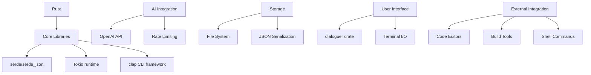

**Core Technologies:**
- **Language**: Rust (for performance, safety, and CLI tooling)
- **AI Services**: OpenAI GPT models (for agent reasoning and generation)
- **Storage**: File-based with JSON serialization
- **UI**: Terminal-based with dialoguer crate for interactive prompts
- **External Integration**: Shell command execution and editor invocation

## 2. System Context

### 2.1 System Positioning and Value Proposition
Cowork Forge addresses the challenge of **reducing manual effort in software project initiation** by automating repetitive, high-cognitive-load tasks while ensuring consistency through structured artifact management. The system bridges the gap between high-level ideas and executable code through AI-powered automation with human oversight.

### 2.2 User Roles and Scenarios

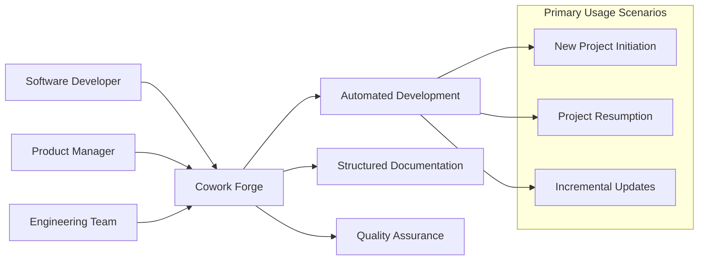

**Primary User Roles:**
- **Software Developers**: Accelerate project setup while maintaining architectural control
- **Product Managers/Technical Leads**: Convert ideas into formal specifications
- **Engineering Teams**: Standardize AI-assisted development practices

### 2.3 External System Interactions

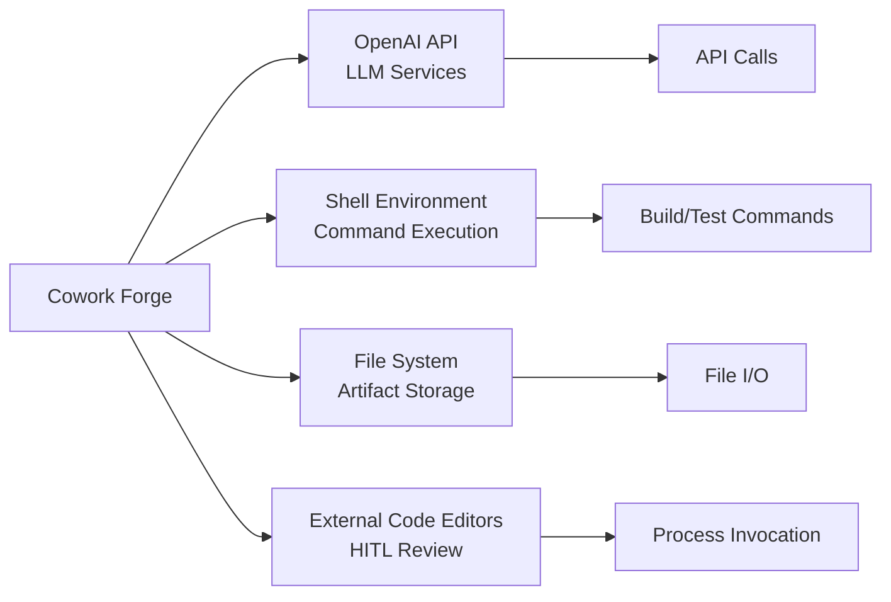

**External Dependencies:**
- **OpenAI API**: Provides LLM capabilities for all agent reasoning and generation
- **Shell Environment**: Executes system commands for verification and validation
- **File System**: Persistent storage for all artifacts under `.cowork/` directory
- **External Code Editors**: Human-in-the-loop review and editing capabilities

### 2.4 System Boundary Definition
**Included Components:**
- CLI entry points (cowork-cli, cowork-cli-v2)
- All AI agent modules and orchestration logic
- Tool implementations (file, command, HITL, validation)
- Storage layer and configuration management
- Artifact data models and envelope system

**Excluded Components:**
- External LLM services (consumed via API)
- Version control systems (Git operations)
- Build tools (Cargo, npm - invoked only)
- CI/CD pipelines and database systems

## 3. Container View

### 3.1 Domain Module Architecture

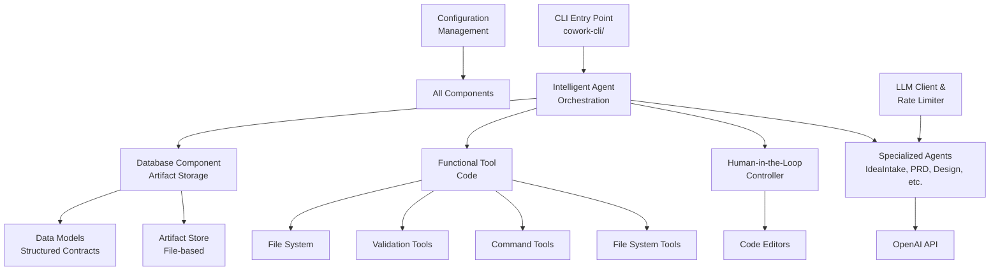

### 3.2 Core Domain Modules

#### 3.2.1 CLI Entry Point Domain
- **Responsibility**: Command parsing, configuration loading, workflow initiation
- **Key Components**: `main.rs` files in cowork-cli and cowork-cli-v2
- **Interactions**: Thin facade delegating to core orchestration

#### 3.2.2 Intelligent Agent Orchestration Domain
- **Responsibility**: Pipeline construction, agent sequencing, execution management
- **Key Components**: StageAgent framework, pipeline constructors, specialized agents
- **Sub-domains**:
  - **StageAgent Framework**: Unified agent interface and execution context
  - **Specialized Agents**: Domain-specific agents (IdeaIntake, PRD, Design, etc.)
  - **Context Management**: TodoManager, BatchContext for workflow state

#### 3.2.3 Human-in-the-Loop Controller Domain
- **Responsibility**: Interactive user input, file editing, approval workflows
- **Key Components**: HITL tools, dialoguer integration, review workflows
- **Integration Points**: Agent execution pauses for human review

#### 3.2.4 Functional Tool Code Domain
- **Responsibility**: Safe, reusable operations for file system, commands, validation
- **Sub-domains**:
  - **File System Tools**: Secure file operations with path validation
  - **Command Execution Tools**: Safe shell command execution
  - **Validation Tools**: Data integrity and project structure verification
  - **Artifact Tools**: High-level document management

#### 3.2.5 Database Component Domain
- **Responsibility**: Persistent artifact storage and retrieval
- **Key Components**: ArtifactStore, FileArtifactStore implementation
- **Storage Strategy**: JSON serialization in `.cowork/` directory structure

### 3.3 Storage Architecture Design

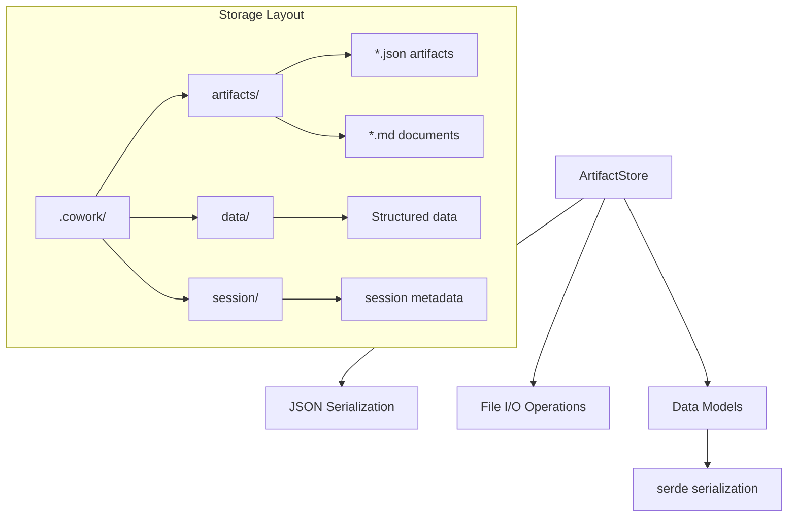

**Storage Strategy:**
- **File-based Persistence**: All artifacts stored as JSON and Markdown files
- **Structured Directory**: Organized by artifact type and session context
- **Version Control Friendly**: Text-based format compatible with Git
- **Recovery Capable**: Session metadata enables workflow resumption

### 3.4 Inter-Domain Communication Patterns

**Service Call Patterns:**
- CLI → Orchestration: Pipeline initiation and control
- Agents → Tools: File operations, command execution, validation
- Agents → HITL: Human review requests
- Orchestration → Storage: Artifact persistence and retrieval

**Data Flow Patterns:**
- Sequential artifact passing between agents
- Configuration sharing across components
- Error propagation and handling
- Human feedback integration

## 4. Component View

### 4.1 Core Functional Components

#### 4.1.1 StageAgent Framework Component
```rust
// Core abstraction for all specialized agents
pub trait StageAgent {
    async fn execute(&self, context: StageAgentContext) -> Result<ArtifactEnvelope>;
}

// Unified execution context
pub struct StageAgentContext {
    pub artifact_store: Arc<dyn ArtifactStore>,
    pub tools: ToolRegistry,
    pub llm_client: Arc<dyn LlmClient>,
    pub config: ModelConfig,
}
```

**Responsibilities:**
- Provide consistent interface for all agents
- Manage execution context and dependencies
- Handle error propagation and recovery
- Integrate HITL interactions

#### 4.1.2 Specialized Agent Components

**IdeaIntakeAgent:**
- Converts natural language ideas into structured IdeaSpec
- Validates idea feasibility and scope
- Generates initial project boundaries

**PRDAgent:**
- Transforms IdeaSpec into comprehensive Product Requirements Document
- Defines features, user stories, acceptance criteria
- Establishes requirement traceability matrix

**DesignAgent:**
- Creates technical design specifications
- Defines architecture patterns and components
- Specifies technology stack and integration points

**CodingStageAgent:**
- Orchestrates code planning and execution
- Manages file generation and modification
- Coordinates with CodePlanner and CodeExecutor

**CheckAgent:**
- Validates code quality and requirement coverage
- Executes automated tests and static analysis
- Generates comprehensive validation reports

#### 4.1.3 Tool Registry Component
```rust
pub struct ToolRegistry {
    file_tools: FileToolSet,
    command_tools: CommandToolSet,
    validation_tools: ValidationToolSet,
    hitl_tools: HitlToolSet,
}

// Tool execution with safety constraints
pub trait Tool {
    fn execute(&self, input: ToolInput) -> Result<ToolOutput>;
    fn validate(&self, input: &ToolInput) -> Result<()>;
}
```

### 4.2 Technical Support Components

#### 4.2.1 Artifact Store Component
```rust
pub trait ArtifactStore {
    fn save_artifact(&self, artifact: ArtifactEnvelope) -> Result<()>;
    fn load_artifact(&self, stage: Stage) -> Result<ArtifactEnvelope>;
    fn list_artifacts(&self) -> Result<Vec<ArtifactMetadata>>;
}

// File-based implementation
pub struct FileArtifactStore {
    base_path: PathBuf,
    serializer: JsonSerializer,
}
```

**Key Features:**
- Type-safe artifact serialization/deserialization
- Version tracking and conflict detection
- Efficient querying and indexing
- Backup and recovery capabilities

#### 4.2.2 LLM Client with Rate Limiting
```rust
pub struct RateLimitedLlm {
    inner: Arc<dyn LlmClient>,
    rate_limiter: TokenBucket,
    config: RateLimitConfig,
}

impl LlmClient for RateLimitedLlm {
    async fn generate(&self, prompt: Prompt) -> Result<LlmResponse> {
        self.rate_limiter.acquire().await?;
        self.inner.generate(prompt).await
    }
}
```

### 4.3 Component Interaction Relationships

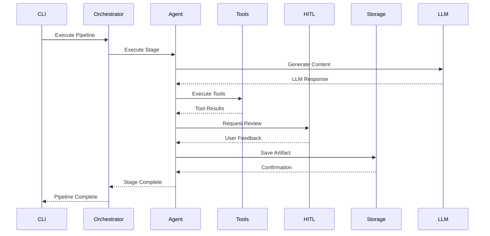

## 5. Key Processes

### 5.1 Core Development Workflow

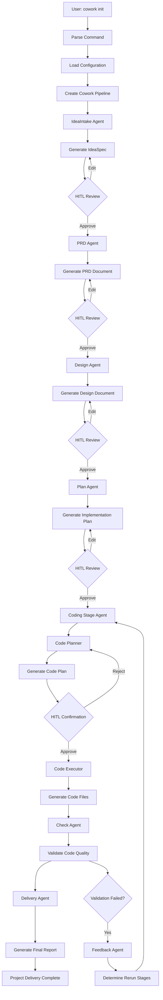

### 5.2 Project Resumption Process

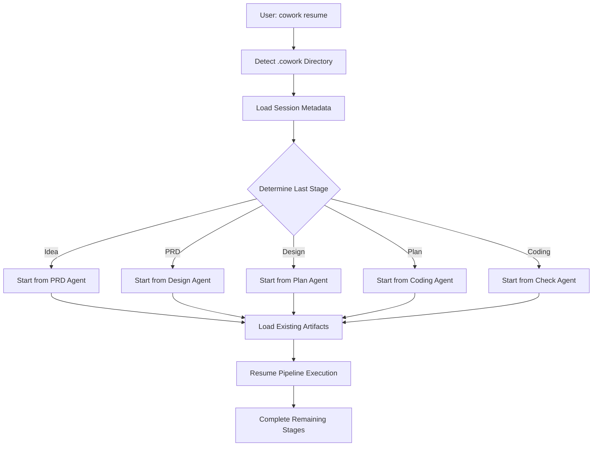

### 5.3 Verification and Validation Process

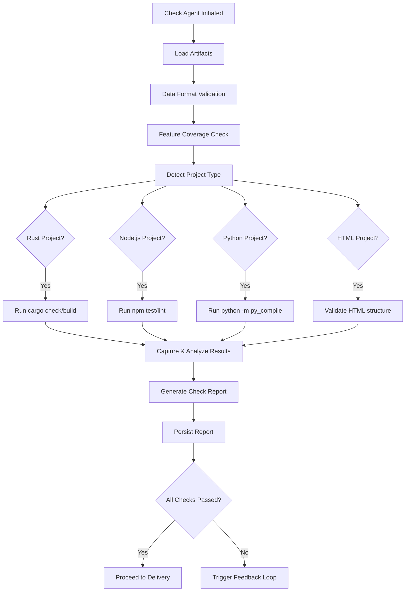

### 5.4 Data Flow Architecture

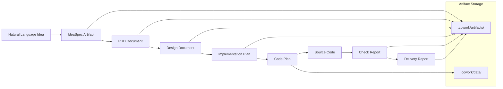

### 5.5 Exception Handling Mechanisms

**Error Classification:**
- **LLM API Errors**: Rate limiting, network issues, content filtering
- **Tool Execution Errors**: File permissions, command failures, validation errors
- **User Interaction Errors**: Timeouts, invalid input, cancellation
- **System Errors**: Disk space, memory exhaustion, configuration issues

**Recovery Strategies:**
- **Retry with Backoff**: For transient API and network errors
- **Alternative Paths**: Fallback tools or simplified workflows
- **User Intervention**: Clear error messages with resolution guidance
- **State Preservation**: Checkpointing for resumable workflows

## 6. Technical Implementation

### 6.1 Core Module Implementation

#### 6.1.1 StageAgent Trait Implementation
```rust
#[async_trait]
pub trait StageAgent: Send + Sync {
    /// Execute the agent's primary responsibility
    async fn execute(&self, context: StageAgentContext) -> Result<ArtifactEnvelope>;
    
    /// Get agent-specific instructions for LLM
    fn get_instructions(&self) -> &'static str;
    
    /// Get available tools for this agent
    fn get_tools(&self) -> Vec<Arc<dyn Tool>>;
    
    /// Validate inputs before execution
    fn validate_input(&self, input: &ArtifactEnvelope) -> Result<()>;
}
```

#### 6.1.2 Artifact Envelope System
```rust
#[derive(Serialize, Deserialize)]
pub struct ArtifactEnvelope<T> {
    pub metadata: ArtifactMetadata,
    pub data: T,
    pub stage: Stage,
    pub created_at: DateTime<Utc>,
    pub version: u32,
}

pub enum Stage {
    Idea,
    PRD,
    Design,
    Plan,
    Coding,
    Check,
    Delivery,
}

impl<T> ArtifactEnvelope<T> {
    pub fn new(data: T, stage: Stage) -> Self {
        Self {
            metadata: ArtifactMetadata::new(),
            data,
            stage,
            created_at: Utc::now(),
            version: 1,
        }
    }
}
```

### 6.2 Key Algorithm Design

#### 6.2.1 Pipeline Orchestration Algorithm
```rust
pub async fn execute_pipeline(
    pipeline: Vec<Box<dyn StageAgent>>,
    context: PipelineContext,
) -> Result<ArtifactEnvelope> {
    let mut current_artifact = context.initial_artifact;
    
    for agent in pipeline {
        // Check if we should skip this stage (resumption scenario)
        if should_skip_stage(&agent, &context).await? {
            continue;
        }
        
        // Execute agent with current context
        let agent_context = StageAgentContext {
            artifact_store: context.artifact_store.clone(),
            tools: context.tools.clone(),
            llm_client: context.llm_client.clone(),
            config: context.config.clone(),
            input_artifact: Some(current_artifact),
        };
        
        current_artifact = agent.execute(agent_context).await?;
        
        // Persist intermediate result
        context.artifact_store.save_artifact(current_artifact.clone()).await?;
    }
    
    Ok(current_artifact)
}
```

#### 6.2.2 Incremental Code Update Algorithm
```rust
pub async fn incremental_update(
    old_prd: &PRD,
    new_prd: &PRD,
    existing_files: &[CodeFile],
) -> Result<UpdatePlan> {
    // Calculate requirement deltas
    let added_reqs = find_added_requirements(old_prd, new_prd);
    let modified_reqs = find_modified_requirements(old_prd, new_prd);
    let removed_reqs = find_removed_requirements(old_prd, new_prd);
    
    // Map requirements to affected files
    let affected_files = map_requirements_to_files(
        &[added_reqs, modified_reqs, removed_reqs],
        existing_files,
    );
    
    // Generate targeted update plan
    UpdatePlan::from_deltas(added_reqs, modified_reqs, removed_reqs, affected_files)
}
```

### 6.3 Data Structure Design

#### 6.3.1 Core Data Models
```rust
// Product Requirements Document
#[derive(Serialize, Deserialize)]
pub struct PRD {
    pub title: String,
    pub description: String,
    pub goals: Vec<Goal>,
    pub features: Vec<Feature>,
    pub user_stories: Vec<UserStory>,
    pub acceptance_criteria: Vec<AcceptanceCriterion>,
    pub non_functional_requirements: Vec<NonFunctionalReq>,
}

// Implementation Plan
#[derive(Serialize, Deserialize)]
pub struct ImplementationPlan {
    pub phases: Vec<Phase>,
    pub tasks: Vec<Task>,
    pub dependencies: Vec<Dependency>,
    pub estimated_duration: Duration,
    pub risk_assessment: RiskAssessment,
}

// Code Generation Artifact
#[derive(Serialize, Deserialize)]
pub struct CodePlan {
    pub files_to_generate: Vec<FileSpec>,
    pub files_to_modify: Vec<FileModification>,
    pub dependencies: Vec<Dependency>,
    pub build_instructions: BuildInstructions,
}
```

### 6.4 Performance Optimization Strategies

**LLM Usage Optimization:**
- **Response Caching**: Cache frequent LLM responses to reduce API calls
- **Prompt Optimization**: Minimize token usage while maintaining clarity
- **Batch Processing**: Group related operations when possible

**File System Optimization:**
- **Incremental Writing**: Only write changed portions of files
- **Directory Scanning Optimization**: Cache file listings for large projects
- **Parallel Processing**: Concurrent file operations where safe

**Memory Management:**
- **Streaming Processing**: Process large artifacts in chunks
- **Smart Caching**: Cache frequently accessed artifacts with LRU strategy
- **Resource Pooling**: Reuse expensive resources like LLM clients

## 7. Deployment Architecture

### 7.1 Runtime Environment Requirements

**Minimum System Requirements:**
- **Operating System**: Linux, macOS, or Windows 10+
- **Rust Toolchain**: Rust 1.70+ with Cargo
- **Memory**: 4GB RAM (8GB recommended for large projects)
- **Storage**: 1GB free space for artifacts and dependencies
- **Network**: Internet access for OpenAI API calls

**Development Dependencies:**
- **Build Tools**: Project-specific (Cargo, npm, pip) for validation
- **Code Editors**: VSCode, Vim, or any editor for HITL review
- **Shell Access**: Command execution capabilities

### 7.2 Deployment Topology Structure

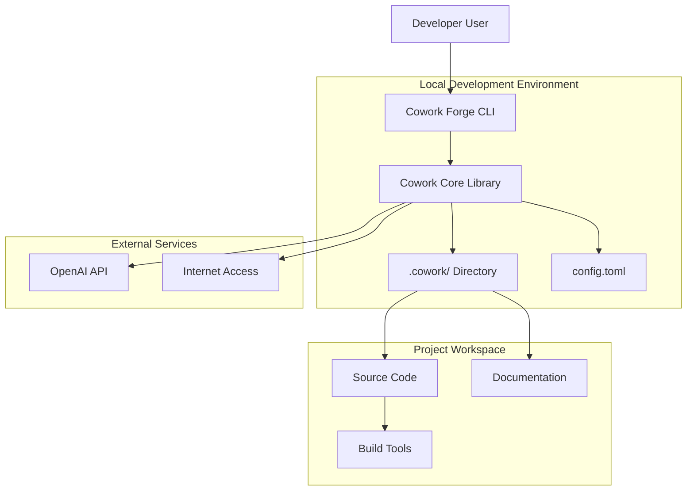

### 7.3 Scalability Design

**Horizontal Scaling Points:**
- **Multiple Projects**: Can handle concurrent development of multiple projects
- **Team Collaboration**: Artifact format supports team review and collaboration
- **Plugin Architecture**: Tool and agent system designed for extension

**Vertical Scaling Considerations:**
- **Large Projects**: Optimized file handling for projects with 1000+ files
- **Complex Requirements**: Efficient processing of large requirement sets
- **Long-Running Sessions**: Memory-efficient artifact management

### 7.4 Monitoring and Operations

**Logging Strategy:**
```rust
#[derive(Serialize)]
pub struct OperationLog {
    pub timestamp: DateTime<Utc>,
    pub operation: String,
    pub agent: String,
    pub stage: Stage,
    pub duration: Duration,
    pub success: bool,
    pub error_message: Option<String>,
    pub artifact_id: Option<String>,
}
```

**Key Metrics:**
- **Pipeline Completion Time**: End-to-end development workflow duration
- **Agent Success Rates**: Individual agent performance and reliability
- **LLM Usage**: Token consumption and API call statistics
- **User Engagement**: HITL interaction frequency and duration

**Operational Considerations:**
- **Configuration Management**: Environment-specific settings via config.toml
- **Error Recovery**: Automated recovery from common failure scenarios
- **Resource Monitoring**: Disk space, memory, and API quota monitoring
- **Update Strategy**: Seamless updates without disrupting active sessions

### 7.5 Security Considerations

**Access Control:**
- **File Permissions**: Respects system file permissions and .gitignore rules
- **API Key Management**: Secure handling of OpenAI API keys
- **Command Safety**: Whitelist-based command execution with validation

**Data Protection:**
- **Artifact Encryption**: Optional encryption for sensitive project artifacts
- **Network Security**: HTTPS for all external API communications
- **Input Validation**: Comprehensive validation of all user inputs and LLM outputs

This architecture documentation provides a comprehensive view of Cowork Forge's system design, implementation details, and operational characteristics. The modular, agent-based approach ensures maintainability and extensibility while the focus on human-in-the-loop integration maintains the essential balance between automation and control.