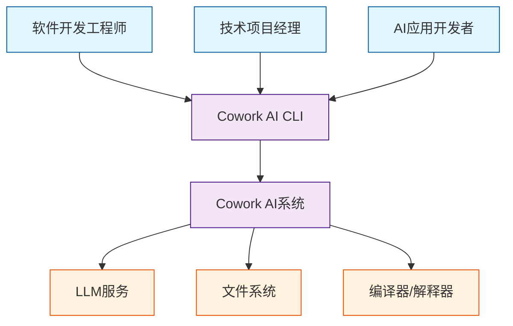
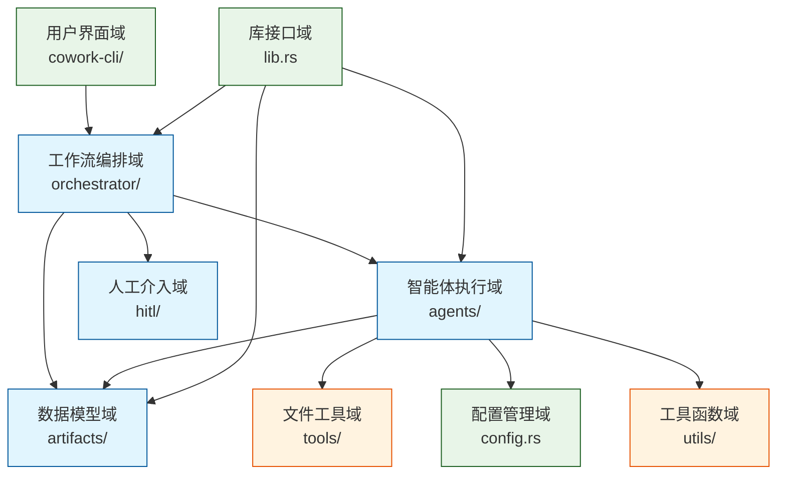
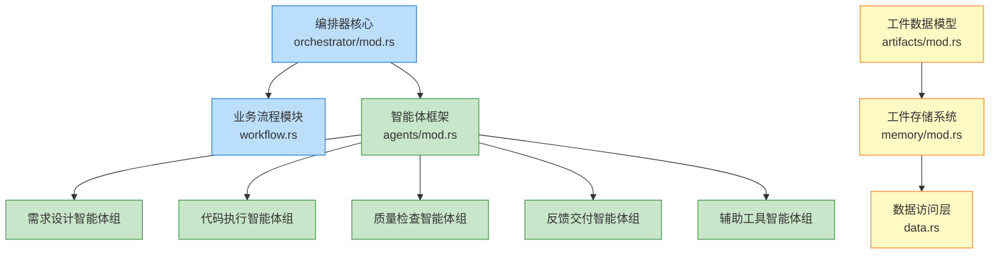
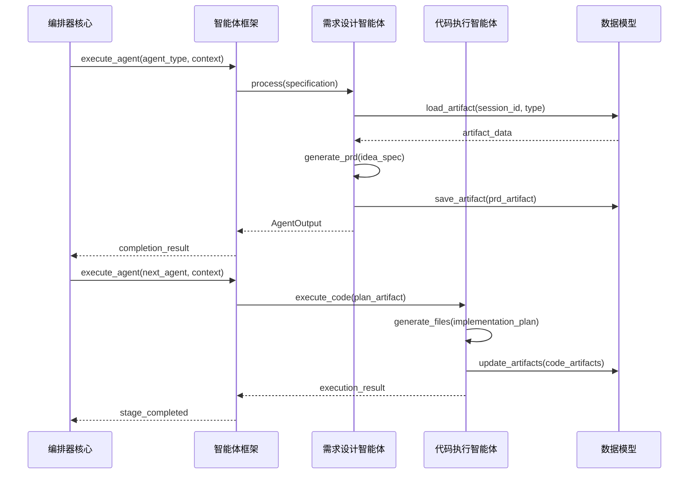
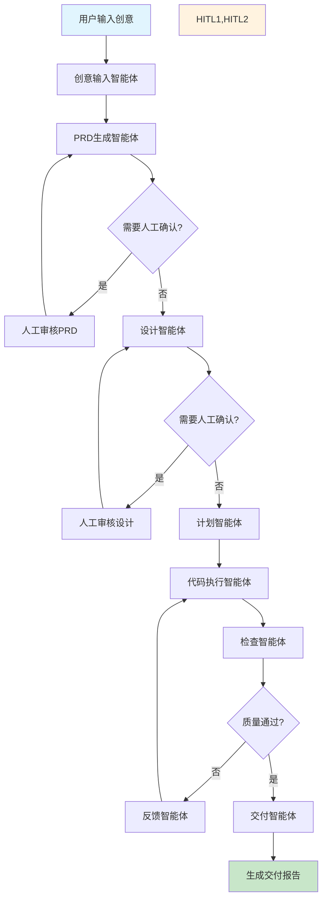
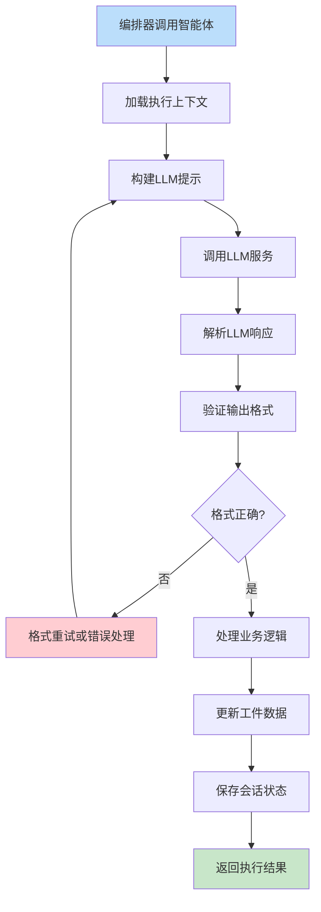

# Cowork AI 多智能体软件开发系统架构文档

## 1. 架构概述

### 1.1 设计理念与原则
Cowork AI 系统采用**工作流驱动的多智能体协作架构**，以模块化设计为核心思想，遵循以下设计原则：

- **分层解耦**：清晰分离用户界面、业务逻辑和基础设施层，降低系统复杂性
- **智能体专业化**：每个智能体专注于特定开发阶段，通过标准化接口实现松耦合协作
- **状态持久化**：完整的会话管理和工件存储机制，支持开发过程的可中断和可恢复
- **人工介入**：在关键决策点引入人工审核，平衡AI自动化与人工控制

### 1.2 核心架构模式
系统采用**分层微内核架构**，工作流编排器作为系统的核心引擎，协调多个专业智能体：

```
┌─────────────────────────────────────────┐
│           用户界面层 (CLI)               │
├─────────────────────────────────────────┤
│           核心业务逻辑层                 │
│  ┌─────────────┬─────────────────────┐  │
│  │ 工作流编排域 │   智能体执行域       │  │
│  └─────────────┴─────────────────────┘  │
├─────────────────────────────────────────┤
│          基础设施支持层                 │
│  ┌─────────────┬─────────────────────┐  │
│  │ 数据持久化域 │   配置管理域        │  │
│  └─────────────┴─────────────────────┘  │
└─────────────────────────────────────────┘
```

### 1.3 技术栈概述
- **编程语言**: Rust（系统级语言，保证性能和内存安全）
- **项目结构**: Cargo Workspace（模块化代码组织）
- **AI集成**: OpenAI兼容的LLM API（智能决策和生成能力）
- **持久化**: JSON + Markdown 双格式存储（机器可读+人工可读）
- **工具生态**: 集成编译器/解释器（多语言代码验证）

## 2. 系统上下文

### 2.1 系统定位与业务价值
Cowork AI 是一个**AI驱动的多智能体协同软件开发系统**，通过命令行界面提供完整的软件开发生命周期管理。核心价值在于：

- **开发效率提升**：自动化从创意到代码的转化过程，减少人工编码工作量
- **质量保证**：通过多阶段验证和检查机制确保代码质量
- **迭代支持**：支持需求变更和增量更新，适应敏捷开发模式
- **知识沉淀**：结构化存储开发工件，形成可复用的开发知识库

### 2.2 用户角色与使用场景



**核心用户群体**：
- **软件开发工程师**：需要快速原型开发和自动化编码
- **技术项目经理**：负责需求管理和开发流程协调
- **AI应用开发者**：专注于智能代码生成技术应用

### 2.3 外部系统交互
系统与以下外部系统进行交互：

| 外部系统 | 交互类型 | 用途 | 技术实现 |
|---------|---------|------|----------|
| LLM服务 | API调用 | 智能体决策、代码生成、文档生成 | HTTP REST API |
| 文件系统 | 读写操作 | 项目文件管理、代码存储、会话持久化 | 标准文件IO |
| 编译器/解释器 | 命令行执行 | 代码语法检查、编译验证 | 子进程执行 |

### 2.4 系统边界定义
**包含组件**：
- 工作流编排器和多智能体系统
- 人工介入控制器和会话管理
- 工件存储和文件操作工具
- 配置管理和LLM服务集成

**排除组件**：
- 图形用户界面（GUI）
- 版本控制系统集成
- 持续集成/部署流水线
- 云端部署和团队协作功能

## 3. 容器视图

### 3.1 域模块划分
系统采用领域驱动设计，划分为9个核心域模块：



### 3.2 域模块架构设计

**核心业务域**：
1. **工作流编排域**（重要性: 10.0）：8阶段工作流调度和状态管理
2. **智能体执行域**（重要性: 9.5）：12个专业智能体的执行框架
3. **数据模型域**（重要性: 8.0）：工件数据定义和持久化存储
4. **人工介入域**（重要性: 7.0）：用户交互和决策确认

**基础设施域**：
5. **用户界面域**（重要性: 6.0）：CLI命令解析和执行路由
6. **配置管理域**（重要性: 7.0）：LLM服务和运行时配置
7. **库接口域**（重要性: 6.0）：统一对外API接口

**工具支持域**：
8. **文件工具域**（重要性: 7.0）：文件系统操作和增量编辑
9. **工具函数域**（重要性: 5.0）：通用工具函数支持

### 3.3 存储设计
系统采用**会话级别的数据隔离**策略：

- **存储格式**：JSON（机器可读） + Markdown（人工可读）
- **数据结构**：基于8个开发阶段的工件模型
- **版本管理**：支持工件版本控制和变更追踪
- **恢复机制**：完整的会话状态保存和恢复能力

### 3.4 域间通信机制
域模块通过清晰的接口进行通信：

| 通信类型 | 发起域 | 目标域 | 通信内容 | 技术实现 |
|---------|--------|--------|----------|----------|
| 服务调用 | 工作流编排域 | 智能体执行域 | 阶段任务执行指令 | Rust trait接口 |
| 数据依赖 | 智能体执行域 | 数据模型域 | 工件读写操作 | 结构体序列化 |
| 工具支持 | 智能体执行域 | 文件工具域 | 文件操作请求 | 函数调用 |
| 配置依赖 | 所有业务域 | 配置管理域 | 运行时参数获取 | 全局配置对象 |

## 4. 组件视图

### 4.1 核心功能组件



### 4.2 技术支撑组件

**智能体执行框架组件**：
- **智能体注册器**：管理所有智能体的注册和发现
- **执行上下文**：维护会话状态和智能体间数据传递
- **结果标准化**：统一智能体输出格式和错误处理

**文件工具组件**：
- **异步文件处理器**：支持大文件的高效读写操作
- **行级编辑器**：实现精确的代码增量修改
- **目录扫描器**：自动化项目文件结构分析

### 4.3 组件职责划分

| 组件组 | 核心组件 | 主要职责 | 关键功能 |
|--------|----------|----------|----------|
| 编排控制 | 编排器核心 | 工作流调度和状态管理 | 阶段转换、会话控制、异常处理 |
| 智能体框架 | 智能体管理器 | 统一智能体执行接口 | 注册管理、上下文传递、结果标准化 |
| 需求设计 | PRD生成智能体 | 产品需求文档生成 | 需求结构化、文档生成、版本管理 |
| 代码执行 | 代码执行智能体 | 代码生成和文件操作 | 文件创建、内容生成、批量处理 |
| 质量保障 | 检查智能体 | 代码质量验证 | 需求覆盖检查、语法验证、质量评估 |
| 数据持久化 | 工件存储系统 | 会话数据管理 | JSON序列化、文件存储、版本控制 |

### 4.4 组件交互关系
组件间通过定义良好的接口进行交互：



## 5. 关键流程

### 5.1 核心业务流：AI驱动软件开发主流程



### 5.2 技术处理流：智能体执行流程



### 5.3 数据流路径
系统数据流遵循严格的阶段转换规则：

1. **输入数据流**：用户创意 → IdeaSpec结构 → PRD文档 → 技术设计
2. **处理数据流**：实施计划 → 代码文件 → 检查报告 → 反馈分析
3. **输出数据流**：交付报告 + 完整代码库 + 文档集合

每个阶段的数据都通过工件存储系统进行持久化，确保数据的完整性和可追溯性。

### 5.4 异常处理机制
系统实现多层次的异常处理：

- **智能体级别**：LLM调用失败重试、输出格式验证重试
- **工作流级别**：阶段执行失败回滚、会话状态恢复
- **系统级别**：配置错误检测、文件权限异常处理

## 6. 技术实现

### 6.1 核心模块实现

**工作流编排器实现**：
```rust
// 核心状态机实现
pub struct WorkflowOrchestrator {
    current_stage: DevelopmentStage,
    session_state: SessionState,
    agent_registry: AgentRegistry,
    artifact_store: ArtifactStore,
}

impl WorkflowOrchestrator {
    pub async fn execute_workflow(&mut self, session_id: &str) -> Result<DeliveryArtifact> {
        while self.current_stage != DevelopmentStage::Completed {
            let agent = self.agent_registry.get_agent(self.current_stage);
            let context = self.build_agent_context(session_id).await?;
            let result = agent.execute(context).await?;
            self.process_agent_result(result).await?;
            self.advance_stage()?;
        }
        self.generate_delivery_report().await
    }
}
```

**智能体框架实现**：
```rust
// 统一智能体trait定义
pub trait Agent: Send + Sync {
    async fn execute(&self, context: AgentContext) -> Result<AgentOutput>;
    fn get_agent_type(&self) -> AgentType;
}

// 智能体执行上下文
pub struct AgentContext {
    pub session_id: String,
    pub previous_artifacts: Vec<Artifact>,
    pub llm_client: Arc<dyn LlmClient>,
    pub file_tools: Arc<dyn FileTools>,
}
```

### 6.2 关键算法设计

**增量代码更新算法**：
```rust
// 基于需求差异的代码更新策略
impl CodeUpdater {
    pub async fn incremental_update(
        &self, 
        old_prd: &PRDArtifact, 
        new_prd: &PRDArtifact,
        existing_code: &CodeArtifact
    ) -> Result<UpdatePlan> {
        // 1. 需求差异分析
        let diff = self.analyze_requirement_diff(old_prd, new_prd).await?;
        
        // 2. 影响文件识别
        let affected_files = self.identify_impacted_files(&diff, existing_code).await?;
        
        // 3. 用户修改保护
        let safe_update_plan = self.protect_user_modifications(affected_files).await?;
        
        // 4. 生成合并策略
        self.generate_merge_strategy(safe_update_plan)
    }
}
```

### 6.3 数据结构设计

**工件数据模型**：
```rust
// 统一的工件trait
pub trait Artifact: Serialize + DeserializeOwned {
    fn get_artifact_type() -> ArtifactType;
    fn get_version(&self) -> Version;
    fn validate(&self) -> Result<()>;
}

// 具体工件实现
#[derive(Serialize, Deserialize)]
pub struct PRDArtifact {
    pub session_id: String,
    pub version: Version,
    pub requirements: Vec<Requirement>,
    pub user_stories: Vec<UserStory>,
    pub acceptance_criteria: Vec<String>,
}
```

### 6.4 性能优化策略

**异步处理优化**：
- 文件操作使用异步I/O，避免阻塞工作流执行
- LLM调用实现连接池和请求批处理
- 工件加载实现懒加载和缓存机制

**内存管理优化**：
- 使用Rust的所有权系统避免内存泄漏
- 大文件处理采用流式读写
- 会话状态实现增量更新

## 7. 部署架构

### 7.1 运行时环境要求
- **操作系统**: Linux/macOS/Windows（支持Rust运行）
- **Rust版本**: 1.70+（支持async/await）
- **内存要求**: 最小4GB，推荐8GB（LLM上下文处理）
- **网络要求**: 稳定的互联网连接（LLM API访问）

### 7.2 部署拓扑结构
系统采用**单机命令行工具部署模式**：

```
用户终端
    │
    ↓
Cowork AI CLI（本地安装）
    │
    ├── 本地文件系统（项目存储）
    ├── LLM服务（云端API）
    └── 本地工具链（编译器/解释器）
```

### 7.3 可扩展性设计

**水平扩展策略**：
- **智能体插件化**：新智能体通过实现标准trait即可集成
- **工作流自定义**：支持自定义阶段顺序和条件分支
- **存储后端扩展**：可扩展支持数据库存储而不仅是文件系统

**性能扩展点**：
- 智能体执行并行化（未来版本）
- 分布式会话管理（团队协作场景）
- LLM服务负载均衡（多API密钥支持）

### 7.4 监控与运维

**日志系统**：
- 结构化日志记录每个智能体执行详情
- 会话级别的操作审计日志
- 性能指标收集（阶段执行时间、LLM调用延迟）

**健康检查**：
- 配置文件验证和LLM连接测试
- 文件系统权限检查
- 依赖工具链可用性验证

**运维建议**：
- 定期清理过期会话数据
- 监控LLM API使用量和费用
- 备份重要的项目工件数据

---

## 架构总结

Cowork AI 系统通过精心设计的模块化架构，实现了AI驱动的多智能体软件开发流程。系统以工作流编排器为核心，协调多个专业智能体协同工作，既保证了开发过程的自动化效率，又通过人工介入机制确保了质量控制。基于Rust的技术栈选择为系统提供了优异的性能和可靠性，而清晰的分层设计则为未来的功能扩展奠定了坚实基础。

该架构充分体现了现代AI应用系统的设计理念，在自动化与可控性、效率与质量之间实现了良好的平衡，为软件开发团队提供了强大的AI辅助工具。