# Cowork Forge 系统架构文档

*文档生成时间：2026-01-29 07:08:56 (UTC)  
文档版本：v1.0  
架构状态：基于研究分析结果*

## 1. 架构概述

### 1.1 架构设计理念
Cowork Forge采用**AI驱动的多智能体协作架构**，核心设计理念是"自动化与可控性的平衡"。系统通过分层模块化设计，实现从需求分析到代码交付的完整软件开发流程自动化，同时在关键决策点引入人工介入循环（HITL）确保输出质量的可控性。

### 1.2 核心架构模式
- **分层架构模式**：清晰的用户接口层、核心业务层、基础设施层、数据管理层分离
- **管道-过滤器模式**：工作流编排采用管道模式，每个智能体作为过滤器处理特定任务
- **Actor模式**：智能体作为独立执行单元，通过消息传递进行协作
- **Repository模式**：数据访问抽象化，支持会话状态持久化管理

### 1.3 技术栈概览
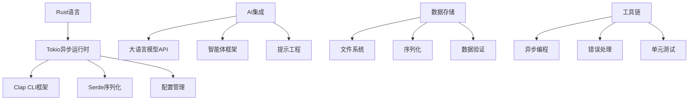

## 2. 系统上下文

### 2.1 系统定位与价值
Cowork Forge定位为**AI辅助的软件开发编排工具**，核心价值在于：
- **效率提升**：通过AI自动化减少重复性开发工作
- **质量保证**：标准化开发流程和人工审核机制
- **门槛降低**：使非专业开发者也能参与复杂软件开发
- **成本优化**：减少人力投入，提高开发资源利用率

### 2.2 用户角色与场景

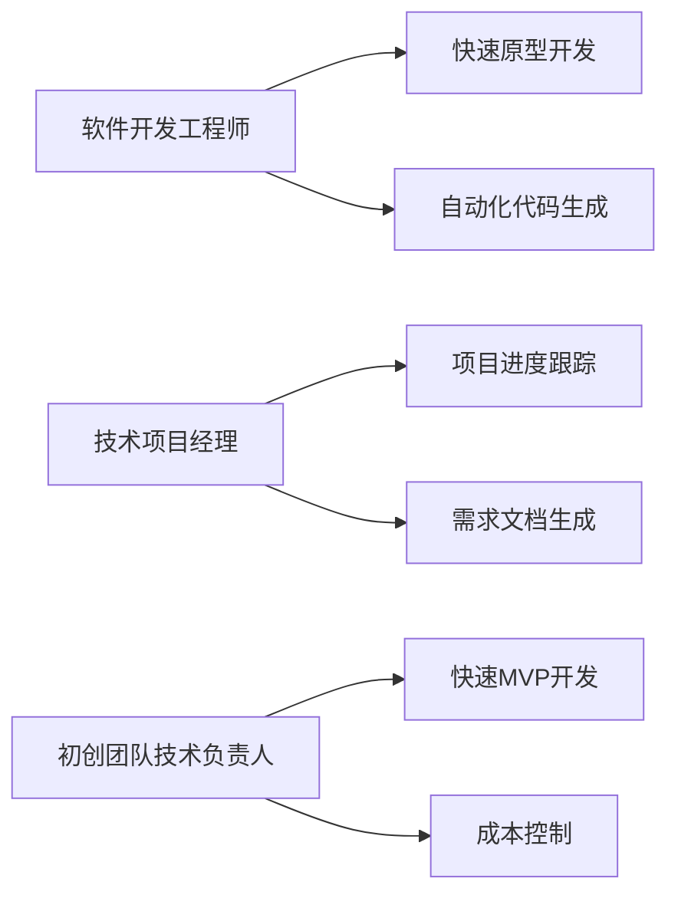

### 2.3 外部系统交互

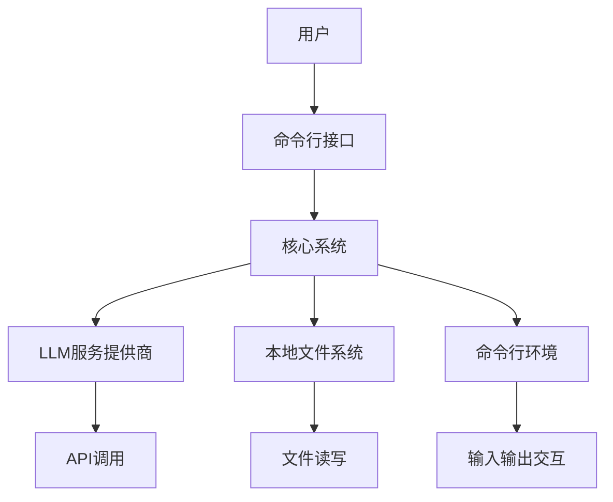

### 2.4 系统边界定义
**包含组件**：
- AI智能体工作流引擎和多智能体协作机制
- 会话管理和状态跟踪系统
- LLM集成和配置管理
- 文件操作和安全管理
- 人工介入循环(HITL)机制

**排除组件**：
- 代码编译和构建系统（由生成代码自包含）
- 测试框架和自动化测试（后续扩展）
- 部署和运维工具（外部集成）
- 版本控制系统（外部管理）

## 3. 容器视图

### 3.1 领域模块划分

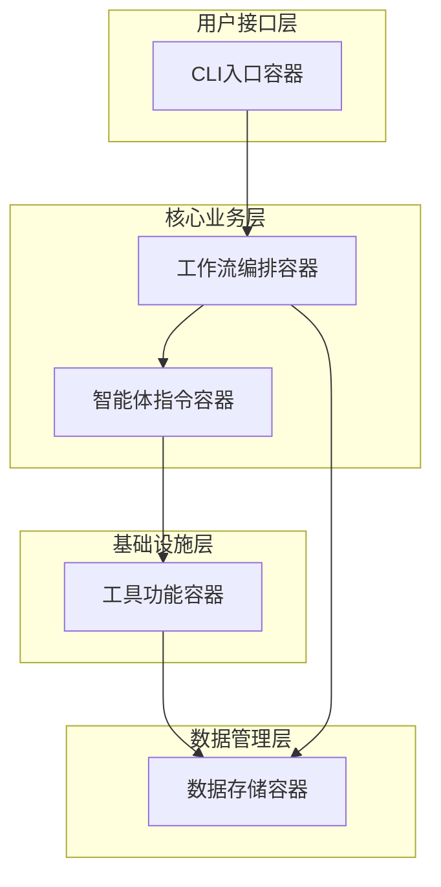

### 3.2 领域模块架构

#### 3.2.1 智能体指令域容器
**职责**：定义和执行AI智能体的行为逻辑，包含完整的软件开发生命周期指令集


#### 3.2.2 工作流编排域容器
**职责**：工作流编排和智能体执行管理，支持完整项目和增量修改的不同流程组合

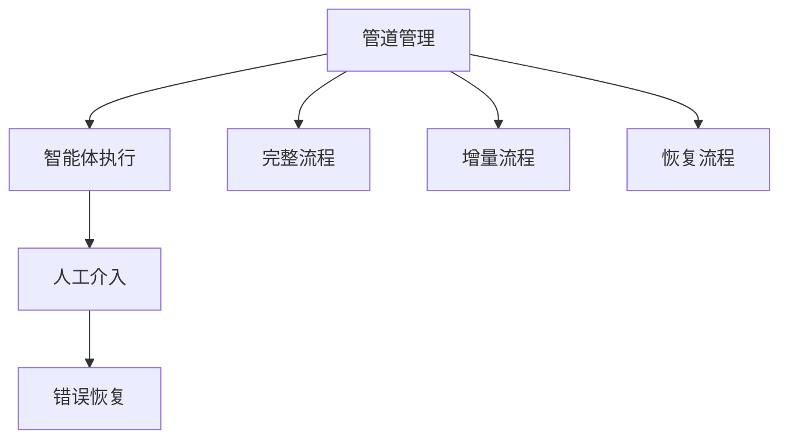

#### 3.2.3 工具功能域容器
**职责**：提供系统运行所需的基础工具和服务


#### 3.2.4 数据存储域容器
**职责**：数据模型定义、持久化存储和会话管理

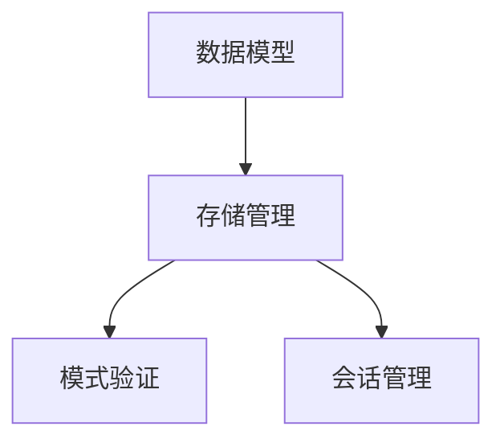

### 3.3 存储设计
- **会话存储**：JSON格式的会话状态文件
- **项目文件**：生成代码和文档的文件系统存储
- **配置数据**：LLM配置和系统设置的持久化
- **临时数据**：执行过程中的中间状态缓存

### 3.4 域间模块通信

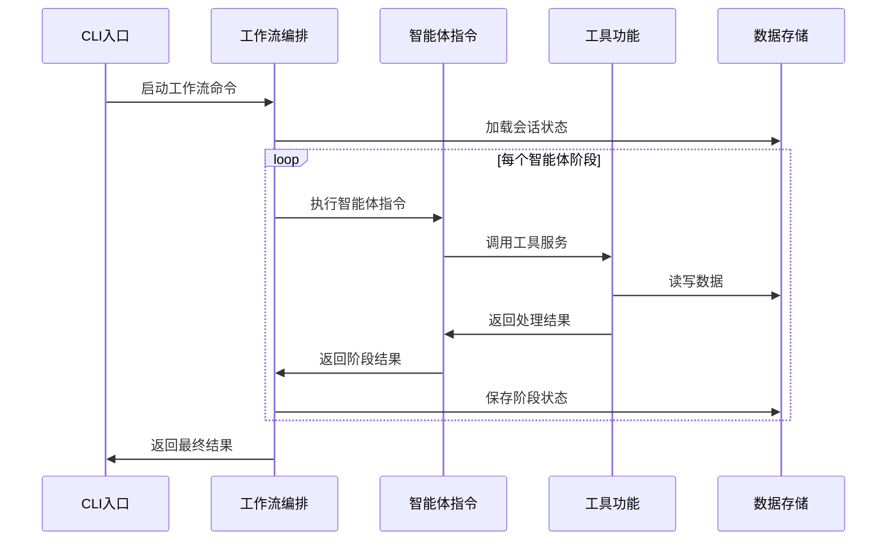

## 4. 组件视图

### 4.1 核心功能组件

#### 4.1.1 智能体指令组件群
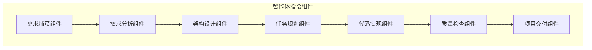

**组件职责细分**：
- **需求捕获组件**：用户需求理解、结构化保存、初步审核
- **需求分析组件**：PRD创建、需求验证、文档生成
- **架构设计组件**：系统架构设计、组件规划、技术选型
- **任务规划组件**：任务分解、依赖分析、实施计划制定
- **代码实现组件**：代码生成、代码修改、语法检查
- **质量检查组件**：代码质量验证、完整性检查、问题检测
- **项目交付组件**：交付验证、报告生成、变更文档

#### 4.1.2 工作流编排组件
```rust
// 核心组件接口定义
pub trait PipelineComponent {
    fn execute(&self, session: &Session) -> Result<ExecutionResult>;
    fn can_resume(&self) -> bool;
    fn get_dependencies(&self) -> Vec<String>;
}

pub struct WorkflowOrchestrator {
    pipelines: HashMap<String, Box<dyn PipelineComponent>>,
    session_manager: SessionManager,
}
```

### 4.2 技术支持组件

#### 4.2.1 工具服务组件
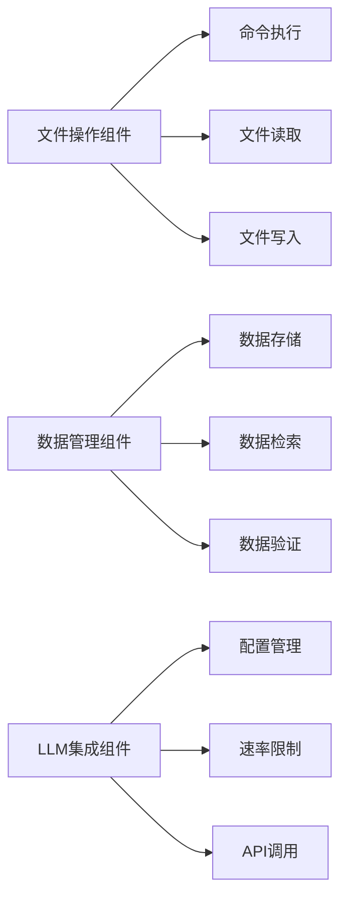

#### 4.2.2 交互控制组件
```rust
pub struct HITLController {
    decision_points: Vec<DecisionPoint>,
    user_interface: UserInterface,
    workflow_controller: WorkflowController,
}

pub struct ControlTools {
    resume_handler: ResumeHandler,
    error_recovery: ErrorRecovery,
    state_manager: StateManager,
}
```

### 4.3 组件职责划分

| 组件类别 | 组件名称 | 主要职责 | 技术复杂度 |
|---------|---------|---------|-----------|
| **核心业务** | 智能体指令组件 | 实现开发流程各阶段逻辑 | 高（9.0） |
| **流程控制** | 工作流编排组件 | 流程管理和智能体调度 | 高（8.0） |
| **基础设施** | 工具服务组件 | 提供基础工具能力 | 中（8.0） |
| **数据管理** | 存储管理组件 | 数据持久化和会话管理 | 中（7.0） |
| **用户交互** | CLI接口组件 | 用户命令解析和处理 | 低（6.0） |

### 4.4 组件交互关系

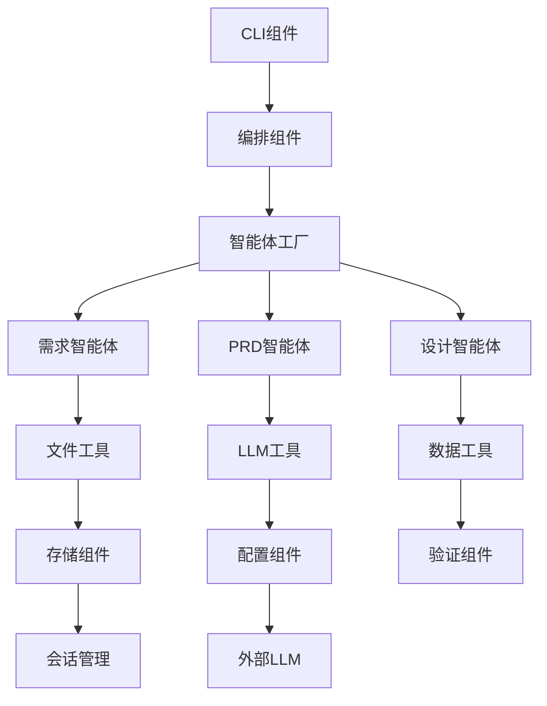

## 5. 关键流程

### 5.1 核心功能流程

#### 5.1.1 完整开发流程
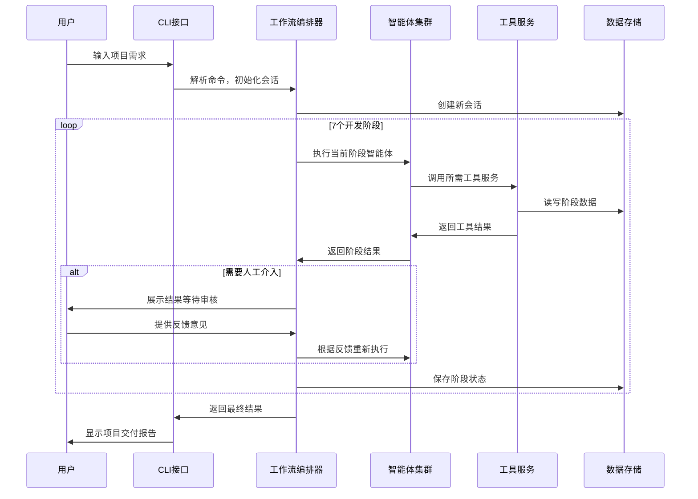

#### 5.1.2 增量修改流程
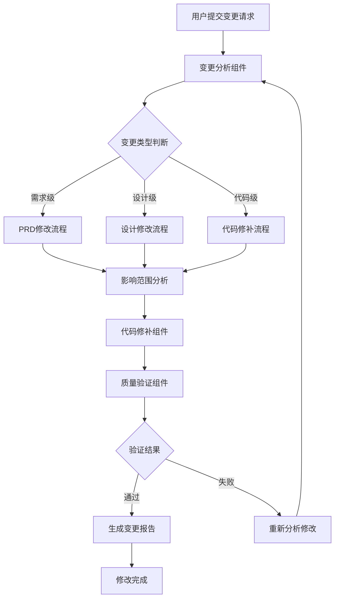

### 5.2 技术处理流程

#### 5.2.1 人工介入循环流程
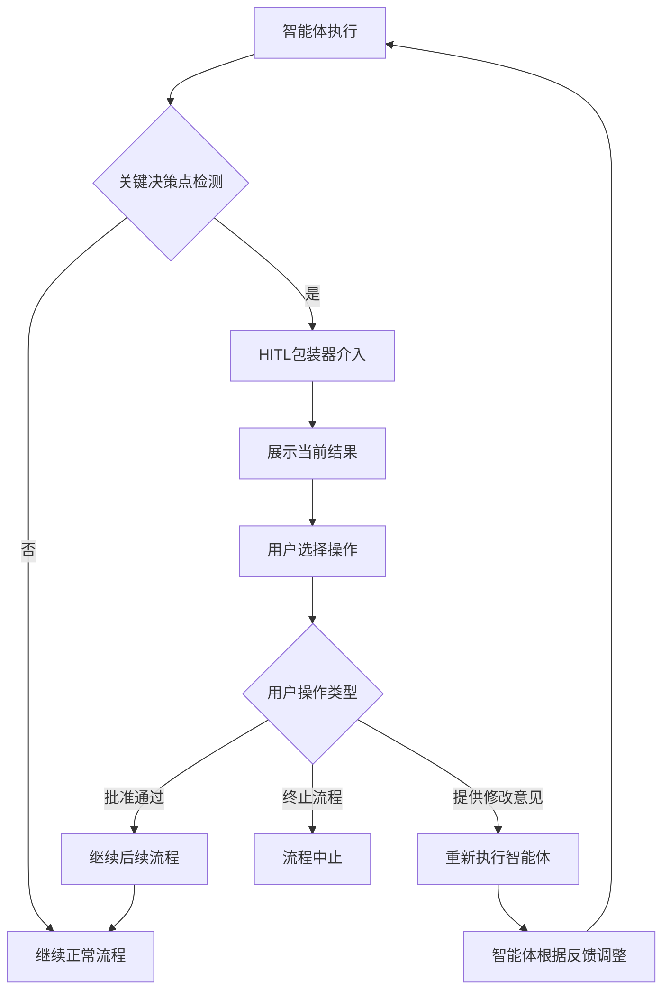

#### 5.2.2 错误恢复和重启流程
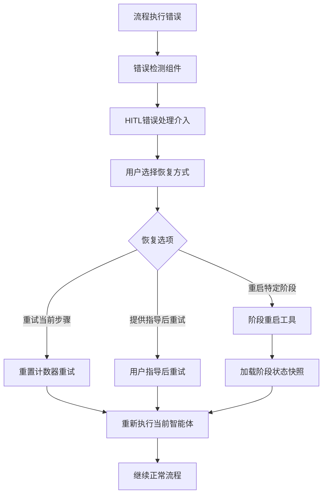

### 5.3 数据流路径

#### 5.3.1 主数据流


#### 5.3.2 状态数据流
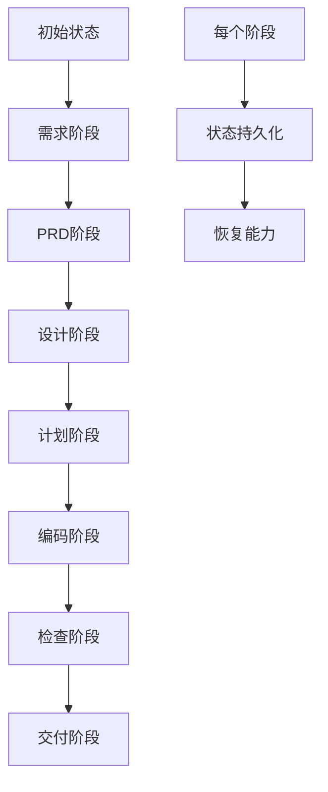

### 5.4 异常处理机制

#### 5.4.1 智能体执行异常
```rust
pub enum AgentError {
    LLMConnectionError(String),      // LLM连接失败
    ValidationError(String),         // 数据验证失败
    FileSystemError(String),         // 文件操作错误
    UserInterventionRequired(String), // 需要人工介入
    RetryableError(String),          // 可重试错误
}

impl AgentError {
    pub fn should_retry(&self) -> bool {
        matches!(self, AgentError::RetryableError(_))
    }
    
    pub fn requires_hitl(&self) -> bool {
        matches!(self, AgentError::UserInterventionRequired(_))
    }
}
```

#### 5.4.2 工作流异常处理策略
- **瞬时错误**：自动重试机制，最多3次重试
- **数据错误**：回滚到上一个检查点，请求用户干预
- **系统错误**：保存当前状态，提供恢复选项
- **用户取消**：清理临时资源，返回优雅退出

## 6. 技术实现

### 6.1 核心模块实现

#### 6.1.1 智能体指令模块架构
```rust
// 智能体指令 trait 定义
pub trait AgentInstruction {
    fn name(&self) -> &'static str;
    fn description(&self) -> &'static str;
    fn execute(&self, context: &AgentContext) -> Result<AgentResult>;
    fn required_tools(&self) -> Vec<ToolType>;
}

// 具体智能体实现
pub struct IdeaAgent {
    llm_client: LLMClient,
    file_tools: FileTools,
    validation_tools: ValidationTools,
}

impl AgentInstruction for IdeaAgent {
    fn execute(&self, context: &AgentContext) -> Result<AgentResult> {
        // 1. 使用LLM分析用户需求
        let analyzed_requirements = self.llm_client.analyze_requirements(&context.input)?;
        
        // 2. 结构化保存需求文档
        self.file_tools.save_structured_data(
            &analyzed_requirements,
            "requirements.json"
        )?;
        
        // 3. 验证需求完整性
        self.validation_tools.validate_requirements(&analyzed_requirements)?;
        
        Ok(AgentResult::success(analyzed_requirements))
    }
}
```

#### 6.1.2 工作流编排引擎
```rust
pub struct WorkflowEngine {
    pipeline_registry: HashMap<String, Box<dyn Pipeline>>,
    session_manager: SessionManager,
    error_recovery: ErrorRecoveryManager,
}

impl WorkflowEngine {
    pub async fn execute_workflow(
        &self, 
        workflow_type: WorkflowType,
        session_id: &str
    ) -> Result<WorkflowResult> {
        let pipeline = self.get_pipeline(workflow_type)?;
        let mut session = self.session_manager.load_session(session_id)?;
        
        for stage in pipeline.stages() {
            match stage.execute(&mut session).await {
                Ok(result) => {
                    self.session_manager.save_stage_result(session_id, stage.name(), &result)?;
                }
                Err(error) => {
                    let recovery_result = self.error_recovery.handle_error(
                        &error, 
                        &session, 
                        stage.name()
                    ).await?;
                    
                    match recovery_result {
                        ErrorRecovery::Retry => continue,
                        ErrorRecovery::RequireHumanIntervention => {
                            return self.await_human_intervention(session_id, stage.name()).await;
                        }
                        ErrorRecovery::Abort => break,
                    }
                }
            }
        }
        
        Ok(WorkflowResult::completed(session))
    }
}
```

### 6.2 关键算法设计

#### 6.2.1 智能体决策算法
```rust
pub struct AgentDecisionEngine {
    context_analyzer: ContextAnalyzer,
    rule_engine: RuleEngine,
    llm_adapter: LLMAdapter,
}

impl AgentDecisionEngine {
    pub async fn make_decision(
        &self,
        current_context: &DecisionContext,
        available_actions: &[Action],
    ) -> Result<Decision> {
        // 1. 上下文分析
        let context_analysis = self.context_analyzer.analyze(current_context)?;
        
        // 2. 规则引擎匹配
        let rule_based_actions = self.rule_engine.evaluate(&context_analysis)?;
        
        // 3. LLM增强决策
        let llm_enhanced_decision = self.llm_adapter.enhance_decision(
            &context_analysis,
            &rule_based_actions,
        ).await?;
        
        // 4. 置信度评估
        let confidence_score = self.calculate_confidence(&llm_enhanced_decision);
        
        Ok(Decision {
            action: llm_enhanced_decision.best_action,
            confidence: confidence_score,
            requires_human_review: confidence_score < HUMAN_REVIEW_THRESHOLD,
            alternatives: llm_enhanced_decision.alternative_actions,
        })
    }
}
```

#### 6.2.2 会话状态管理算法
```rust
pub struct SessionStateManager {
    state_machine: StateMachine<SessionState>,
    snapshot_strategy: SnapshotStrategy,
    conflict_resolution: ConflictResolution,
}

impl SessionStateManager {
    pub fn transition_state(
        &mut self,
        current_state: SessionState,
        event: SessionEvent,
    ) -> Result<SessionState> {
        // 状态机验证
        if !self.state_machine.can_transition(&current_state, &event) {
            return Err(Error::InvalidStateTransition);
        }
        
        // 创建状态快照
        let snapshot = self.snapshot_strategy.create_snapshot(&current_state);
        
        // 执行状态转换
        let new_state = self.state_machine.transition(current_state, event)?;
        
        // 冲突检测和解决
        if let Some(conflict) = self.conflict_resolution.detect_conflict(&new_state) {
            self.conflict_resolution.resolve_conflict(conflict, &snapshot)?;
        }
        
        Ok(new_state)
    }
}
```

### 6.3 数据结构设计

#### 6.3.1 核心数据模型
```rust
#[derive(Debug, Clone, Serialize, Deserialize)]
pub struct Session {
    pub id: String,
    pub project_name: String,
    pub current_state: SessionState,
    pub stages: HashMap<String, StageResult>,
    pub created_at: DateTime<Utc>,
    pub updated_at: DateTime<Utc>,
    pub metadata: SessionMetadata,
}

#[derive(Debug, Clone, Serialize, Deserialize)]
pub struct StageResult {
    pub stage_name: String,
    pub status: StageStatus,
    pub input_data: Value,
    pub output_data: Value,
    pub artifacts: Vec<Artifact>,
    pub started_at: DateTime<Utc>,
    pub completed_at: Option<DateTime<Utc>>,
    pub error_info: Option<ErrorInfo>,
}

#[derive(Debug, Clone, Serialize, Deserialize)]
pub struct AgentContext {
    pub session_id: String,
    pub current_stage: String,
    pub input: Value,
    pub previous_results: Vec<StageResult>,
    pub tools: ToolRegistry,
    pub config: AgentConfig,
}
```

#### 6.3.2 配置数据结构
```rust
#[derive(Debug, Clone, Serialize, Deserialize)]
pub struct SystemConfig {
    pub llm: LLMConfig,
    pub workflows: WorkflowConfig,
    pub storage: StorageConfig,
    pub security: SecurityConfig,
}

#[derive(Debug, Clone, Serialize, Deserialize)]
pub struct LLMConfig {
    pub provider: LLMProvider,
    pub api_key: SecretString,
    pub model: String,
    pub temperature: f32,
    pub max_tokens: usize,
    pub rate_limit: RateLimitConfig,
}
```

### 6.4 性能优化策略

#### 6.4.1 LLM调用优化
```rust
pub struct LLMOptimizer {
    cache: LLMCache,
    batch_processor: BatchProcessor,
    rate_limiter: RateLimiter,
}

impl LLMOptimizer {
    pub async fn optimized_call(
        &self,
        prompt: &str,
        context: &LLMContext,
    ) -> Result<LLMResponse> {
        // 1. 缓存查询
        if let Some(cached) = self.cache.get(prompt, context) {
            return Ok(cached);
        }
        
        // 2. 批量处理
        if self.batch_processor.should_batch() {
            return self.batch_processor.add_to_batch(prompt, context).await;
        }
        
        // 3. 速率限制检查
        self.rate_limiter.acquire().await?;
        
        // 4. 执行调用
        let response = self.llm_client.call(prompt, context).await?;
        
        // 5. 缓存结果
        self.cache.put(prompt, context, &response)?;
        
        Ok(response)
    }
}
```

#### 6.4.2 文件操作优化
- **增量写入**：避免重复写入相同内容
- **异步IO**：使用Tokio异步文件操作
- **内存映射**：大文件使用内存映射提高读写效率
- **压缩存储**：历史数据采用压缩格式存储

## 7. 部署架构

### 7.1 运行时环境要求

#### 7.1.1 系统要求
```yaml
runtime_requirements:
  operating_system: "Linux/macOS/Windows"
  rust_version: "1.70+"
  memory: "最低4GB，推荐8GB"
  storage: "最少1GB可用空间"
  network: "需要互联网连接访问LLM API"
```

#### 7.1.2 依赖服务
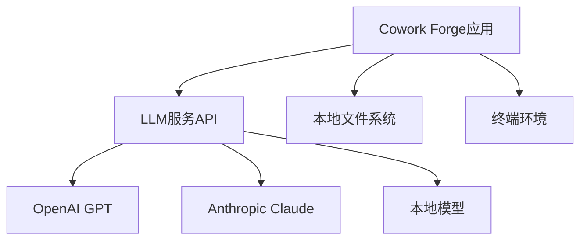

### 7.2 部署拓扑结构

#### 7.2.1 单机部署模式
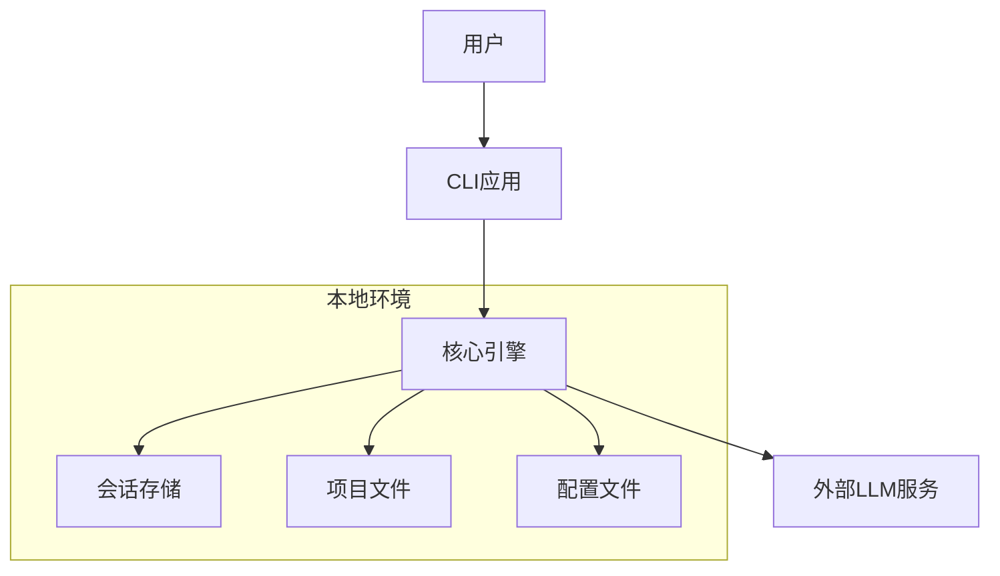

#### 7.2.2 配置管理部署
```rust
// 配置加载策略
pub struct ConfigManager {
    sources: Vec<ConfigSource>,
    hierarchy: ConfigHierarchy,
    validators: Vec<ConfigValidator>,
}

impl ConfigManager {
    pub fn load_config() -> Result<SystemConfig> {
        // 配置加载优先级：环境变量 > 本地文件 > 默认配置
        let mut config = SystemConfig::default();
        
        for source in &self.sources {
            if let Some(source_config) = source.load()? {
                config.merge(source_config);
            }
        }
        
        for validator in &self.validators {
            validator.validate(&config)?;
        }
        
        Ok(config)
    }
}
```

### 7.3 可扩展性设计

#### 7.3.1 水平扩展点
- **智能体扩展**：新的开发阶段可以通过实现`AgentInstruction` trait添加
- **工具扩展**：新的工具服务可以通过实现`Tool` trait集成
- **工作流扩展**：支持自定义流水线组合和阶段顺序

#### 7.3.2 垂直扩展策略
```rust
pub struct ScalabilityManager {
    resource_monitor: ResourceMonitor,
    scaling_policies: Vec<ScalingPolicy>,
    performance_tuner: PerformanceTuner,
}

impl ScalabilityManager {
    pub async fn adjust_resources(&self, current_load: &SystemLoad) {
        for policy in &self.scaling_policies {
            if policy.should_scale(current_load) {
                self.performance_tuner.adjust(policy.get_adjustment()).await;
            }
        }
    }
}
```

### 7.4 监控与运维

#### 7.4.1 监控指标
```rust
#[derive(Debug, Clone)]
pub struct SystemMetrics {
    // 性能指标
    pub request_latency: Histogram,
    pub memory_usage: Gauge,
    pub cpu_usage: Gauge,
    
    // 业务指标
    pub workflow_completion_time: Histogram,
    pub agent_success_rate: Gauge,
    pub hitl_intervention_rate: Gauge,
    
    // 错误指标
    pub error_rate: Gauge,
    pub retry_count: Counter,
    pub recovery_success_rate: Gauge,
}
```

#### 7.4.2 日志策略
```rust
pub struct LoggingConfig {
    pub level: LogLevel,
    pub format: LogFormat,
    pub outputs: Vec<LogOutput>,
    pub retention: RetentionPolicy,
}

// 结构化日志示例
info!(
    session_id = session.id,
    stage = stage.name(),
    duration = ?stage_duration,
    "阶段执行完成",
    metadata = ?session.metadata
);
```

## 8. 架构洞察与设计思考

### 8.1 可扩展性设计
**扩展点分析**：
1. **智能体扩展**：新的开发阶段可通过实现标准化接口快速集成
2. **工具服务扩展**：支持自定义工具增强系统能力
3. **LLM提供商扩展**：抽象化的LLM接口支持多模型提供商
4. **工作流定制**：可配置的流水线支持不同开发方法论

**扩展策略**：
- 接口隔离原则确保扩展不影响现有功能
- 依赖注入支持运行时扩展
- 配置驱动的工作流组合

### 8.2 性能考量
**性能瓶颈分析**：
1. **LLM API调用**：网络延迟和速率限制是主要瓶颈
2. **文件IO操作**：大量文件读写可能影响性能
3. **内存使用**：大会话状态可能占用较多内存

**优化策略**：
- 异步非阻塞架构减少等待时间
- 缓存策略减少重复LLM调用
- 增量文件操作避免不必要IO
- 资源监控和自动调整

### 8.3 安全性设计
**安全机制**：
1. **输入验证**：所有用户输入和外部数据都经过严格验证
2. **文件沙箱**：限制文件操作范围，防止任意文件访问
3. **配置安全**：敏感配置信息加密存储
4. **会话隔离**：不同会话间数据完全隔离

**安全最佳实践**：
- 最小权限原则指导工具设计
- 审计日志记录所有关键操作
- 定期安全评估和漏洞扫描

## 9. 实践指导

### 9.1 开发团队指导
**新功能开发流程**：
1. 分析需求，确定涉及的领域模块
2. 设计接口，遵循现有架构模式
3. 实现功能，保持代码质量和测试覆盖
4. 集成测试，确保与其他模块兼容

**代码质量要求**：
- Rust语言最佳实践和编码规范
- 完整的单元测试和集成测试
- 文档注释和示例代码
- 性能基准测试

### 9.2 运维团队指导
**部署检查清单**：
- [ ] 验证系统依赖和版本兼容性
- [ ] 配置LLM API密钥和端点
- [ ] 设置适当的文件系统权限
- [ ] 配置监控和告警规则

**监控重点**：
- LLM API调用成功率和延迟
- 工作流完成时间和成功率
- 系统资源使用情况
- 错误率和恢复成功率

### 9.3 技术决策支持
**架构决策记录**：
- 选择Rust语言：性能、安全性、并发能力
- 模块化设计：维护性、可测试性、团队协作
- HITL机制：质量控制、用户信任、风险 mitigation

**技术债管理**：
- 定期架构评审和技术债评估
- 重构计划和技术升级路线图
- 技术栈更新和依赖管理

---

*本文档基于现有研究材料生成，反映了Cowork Forge系统的当前架构设计。随着系统演进，架构文档需要定期更新以保持准确性。*

*文档版本：v1.0 | 最后更新：2026-01-29 07:08:56 (UTC)*