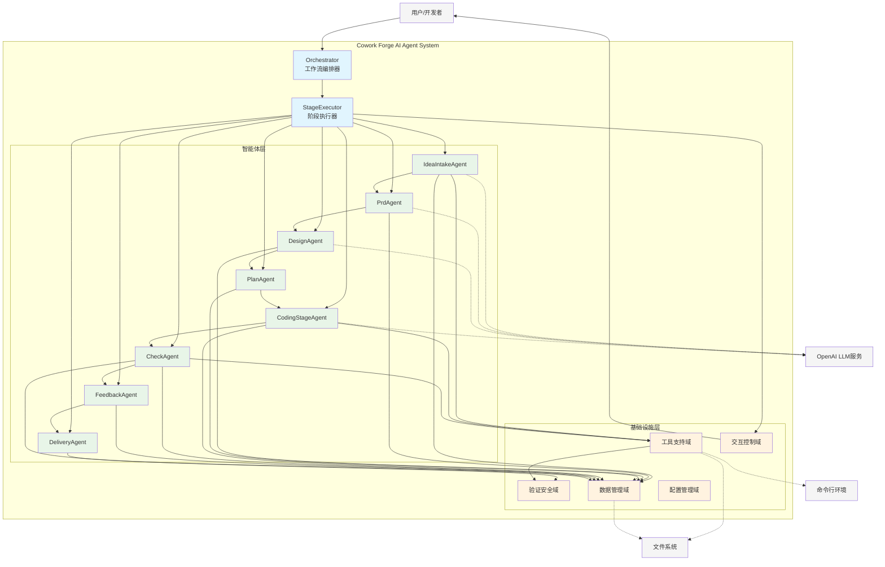
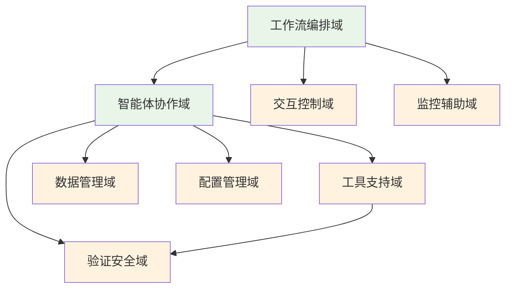
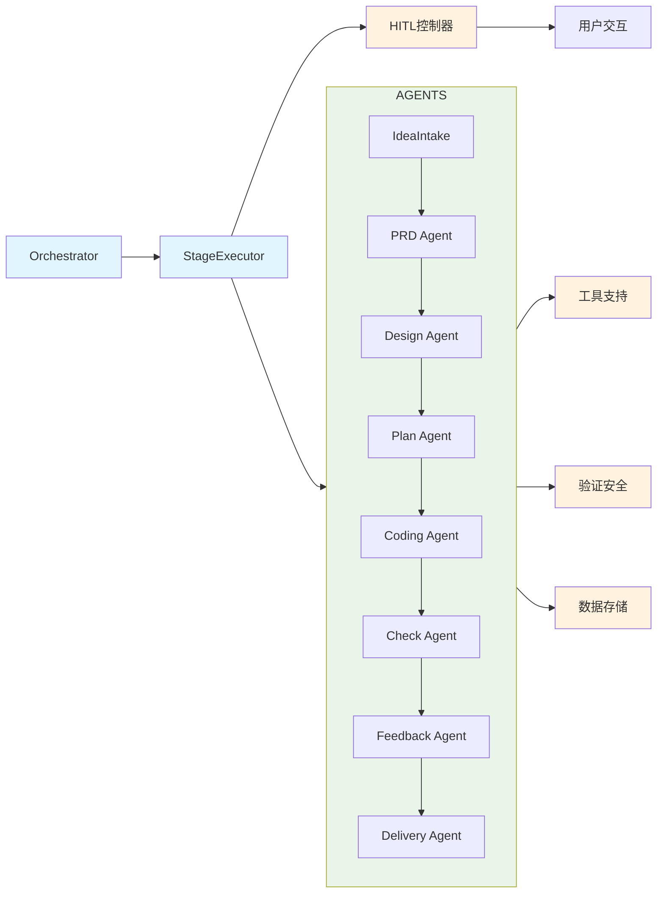
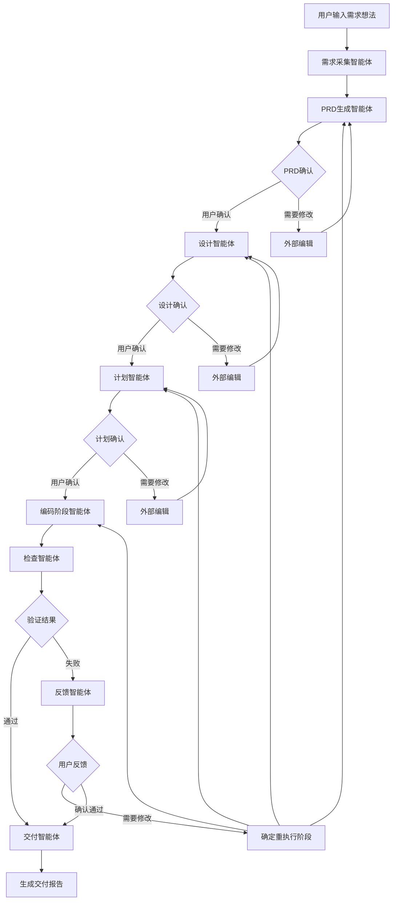
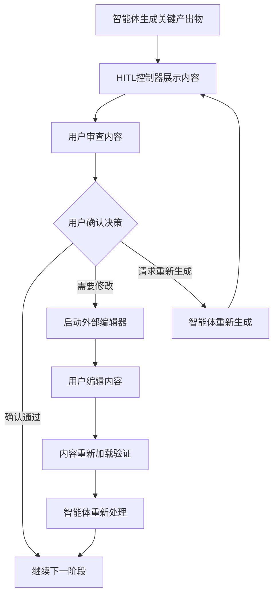
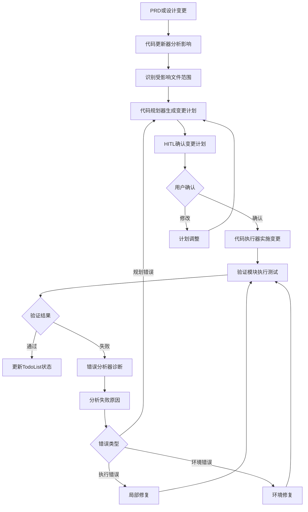
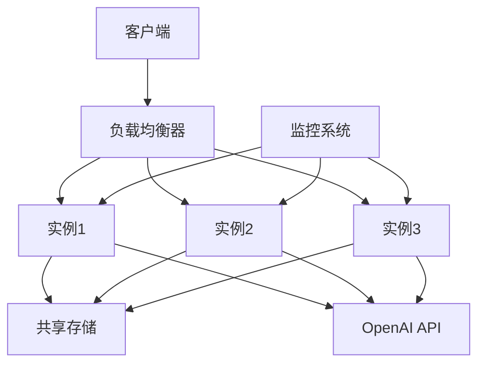
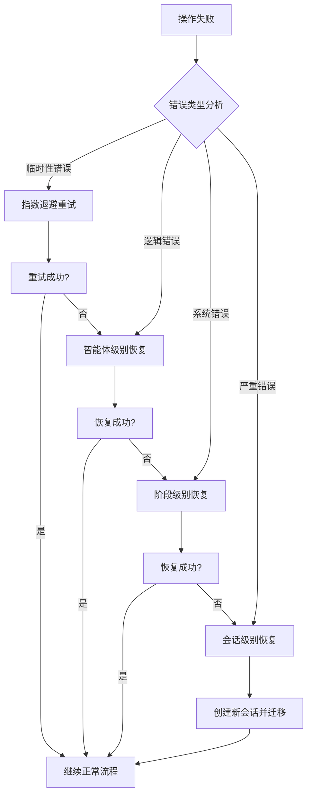

# Cowork Forge AI Agent System 架构文档

*文档生成时间：2026-01-24 00:59:31 (UTC)  
文档版本：v1.0  
架构分析深度：Container级别*

## 1. 架构概述

### 1.1 架构设计理念
Cowork Forge AI Agent System采用**分层模块化架构**设计，核心理念是基于多智能体协作实现软件开发生命周期的全流程自动化。系统围绕"专业化分工、协同工作"的原则，通过8个专业化智能体分别负责软件开发的不同阶段，由统一的工作流编排器协调执行。

### 1.2 核心架构模式
- **多智能体架构模式**：每个智能体职责单一，专注于特定领域任务
- **管道-过滤器模式**：8阶段工作流形成处理管道，每个阶段作为过滤器
- **编排器模式**：中央编排器协调智能体执行顺序和依赖关系
- **HITL模式**：关键决策点引入人工验证，确保AI生成质量

### 1.3 技术栈概览
```yaml
编程语言: Rust
核心框架: 自定义多智能体框架
AI服务: OpenAI LLM API
存储: 基于文件的工件存储
序列化: JSON + Markdown
工具支持: 文件操作、命令执行、安全检查
```

### 1.4 系统架构图


## 2. 系统上下文

### 2.1 系统定位与价值
Cowork Forge AI Agent System定位为**AI驱动的软件开发自动化平台**，核心价值在于：
- **效率提升**：自动化软件开发生命周期，减少人工编码工作量
- **质量保证**：通过多轮验证和HITL机制确保代码质量
- **门槛降低**：使非专业开发者也能参与软件开发过程
- **适应性增强**：支持迭代式开发和需求变更管理

### 2.2 用户角色与场景

#### 2.2.1 软件开发工程师
**核心需求**：快速原型开发、代码生成优化、自动化测试验证
**使用场景**：
- 新功能快速原型验证
- 现有代码重构和优化
- 自动化测试用例生成

#### 2.2.2 技术项目经理
**核心需求**：项目进度跟踪、质量保证、交付物管理
**使用场景**：
- 项目里程碑规划和跟踪
- 代码质量度量和报告
- 团队协作和任务分配

#### 2.2.3 产品经理
**核心需求**：需求结构化、技术可行性验证、产品文档自动化
**使用场景**：
- 产品需求文档自动生成
- 技术方案可行性评估
- 用户故事和验收标准定义

### 2.3 外部系统交互

| 外部系统 | 交互类型 | 交互目的 | 技术实现 |
|---------|---------|---------|---------|
| OpenAI LLM服务 | API调用 | 智能体决策、代码生成、文档分析 | HTTP REST API |
| 文件系统 | 读写操作 | 项目文件管理、配置持久化 | 标准文件IO |
| 命令行环境 | 命令执行 | 构建、测试、验证命令执行 | 子进程执行 |

### 2.4 系统边界定义

**包含组件**：
- 智能体编排器（Orchestrator）和阶段执行器（StageExecutor）
- 8个专业化智能体（需求采集到交付报告）
- 工具支持系统（文件操作、命令执行）
- 验证和安全检查模块
- HITL人工交互控制器

**排除组件**：
- 具体的业务逻辑实现
- 用户界面展示层
- 数据库持久化层
- 第三方服务集成（除LLM外）
- 部署和运维工具

## 3. 容器视图

### 3.1 领域模块划分

系统采用**领域驱动设计**理念，划分为8个核心领域模块：

#### 3.1.1 工作流编排域（核心业务流程域）
**职责**：协调和管理整个软件开发工作流
- **工作流编排器**（Orchestrator）：8阶段工作流的核心协调器
- **阶段执行器**（StageExecutor）：统一执行各阶段智能体

#### 3.1.2 智能体协作域（核心业务域）
**职责**：包含所有专业化智能体，负责软件开发生命周期各阶段
- 8个智能体：从需求采集到交付报告的完整链条

#### 3.1.3 工具支持域（基础设施支持域）
**职责**：提供基础工具支持能力
- **文件工具集**：安全的文件读写和目录操作
- **命令工具集**：安全的命令执行和输出捕获

#### 3.1.4 验证安全域（质量保证域）
**职责**：代码验证、命令安全检查和项目类型检测
- **验证执行器**：执行项目验证命令
- **安全检查器**：防止危险命令执行
- **项目检测器**：自动检测项目类型

### 3.2 领域模块架构



### 3.3 存储设计

#### 3.3.1 工件存储架构
系统采用**基于文件的工件存储系统**，设计特点：
- **版本化管理**：每个会话的产出物版本化存储
- **格式标准化**：JSON用于结构化数据，Markdown用于文档
- **目录结构**：按会话ID和阶段组织文件存储

```rust
// 核心数据模型
pub struct SessionMeta {
    pub session_id: String,
    pub current_stage: Option<Stage>,
    pub stage_status: HashMap<Stage, StageStatus>,
    pub feedback_iterations: usize,
    pub modification_context: Option<String>,
}
```

#### 3.3.2 数据持久化策略
- **会话状态持久化**：实时保存工作流执行状态
- **智能体产出物持久化**：各阶段生成的内容独立存储
- **配置持久化**：TOML格式配置文件管理

### 3.4 领域间模块通信

#### 3.4.1 通信模式分析
1. **同步调用模式**：工作流编排器→智能体执行
2. **事件驱动模式**：阶段完成触发下一阶段执行
3. **数据共享模式**：通过工件存储共享阶段产出物
4. **HITL交互模式**：人工确认触发流程继续

#### 3.4.2 关键接口定义
```rust
// 智能体统一接口
pub trait StageAgent {
    fn execute(&self, context: &AgentContext) -> Result<AgentOutput>;
    fn get_stage(&self) -> Stage;
}

// 工具执行接口
pub trait ToolExecutor {
    fn execute_safe(&self, command: &str) -> Result<CommandOutput>;
    fn read_file(&self, path: &Path) -> Result<String>;
    fn write_file(&self, path: &Path, content: &str) -> Result<()>;
}
```

## 4. 组件视图

### 4.1 核心功能组件

#### 4.1.1 工作流编排器（Orchestrator）
**职责**：整个系统的指挥中心
- **会话生命周期管理**：创建、执行、结束会话
- **阶段依赖管理**：维护8个阶段的执行顺序和依赖关系
- **错误恢复机制**：处理阶段执行失败的重试策略

**关键实现**：
```rust
impl Orchestrator {
    pub fn new() -> Self { /* ... */ }
    pub async fn run_session(&self, idea: String) -> Result<SessionResult> {
        // 1. 初始化会话元数据
        // 2. 按顺序执行8个阶段
        // 3. 处理HITL交互点
        // 4. 管理反馈迭代循环
    }
}
```

#### 4.1.2 阶段执行器（StageExecutor）
**职责**：统一执行智能体的标准化执行器
- **智能体执行封装**：提供统一的执行环境和错误处理
- **HITL协调**：管理人工验证点的交互流程
- **状态持久化**：实时保存执行状态和结果

### 4.2 智能体组件集群

#### 4.2.1 需求采集智能体（IdeaIntakeAgent）
**输入**：非结构化用户需求想法
**输出**：结构化的需求规格说明
**核心技术**：LLM驱动的需求分析和结构化

#### 4.2.2 PRD智能体（PrdAgent）
**输入**：结构化的需求规格
**输出**：完整的产品需求文档
**核心能力**：产品范围定义、需求优先级排序

#### 4.2.3 设计智能体（DesignAgent）
**输入**：产品需求文档
**输出**：技术架构和设计方案
**核心技术**：系统架构设计、技术选型建议

#### 4.2.4 编码阶段智能体（CodingStageAgent）
**复杂度**：最高的智能体，包含多个子组件
- **代码规划器**（CodePlanner）：生成代码变更计划
- **代码执行器**（CodeExecutor）：实际执行代码生成
- **代码更新器**（CodeUpdater）：支持增量代码更新

### 4.3 技术支撑组件

#### 4.3.1 验证安全组件
```rust
// 安全检查器核心逻辑
impl SafetyChecker {
    pub fn check_command(&self, command: &str) -> SafetyLevel {
        if self.is_dangerous_pattern(command) {
            SafetyLevel::Dangerous
        } else if self.is_suspicious_pattern(command) {
            SafetyLevel::Suspicious  
        } else {
            SafetyLevel::Safe
        }
    }
}
```

#### 4.3.2 工具支持组件
- **文件工具集**：支持原子文件操作，防止部分写入
- **命令工具集**：超时控制、输出大小限制、错误流分离

### 4.4 组件交互关系



## 5. 关键流程

### 5.1 核心功能流程

#### 5.1.1 软件开发全生命周期工作流


#### 5.1.2 人机交互验证流程
**设计理念**：在关键决策点引入人工验证，平衡自动化效率和输出质量



### 5.2 代码变更管理流程

#### 5.2.1 增量代码更新机制


### 5.3 异常处理机制

#### 5.3.1 多层次错误恢复策略
1. **智能体级别恢复**：单个智能体执行失败的重试机制
2. **阶段级别恢复**：阶段执行失败的回滚和重试
3. **会话级别恢复**：会话异常的状态恢复和继续执行
4. **系统级别恢复**：系统故障的会话迁移和恢复

## 6. 技术实现

### 6.1 核心模块实现

#### 6.1.1 工作流状态机实现
```rust
// 工作流状态定义
pub enum WorkflowState {
    Initializing,
    IdeaIntake,
    PrdGeneration,
    TechnicalDesign,
    ImplementationPlan,
    Coding,
    Checking,
    FeedbackProcessing,
    Delivery,
    Completed,
    Error(WorkflowError),
}

// 状态转换逻辑
impl WorkflowState {
    pub fn next_state(&self, result: &StageResult) -> Self {
        match (self, result) {
            (WorkflowState::IdeaIntake, StageResult::Success) => WorkflowState::PrdGeneration,
            (WorkflowState::PrdGeneration, StageResult::Success) => WorkflowState::TechnicalDesign,
            // ... 其他状态转换
            (_, StageResult::Error(_)) => WorkflowState::Error(WorkflowError::StageExecutionFailed),
            _ => self.clone(),
        }
    }
}
```

#### 6.1.2 智能体执行框架
```rust
// 智能体执行上下文
pub struct AgentContext {
    pub session_id: String,
    pub artifacts: ArtifactStore,
    pub tools: ToolRegistry,
    pub config: AgentConfig,
    pub previous_outputs: HashMap<Stage, AgentOutput>,
}

// 统一执行模板
impl StageExecutor {
    pub async fn execute_agent<A: StageAgent>(&self, agent: A, context: &AgentContext) -> Result<AgentOutput> {
        // 1. 前置检查和环境准备
        self.pre_execution_checks(&agent, context)?;
        
        // 2. 执行智能体逻辑
        let result = agent.execute(context).await;
        
        // 3. 结果处理和持久化
        self.handle_execution_result(result, &agent, context).await
    }
}
```

### 6.2 关键算法设计

#### 6.2.1 代码变更影响分析算法
```rust
// 变更影响分析
impl CodeUpdater {
    pub fn analyze_impact(&self, changes: &DesignChanges) -> ImpactAnalysis {
        let mut analysis = ImpactAnalysis::new();
        
        // 文件级别影响分析
        for file in &changes.affected_files {
            let dependencies = self.dependency_graph.get_dependents(file);
            analysis.add_impacted_files(dependencies);
        }
        
        // API级别影响分析
        for api_change in &changes.api_changes {
            let consumers = self.find_api_consumers(api_change);
            analysis.add_impacted_components(consumers);
        }
        
        analysis
    }
}
```

#### 6.2.2 HITL决策点优化算法
```rust
// HITL触发策略
impl HitlController {
    pub fn should_trigger_hitl(&self, stage: Stage, confidence: f64, complexity: Complexity) -> bool {
        match stage {
            Stage::PrdGeneration => confidence < self.config.prd_confidence_threshold,
            Stage::TechnicalDesign => complexity >= Complexity::High,
            Stage::Coding => {
                confidence < self.config.coding_confidence_threshold 
                || complexity >= Complexity::Medium
            },
            _ => false,
        }
    }
}
```

### 6.3 数据结构设计

#### 6.3.1 会话元数据结构
```rust
#[derive(Serialize, Deserialize, Clone)]
pub struct SessionMeta {
    pub session_id: String,
    pub created_at: DateTime<Utc>,
    pub current_stage: Stage,
    pub stage_status: HashMap<Stage, StageStatus>,
    pub artifacts: HashMap<String, ArtifactReference>,
    pub feedback_cycles: usize,
    pub max_feedback_cycles: usize,
    pub modification_context: Option<String>,
    pub user_preferences: UserPreferences,
}
```

#### 6.3.2 智能体输出标准化
```rust
#[derive(Serialize, Deserialize)]
pub struct AgentOutput {
    pub stage: Stage,
    pub content: OutputContent,
    pub artifacts: Vec<Artifact>,
    pub confidence: f64,
    pub execution_time: Duration,
    pub next_steps: Vec<NextStep>,
    pub requires_hitl: bool,
    pub hitl_prompt: Option<String>,
}
```

### 6.4 性能优化策略

#### 6.4.1 LLM调用优化
- **批量处理**：将相关请求合并为批量调用
- **缓存机制**：缓存频繁使用的LLM响应
- **超时控制**：设置合理的LLM调用超时时间

#### 6.4.2 文件操作优化
- **增量读写**：避免全量文件读取和写入
- **内存映射**：对大文件使用内存映射技术
- **异步IO**：使用异步文件操作提高并发性

## 7. 部署架构

### 7.1 运行时环境要求

#### 7.1.1 硬件要求
```yaml
最低配置:
  CPU: 4核心
  内存: 8GB
  存储: 10GB可用空间

推荐配置:
  CPU: 8核心或以上
  内存: 16GB或以上  
  存储: SSD, 50GB可用空间
```

#### 7.1.2 软件依赖
- **操作系统**：Linux/macOS/Windows (推荐Linux)
- **Rust工具链**：1.70+ 版本
- **OpenAI API访问**：有效的API密钥和网络连接
- **命令行工具**：git, make, 语言特定构建工具

### 7.2 部署拓扑结构

#### 7.2.1 单机部署模式
```
用户终端 → Cowork Forge AI Agent System → 本地文件系统
                      ↓
                OpenAI API服务
```

#### 7.2.2 潜在的多机部署扩展


### 7.3 可扩展性设计

#### 7.3.1 水平扩展策略
- **无状态设计**：智能体实例无状态，可水平扩展
- **共享存储**：工件存储使用共享文件系统或对象存储
- **会话亲和性**：同一会话路由到同一实例处理

#### 7.3.2 垂直扩展策略
- **内存优化**：大文件处理使用流式处理
- **CPU优化**：计算密集型任务使用多线程
- **IO优化**：异步非阻塞IO操作

### 7.4 监控和运维

#### 7.4.1 关键监控指标
```yaml
业务指标:
  - 会话成功率
  - 平均处理时间
  - 各阶段成功率
  - 用户满意度评分

系统指标:
  - CPU/内存使用率
  - LLM API调用延迟
  - 文件IO性能
  - 错误率和异常统计
```

#### 7.4.2 日志和追踪
- **结构化日志**：JSON格式日志，便于分析
- **请求追踪**：全链路请求追踪，便于问题排查
- **性能剖析**：各阶段执行时间统计和分析

## 8. 架构洞察与设计思考

### 8.1 可扩展性设计

#### 8.1.1 智能体插件化架构
系统采用**插件化的智能体架构**，新的智能体可以通过实现统一的`StageAgent` trait轻松集成：

```rust
// 扩展新智能体的示例
pub struct NewDomainAgent {
    // 实现特定领域逻辑
}

impl StageAgent for NewDomainAgent {
    fn execute(&self, context: &AgentContext) -> Result<AgentOutput> {
        // 新智能体的业务逻辑
    }
    
    fn get_stage(&self) -> Stage {
        Stage::Custom("new_domain")
    }
}
```

#### 8.1.2 工具集扩展机制
工具支持域设计为**可扩展的工具注册表**，新工具可以动态注册：

```rust
impl ToolRegistry {
    pub fn register_tool(&mut self, name: String, tool: Box<dyn Tool>) {
        self.tools.insert(name, tool);
    }
    
    pub fn get_tool(&self, name: &str) -> Option<&dyn Tool> {
        self.tools.get(name).map(|t| t.as_ref())
    }
}
```

### 8.2 性能考量

#### 8.2.1 瓶颈分析与优化
**识别的主要性能瓶颈**：
1. **LLM API调用延迟**：通过批量请求和缓存优化
2. **大文件处理**：采用流式处理和内存映射技术
3. **IO密集型操作**：使用异步IO和并发处理

**优化策略**：
- **预取优化**：预测下一个阶段可能需要的资源并提前加载
- **懒加载**：工件数据按需加载，减少内存占用
- **连接池**：LLM API连接复用，减少建立连接开销

#### 8.2.2 资源管理策略
```rust
// 资源限制管理
impl ResourceManager {
    pub fn enforce_limits(&self) -> Result<()> {
        // 内存使用限制
        if self.current_memory_usage() > self.config.max_memory {
            return Err(ResourceError::MemoryLimitExceeded);
        }
        
        // 文件描述符限制
        if self.open_files_count() > self.config.max_open_files {
            return Err(ResourceError::FileLimitExceeded);
        }
        
        // CPU时间限制
        if self.cpu_time_used() > self.config.max_cpu_time {
            return Err(ResourceError::CpuTimeExceeded);
        }
        
        Ok(())
    }
}
```

### 8.3 安全设计

#### 8.3.1 多层次安全防护
系统构建了**纵深防御体系**，从多个层面确保安全性：

1. **命令执行安全层**
   ```rust
   impl SafetyChecker {
       pub fn validate_command(&self, command: &str) -> ValidationResult {
           // 1. 语法分析：识别危险模式
           if self.contains_dangerous_patterns(command) {
               return ValidationResult::Rejected;
           }
           
           // 2. 上下文验证：检查命令在当前上下文的合理性
           if !self.is_context_appropriate(command) {
               return ValidationResult::Suspicious;
           }
           
           // 3. 权限检查：确保命令在安全权限内执行
           if !self.has_required_permissions(command) {
               return ValidationResult::InsufficientPermissions;
           }
           
           ValidationResult::Approved
       }
   }
   ```

2. **文件操作安全层**
   - 路径遍历攻击防护
   - 符号链接解析安全
   - 文件权限严格检查

3. **数据验证安全层**
   - LLM输出内容验证
   - 结构化数据格式检查
   - 跨阶段数据一致性验证

#### 8.3.2 隐私保护设计
- **本地处理优先**：敏感数据尽可能在本地处理
- **数据最小化**：只向LLM发送必要的最小数据
- **临时数据清理**：会话结束后清理临时文件

### 8.4 容错与可靠性

#### 8.4.1 故障恢复策略
系统设计了**分级故障恢复机制**：



#### 8.4.2 数据一致性保障
- **原子操作**：关键操作具备原子性
- **事务性存储**：重要数据变更支持回滚
- **一致性检查**：阶段间数据依赖关系验证

### 8.5 架构演进思考

#### 8.5.1 当前架构优势
1. **清晰的职责分离**：每个智能体专注特定领域
2. **灵活的扩展性**：新的智能体易于集成
3. **强大的人机协作**：HITL机制平衡自动化和质量控制
4. **鲁棒的错误处理**：多层次容错机制

#### 8.5.2 未来演进方向
1. **分布式架构**：支持多机协作处理复杂项目
2. **智能体学习能力**：基于历史会话优化智能体行为
3. **多模态支持**：支持图像、音频等更多输入形式
4. **团队协作功能**：多用户同时参与同一项目

## 9. 实践指导

### 9.1 开发团队指南

#### 9.1.1 新功能开发流程
1. **需求分析阶段**：使用IdeaIntakeAgent进行需求结构化
2. **技术设计阶段**：基于DesignAgent的输出进行详细设计
3. **实现阶段**：遵循系统现有的代码规范和架构模式
4. **测试验证**：利用CheckAgent进行自动化测试

#### 9.1.2 代码贡献规范
- **智能体开发**：实现StageAgent trait，保持接口一致性
- **工具扩展**：通过ToolRegistry注册新工具
- **配置管理**：使用统一的配置管理系统

### 9.2 运维团队指南

#### 9.2.1 部署检查清单
```yaml
前置检查:
  - OpenAI API密钥配置
  - 文件系统权限验证
  - 网络连接测试
  - 依赖工具安装确认

运行时监控:
  - 会话成功率监控
  - LLM API延迟监控
  - 系统资源使用情况
  - 错误日志分析
```

#### 9.2.2 故障排查指南
1. **LLM API问题**：检查网络连接和API配额
2. **文件操作失败**：验证文件权限和磁盘空间
3. **命令执行错误**：检查命令工具可用性和环境变量
4. **内存不足**：调整会话并发数或增加系统内存

### 9.3 架构决策记录

#### 9.3.1 关键架构决策
1. **选择Rust语言**：基于性能、安全性和并发能力考量
2. **基于文件的存储**：简化部署，避免数据库依赖
3. **模块化智能体设计**：支持专业化发展和独立演进
4. **HITL机制集成**：确保AI生成内容的质量可控

#### 9.3.2 技术债务管理
- **文档化已知问题**：维护技术债务清单
- **定期重构计划**：每个版本安排架构优化时间
- **性能基准测试**：建立持续的性能监控体系

---

**文档状态**：已完成  
**下次评审时间**：3个月后  
**维护负责人**：架构委员会  

*本架构文档将随系统演进定期更新，确保与实际情况保持一致。*