# Core Workflows

## 1. Workflow Overview

Cowork Forge implements a sophisticated multi-agent workflow system that automates the complete software development lifecycle from ideation to delivery. The system orchestrates specialized AI agents through a sequential pipeline with strategic human-in-the-loop (HITL) integration points for quality control and decision-making.

### System Main Workflows

The system supports three primary workflow patterns:

1. **New Project Initiation**: Complete end-to-end development from idea to delivery
2. **Project Resumption**: Intelligent continuation of interrupted sessions 
3. **Incremental Updates**: Targeted modifications based on requirement changes

### Core Execution Paths

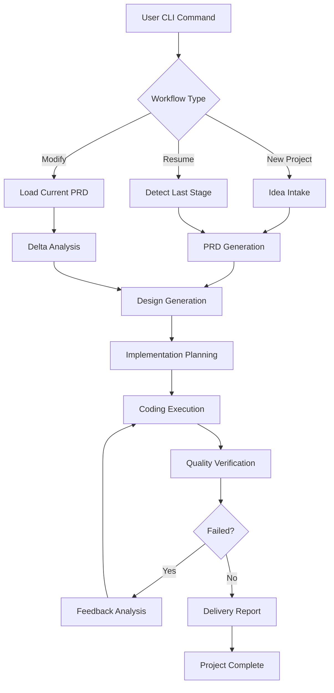

### Key Process Nodes

- **CLI Command Parsing**: Entry point for user interaction
- **Agent Orchestration**: Sequential execution of specialized agents
- **HITL Integration**: Human review at critical decision points
- **Artifact Persistence**: Structured data management via JSON/Markdown
- **Quality Gates**: Automated validation and verification checks

## 2. Main Workflows

### 2.1 Core Development Workflow

The primary workflow transforms user ideas into implemented software through seven sequential stages:

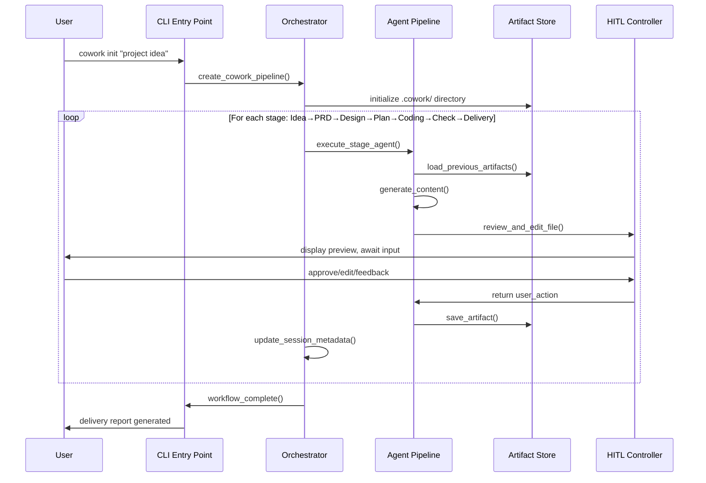

#### Stage 1: Idea Intake Process
**Input**: Natural language project description
**Output**: Structured IdeaSpec artifact
**Key Operations**:
- LLM-powered parsing of user input into structured fields
- Generation of `idea.md` with predefined sections
- HITL review for refinement
- Persistence to `.cowork/data/idea_spec.json`

#### Stage 2: PRD Generation Process  
**Input**: IdeaSpec artifact
**Output**: Product Requirements Document
**Key Operations**:
- Transform idea into formal requirements and features
- Create `prd.md` with scope, constraints, success criteria
- HITL review with feedback incorporation
- Generate structured `requirements.json` and `feature_list.json`

#### Stage 3: Design Generation Process
**Input**: PRD artifact  
**Output**: Technical Design Document
**Key Operations**:
- Analyze requirements to produce architectural design
- Generate `design.md` covering CLI modes, workflows, components
- HITL review of technical approach
- Create `design_spec.json` with component specifications

#### Stage 4: Implementation Planning Process
**Input**: Design artifact
**Output**: Implementation Plan and Task List
**Key Operations**:
- Break down design into executable tasks
- Generate prioritized task list with dependencies
- HITL review of implementation approach
- Create `implementation_plan.json` and `todo_list.json`

#### Stage 5: Coding Execution Process
**Input**: Implementation plan
**Output**: Generated/modified code files
**Key Operations**:
- CodePlanner analyzes project structure and generates change plan
- HITL confirmation of proposed changes
- CodeExecutor applies changes using file manipulation tools
- Update task status based on execution results

#### Stage 6: Verification and Validation Process
**Input**: Generated code and requirement artifacts
**Output**: CheckReport with quality assessment
**Key Operations**:
- Execute project-specific verification commands
- Validate requirement coverage and structural integrity
- Generate comprehensive check report
- Automatic progression or feedback loop initiation

#### Stage 7: Delivery Report Generation
**Input**: All previous artifacts
**Output**: Final delivery documentation
**Key Operations**:
- Aggregate capabilities, limitations, usage instructions
- Generate `delivery_report.md`
- Mark project as complete

### 2.2 Project Resumption Workflow

Intelligent session recovery mechanism that preserves workflow state:

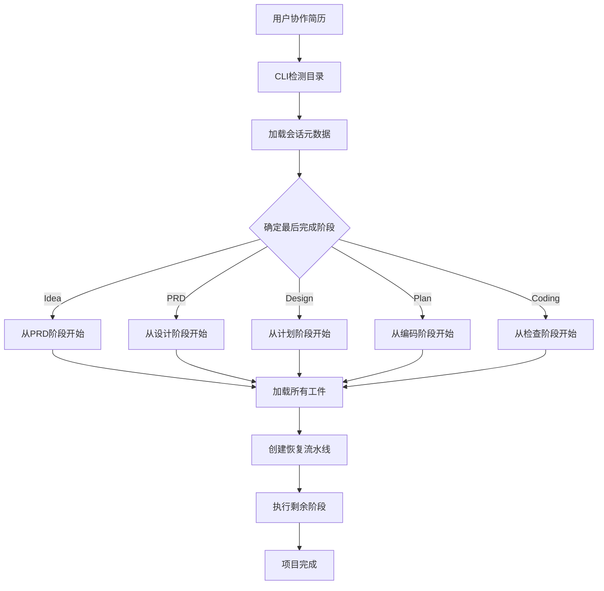

**Key Features**:
- **Artifact Detection**: Scans `.cowork/` directory for existing files
- **Stage Inference**: Analyzes artifact completeness to determine restart point
- **Context Preservation**: Loads all previous artifacts into memory
- **Pipeline Construction**: Builds partial pipeline starting from detected stage

### 2.3 Incremental Update Workflow

Efficient modification process for requirement changes:

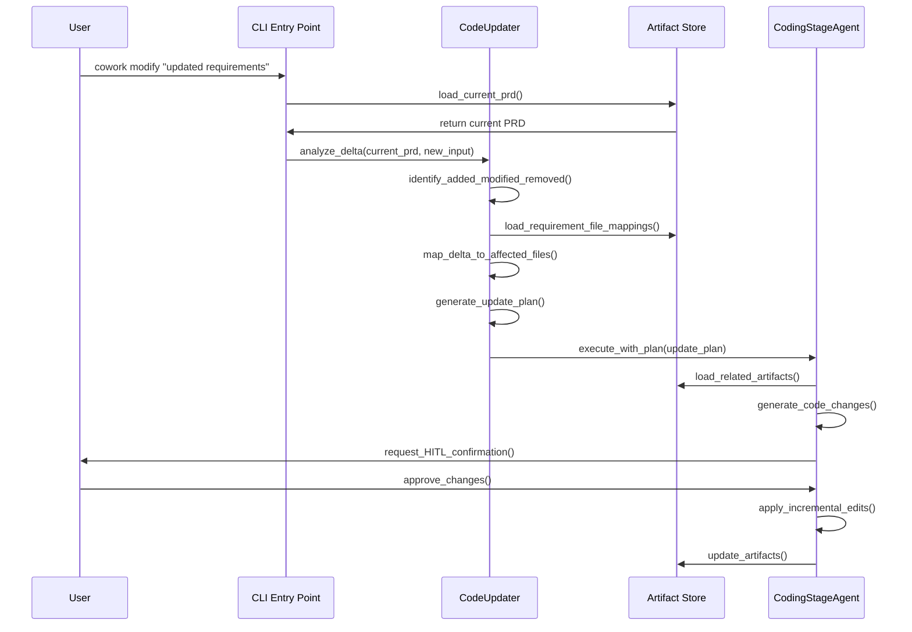

**Delta Analysis Process**:
1. **Requirement Comparison**: Identify added, modified, removed requirements
2. **File Mapping**: Correlate requirements to affected source files
3. **Change Isolation**: Focus edits only on impacted components
4. **Plan Generation**: Structured update instructions for CodeExecutor

## 3. Flow Coordination and Control

### 3.1 Multi-Agent Coordination

The system employs a sophisticated agent orchestration mechanism:

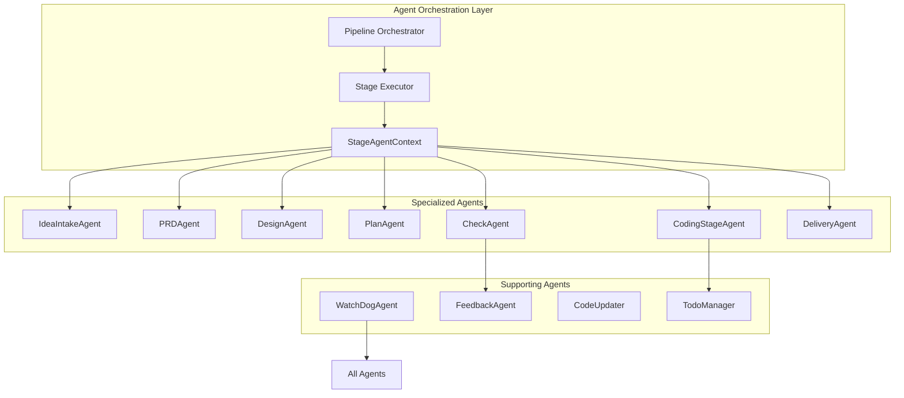

**Coordination Mechanisms**:
- **Sequential Execution**: Strict stage ordering with dependency validation
- **Context Sharing**: Shared StageAgentContext for resource access
- **State Propagation**: ArtifactStore ensures data consistency across stages
- **Error Containment**: Stage-level error handling prevents cascade failures

### 3.2 State Management and Synchronization

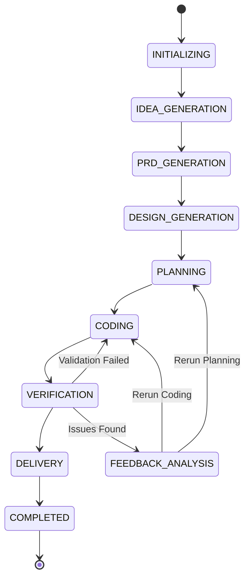

**State Persistence Strategy**:
- **Session Metadata**: Tracks current stage, timestamps, restart reasons
- **Artifact Versioning**: Each stage produces versioned artifacts
- **Progress Tracking**: TodoListManager monitors task completion
- **Resume Point Detection**: Automated stage completion analysis

### 3.3 Data Flow Architecture

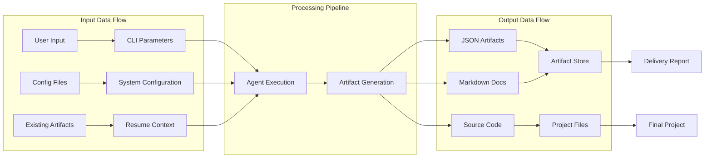

## 4. Exception Handling and Recovery

### 4.1 Error Detection and Classification

The system implements comprehensive error detection across multiple dimensions:

**Error Categories**:
- **LLM API Errors**: Rate limits, authentication failures, network issues
- **File System Errors**: Permission denied, disk full, path violations  
- **Validation Errors**: Schema violations, dependency cycles, coverage gaps
- **Execution Errors**: Command failures, syntax errors, runtime exceptions

### 4.2 Exception Recovery Mechanisms

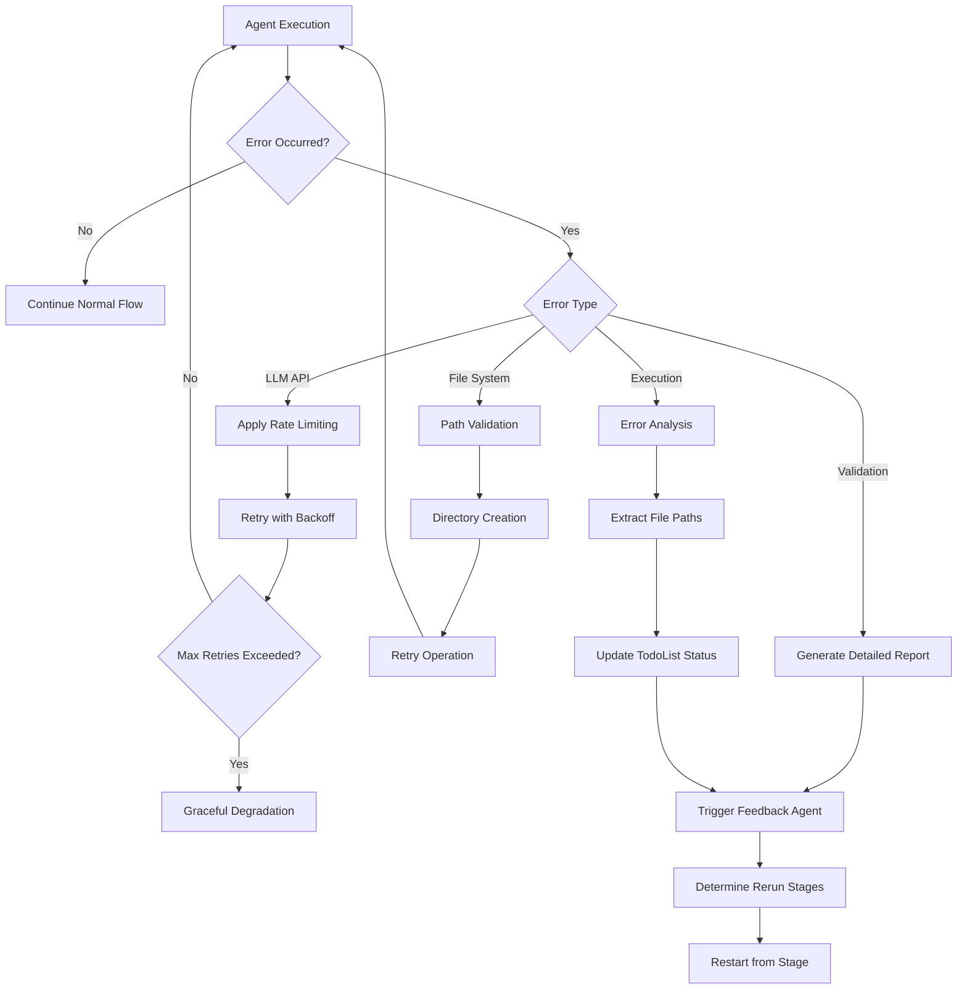

**Recovery Strategies**:
- **Retry with Exponential Backoff**: For transient errors (network, API limits)
- **Graceful Degradation**: Fallback to simplified operations when complex features fail
- **Targeted Restart**: Resume from specific stages instead of full pipeline
- **Human Escalation**: Request user intervention for unresolvable issues

### 4.3 Fault Tolerance Design

**Multi-Layer Protection**:
1. **Tool-Level Safety**: Path validation, command blocking, input sanitization
2. **Agent-Level Resilience**: Max iteration limits, timeout handling, state checkpointing  
3. **Pipeline-Level Robustness**: Stage isolation, error containment, resume capability
4. **System-Level Monitoring**: Progress tracking, resource usage, performance metrics

## 5. Key Process Implementation

### 5.1 Agent Instruction Processing Pipeline

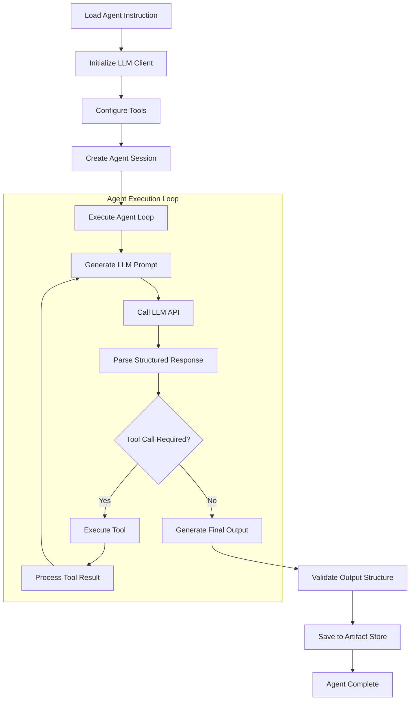

**Key Implementation Details**:
- **Structured Output Parsing**: LLM responses parsed against predefined schemas
- **Tool Chaining**: Sequential tool execution with context preservation
- **Iteration Control**: Max iteration limits prevent infinite loops
- **State Management**: Session persistence across tool invocations

### 5.2 File-Based Artifact Management

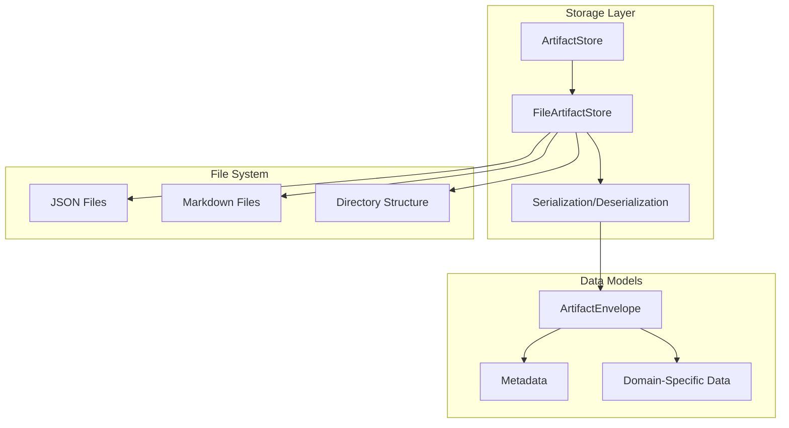

**Artifact Persistence Strategy**:
- **Dual Format Storage**: JSON for machine processing, Markdown for human readability
- **Versioned Artifacts**: Each stage produces complete artifact set
- **Metadata Enrichment**: Timestamps, session context, dependency information
- **Directory Organization**: Logical separation by artifact type and stage

### 5.3 Human-in-the-Loop Integration

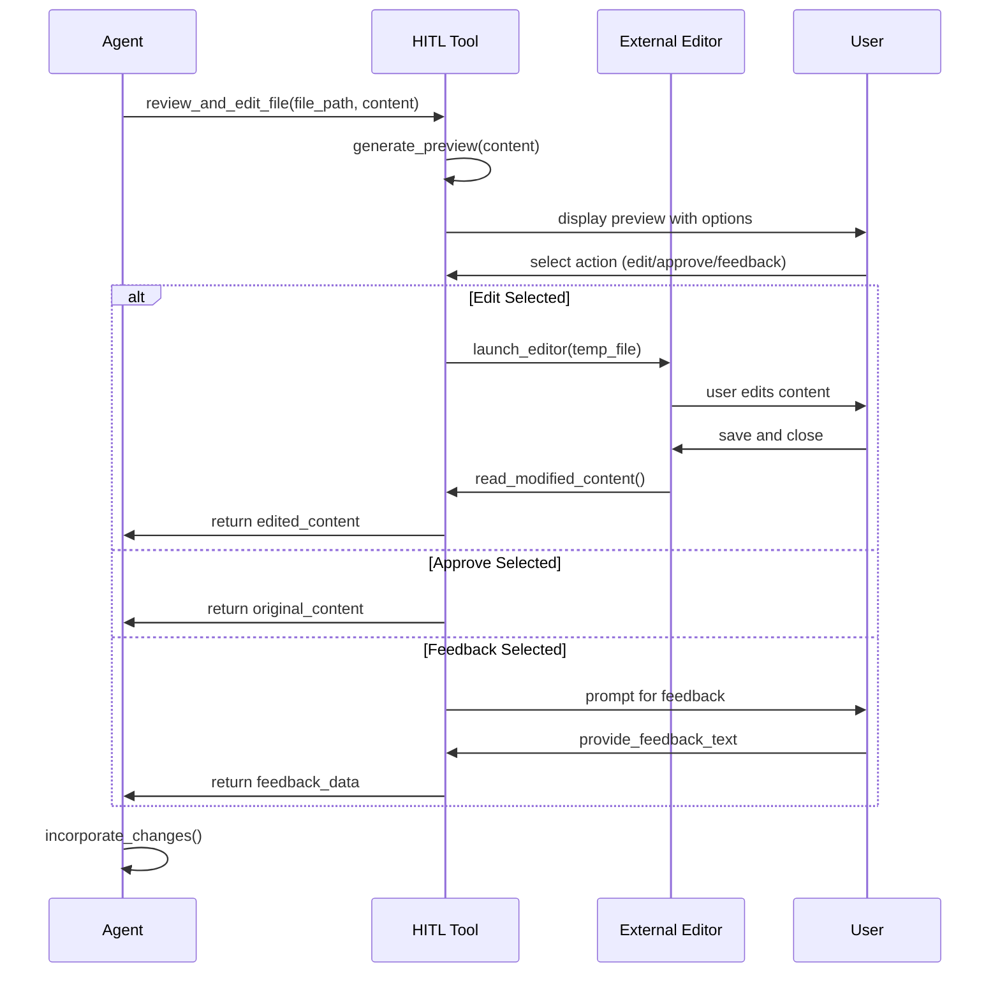

**HITL Workflow Features**:
- **Non-Blocking Design**: Async user interaction without blocking agent execution
- **Content Preview**: First 10-15 lines displayed for quick assessment
- **Multiple Interaction Modes**: Edit, approve, or provide feedback
- **External Editor Integration**: Uses system default editor for complex edits
- **Structured Response Handling**: Clear action outcomes for agent processing

### 5.4 Performance Optimization Processes

**Concurrent Processing Strategy**:
- **Agent-Level Parallelism**: Independent agent execution with shared context
- **Tool Execution Optimization**: Async tool calls with timeout management
- **LLM Rate Limiting**: Configurable delays between API calls
- **File Operation Batching**: Batch file reads/writes where possible

**Resource Management**:
- **Memory Optimization**: Streaming LLM responses, incremental file processing
- **Disk Usage Control**: Automatic cleanup of temporary files
- **Network Efficiency**: Cached LLM responses, connection pooling
- **CPU Utilization**: Background processing of non-critical tasks

This comprehensive workflow documentation provides development teams with clear implementation guidance, operations teams with monitoring and troubleshooting support, and ensures all stakeholders understand the business value and technical execution of each process step in the Cowork Forge system.