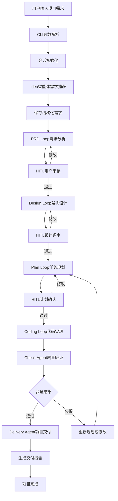
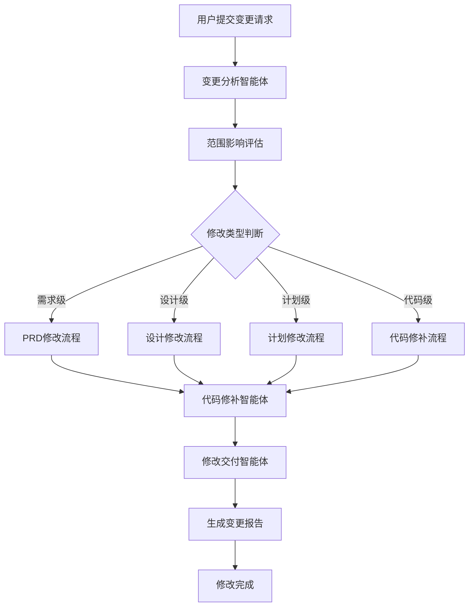
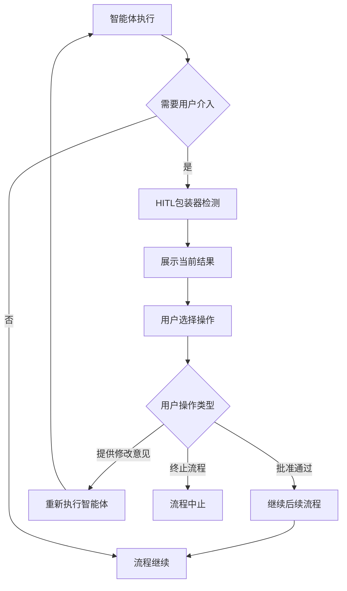
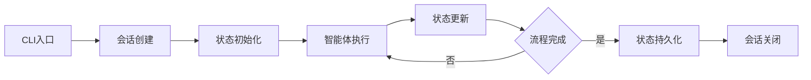
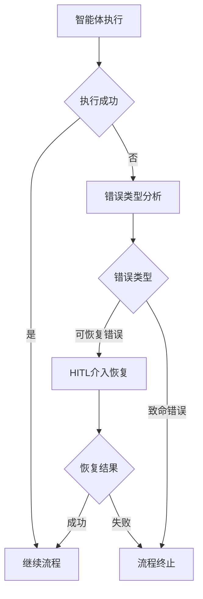

# Core Workflows

## 1. Workflow Overview

Cowork Forge是一个基于AI智能体的软件开发编排系统，通过多智能体协作和人工介入循环（HITL）实现从需求收集到代码交付的完整软件开发流程自动化。系统采用模块化架构设计，核心工作流程围绕会话管理展开。

### 1.1 系统主要工作流程
- **全项目开发流程**：从用户需求输入到代码交付的完整生命周期
- **增量修改流程**：对现有项目的局部修改和调整
- **人工介入流程**：关键决策点的用户反馈和审批
- **错误恢复流程**：流程执行异常时的恢复机制

### 1.2 核心执行路径
系统采用顺序执行模型，各阶段智能体按照预设顺序执行，每个阶段内部采用Actor-Critic模式进行质量把控。

### 1.3 关键流程节点
- **需求捕获节点**：Idea智能体处理和结构化用户需求
- **设计评审节点**：Design Critic进行架构设计验证
- **代码实现节点**：Coding Actor和Critic协作生成代码
- **质量检查节点**：Check Agent进行最小化质量验证
- **交付验证节点**：Delivery Agent确保项目完整交付

### 1.4 流程协调机制
系统通过会话状态管理和数据持久化实现流程协调，各智能体通过共享的会话数据实现状态同步和进度跟踪。

## 2. 主要工作流程

### 2.1 全项目开发工作流



#### 2.1.1 流程执行顺序和依赖关系
1. **入口阶段**：CLI参数解析 → 会话初始化 → 配置加载
2. **需求阶段**：Idea捕获 → PRD生成 → 用户审核
3. **设计阶段**：架构设计 → 设计评审 → 用户确认
4. **规划阶段**：任务分解 → 依赖分析 → 计划验证
5. **实现阶段**：代码生成 → 质量检查 → 问题修复
6. **交付阶段**：交付验证 → 报告生成 → 流程结束

#### 2.1.2 输入输出数据流
- **输入**：用户需求描述、配置参数、基础项目信息
- **输出**：结构化需求文档、设计规范、实现计划、源代码文件、交付报告
- **中间数据**：会话状态、反馈记录、版本快照、变更历史

### 2.2 增量修改工作流



#### 2.2.1 变更分析流程
1. **变更范围评估**：分析变更对PRD、设计、计划、代码的影响
2. **风险评估**：评估修改的复杂度和风险等级
3. **影响分析**：识别受影响的组件和功能特性
4. **接受标准**：定义变更完成的标准和验证方法

#### 2.2.2 代码修补流程
1. **增量修改策略**：基于ChangeRequest实施局部修改
2. **版本控制**：保持与基础版本的兼容性
3. **质量保证**：确保修改不影响现有功能
4. **变更记录**：详细记录修改内容和影响范围

### 2.3 人工介入循环工作流



#### 2.3.1 HITL触发条件
- **关键决策点**：设计评审、计划确认、重大架构变更
- **质量检查失败**：验证不通过需要人工干预
- **执行异常**：智能体执行遇到障碍需要指导
- **用户主动介入**：用户要求查看进度或提供反馈

#### 2.3.2 交互模式设计
- **编辑模式**：用户直接修改生成内容
- **反馈模式**：提供文本反馈指导智能体
- **通过模式**：快速批准继续流程
- **终止模式**：中止当前流程进行问题修复

## 3. 流程协调和控制

### 3.1 多模块协调机制

#### 3.1.1 会话状态管理


系统通过会话ID实现流程隔离，每个开发流程在独立的会话环境中执行，确保多项目并行开发的隔离性。

#### 3.1.2 数据传递和共享
- **共享数据模型**：统一的Requirements、Feature、DesignComponent等数据模型
- **文件系统存储**：JSON格式的数据文件实现智能体间数据共享
- **状态同步机制**：通过存储模块实现各智能体状态同步

### 3.2 执行控制和调度

#### 3.2.1 智能体执行控制
```rust
// 顺序执行控制示例
let pipeline = SequentialAgent::new(
    "cowork_forge_pipeline",
    vec![
        idea_agent,
        prd_loop,
        design_loop,
        plan_loop,
        coding_loop,
        check_agent,
        delivery_agent,
    ],
);
```

#### 3.2.2 循环迭代控制
- **最大迭代次数**：每个LoopAgent设置最大3次迭代
- **退出条件**：Critic批准或达到最大迭代次数
- **错误恢复**：ResilientAgent包装提供错误恢复机制

### 3.3 状态管理和同步

#### 3.3.1 会话生命周期管理
1. **创建阶段**：生成唯一会话ID，初始化目录结构
2. **执行阶段**：维护当前执行状态和进度信息
3. **持久化阶段**：定期保存状态防止数据丢失
4. **完成阶段**：生成最终报告，清理临时资源

#### 3.3.2 数据一致性保证
- **原子操作**：工具操作确保数据完整性
- **版本控制**：支持会话间的状态继承和回滚
- **冲突检测**：并发访问的数据冲突检测和解决

## 4. 异常处理和恢复

### 4.1 错误检测和处理

#### 4.1.1 智能体执行错误


#### 4.1.2 错误分类和处理策略
- **配置错误**：LLM配置异常、文件权限问题 → 系统级错误处理
- **数据错误**：JSON解析失败、数据格式错误 → 数据验证和修复
- **执行错误**：智能体迭代超限、工具调用失败 → HITL介入恢复
- **资源错误**：磁盘空间不足、内存溢出 → 资源监控和预警

### 4.2 异常恢复机制

#### 4.2.1 阶段重启机制
```rust
// 阶段重启工具实现
pub fn create_partial_pipeline(
    config: &ModelConfig,
    session_id: &str,
    base_session_id: &str,
    start_stage: &str,  // "prd", "design", "plan", "coding"
) -> Result<Arc<dyn Agent>>
```

支持从特定阶段重新启动流程，基于现有数据文件判断恢复起点。

#### 4.2.2 数据恢复策略
- **会话继承**：从基础会话复制状态数据
- **增量恢复**：只重新执行失败阶段及后续阶段
- **状态回滚**：恢复到最近的稳定状态点

### 4.3 容错策略设计

#### 4.3.1 预防性容错
- **输入验证**：所有用户输入和外部数据都经过严格验证
- **资源限制**：设置合理的资源使用限制防止系统过载
- **超时控制**：每个操作设置超时时间防止无限等待

#### 4.3.2 恢复性容错
- **检查点机制**：定期保存执行状态支持快速恢复
- **重试机制**：对临时性错误实施指数退避重试
- **降级策略**：在资源受限时提供功能降级方案

## 5. 关键流程实现

### 5.1 核心算法流程

#### 5.1.1 智能体协作算法
```rust
// LoopAgent协作模式
let mut loop_agent = LoopAgent::new(
    "design_loop", 
    vec![Arc::new(design_actor), Arc::new(design_critic)]
);
loop_agent = loop_agent.with_max_iterations(3);
```

**算法流程**：
1. Actor生成初始方案
2. Critic进行质量评估
3. 根据反馈进行迭代优化
4. 达到质量标准或最大迭代次数时退出

#### 5.1.2 依赖分析算法
基于DFS的循环依赖检测算法，确保任务计划的合理性。

### 5.2 数据处理流水线

#### 5.2.1 数据转换流程
```
用户输入 → 结构化需求 → 功能特性 → 设计组件 → 实施任务 → 代码文件
```

#### 5.2.2 数据验证流程
- **格式验证**：JSON Schema验证数据格式正确性
- **完整性验证**：检查必需字段和数据关联关系
- **一致性验证**：确保上下游数据的一致性

### 5.3 业务规则执行

#### 5.3.1 简化优先原则
系统强制实施简化优先的开发原则：
- 禁止包含测试、优化、部署任务（除非明确要求）
- 最大组件数量限制为4个
- 专注于核心功能实现

#### 5.3.2 质量门槛规则
- **最小验证原则**：只进行必要的结构性完整性检查
- **渐进式验收**：分阶段的质量验证和用户确认
- **风险控制**：高风险变更需要额外的人工审核

### 5.4 技术实现细节

#### 5.4.1 会话管理实现
```rust
// 会话目录结构
.cowork/
├── index.json          # 项目索引
└── sessions/
    └── {session_id}/
        ├── artifacts/  # 生成的文档
        ├── state/      # 状态文件
        ├── patch/      # 增量修改
        └── logs/       # 执行日志
```

#### 5.4.2 工具调用安全
- **路径验证**：所有文件操作验证路径安全性
- **权限控制**：限制工具的操作范围和权限
- **沙箱环境**：在受控环境中执行外部命令

#### 5.4.3 LLM集成优化
- **速率限制**：RateLimiter中间件控制API调用频率
- **错误重试**：对临时性API错误实施智能重试
- **响应缓存**：对重复性查询实施缓存优化

## 6. 性能优化流程

### 6.1 并发处理策略

#### 6.1.1 智能体并行化
虽然主要采用顺序执行，但内部工具调用可以并行化：
- 文件读写操作异步执行
- 数据验证工具并行处理
- LLM调用支持流式响应

#### 6.1.2 资源池管理
- **会话池**：复用会话资源减少初始化开销
- **LLM连接池**：管理LLM客户端连接
- **文件缓存**：缓存常用文件减少IO操作

### 6.2 内存管理优化

#### 6.2.1 数据分片策略
- 大型数据集分片处理
- 流式处理避免内存溢出
- 及时释放不再需要的资源

#### 6.2.2 垃圾回收优化
- 智能体执行完成后立即清理临时数据
- 会话结束时释放所有关联资源
- 定期清理过期会话数据

### 6.3 IO优化策略

#### 6.3.1 文件操作优化
- 批量文件操作减少系统调用
- 异步IO提升响应速度
- 文件锁定机制防止冲突

#### 6.3.2 网络通信优化
- LLM API调用连接复用
- 压缩传输数据减少带宽占用
- 超时和重试机制保障可靠性

## 7. 总结

Cowork Forge的核心工作流程设计体现了现代AI辅助开发系统的先进理念，通过智能体协作、人工介入、状态管理和异常恢复等机制，实现了软件开发流程的智能化和可控化。系统的工作流程不仅关注功能实现，更注重开发过程的质量保证和风险管理，为AI驱动的软件开发提供了可靠的技术基础。

该工作流程文档为开发团队提供了清晰的实现指导，为运维团队提供了流程监控和故障处理的依据，具有重要的实践价值和知识传递意义。